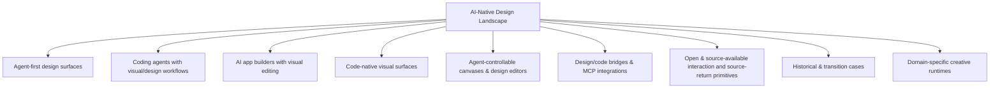
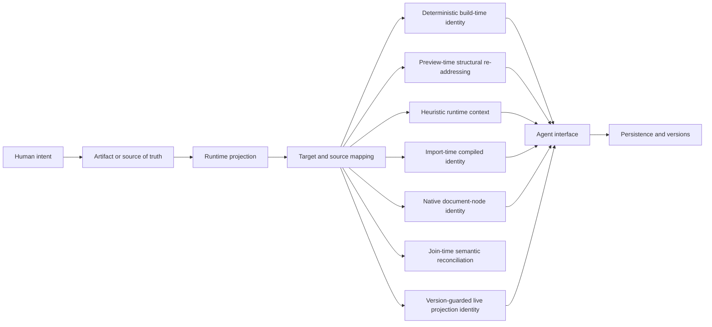

# AI-Native Design Landscape — v0.1 legacy evidence atlas

> Historical mechanism synthesis for exactly the 63 dossiers in the legacy seed pass. This document is **not** the current candidate universe, a discovery-coverage report or a global frame. Current verified-sample findings and explicit unknowns live in [`README.md`](README.md); the discovery protocol and open candidate register live in [`DISCOVERY.md`](DISCOVERY.md) and [`data/candidates.csv`](data/candidates.csv).

**Legacy pass snapshot:** 2026-08-11 · **Version:** v0.1 · **Coverage:** 63 legacy seed dossiers only

## Status of the legacy pass

- **Audited seed set:** 63 project directories registered against the names collected before the reproducible discovery protocol existed; the original search routes and denominator are unknown.
- **Evidence-bounded deep dossiers complete:** 63 / 63 — 20 Source-level dossiers plus Claude Design, Replit Design, QoderWork Design, TRAE Work Design, Cursor, Tencent CodeBuddy, Baidu Comate, Devin, v0, Lovable, GitHub Spark, Anything, Fusion, Base44, Bolt.new, Atoms, Subframe, FlutterFlow, Magic Patterns, Anima, Tempo, Rivet, Uizard, Webflow AI, Firebase Studio, Kombai, Miaoda, Canva Magic Design, Design Canvas, historical Windsurf, Diagram, Galileo AI, Motiff, Stitch, Google Antigravity, Figma Make, Alloy, pen.dev, Paper, Clearly, MagicPath, Framer AI and Relume at Architecture-level with the available closed-source or published-distribution evidence boundary reached.
- **Source-level subset:** 20 / 63 — Onlook, stagewise, Dosmos, Retune, Tuna, Nimbalyst, OpenPencil (`open-pencil/open-pencil`), OpenPencil (`ZSeven-W/openpencil`), Reframe, Puck, onUI, Open CoDesign, Agentation, Code Inspector, Open Design, Monet, Superdesign, Figwright, mcp_excalidraw, Codex.
- **Remaining dossiers:** 0 / 63 at Seed, Product-level, or unfinished Architecture-level depth.
- **Repository structure:** the legacy registry, project template, evidence rules, lifecycle/alias rules and a mechanism panorama for this seed set were established.
- **Closed milestone:** v0.1 depth is complete for the audited 63-record seed set only. It makes no claim that the set covers the field.

## Continuing research

The first evidence-bounded pass is complete, but the landscape is not frozen. Future work remains depth-first and project-specific: refresh lifecycle/product facts, follow newly public implementation paths, upgrade an Architecture-level dossier only when its evidence ceiling moves, and update the current root synthesis when a project establishes a genuinely new mechanism.

The earlier ten-part chain remains a **research checklist**, not a required structure:

`product facts · technical direction · technology choices · artifact/data model · agent interface · runtime/rendering · source mapping · persistence/versioning · implementation paths · commit history`

Use only the dimensions that explain the project, combine related ones, and add project-specific dimensions when the implementation demands them. A compile-time source locator, a feedback overlay, a vector editor and an agent-run artifact workspace should not read like four instances of the same system.

Priority backlog:

1. Deepen the remaining closed, partial-source and historical products through official product docs, changelogs, engineering posts, public protocols, distribution artifacts and bounded live observation without guessing undisclosed internals.
2. When a closed product exposes an open format, SDK, agent API or related foundation, pin and inspect that component but do not let adjacent source stand in for the product implementation.
3. Trace the project's own critical path deeply enough to establish its artifact/source of truth, decisive mechanism, user-visible failure boundaries and relevant persistence or delivery semantics; do not add irrelevant sections for symmetry.
4. Maintain lifecycle events, aliases/rebrands, acquisitions and discontinued products.
5. Re-audit completed Source-level dossiers and re-run long-tail discovery periodically so coverage can expand without weakening the per-project evidence standard.
6. Evolve the root panorama only from facts established in project dossiers; cross-product synthesis remains root-only.

## Scope

This repository tracks the part of the design-tool ecosystem being reshaped by AI agents, executable artifacts, code-native visual editing, agent-controllable canvases, and design-to-code/code-to-design workflows.

Repository rule:

- Root `README.md`: taxonomy, categorization, panorama, lifecycle, coverage decisions, research depth and project index.
- `projects/<project>/README.md`: only that project's own technical direction, public technology choices, artifact model and primary sources.
- No cross-product comparisons inside project directories.
- No guessed internal stack for closed products.

### Directory unit

A directory represents an independently identifiable product, open-source project, or independently surfaced design workspace.

- Product features/modes stay inside the owning product directory unless they have a distinct product/workspace identity.
- Direct renames/rebrands normally stay in one canonical directory with aliases recorded as metadata.
- An acquired or discontinued product may remain as a historical entry when its independently attributable pre-transition lineage is material; that dossier must declare an exact cutoff and leave the successor's current implementation in the successor directory.
- Traditional design tools are outside the current scope unless they have an AI-native product/workspace represented here.

### Coverage audit

The v0.1 registry was re-audited against the named products and projects collected during the research thread. Important canonicalization decisions:

| Name encountered during research | Canonical entry |
|---|---|
| Create | [Anything](projects/anything/) |
| MGX / MetaGPT X | [Atoms](projects/atoms/) |
| TRAE SOLO | [TRAE Work](projects/trae-work/) |
| Devin Desktop / cloud Desktop mode / installable Devin PWA | [Devin](projects/devin/) |
| Windsurf Editor through 2026-06-01 | [Windsurf](projects/windsurf/) as a bounded historical entry; post-rename Devin Desktop belongs to [Devin](projects/devin/) |
| Cursor Design Mode | [Cursor](projects/cursor/) |
| Codex Browser / Annotations / Sites / Product Design workflows | [Codex](projects/openai-codex/) |
| v0 Design Mode | [v0](projects/vercel-v0/) |
| Uizard Autodesigner | [Uizard](projects/uizard/) |
| Canva AI / Magic Design | [Canva Magic Design](projects/canva-magic-design/) |
| Galileo AI / `usegalileo.ai` historical product | [Galileo AI](projects/galileo-ai/) as a bounded historical entry; the current redirect destination and active product belong to [Stitch](projects/google-stitch/) |
| Motiff UI Editor / later Motiff AI generator | [Motiff](projects/motiff/) as one two-era historical dossier: UI Editor ended 2025-08-22, Motiff AI went offline 2026-06-23, and announced export ends 2026-10-31 |

### Research depth

Coverage and evidence depth are tracked separately. A directory existing in the registry does **not** mean its technical dossier is complete. Completion follows the available evidence ceiling: source-visible projects require implementation tracing, while a closed product can be complete only after its official behavior, public architecture/protocol edges, observable failure boundaries and consequential unknowns have been exhausted for the current snapshot.

| Depth | Meaning | Count in current snapshot |
|---|---|---:|
| **Source-level** | Open/source-available implementation pinned to a concrete commit and traced through the project's decisive product and technical questions, relevant implementation paths and failure boundaries, with commit history used where it changes the conclusion | **20** |
| **Architecture-level / available implementation boundary reached** | Closed implementation or inspectable distribution without a corresponding reachable source revision, but the decisive user journey, working artifact authority, public runtime/protocol boundaries, delivery and persistence semantics, documented failures, live observable edges and unresolved internals are explicitly established without invented source claims | **43** |
| **Seed, Product-level or unfinished Architecture-level** | Product is registered and independently documented, but its available public evidence has not yet been exhausted around the project's decisive questions | **0** |

Current source-level dossiers:

- [Onlook](projects/onlook/)
- [stagewise](projects/stagewise/)
- [Dosmos](projects/dosmos/)
- [Tuna](projects/tuna/)
- [Nimbalyst](projects/nimbalyst/)
- [OpenPencil (`open-pencil/open-pencil`)](projects/open-pencil/)
- [OpenPencil (`ZSeven-W/openpencil`)](projects/openpencil-zseven/)
- [Reframe](projects/reframe/)
- [Puck](projects/puck/)
- [onUI](projects/onui/)
- [Open CoDesign](projects/open-codesign/)
- [Agentation](projects/agentation/)
- [Retune](projects/retune/)
- [Code Inspector](projects/code-inspector/)
- [Open Design](projects/open-design/)
- [Monet](projects/monet/)
- [Superdesign](projects/superdesign/)
- [Figwright](projects/figwright/)
- [mcp_excalidraw](projects/mcp-excalidraw/)
- [Codex](projects/openai-codex/)

Current evidence-bounded Architecture-level dossiers:

- [Claude Design](projects/anthropic-claude-design/)
- [Replit Design](projects/replit-design/)
- [QoderWork Design](projects/qoderwork-design/)
- [TRAE Work Design](projects/trae-work/)
- [Cursor](projects/cursor/)
- [Tencent CodeBuddy](projects/tencent-codebuddy/)
- [Baidu Comate](projects/baidu-comate/)
- [Devin](projects/devin/)
- [v0](projects/vercel-v0/) — closed hosted agent, Design Mode, VM/Git sync and deployment core with a pinned Apache-2.0 Platform API SDK and two auditable API-generation distributions
- [Lovable](projects/lovable/) — closed hosted agent/project/Cloud/publish core with inspected MIT source-coordinate and Vite distributions plus an Apache-2.0 hosted-MCP client/setup repository
- [GitHub Spark](projects/github-spark/) — transitioning hosted Workbench with a time-bounded repository exit, pinned MIT template and inspected MIT SDK distributions exposing visual-coordinate, data-client and runtime edges
- [Anything](projects/anything/) — closed hosted project-group/agent/runtime core with a live OpenAPI and inspected MIT CLI distribution exposing generation receipts, read-only source projection and deployment-contract skew
- [Fusion](projects/builderio-fusion/) — closed hosted visual/agent/capture/writeback core with an inspected MIT dev-tools distribution exposing the local runtime bridge, Git/container reconciliation, post-capture comment anchoring and QA evidence checks, plus pinned public Agent Skills
- [Base44](projects/base44/) — closed hosted builder/Canvas/generation/production core with pinned MIT CLI and SDK implementations exposing resource schemas, local emulation, deploy ordering, runtime clients and remote-sandbox calls
- [Bolt.new](projects/bolt-new/) — closed current agent, code-storage, Design System Agent, Bolt Cloud and publishing core with a pinned MIT historical v1 implementation exposing its string-action protocol, WebContainer runner and IndexedDB replay model
- [Atoms](projects/atoms/) — closed hosted team/orchestration, Race, Visual Editor, Cloud and release core with a pinned MIT MetaGPT foundation exposing related MGX message routing, role handoff, plans, project repositories and Git archive semantics
- [Subframe](projects/subframe/) — closed hosted design graph, deterministic compiler, AI workers and MCP implementation with pinned public docs/skills, an ISC-declared one-way CLI and an inspectable React runtime distribution exposing its component/page/prototype authority split
- [FlutterFlow](projects/flutterflow/) — closed hosted IDE, project service and Flutter generator with a signed BSL source distribution exposing its branch-specific protobuf project writer, declarative DSL, typed selectors, fast-patch CAS, local MCP/Desktop bridge, YAML merge workflow and one-way generated-code exits
- [Kombai](projects/kombai/) — closed design/code/browser core with Git-native HTML Canvas and Markdown/YAML Design System artifacts, public Context Graph and browser behavior, and an immutable proprietary 2.0.81 distribution whose declarative manifests and schemas expose integration boundaries without opening implementation algorithms
- [Miaoda](projects/baidu-miaoda/) — closed hosted generator/editor/backend/release core with a pinned MIT-0 Skill exposing the PRD confirmation token, conversation identity, trajectory and release protocol, plus public GUI materialization, multi-environment promotion and source-ejection boundaries
- [Canva Magic Design](projects/canva-magic-design/) — closed Magic Design/Canva AI/Design Model lineage with a public candidate-to-design and draft-to-commit MCP protocol, bounded Connect/Apps SDK resource contracts and a hashed current OpenAPI snapshot
- [Design Canvas](projects/design-canvas/) — closed native Mac/WebKit canvas with a pinned initial MIT TypeScript adapter and an immutable MIT 0.6.0 distribution exposing a local authenticated route/reference/section control plane, multi-server topology and bounded screenshot-return path
- [Windsurf](projects/windsurf/) — historical boundary through 2026-06-01
- [Diagram](projects/diagram/) — historical product family through the 2023 Figma acquisition
- [Galileo AI](projects/galileo-ai/) — historical product whose legacy domain now redirects to Stitch
- [Motiff](projects/motiff/) — UI Editor through 2025-08-22, later Motiff AI through 2026-06-23 and export through 2026-10-31
- [Stitch](projects/google-stitch/) — closed hosted core with public MCP, SDK, DESIGN.md specification/CLI, Agent Skills and Gemini CLI extension boundaries
- [Google Antigravity](projects/google-antigravity/) — closed desktop/IDE/CLI and Go harness core with an open Python control layer and a managed Gemini API agent boundary
- [Figma Make](projects/figma-make/) — closed hosted generator and local-codebase beta with public resource, export and repository-bootstrap contracts
- [Alloy](projects/alloy/) — closed hosted core with inspectable capture distribution, MCP and GitHub workspace-boot contracts
- [pen.dev](projects/pen-dev/) — closed editor/renderer/MCP core with a live `.pen` format, current CLI/extension contracts and an open Script example repository
- [Paper](projects/paper/) — closed hosted editor/document/MCP core with public HTML-import and tool contracts, agent adapters and a portable shader runtime
- [Clearly](projects/clearly/) — closed hosted scene/collaboration/MCP core with a live public protocol catalog, inspectable MIT CLI distribution and pinned MIT agent adapter
- [MagicPath](projects/magicpath/) — closed hosted canvas/compiler/collaboration core with a public agent adapter, inspectable MIT CLI distribution and inspectable shipped DOM-edit runtime
- [Framer AI](projects/framer-ai/) — closed hosted project/Agent/branch/publish core with a readable unlicensed External Agent adapter and pinned MIT Server API client exposing native graph, transport and delivery boundaries
- [Relume](projects/relume/) — closed Site Builder/export/Publish core with a hashed public account bundle, hashed Webflow Chrome extension, live component-scoped OAuth edge and inspectable unlicensed npm distributions exposing its coupled planning graph, destination forks and separate Beta publisher generation
- [Magic Patterns](projects/magic-patterns/) — closed hosted editor/compiler/collaboration/AI/GitHub/Figma core with pinned MIT agent plugins, a pinned MIT Storybook MCP fork and live Design/artifact, Design System release, Inspiration and read-only MCP contracts exposing its plural artifact authorities and intentionally semantic code roundtrip
- [Anima](projects/anima/) — closed hosted generator/editor/agent/database/deployment core with an inspectable MIT-declared CLI distribution, pinned ISC-declared SDK source, a pinned unlicensed Agent Grid guide and archived MIT Storybook lineage exposing its Git-centered artifact authority, governed capability plane and separate history/data/delivery clocks
- [Tempo](projects/tempo/) — closed local-first repository/Canvas/agent core with a hash-pinned proprietary `0.0.91` distribution whose readable projection, parser, source-write and TypeScript-support slices expose version-guarded visual return, worktree convergence and a separate heuristic Browser plane
- [Rivet](projects/rivet-design/) — local code-variant decision system with a hash-pinned GPL-declared `0.14.19` compiled distribution exposing dirty-baseline worktrees, leased multi-vendor workers, private tree history, runtime DOM grounding and split apply/Git/share clocks; the corresponding current source revision is not publicly reachable
- [Uizard](projects/uizard/) — closed hosted native prototype graph with a hash-pinned anonymous production client exposing asynchronous node-addressed AI mutation, separate chat/review/brand/multiplayer/export clocks and a deliberately component-scoped code handoff rather than a whole-application roundtrip
- [Webflow AI](projects/webflow-ai/) — closed hosted native site/AI/code-component/optimization core and current OAuth MCP 2.0 service with current official lifecycle contracts plus a pinned MIT earlier MCP adapter exposing the historical local-bridge and native-element identity boundary
- [Firebase Studio](projects/firebase-studio/) — sunsetting closed Prototyper/Code OSS integration/workspace core with current official migration and service-survival contracts, a pinned Apache-2.0 template layer and a pinned MIT `firebase-tools@15.26.0` export adapter exposing the code/config/secret/backend transformation boundary

### Project-specific dossier design

Every dossier keeps a small common evidence floor: verified identity and lifecycle, canonical sources, an explicit evidence boundary, research gaps, and immutable revisions for source-derived claims. Everything between those anchors is project-specific.

Examples of questions that can determine a dossier's structure:

| Project shape | Questions that should lead the document |
|---|---|
| Agent design workspace | What is the ordinary-user loop, who owns execution authority, what becomes the durable artifact, and how is it delivered or recovered? |
| Code-native visual editor | What is canonical—source or a design document—how is it rendered, how does a selected element regain identity, and where is a mutation written? |
| Feedback/annotation bridge | What context is captured, how stable is the target, what survives transport to the agent, and what is persisted or lost? |
| Compile-time source locator | Which files are transformed, what identity is injected, how is it resolved at runtime, and which framework/build cases break the chain? |
| Canvas/object editor | What graph or schema owns truth, which operations mutate it, how do renderers project it, and how do undo, collaboration and versioning compose? |
| Closed or historical product | What user-observable journey and public contracts are established, what changed over time, and which internal claims must remain unknown? |

These are prompts, not archetype templates. The final headings should expose the particular system's causal structure rather than demonstrate that every checklist label was filled.

## Panorama



The project index is the ecosystem view; completed deep dossiers also support an implementation-oriented reading across products:



These axes distinguish prompts, annotations and direct manipulation; source files, canvas graphs and feedback sessions; DOM, iframe, canvas and native renderers; selectors, component identities and source maps; file tools, MCP and product protocols; and browser storage, databases, snapshots and version graphs. Each dossier pins those distinctions to evidence instead of treating every visible canvas as the same architecture.

Eight distinct target-return mechanism families are now established across the completed dossiers; this is an evidence-backed starting taxonomy, not an exhaustive claim about the landscape. Code Inspector and GitHub Spark implement the same build-time coordinate family at different product boundaries, Open Design re-addresses preview structure, Agentation transports heuristic runtime context, Reframe returns exported DOM to an imported graph identity, OpenPencil never leaves its canonical design-document identity domain, Figwright reconciles native Figma identities with repository-level semantic candidates at join time, Fusion re-resolves a previously captured source coordinate through structural JSX and static-signature evidence, and Tempo binds a React/Fiber live projection to file, byte position, mtime and source-version evidence before guarded source mutation:

| Target-return route | Established implementation | Identity delivered downstream | Known break |
|---|---|---|---|
| Deterministic build-time identity | [Code Inspector](projects/code-inspector/) rewrites eligible framework source during bundling; [GitHub Spark](projects/github-spark/) uses an MIT Vite pre-transform in Workbench serve mode to tag React JSX with source start/end coordinates | Code Inspector carries file, line, column and node name; Spark returns element/component file start/end coordinates plus React props, geometry and editability | untransformed/failed files lose mapping; Spark is limited to `.tsx`/`.jsx`, React internals and development mode, its repeated-instance selector is malformed, and durable source reconciliation remains closed |
| Preview-time structural re-addressing | [Open Design](projects/open-design/) parses HTML for its rich preview, prefers authored element ids and adds body-relative child-index paths before re-parsing persisted HTML for bounded patches | authored `data-od-id` or a structural HTML path plus DOM/text/style context | generated paths drift after structural edits; runtime-only DOM and heuristic comment targets do not become component-source identity |
| Heuristic runtime context | [Agentation](projects/agentation/) inspects DOM/React runtime structures while the page is running | DOM context plus optional React hierarchy and file hint | file hints are environment-dependent and do not survive its default SQLite + common MCP projection |
| Import-time compiled identity | [Reframe](projects/reframe/) hashes content-aware DOM paths into `h:` INode ids and re-emits them as `data-reframe-inode` in the HTML canvas | a selected exported DOM element returns to the compiled `SceneGraph`; `NodeMeta` retains structural import provenance | anonymous/duplicate-key ordering can retarget ids, there is no file/line mapping, and the primary MCP recompile path currently bypasses the replay overlay |
| Native document-node identity | [OpenPencil (`ZSeven-W/openpencil`)](projects/openpencil-zseven/) copies each canonical `.op` node ID into its resolved paint scene; paint and hit testing consume that same refreshed scene | the selected canvas target is already the canonical design-document node addressed by editor commands and MCP | the identity ends at the `.op` boundary; conversion provenance and generated code do not create a live reverse pointer to original application source |
| Join-time semantic reconciliation | [Figwright](projects/figwright/) groups Figma instances by main component, scans repository components/tokens/icons, then joins names, props and values with explicit map-file overrides | a tool result can associate Figma instance ids with a candidate component file, or design tokens/icons with repository refs/assets | fuzzy evidence is not a source line or AST identity; durable overrides are keyed by unnamespaced Figma names, and no cross-artifact transaction proves that the agent used the candidate |
| Post-capture structural JSX reconciliation | [Fusion](projects/builderio-fusion/)'s inspected MIT dev-tools package derives a versioned component/tag/sibling path plus static signature from an already supplied file/line/column, then re-resolves in-file or ripgrep-nominates candidate files after a move | source `present` with a possibly updated file/key, or `absent`; the caller maps source-present-but-not-rendered to `UNREACHABLE` and genuine absence to `ORPHANED` | the renderer-to-coordinate producer remains closed, structural keys/signatures are not unique AST ids, ambiguity/search/syntax failure biases to present, and this is read-only comment anchoring rather than deterministic code mutation |
| Version-guarded source-annotated live projection | [Tempo](projects/tempo/)'s inspected proprietary `0.0.91` distribution activates framework annotation plugins, captures committed React Fiber/DOM projections and rebinds first by transient DOM id and then by file/byte/mtime evidence before exact JSX/HTML writes | authored file plus byte position or HTML offset, observed mtime/source-version and typed prop editability; successful writes three-way merge or refuse, then restamp affected runtime identities | annotations disappear outside Tempo builds, byte positions move, shared component instances can share coordinates, HMR replaces transient ids, the ordinary embedded Browser has only selector/DOM context and the current implementation has no public source commit |

[Superdesign](projects/superdesign/) adds an equally important negative result: selected source snippets can condition a hosted HTML draft and a coding agent can later implement that draft, but the public workflow carries no canvas-element identity back to an application file or component. Workflow continuity is not target-return identity.

[Figwright](projects/figwright/) establishes the inverse nuance: native Figma node ids can survive reads, writes and design baselines, while repository joins can return a semantic code candidate, yet the two facts still do not create a durable node-to-code-AST binding. Semantic reconciliation is stronger than an ungrounded prompt and weaker than source identity.

[mcp_excalidraw](projects/mcp-excalidraw/) adds another negative boundary: a coding agent can inspect a repository, draw a diagram and commit the exported <code>.excalidraw</code> file beside source, but the canvas carries no repository scan, component join or node-to-file identity. A repo-native artifact is not automatically source mapping.

[Codex](projects/openai-codex/) establishes a tool-supplied visual-context boundary: the public harness carries images as data or paths and client-supplied context as opaque classified strings, while review comments can address Git diff lines. None of those public types standardizes a rendered DOM/design node back to an authored file or AST location. Rich visual feedback can guide a repair without becoming durable target-return identity.

[Claude Design](projects/anthropic-claude-design/) establishes the corresponding closed-product boundary. Its public surface can click-target a canvas element, directly manipulate layout and let Claude create adjustment sliders for the current artifact, but no public contract exposes the selected node identity, slider representation or a reverse binding to design-system source or code. Precise human targeting and an artifact-specific generated editor are product facts; durable target-return identity is still unknown.

[Replit Design](projects/replit-design/) establishes a stronger closed-product target-return contract without disclosing its mechanism: an eligible rendered element can jump to its source location, and deterministic text/style/layout/image edits update source directly. Reused or loop-rendered elements may update every instance, while hidden complexity routes to Agent. This proves visual-target-to-source behavior at the product boundary, but not the injected identity, framework adapter, AST patch or conflict semantics; it does not increase the eight source-inspected mechanism count.

[QoderWork Design](projects/qoderwork-design/) establishes a different closed boundary: lasso/annotation grounds an Agent edit to a Canvas region and Nudge exposes generated design parameters, while Design Files remain directly editable. No public contract returns a selected region or Nudge parameter to a stable file/range/AST identity or exposes its writeback. Grounded visual correction and parametric control are not yet source mapping.

[TRAE Work Design](projects/trae-work/) adds structured design-system provenance without closing the target-return loop. Its anonymously visible Design Library exposes token projections, component DOM anatomy, assets, coverage and provenance, but the package itself labels component contracts as medium-confidence preview evidence rather than original design intent. No public identity joins those contracts to a generated canvas node, imported Figma node or Code Mode file. Executable design-system grounding is not canvas-to-source mapping.

[Cursor](projects/cursor/) exposes the strongest inspectable closed-client runtime packet in this snapshot without crossing into deterministic source identity. Its shipped protocol carries element label, a field named `xpath`, text, JSON extras, component and optional props; the inspected picker actually fills `xpath` with a CSS-like tag/id/class/sibling path and gives nodes session-local `WeakMap` ids. Framework stacks, geometry, styles and screenshots help Agent search, but no file, range, module, source-map location or repository revision reaches the packet. Cursor therefore sharpens the heuristic-runtime-context category without increasing the eight source-inspected mechanism count.

[Tencent CodeBuddy](projects/tencent-codebuddy/) exposes two different closed-client negative boundaries. Its Figma path stores generated HTML, resources and an optional screenshot under selection-keyed workspace paths before passing them to Agent, while its Preview path narrows a runtime element to HTML, a synthetic range in serialized page markup and optional DOM-editor deltas. A normal localhost target contributes no authored file path; the DOM Editor first patches the live element and only then asks Agent to implement CSS in project files. Figma node ids and runtime coordinates improve grounding, but neither path yields a durable file/range/AST identity or reverse sync.

[Baidu Comate](projects/baidu-comate/) establishes a stronger optional closed-client return path. Its Preview picker can inherit `data-comate-source-path` from the selected element or an ancestor, navigate to a real file/line/column and use that hint for direct style/text rewrites or Agent-led general edits. Yet the installed client exposes the reader rather than the annotation producer, its own edit prompt calls coordinates search starting points rather than exact identity, and no file revision guards against HMR or concurrent change. Normal Figma input remains a generated HTML/assets/token context mediated by a system Skill, not a native node-to-source binding. Comate therefore strengthens source-addressed runtime repair without increasing the eight source-inspected mechanism count.

[Devin](projects/devin/) adds a closed-client runtime-context boundary across two different visual planes. Cloud Computer Use observes screenshots and acts on a remote Linux/Windows desktop, then can return a focused recording; local Devin Desktop Preview sends an HTML ancestor path, outer HTML, geometry, computed CSS and an optional clipped screenshot to local, remote or ACP agents. The inspected Preview packet contains no file, range, component, source-map or repository revision, while cloud screen coordinates never claim source identity. Visual execution proof and richly structured DOM context can improve a repair without becoming target return.

The bounded historical [Windsurf](projects/windsurf/) dossier fixes the lineage behind that local Preview category. The final Windsurf-branded `2.3.15` main process uses Electron debugging and CDP `DOM`/`CSS`/`Overlay`/`Runtime` calls to turn a clicked element into ancestor path, attributes, HTML, computed styles, geometry and an optional clipped screenshot before Cascade searches source. Its outgoing packet likewise has no authored file/range/component/source-map/revision identity. This establishes that the runtime-context mechanism predates the Devin Desktop name; it refines product history rather than adding another source-inspected mapping mechanism.

[Diagram](projects/diagram/) adds a historical **forward binding** that should not be counted as source return. Prototyper turned each Figma layer into a JavaScript variable for a closed plugin bridge and rendered Framer Library interactions in a live preview; no public contract maps that runtime back to repository source or even establishes how the code/layer binding survives rename, reload or handoff. The same dossier also fixes Magician's narrower Text Review boundary: Figma's host event carries text and returns suggestion ranges, while the proprietary plugin/model binding remains closed.

[Motiff](projects/motiff/) adds a read-only node-addressed projection without creating source return. Its public MCP package sends a Motiff `docId` and selected `nodeId` to hosted asynchronous HTML or screenshot tasks, then passes the result to an external coding agent. The package exposes no Motiff write tool, descendant-node-to-HTML identity or binding from generated application code back to the design file. Addressing a source frame for export is stronger than an ungrounded screenshot and still weaker than roundtrip identity.

[Stitch](projects/google-stitch/) exposes a different closed-core boundary. Its public SDK types retain XPath and bounding-box annotations inside generated screens and XPath-to-screen links inside prototypes, while the open React skill preserves only a screen-level ledger before decomposing downloaded HTML into a new component tree. Static code import first removes scripts and uploads a rendered document, so neither direction carries original file/range/AST identity through the hosted graph. Source-inspected clients make this loss visible, but they do not make the proprietary product another source-return implementation.

[Google Antigravity](projects/google-antigravity/) adds a visual-verification boundary rather than another source-return mechanism. Browser screenshots, recordings and walkthroughs can prove that an agent observed and exercised a running application, but no public artifact or browser schema carries a rendered target back as a stable authored file, range, component, source-map location or repository revision. Local folders/worktrees remain implementation authority; in the managed Gemini API, the remote environment filesystem does. Pixel evidence improves acceptance without becoming target identity.

[Figma Make](projects/figma-make/) establishes a two-regime closed-product source-return boundary. In an ordinary hosted file, properties and annotations stack in chat before Apply asks the agent to change the hosted React project; no public contract exposes the selected element as a stable file/range/component/revision identity. In the limited local-codebase beta, Figma claims that a selected live element—and edits to code-backed screens copied into Figma Design—can return through the agent to real repository code, but the mapping packet, revision guard and conflict protocol remain closed. Hosted GitHub export is separately one-way, while public Figma MCP exposes Make project resources to external agents without a documented Make write tool. This is stronger behavioral evidence than an ungrounded prompt and still not another source-inspected mapping mechanism.

[Alloy](projects/alloy/) adds a browser-archive boundary beside a separate Git-backed path. Its inspected extension serializes rendered HTML, CSS, resources, computed-style context, interaction segments and a screenshot while blocking captured scripts; it carries no original application file, range, component AST, source map or repository revision. Hosted visual edits and inline comments address elements in the generated Alloy session, while public MCP reads session files and some diffs without a documented write tool. Codebase sessions do mutate a real repository through a cloud checkout and PR, but no public preview-target packet establishes how a rendered element returns to source. Alloy therefore sharpens capture-grounded context and repository mutation without adding another source-inspected target-return mechanism.

[pen.dev](projects/pen-dev/) exposes three identity regimes without adding another source-inspected target-return mechanism. A selected native design node already has a canonical `.pen` id, but that identity stops at the saved design graph. Its browser importer can attach a component/tag label and computed-style context before turning the page into ordinary nodes, while agent-mediated design/code conversion and deterministic HTML export create new artifacts. None of the public contracts retains an authored file/range/AST/source-map/revision pointer or a reverse transaction, so repository co-location and semantic context improve reconstruction without making design and code one synchronized identity domain.

[Paper](projects/paper/) establishes a hosted Web-semantic identity domain rather than another source-return mechanism. Human and MCP operations address native Paper node ids—moves preserve ids and duplication returns a new descendant-id map—but HTML, Snapshot and Figma inputs are normalized into new nodes, while JSX/Tailwind/React and application code are projections or external-agent reconstructions. Classes, selectors, Figma component identity and authored file/range/AST/source-map/revision do not cross the public boundary. Speaking HTML/CSS reduces translation distance without making a Paper node the original application node.

[Clearly](projects/clearly/) adds a spatial code-work boundary around a native hosted scene. Its Composition and server-minted node ids survive human or agent canvas edits, while a machine-local binding can associate the whole Composition with one repository and diff cards can display file paths, hunks and an optional commit. Human ink is interpreted against those cards by geometric proximity, layer-name handles are first-match and no public packet joins a selected node to an authored file/range/AST/source-map/revision. Whole-workspace binding and pointable code evidence improve coordination without creating another source-inspected target-return mechanism.

[MagicPath](projects/magicpath/) establishes a stronger closed-runtime return path inside its own generated artifact. Each hosted React revision is built with file-local `data-magicpath-path` / `data-magicpath-id` markers; its injected iframe runtime joins a selected DOM layer to those markers, current DOM ancestry and optional repeated-record fields, then returns a mutation manifest pinned to the component and base revision. Safe literal/style/structural changes can be reconciled deterministically while computed or ambiguous expressions route through AI. This is genuine Design-DOM-to-generated-source grounding, but it does not retain original repository identity after import, publish a file/range/AST contract or expose the marker compiler/save implementation; the unlicensed shipped runtime therefore strengthens closed-product evidence without becoming another source-inspected implementation.

[v0](projects/vercel-v0/) closes durability at a different layer. Design Mode selects a rendered element and holds panel changes, instructions and an element screenshot as pending state; Apply serializes them into a source-generating Chat version, but no public marker, file/range, AST or source-map identity explains the return. The code editor, agent, terminal and Preview do converge on one Chat-specific VM filesystem, and after Git connection every code-changing message is promoted to a Chat branch while Git becomes explicit source of truth. Durable repository return is strong without making the closed Design Mode mechanism another source-inspected target-return implementation.

[Lovable](projects/lovable/) exposes a source-coordinate bridge without making the current closed Preview Toolbar another source-inspected target-return implementation. The inspected `lovable-tagger@1.3.3` attaches cleaned `file:line:column` data to rendered DOM nodes through `Symbol.for("__jsxSource__")` and a global WeakRef map, while older `1.1.13` adds in-memory Vite overrides and HMR events. Yet the current product serializes selections, annotations and sent inline text into the main Build queue, the newest tagger removed virtual overrides, and `lovite@0.0.2` still pins the old graph. Public packages prove coordinate and historical preview edges; the hosted selection packet, deterministic-versus-model routing, revision guard and durable save path remain closed.

[GitHub Spark](projects/github-spark/) adds a second inspected implementation to the deterministic build-time family without opening the product core. Its MIT SDK tags `.tsx`/`.jsx` during Workbench development with element or component start/end coordinates, requires React internals to construct a rich selection packet and can apply token/class/text changes to the live DOM. The actual source saver runs behind closed `spark-designer`; `main` synchronization, Workbench versions and deployment remain separate. In the current sunset path, that distinction is operational: a repository preserves source history, not the managed data, deployed revision, access policy or retired Models inference contract.

[Anything](projects/anything/) establishes another negative boundary. A URL becomes screenshot inspiration, screenshots/images provide pixels and a Figma frame/page is rebuilt through the agent, but no public node id, Figma revision, file/range, AST marker or reverse sync survives into generated source. Its current top-bar “Element selector” switches the viewed page, component or database; it is not documented as DOM-to-source targeting. Visual context is strong enough to guide reconstruction without creating another source-inspected target-return family.

[Base44](projects/base44/) establishes a closed generated-source return contract without exposing the mapper. Edit mode can select a rendered element, highlight repeated instances, open associated code and narrow the Code tab to files used by the page; Figma frames are separately reconstructed into new pages. No inspected CLI/SDK path contains the builder's marker producer, source-map/AST resolver, writeback algorithm or revision guard, and imported Figma node identity does not survive as a public binding. Precise product-level targeting is established while the mechanism and concurrency semantics remain unknown.

[Bolt.new](projects/bolt-new/) adds a browser-dependent closed target boundary. Select can hover one rendered element or disambiguate overlapping layers before attaching the target to chat, but no public packet exposes a file/range/AST identity or revision guard and the frozen MIT v1 tree predates Select. Its Figma paths make the inverse tradeoff explicit: normal import uses Anima code conversion, while design-system-aware generation deliberately consumes a screenshot and semantically reconstructs it against the active component context. Neither path preserves public Figma-to-source identity.

[Atoms](projects/atoms/) adds a closed dual-lane target boundary. Theme supplies global constraints, while Visual Editor selects a rendered element for immediate text, style and layout controls; Add to Chat escalates the selected component to a code-changing agent. Official material says direct changes can be hard-coded, but no public packet exposes the target as a file, range, component identity, source map or guarded revision. Atoms therefore establishes selected-element refinement without adding another source-inspected mapping mechanism.

[Kombai](projects/kombai/) adds a two-stage runtime return path across three authorities. Its browser can package selected or full DOM, screenshots, temporary text/CSS/layout intent, console/network/performance evidence and—on React—the claimed nearest component and source-file location; durable change still requires sending that evidence to the agent, changing repository source and waiting for HMR. The shipped Manifest V3 bridge proves broad page injection and a local page API, but no public packet exposes an exact file range, source map, repository revision, repeated-instance guard or writeback algorithm. Its `.canvas` node ids and HTML remain a separate design identity domain rather than a reverse binding to application source.

[Miaoda](projects/baidu-miaoda/) adds a hosted materialization boundary rather than a new source-inspected mapping family. LUI and GUI can target selected atomic elements, but no public packet exposes file/range/AST identity or revision guards. The decisive clue is export behavior: GUI changes such as font and color are absent from the source ZIP until Preview or Publish materializes them into the current application version. A selected edit, editor autosave and exportable source are therefore three different states.

[Canva Magic Design](projects/canva-magic-design/) adds native-design element identity without adding code-source mapping. The public Canva MCP separates general content reads from transaction-scoped editable `element_id`s, holds operations in a draft and requires commit; concurrent browser edits can stale that transaction. This is a strong native-document mutation protocol, but no public contract makes element ids permanent across versions, resize/copy/import or AI regeneration, and none maps them to application source.

[Design Canvas](projects/design-canvas/) adds stable runtime-frame identity without adding an element-to-source return path. Its route ids bind path, viewport, position and a dev-server identity; capture can request those exact ids, while document/image ids bind absolute local paths. The returned JPEG evidence contains neither a DOM/component target nor a file/range/AST/source-map/revision pointer, and the distributed verify workflow falls back to agent-side component-name search. Route topology improves visual grounding, but source targeting remains interpretation by the external coding agent.

[Dosmos](projects/dosmos/) composes existing target-return ideas rather than adding a ninth family. Its separate Edit code button first consumes compatible build-stamped DOM attributes, then reads React 18 `_debugSource`, then ranks repository files from component names, attributes, text and route context. The ordinary annotation path does not use that resolution: it types tag/text/attributes and temporary image paths into an external CLI, without file, line, selector or URL. At `2.0.1`, the heuristic directly spawns `grep`; a stock Windows setup has no such command, and even Git's `grep.exe` emits a drive-letter colon that the first-colon parser misreads. The source-visible resolver is therefore real, tiered and materially narrower than the product-level “exact source file and line” claim.

[Framer AI](projects/framer-ai/) also composes native document identity rather than adding a ninth target-return family. Page paths, selected-node ids and canonical ids let the in-app or External Agent read and mutate resources inside one hosted Framer project. Public contracts do not return a published DOM target or local input to a repository file, range, AST node, source map or guarded revision. The identity is strong enough for native graph editing and branch review, but it stops at the project boundary.

[Relume](projects/relume/) establishes the same negative boundary across more exits. Native page, section, component and concept identities keep its hosted sitemap and wireframe coherent, but Figma intentionally detaches imported components, Webflow reconciles into destination names/classes, React/HTML and Claude Design create new artifacts, and the Library MCP returns library code rather than project state. No public contract binds any of those outputs back to a Site Builder section/version, authored file/range/AST or guarded repository revision, so Relume does not add a ninth target-return family.

[Magic Patterns](projects/magic-patterns/) adds a hosted React-instrumentation boundary without adding a ninth source-inspected family. Select Mode and comments address rendered elements, and the public outbound Skill identifies `data-id` props as editor instrumentation plus `canvas.manifest.js` / `useScreenInit.js` as multi-screen plumbing. Yet neither Skill nor MCP exposes the selection packet, file/range/AST/source-map identity, repeated-instance rule or revision guard; code-first tools stop at artifact id plus whole file contents. Its exact hosted targeting remains closed, while Figma, GitHub sync and downstream integration deliberately normalize identity away.

[Anima](projects/anima/) adds a Git-backed hosted-code boundary without adding a ninth source-inspected family. Preview selection and visual text editing can return a rendered target to a proposed file change, while the public SDK can emit `data-id`, `data-name` and `data-variant` attributes. No public contract joins those facts into a locator packet, file/range/AST/source-map/revision identity, repeated-instance rule or stale-write guard. Its internal Git repository gives the eventual code change a durable address, but the hosted return mechanism remains closed and Figma, URL and Copy-to-Figma paths normalize provenance away.

[Tempo](projects/tempo/) adds the eighth family from a closed but hash-pinned distribution. Its framework plugins emit file/byte/mtime/source-version annotations; the Canvas captures React Fiber and DOM projections, rebinds runtime layers through transient ids or guarded source anchors, and writes exact JSX/HTML changes through mtime checks, three-way merge, conflict refusal and multi-file rollback before re-stamping the projection. The same app's embedded Browser proves the negative control: an arbitrary page returns only selector/DOM/style context. Source-aware Canvas return and heuristic browser grounding are explicitly different mechanisms, while the absence of a public current commit keeps Tempo at Architecture-level rather than Source-level.

[Rivet](projects/rivet-design/) reinforces the heuristic runtime-context family rather than adding a ninth mechanism. Its published `0.14.19` preview bridge returns a runtime `data-rivet-id`, XPath, DOM details, computed style and geometry, and a caller can separately supply a candidate source file. The dormant component-search service can rank files from ids, classes, text and route hints, but it is not wired into the active server graph; no public packet carries an AST node, byte range, source map or guarded revision. The clicked target therefore grounds an agent or heuristic search, not a deterministic element-to-source writeback.

[Uizard](projects/uizard/) establishes exact identity inside a hosted design graph without adding an application-source return family. Autodesigner sends project id plus native `selectedNodeIds` and receives add/modify/delete commands, while comments and annotations address native object-id paths. Those identities stop at the prototype boundary: code files cannot be imported, full projects cannot be exported as runnable code and one-component React/CSS output carries no public reverse binding to a project object or revision. Native design-node convergence is not repository source roundtrip.

[Webflow AI](projects/webflow-ai/) extends the same native-hosted-graph boundary across a production website platform. Webflow MCP can query and mutate exact page, element, component, class and variable identities, but those ids address the hosted Webflow graph. DevLink, static export and AI code components are separate projections or hosted code islands; none carries a native target back to an authored file/range/AST/source map and guarded repository revision. Exact external-agent targeting inside a native site therefore does not add a ninth target-return family.

[Firebase Studio](projects/firebase-studio/) supplies another closed-product negative boundary. Prototyper can Annotate a preview or Select a rendered icon, button, image or text region, and every accepted agent response becomes a local Git commit. No public contract exposes the selected-target packet, injected marker, file/range/AST/source map, repeated-instance rule or stale-preview guard that produced that commit. Strong Git durability after an agent write does not turn the undisclosed visual return path into a ninth source-inspected family.

[Retune](projects/retune/) composes the existing heuristic runtime-context family rather than adding a ninth mechanism. Its source-visible path generates a DOM selector, may deliberately broaden that selector to a shared class, walks private React fiber ownership and opportunistically reads `_debugSource`; the packet then leaves exact source choice and all file mutation to an external coding agent. There is no source-map/AST identity, file-content or revision guard, and private fiber metadata can disappear under framework, HMR or production changes. Retune makes the runtime intent unusually structured, but its durable return remains agent interpretation followed by independently verified repository edits.

[Subframe](projects/subframe/) establishes a precise native-identity boundary without adding a ninth mechanism. `get_page_info(includeNodeIds: true)` emits `data-node-id` values that `edit_page` can use to replace, insert around or delete the same hosted page nodes, and `appliedCode` returns their normalized identities. That exactness ends at the Subframe graph: exported page JSX is an intentional fork, component CLI sync receives generated file strings, and no public contract carries a native id into an application file, range, AST, source map, baseline or repository revision. Native graph writeback is not automatically application-source return.

[FlutterFlow](projects/flutterflow/) composes native document identity with an entity-level generated-code projection rather than adding a ninth target-return family. A copied AI Selector carries project, page/component scope, deterministic structural path, native node key, name and type; the source-available SDK verifies that target and its export manifest then maps the containing entity to generated Dart files. The join stops there: it publishes no widget-to-Dart range, AST, source map or repository revision, generated code is read-only in the native workflow and arbitrary exported Dart does not reverse-sync. Exact project-node targeting plus a file-level compiler manifest is still not application-source roundtrip identity.

The dossiers now also establish fifty-two different durable-refinement models. “Structured” does not by itself mean that every product has one equivalent source of truth:

| Durable-refinement model | Established implementation | Durable center | Known break |
|---|---|---|---|
| Canonical design document | [OpenPencil (`ZSeven-W/openpencil`)](projects/openpencil-zseven/) edits one typed `.op` document and projects it into paint scenes and exports | the `.op` document; editor commands, save, undo and collaboration all converge on its node ids | imported/generated code is an asymmetric conversion, not a continuously bound second authority |
| Materialized compile plus rebuild layers | [Reframe](projects/reframe/) keeps a live INode graph and SceneJSON snapshot, with optional HTML source and a partial JSONL edit overlay | current scene snapshot for restart; HTML + replay only for supported regeneration paths | the main MCP compile does not currently replay the overlay, structural edit coverage is incomplete and some graph side-channel metadata is not serialized |
| Filesystem-native deliverable | [Open Design](projects/open-design/) delegates execution to an installed agent and treats project files as the artifact, with optional manifests and per-file versions | canonical project files in the daemon project root or an explicitly imported folder | provider events are not artifact proof; render/edit bridges remain artifact-type-specific and must guard external file changes |
| Thread ledger plus workspace and Git clocks | [Codex](projects/openai-codex/) persists replayable thread JSONL, lets tools and external processes mutate the selected workspace, and uses Git/worktrees for reviewable isolation and versions | the intended workspace files and Git state are the artifact; rollout JSONL preserves orchestration history and SQLite is a rebuildable query projection | resuming a thread does not restore files, streamed turn diffs cover exact tracked patch deltas rather than every side effect, and worktrees do not merge or publish themselves |
| Split repository repair and managed Canvas sources | [Cursor](projects/cursor/) uses a running app only as visual context for Agent edits to repository/worktree files, while a separately created Canvas is managed user-home `.canvas.tsx` with optional `.canvas.data.json` state and an explicit published snapshot | repository files and Git for Browser Design Mode; managed Canvas source/sidecar for Canvas Design Mode; the uploaded share after delivery | runtime targets are session-local and can stale under HMR, Canvas is outside the application repo by default, host actions are fire-and-forget and no transaction joins code, Canvas state, worktree or share |
| Path-bound multi-artifact workspace | [Monet](projects/monet/) combines a live timeline store, `.aiveproj.json`, hashed autosave, path-keyed Canvas sidecar, absolute media references and generated source/renders | live `ProjectStore` for editing/export; project file and newer autosave for timeline recovery | Canvas is outside the project file, relocation changes its lookup key, external media is not bundled and MCP mixes live calls with direct disk writes |
| Hosted draft graph with local context staging | [Superdesign](projects/superdesign/) reduces a repository into selected context files, then keeps branchable draft nodes and per-node HTML versions on its hosted service | remote project/draft/version graph during design; application source becomes durable only through a later coding-agent implementation | context snippets are evidence inputs rather than source links, the hosted renderer/backend is closed and implemented code can diverge from the approved HTML draft |
| Hosted multi-format project with inferred organization constraints | [Claude Design](projects/anthropic-claude-design/) derives a reusable design system from heterogeneous organization assets, then keeps chat, canvas corrections, saved directions, sharing and exports around a hosted project | the hosted project is the working editing center; the published organization design system governs later projects and each export/handoff creates a new delivery authority | internal project and version schemas are closed, projects are not publicly pinned to an exact design-system revision, and no lossless roundtrip or downstream reverse sync is established |
| Hosted visual branches plus Git-backed application state | [Replit Design](projects/replit-design/) keeps Design frames and live Artifact previews on one hosted Project Canvas, writes eligible direct edits to source, and uses Agent checkpoints when a frame becomes or rewrites an Artifact | Project files and Git own runnable implementation; checkpoints add Agent/context/database recovery; Canvas owns visual branches and layout | public checkpoint fields do not explicitly include complete Canvas state, so Git recovery cannot be equated with visual-branch recovery and frame-to-Artifact Build is not a live binding |
| Task-bound engineering files with opaque visual side state | [QoderWork Design](projects/qoderwork-design/) can bind a task to one local Working Folder, write HTML/React files, retain task conversation and artifacts, and place Design Plan, Canvas, Preview and Nudge around that file-producing run | local folder files are the handoff authority; the task ledger retains context and artifacts | the folder is optional, Canvas/plan/Nudge serialization and atomic versioning with files are undisclosed, and QoderWork Awareness memory is a separate persistence domain |
| Design-library-grounded hosted artifact with plural exits | [TRAE Work Design](projects/trae-work/) conditions a hosted canvas with an agent-readable package of tokens, components, previews, UI kits, provenance and authoring rules, then exits to Figma, raster images, Code Mode or static deployment | the hosted task/canvas is the editing center; the Design Library is reusable generation evidence; each destination becomes its own authority | no public Design revision graph or library pin joins task, canvas, local/cloud files, memory, Git worktree and destination state atomically |
| Native external document with repository-side reconciliation aids | [Figwright](projects/figwright/) mutates the open Figma file while optionally storing verified name mappings and per-node context baselines in the application repository | Figma owns durable design state; application files own implementation; `docs/figma-*-map.md` and `.figwright/snapshots/` support later reconciliation | the aids are not a mirrored document: map keys lack file identity, snapshots are keyed only by node id, and neither establishes a shared Figma/code transaction |
| Native document plus portable automation program | [Diagram](projects/diagram/) Automator interprets a recursive `command`/`metadata`/`actions[]` JSON tree against the current Figma file, while definitions can be exported, remixed or cloud-synced separately | the Figma document owns design output; JSON/team/community copies own the reusable procedure | the pinned schema has no version field or secret type, remote/selection inputs vary, and no transaction binds one definition/run to a Figma file version or rolls back partial mutations |
| Hosted screen-lineage thread with destination forks | [Galileo AI](projects/galileo-ai/) groups generated variants under a bot message, carries refinement through `based_on_screen_id`, retries selected screen ids and regenerates message screens under a shared theme | the hosted chat/message/screen lineage is the editing center; public pages and pasted Figma content are separate projections or forks | no immutable version/rollback contract is public, theme regeneration can partially fail, account termination can destroy content and no transaction or reverse identity joins the thread, public share and Figma document |
| Native design document with AI side state, followed by a hosted generator center | [Motiff](projects/motiff/) let AI Layout promote a temporary inferred hierarchy, AI Reduplication read an asynchronous organization index and AI Design Systems promote candidates into native libraries; its later generator coordinated multiple screens before exporting each code screen separately | the native file/library/version graph in the UI Editor era; the hosted Motiff AI project in the generator era; the actual Figma/code/image artifact after exit | temporary layout can be discarded, retrieval can be stale, candidates require human publication, version restore excludes comments/libraries, code exits split screens and both hosted centers reached separate shutdown cliffs |
| Hosted project graph with source screens, canvas instances and design assets | [Stitch](projects/google-stitch/) lets the human canvas, Design Agent, remote MCP and SDK address one project while `DESIGN.md` and Agent Skills move design intent or snapshots across the boundary | the hosted project is the editing center; source screens own downloadable outputs, instances own canvas placement, design assets own reusable intent and each export becomes a new authority | project/screen history is not public, asset version is the only explicit version field, defaults do not update existing screens and imported/exported code has no element-level reverse identity |
| Volatile canvas with explicit interchange checkpoints | [mcp_excalidraw](projects/mcp-excalidraw/) keeps live elements, snapshots and image files in one local process, then materializes deterministic Excalidraw or Obsidian files on demand | an explicitly exported <code>.excalidraw</code>/<code>.excalidraw.md</code> file; PNG/SVG are visual deliveries | restart loses live state, named snapshots are process-local and shallow, files have a separate lifecycle, and an open browser tab can become an unintended shadow copy |
| External-design and runtime-context convergence on checkpointed files | [Tencent CodeBuddy](projects/tencent-codebuddy/) materializes Figma selections as local HTML/resources/screenshots, turns Preview selections and DOM-editor deltas into Agent context, and imports Miora bridge results as files | application files and Git are the implementation authority; automatic file checkpoints add recovery, while Figma/Miora caches, plans, chat, global memory, Preview and deployment retain separate clocks | re-export can mix refreshed HTML with a retained screenshot, runtime targets stale under reload/HMR, and no transaction joins visual sources, context caches, file checkpoint and delivery |
| Skill-mediated design context plus hybrid source-addressed repair | [Baidu Comate](projects/baidu-comate/) materializes Figma HTML/assets/tokens under temporary and `.comate` context, while Preview can carry an optional source hint into direct style/text rewrites or Agent-led general edits | workspace files and ordinary Git state are the implementation authority; design providers, F2C cache/rules, Spec/Mission, Memory, conversation recovery and Preview retain separate clocks | multiple Figma inputs share first-context configuration, source hints can be absent/inherited/stale, direct rewrites are tag/line heuristics, and no transaction joins design revision, working tree, runtime and delivery |
| Snapshot-booted cloud execution plus local/cloud Git convergence | [Devin](projects/devin/) boots each cloud session from an organization snapshot, lets local agents work in a checkout/worktree, and transfers bounded context into separate cloud VMs whose reviewable result is a branch/PR | local files/Git or the cloud branch/PR are implementation authority; snapshot, session VM, queue, browser state, recording, plan, checkpoint and Space retain distinct clocks | session changes do not persist to the snapshot, worktrees require preservation/merge, handoff omits or truncates local state, and no suite-wide rewind joins machines, Git and visual evidence |
| Multi-surface harness over direct, worktree and managed-environment authorities | [Google Antigravity](projects/google-antigravity/) coordinates plans, diffs, screenshots, recordings, conversations, subagents and schedules across 2.0, IDE, CLI, SDK and a managed API agent | local folder/Git state or the active conversation worktree for local work; the remote environment filesystem until API output is exported; artifacts and transcripts remain evidence/control state | mixed Projects can share non-Git folders, conversations are not automatically shared across surfaces, CLI forks do not isolate Git, remote environments expire and no suite-wide rewind joins files, worktrees, artifacts, sidecars and interactions |
| Split hosted-version and local-Git regimes with destination clocks | [Figma Make](projects/figma-make/) keeps ordinary generated prototypes in a hosted React project with automatic Make code versions, while its limited local-codebase beta mutates a real checkout through local commits, branches and PRs | hosted files/version graph for sandbox work; repository files and Git for local-beta work; Supabase, published site, GitHub export, ZIP and Design copy remain separate authorities | the two regimes have no documented shared migration/version transaction, hosted GitHub is one-way, Make restore does not rewind backend or destinations, and local target mapping/conflict semantics are closed |
| Independent capture, hosted-session and Git clocks | [Alloy](projects/alloy/) keeps reusable rendered-page captures separate from destructively restorable hosted prototype sessions, while codebase sessions boot and mutate a real GitHub repository through checked-in Compose/environment configuration | workspace Capture entry for the starting snapshot; current hosted prototype/chat point for generated exploration; repository branch and PR for codebase work | capture/prototype deletion is asymmetric, restoring a chat point destroys later prototype changes, component publication can update linked designs, React export forks again and no operation rewinds capture, session, sandbox and Git together |
| Explicit design file with relative program/library dependencies | [pen.dev](projects/pen-dev/) keeps one JSON `.pen` graph beside relative `.js` Scripts and `.lib.pen` imports, then lets application code and exports fork into their own destinations | the explicitly saved `.pen` plus every referenced script, library and asset at the intended Git revision; application code and exports remain downstream authorities | there is no autosave or real-time multiplayer, undo is limited, Script output and library updates have asymmetric histories, format versions drift and Git text merge has no public semantic conflict protocol |
| Hosted Web-semantic node graph with disconnected bridge clocks | [Paper](projects/paper/) keeps real-time pages, artboards, CSS-like nodes, file-scoped tokens and agent presence in one URL-addressed team file, while imports, copied themes, code projections and exports fork outward | the hosted Paper file is live design authority; the application repository, copied token set, portable shader dependency and media/code outputs become separate authorities | native serialization/save/version restore are unpublished, copied tokens stop updating, imports normalize provenance away, and no transaction joins collaborators, MCP writes, application Git or delivery artifacts |
| Versioned cloud Composition with live-room and local-agent clocks | [Clearly](projects/clearly/) checkpoints one hosted node graph while a browser adds ephemeral gaze/focus/chrome, a daemon resumes provider JSONL and an optional machine-local map points the whole Composition at one repository | Composition history is design/review authority; the bound checkout and Git are code authority; browser state, provider conversation, sources/brand and exported files retain separate clocks | explicit checkpoints can otherwise coalesce, stale repo paths fall back to scratch, live operations require a tab and restoring the Composition does not rewind Git, conversation, collaborators or delivery |
| Independent source revisions inside a shared spatial Project | [MagicPath](projects/magicpath/) keeps project chat, shapes, images and presence around multiple React mini-app Designs, each with its own source/build revision line, while an external checkout and design-system/library records keep separate histories | the explicitly selected Design revision is presentation authority; the application repository and Git own integrated runtime behavior; the Project remains coordination context | visual sessions are volatile until Done/build, parallel jobs can finish independently, registry names can drift from a selected historical revision and no restore rewinds every Design, chat, library, design system, local staging folder and Git together |
| Per-Chat VM over a Git branch and shared Vercel Project | [v0](projects/vercel-v0/) keeps one Chat's current files, agent trace and dev server in an isolated resumable Sandbox, promotes code-changing messages to a dedicated repository branch and deploys selected state into Project-scoped infrastructure | Git branch/base is durable source after connection; the Chat VM is current working state; the Vercel Project owns environment, integrations, domains and production destination | direct edits need not create Chat versions, VM processes expire, several Chats/branches can target one production URL and no restore rewinds Chat files, Git, deployment, environment variables, external data and design-system skills together |
| Hosted code versions beside Git, publish and data clocks | [Lovable](projects/lovable/) keeps current generated source and automatic versions in one Project, synchronizes one active branch after creating a GitHub repository, explicitly publishes a code snapshot and ordinarily lets Preview/public code share one Cloud or Supabase backend | project version/current files are hosted working authority until Git connection; the active Git branch becomes maintainable source; published site and backend remain independent delivery/data authorities | code revert does not restore data, database restore can mismatch code, Publish is manual, inactive Git branches do not sync and no operation restores Project, Git, Preview, publication, Cloud and external integrations atomically |
| Sunsetting hosted version graph to main-only repository exit | [GitHub Spark](projects/github-spark/) directs existing owners to create a private repository before 2026-08-31, carrying prior Spark commits and then synchronizing only repository `main` with Workbench source | remote `main` and its commit graph become portable code authority; Workbench versions, Codespace files, ACA deployment, Cosmos data, access policy and app inference remain independent clocks | the repository omits hosted rows and release state, public tooling is not a full runtime, Models retired before the export window and no operation restores or migrates all clocks together |
| Hosted project group with revision, runtime, data and delivery clocks | [Anything](projects/anything/) keeps agent threads, generation revisions, current modules/files and restorable hosted versions around one web/mobile project group, while Preview, deployment, two database lanes, three secret environments and store submissions advance separately | current hosted project version/files are working authority; explicit web deployment or store build is delivery evidence; production data remains its own authority and ZIP/CLI pulls become disconnected source forks | `VALID` need not change files, Restore is not data/release rollback, source exports omit managed state, v2 creates a second rewritten project and no transaction joins project, database, secrets, deployment, stores or external Git |
| Hosted branch workspace reconciled through Git commits | [Fusion](projects/builderio-fusion/) lets staged Design operations, agent runs and direct Code edits converge on a running Builder branch workspace, then reconciles its container, local checkout and provider branch through commits while hosted History, preview, PR and Publish retain separate clocks | Builder branch files/container are working authority; reviewed provider branch/commit/PR becomes portable code authority; deployment and Publish content remain independent delivery authorities | Apply can precede commit, Git push can precede Builder refresh, History does not document remote rewind, preview/QA evidence is not commit-bound and no operation restores branch workspace, Git, PR, deployment or Publish together |
| Hosted full-stack draft with code, resource, data and release ledgers | [Base44](projects/base44/) lets chat, visual Edit, Theme, Canvas context, Code and external sandbox agents converge on generated React/Vite files plus managed entity/function/auth/agent resources, while branches or GitHub, three data environments, checkpoints and publication advance separately | current hosted files/resource definitions are working authority; repository `main` is portable code authority after Git connection; production records and the explicitly published version remain independent data/delivery authorities | visual mapping and hosted merges are closed, Git omits managed entity definitions in two-way mode, code restore does not rewind records or agent memory, ordered deploy has no public rollback and no operation restores draft, data, sandbox, Git, connectors and publication together |
| Team-global design projection beside hosted code, data and release ledgers | [Bolt.new](projects/bolt-new/) compiles team-owned component sources into one browse-only Storybook/active revision, lets chat, Select and Code View refine hosted project source, runs Chromium or Safari preview projections and separately synchronizes Git, database and an explicit publish | current hosted project files are working code authority; reviewed Git commit is portable source authority; team inputs own design-system truth; database records and published site remain independent data/delivery authorities | design-system revision changes globally without migrating project files, Version History excludes data, Git has an overwrite edge, browser runtimes differ and no operation restores design context, code, chat, data, Git and release together |
| Hosted team project with regime-dependent history, backend and release clocks | [Atoms](projects/atoms/) keeps brief, plan and chat, generated project files, Theme, the selected Race candidate and supported code versions around one hosted project, while Atoms Cloud or Supabase data, preview builds, Git milestones and explicit Publish advance separately | current hosted files and latest supported build are working code authority; Atoms Cloud or Supabase owns live data; a reviewed Git commit is portable code authority; the production URL/domain is delivery authority | Atoms Cloud disables history and retains only the latest build, Race losers are discarded, a Remix can depend on its base, Git sync is manual and no operation restores project, data, services, Git and release together |
| Git-centered design/source federation with ephemeral runtime evidence | [Kombai](projects/kombai/) keeps HTML-bearing `.canvas` designs, Markdown/YAML `.ds` constraints, application source, graph/index declarations and agent policy in repository-addressable files while threads, reconstructed Context Graphs and browser state advance on separate clocks | committed application files are implementation authority; committed `.canvas` is design authority; the exact `.ds` revision is generation context; a freshly rendered DOM is verification evidence | applying a Design System regenerates rather than live-binds, graph content and thread/checkpoint schemas are closed, browser edits vanish until agent materialization and no restore joins Canvas, source, graph, user-home config, browser and deployment |
| PRD-gated hosted application with editor, backend and release ledgers | [Miaoda](projects/baidu-miaoda/) keeps requirement trajectory, current conversation identity, hosted app versions, pending/materialized GUI intent, development backend snapshots, production backend and releases on related clocks | the current hosted app version is editing authority; the chosen backend environment owns live records; a successful `releaseId` and actual destination establish delivery; source ZIP is an independent ejection fork | initial generation and later modification use different controls, GUI state needs Preview/Publish before export, single-env data can already be live, incremental multi-env release preserves deleted plugins/keys and no restore joins trajectory, code, data, Skills, release, domain/store and ZIP |
| Candidate-promoted native design with brand, memory and destination clocks | [Canva Magic Design](projects/canva-magic-design/) promotes one generated candidate into a hosted Canva design, lets human/AI edits converge there, and keeps Brand Kit/templates, Memory Library, connector context, resized/copied variants and exports/publications around it | selected Canva `design_id` is editable design authority; transaction commit advances it; every export, published channel, site/code output or print order is a separate delivery authority | candidates are not designs, brand/template copies are not live bindings, external context and memory revisions are closed, static exports lose native state and no restore joins design, comments/permissions, brand, memory, connectors, variants and destinations |
| Repository/runtime/canvas/evidence federation | [Design Canvas](projects/design-canvas/) places one or more dev-server bindings, saved route/viewports, path-bound Markdown/images and labelled sections on a native WebKit board while an external coding agent edits the underlying application | repository files and reviewed Git state are durable implementation authority; saved native topology is a review workspace; local references and each fresh capture keep separate clocks | no public transaction pins a frame or screenshot to source revision, absolute references carry no content hash, runtime/HMR can stale, native storage/export/undo are closed and Share Links are not yet a current delivery path |
| Local repository authority with process-scoped visual and agent state | [Dosmos](projects/dosmos/) keeps a live webview, injected targets, PTYs and per-project queues around an existing source tree while separately persisting project presets, settings and path-keyed card previews | project files and the user's Git state are implementation authority; atomic preset files, settings, JPEG previews, temp images, browser storage and the mounted runtime each keep narrower clocks | ordinary annotations omit source identity, active sessions/queues do not survive restart, selector rehydration can lose the target, editor and external agent have no write-conflict protocol, and no operation rewinds source, runtime, PTY, browser state or delivery together |
| Whole-project branch graph with message, file and deployment recovery clocks | [Framer AI](projects/framer-ai/) lets humans, the in-app Agent, External Agents and Server API clients mutate one hosted resource graph on isolated whole-project branches, then separately applies a branch, publishes `main` and deploys a selected version | the `main` Framer project is working authority after review; an exact published version and domain assignment establish delivery, while message rollback, copy-only file history and code-file versions retain narrower recovery scopes | Server API and edit batches are non-transactional, branch isolation can contain partial writes without making them atomic, file-history recovery copies content into the current canvas, external side effects are outside branch rollback and publish does not itself prove custom-domain deployment |
| Coupled planning graph with destination and publisher forks | [Relume](projects/relume/) keeps a primary sitemap, directly linked component wireframes, copy, concepts, globals and comments in a custom delta/versioned Site Builder project; Figma/Webflow/code/Claude exports fork outward, while the emerging Publish product uses a separate Yjs document, full-state snapshots and staging/production deploy clocks | the hosted Site Builder project is authority until handoff; each Figma/Webflow/repository/Claude/Excel artifact becomes authority after export; within Publish, current Yjs state, selected snapshot and deployment pointers remain distinct | deleting a linked section can also remove its counterpart/comments, exports do not reverse-sync, Figma detaches instances, destination schema/name collisions change results and no transaction or restore joins Site Builder, MCP-vendored code, Publish snapshots, deployments or external destinations |
| Runtime shadow intent relayed to repository source | [Retune](projects/retune/) applies `!important` preview rules and direct DOM structure/text mutations, stores selector-keyed diffs/comments locally, then exposes them through clipboard or a local MCP bridge for an external agent to implement | reviewed repository files/Git are application authority; runtime shadow state and origin-scoped localStorage are recoverable intent only; `retune.manifest.json` is advisory semantic metadata | selectors and React internals drift, origin state is not project/version scoped, watch has no normal producer, formatted retrieval clears by default before source application and no receipt joins intent, agent write, build or deployment |
| Split design-system authority with intentional page and prototype forks | [Subframe](projects/subframe/) keeps theme/components and their instances in one hosted graph, projects components one-way through its CLI, exports presentational pages for business-logic divergence and generates prototype code in a separate conversation/version domain | Subframe remains design-system authority; shipped page/application source and reviewed Git become implementation authority; prototype code/history remains a distinct hosted artifact | full sync can clear unrelated unmarked files and partially write, page export has no baseline/reverse merge, prototype changes do not return to pages and no restore joins hosted graph, prototype history, Git or deployment |
| Branch-specific structured project with typed and generated local mirrors | [FlutterFlow](projects/flutterflow/) lets the visual Builder and external agents mutate one hosted `FFProject`, then regenerates a typed authoring map and a read-only Flutter runtime snapshot before optional Git/deployment exits | the internal FlutterFlow branch and YAML commit graph are authoring authority; generated Dart is runtime truth for one projection; a reviewed exported Git branch becomes independent code authority after an intentional fork | DSL source upload and mirror refresh follow the project commit, selectors/projections stale independently, generated GitHub `flutterflow` is overwritten and no restore joins project history, local sidecars, Git, backend data, tests or delivery |
| Active React artifact inside a four-authority federation | [Magic Patterns](projects/magic-patterns/) versions a Design's React files by artifact id while Canvas owns spatial/link state, Design System owns guarded drafts and immutable semantic releases, and Inspiration owns in-place HTML variants | selected active artifact is Design authority; Canvas, published Design System version and Inspiration document remain independent native centers; Git/Figma/published-site outputs fork again | Design publish lacks a public active-base CAS, Design System has a stronger optional base guard, Inspiration has no documented version history and no restore joins chat, comments, Canvas, system version, repository, Figma or public delivery |
| Git-backed artifact with separate history, data and delivery clocks | [Anima](projects/anima/) lets prompt, URL, Figma and uploaded-code compilers create the first repository state, then routes browser edits and scoped external-agent pushes toward one `sessionId`-addressed artifact | the internal Git repository is code authority; managed data/users, browser AI history, metadata, Preview and public deployment remain separate authorities | history is not publicly mapped to commits, collaborators can hold divergent local copies, GitHub/Figma exits fork, and no transaction joins code, data, users, history or delivery |
| Local Git workspace with source-annotated Canvas and organization-cloud coordination | [Tempo](projects/tempo/) keeps a persistent repository root, typed React storyboards and per-chat worktrees beside organization Docs/Issues/history, device-private scripts, live projections and remote-control sessions | reviewed repository branch/commit is implementation authority; the organization database, private device state, runtime iframe, agent run and external deployment retain separate clocks | discard deletes a worktree branch while archive retains it, browser context is not source identity, setup side effects exceed Git rollback, submodules commit separately and no restore joins repository, cloud attachments, machine state, agent run or delivery |
| Private variant tree store beside user Git | [Rivet](projects/rivet-design/) snapshots a dirty repository baseline into detached worktrees, records exact base/variant trees in `.rivet/store.git`, keeps manifests and lifecycle files under `.rivet/variants`, and treats `.rivet/rivet.db` as a rebuildable projection | user repository and Git become authority only after winner promotion; private refs and manifests preserve local exploration and replay | replay overlays current `.env*` and `node_modules`, existing-project adoption applies an uncommitted patch, and no atomic transaction joins worker state, private history, working tree, Git promotion or sharing |
| Hosted native prototype graph with AI and handoff side ledgers | [Uizard](projects/uizard/) normalizes prompt, screenshot, sketch, template and manual inputs into one autosaved device-scoped screen/object/interaction graph while AI chats, Brand Kits, comments, shares and exports advance separately | the hosted Uizard prototype is editable design authority; chat candidates, reusable brand resources, public prototype and static/component outputs remain side ledgers or forks | no public named version graph exists, broad theme patches have only immediate undo, archive/deletion docs and client contract diverge, and no restore joins scene, chat, collaborators, brand context, share or export |
| Native site graph with hosted code islands and separate content, experiment and cloud ledgers | [Webflow AI](projects/webflow-ai/) makes a Flowkit-backed Webflow site the shared surface for Designer, AI Assistant and MCP while one-file React components, CMS, Optimize/AEO, page branches, backups, publication and App Gen retain distinct lifecycles | the hosted native site graph is the main editable authority; each code component remains Webflow-owned, CMS/live delivery and experiments have separate promotion states, and App Gen is a distinct Cloud application | no atomic restore spans every ledger, code components are stripped from export and cannot use DevLink, branch/backups do not rewind all integrations or publication, and App Gen is already entering deprecation |
| Sunsetting cloud workspace with Git-portable code and independent Firebase resources | [Firebase Studio](projects/firebase-studio/) places Prototyper commits, direct Code edits, a Nix-described remote VM, agent-history sidecars and Firebase project/deployment control planes behind one browser workspace | reviewed application files and Git are the portable development center; Firestore/Auth/project configuration and App Hosting/Hosting/Cloud Run remain independent live authorities after Studio shuts down | the normal project export omits full chat history and all live cloud data, secrets require deliberate re-homing, no restore spans source/data/release and unexported workspace state is permanently deleted on 2027-03-22 |

The same evidence separates **having an agent interface** from the fifty established patterns of **converging on one mutation authority**:

| Control-plane convergence | Established implementation | Agent/direct-edit relationship | Failure boundary |
|---|---|---|---|
| Native-document convergence | [OpenPencil (`ZSeven-W/openpencil`)](projects/openpencil-zseven/) addresses the same canonical `.op` nodes from editor commands and MCP | human selection, paint scene and agent commands retain one document-node identity | conversion provenance ends at the `.op` boundary rather than roundtripping to original app source |
| Filesystem convergence with verification | [Open Design](projects/open-design/) lets agents and artifact bridges converge on project files | file fingerprints/content diffs, not provider events, establish that the artifact changed | different artifact render/edit bridges still have type-specific fidelity and external-change boundaries |
| App-Server-mediated workspace convergence | [Codex](projects/openai-codex/) gives rich clients one thread/turn/item and approval protocol around tools acting in an explicit cwd/workspace | CLI and rich clients can coordinate commands, patches, review and visual context while the actual mutation lands in workspace files | client-specific visual context creates no public DOM-to-source identity, arbitrary command/external writes exceed exact patch-diff tracking, and approval is not rollback |
| Dual visual-context convergence on separate sources | [Cursor](projects/cursor/) turns a human Browser selection into Agent context for repository edits, and a Canvas selection into Agent context for edits to managed `.canvas.tsx`; browser automation is a separate MCP control plane | both gestures rely on Agent materialization, but Browser changes converge on application files while Canvas changes converge on Canvas source/sidecar | the structural path and session-local id can stale, no source range travels with the target, parallel agents expose no visual precondition and Canvas host actions provide no completion receipt |
| Live-graph convergence with partial replay | [Reframe](projects/reframe/) shares the current `SceneGraph` across MCP and Platform UI | direct manipulation and agent tools see one in-memory graph | not every mutation joins the replay log, and the primary compile route currently bypasses replay |
| Split live/file/sidecar control | [Monet](projects/monet/) routes CLI/HTTP mutations to a live store but lets six MCP tools rewrite the project JSON directly; Canvas persists separately | nominally one agent server can operate three authorities | UI saves can overwrite disk-only MCP edits, disk reads can be stale, Canvas acknowledgements precede renderer persistence and fixed MCP port/file discovery can miss the live project |
| Hosted-draft convergence, downstream source rewrite | [Superdesign](projects/superdesign/) gives web UI and CLI operations common remote project/draft/version identities | agent commands and canvas review converge on the hosted draft, then a coding agent separately writes the application repository after approval | no shared transaction or reverse identity joins the approved HTML head to the resulting framework code |
| Hosted-project convergence with generated controls | [Claude Design](projects/anthropic-claude-design/) brings chat, element comments, direct manipulation, Claude-created sliders and an OAuth-scoped read/write MCP edge to the same hosted design project | users can move between semantic, targeted, continuous and direct corrections before sharing, export or Claude Code handoff | public evidence does not prove one durable node identity or transaction across those paths; comments can be lost, simultaneous editing is basic and downstream handoff has no documented reverse binding |
| Deterministic source edit plus checkpointed Agent materialization | [Replit Design](projects/replit-design/) lets Visual Editor patch eligible source directly, routes hidden complexity to Agent, and asks Agent to create/rewrite an Artifact from a selected Design frame | simple edits converge on project source; Build/apply converges on the Artifact through a checkpointed Agent task | direct-edit classification and mapping internals are closed, reused instances broaden write scope, and no shared identity or transaction keeps the source Design frame synchronized with the resulting Artifact |
| File-centered workspace with opaque visual and parametric bridges | [QoderWork Design](projects/qoderwork-design/) lets Agent writes and direct Design Files edits converge on engineering source while lasso/annotation and Nudge operate through the Canvas | source files remain available for inspection and handoff; visual targeting can ground a requested change without replacing the file artifact | no public contract exposes target identity, Nudge writeback or dirty-file conflict behavior, and stopping a run is not documented as transactional rollback |
| Hosted-artifact convergence with an executable library contract | [TRAE Work Design](projects/trae-work/) lets conversational edits, comments and a CSS-property GUI refine one hosted Design artifact while the Design Library supplies routed token/component/preview evidence | direct and agent-guided corrections meet in the current canvas; Code Mode is a later materialization path | canvas patch/rollback semantics are closed, no node-to-library/code identity is public, and later Figma/code/deployment exits have no documented reverse sync |
| Read-only native-frame projection into external code authority | [Motiff](projects/motiff/) accepts a native document/frame id, asynchronously exports inline-CSS HTML or a screenshot through its public MCP adapter and lets the calling IDE agent implement it | human edits remain in the Motiff file while agent changes land only in the external repository | the two MCP tools cannot mutate Motiff, complex or layer-heavy frames lose fidelity, package/server versions diverge and no transaction or reverse identity joins design revision and code |
| Hosted-resource convergence across human, agent and programmable clients | [Stitch](projects/google-stitch/) gives the canvas, Design Agent, destructive MCP tools and an SDK compatible project/screen/design-system resources; Agent Skills add repository-side capture and materialization | native operations converge on hosted resource IDs, while `DESIGN.md` can carry intent between agents and tools | instance and source-screen identities differ, long-running writes lack public idempotency/session recovery, and no transaction joins the hosted mutation to original code or any exported destination |
| Native-Figma convergence with downstream provider split | [Figwright](projects/figwright/) routes human-visible plugin activity and agent tools to nodes in the same open Figma file, while Figma-to-code hands grounded context to an external coding agent | direct Figma edits and plugin writes converge on the native document; repository output is a later provider-authored artifact | server/plugin feature skew can make a write partial, activity-based file routing is not an explicit file id on every call, and code generation has no shared commit with the Figma mutation |
| REST-centered convergence with browser full-scene return | [mcp_excalidraw](projects/mcp-excalidraw/) routes CLI, MCP and raw HTTP to one in-memory canvas server while the browser projects and edits the same scene | agent-side granular writes and human browser edits normally meet in the server element map | browser edits replace the complete map after a debounce; no scene revision or transaction prevents a stale tab or partial multi-operation call from overwriting earlier work |
| Dual visual-context convergence on one project workspace | [Tencent CodeBuddy](projects/tencent-codebuddy/) routes an external Figma export and a selected running DOM through different context schemas to the same Agent file-writing authority; Miora contributes a third ordinary-file input | Figma is a one-way HTML/resource/screenshot materialization, while DOM Editor performs a temporary runtime patch before Agent edits source | neither target carries deterministic source identity, parallel tasks can observe different runtime/file states, and a checkpoint cannot rewind the external design, cached context or deployment |
| Hybrid direct/Agent convergence with optional source hints | [Baidu Comate](projects/baidu-comate/) routes Figma context through the `figma2code` Skill to Agent, while Preview routes supported style/text edits through a local source rewriter and compound edits through Agent | both mutation paths converge on workspace files; a clean rebuilt Preview is the shared verification surface | the source annotation producer and coverage are closed, direct rewrites use AST/line heuristics, Agent targets are advisory, and preview overlays can look correct before durable source exists |
| Command-center convergence over plural machines | [Devin](projects/devin/) places Devin Local, Cascade, cloud Devin and ACP agents in one Kanban/Space surface while each route retains its own workspace or VM | local agents mutate the main checkout/worktree; cloud sessions mutate their own checkout and return a branch/PR; shared Space context coordinates rather than merges | sessions can see different revisions, Preview context has no source identity, handoff is lossy and a “finished” control state does not prove file or PR delivery |
| Harness-level coordination over plural authorities | [Google Antigravity](projects/google-antigravity/) gives desktop, IDE, CLI, SDK and managed API surfaces related planning/tool/subagent concepts while Project modes and environments choose where execution lands | plan/diff/artifact feedback coordinates agent writes, but the actual convergence point is a direct folder, a Git worktree or a hosted environment rather than the conversation itself | shared-core claims do not share conversations or machines, mixed folders weaken isolation, permissions/hooks vary by surface and task completion does not integrate or export the result |
| Regime-specific convergence on code authority | [Figma Make](projects/figma-make/) routes prompt, plan/build, direct code and staged property/annotation edits to hosted project versions, while the local beta routes rendered-app edits and chat to a real checkout and Git review | both interfaces make visual and semantic intent converge on code, but one converges on Figma-hosted files and the other on local repository files | identical controls do not imply identical writes; hosted edits are agent-applied, local source mapping is undisclosed, and connectors, Supabase, Design copies and delivery destinations are outside either atomic change |
| Capture-derived session convergence plus separate Git authority | [Alloy](projects/alloy/) routes page capture, chat, visual controls, reusable components and comments around one hosted prototype, while codebase-session chat acts on an isolated checkout and MCP projects either session outward as context | capture-first controls converge on generated hosted files; cloud-agent controls converge on repository files and an eventual PR; MCP does not mutate either authority | selected hosted elements have no public file identity, component updates can broaden scope, history restore is destructive, cloud branch/commit semantics are closed and no transaction joins the archive, prototype, sandbox, Git or exported React fork |
| Shared design-graph convergence with an explicit save boundary | [pen.dev](projects/pen-dev/) lets the visual editor, local MCP and headless `execute` operations address one in-memory `.pen` graph | human and agent edits converge on native design ids, while Script/library files remain declared inputs and application code remains a later agent-authored artifact | a successful operation is volatile until save, Script/library changes have separate clocks, and no transaction joins the design graph to generated code, export files or Git |
| Current-file native-node convergence through a local gateway | [Paper](projects/paper/) lets direct manipulation and a localhost Desktop MCP read/write the same hosted file, selection and Paper node ids | id-addressed text/style/move/duplicate operations converge on the live graph; HTML replacement is normalized and repository code remains a downstream agent task | calls implicitly follow the open file, long sessions stale, write revision/atomicity are closed, collaborators can race and agent presence or tool success is not durable version proof |
| Catalog-mediated convergence across live and persisted canvas paths | [Clearly](projects/clearly/) lets humans and agents mutate one hosted Composition through direct editing or a generated action catalog, with separate agent-owned navigation/focus and an optional local coding-agent runtime | headless structural actions and live-tab edits converge on native scene nodes and Composition versions; a bound repository and provider conversation remain independent authorities | the live/headless action split changes, batches can stop after partial writes, machine-global target state can misroute calls, and no transaction joins canvas history, local Git, collaborators or exports |
| Source-marked rendered-DOM convergence on one Design revision | [MagicPath](projects/magicpath/) lets direct visual operations and constrained external-agent file sessions target one React mini-app, with build-injected file/element markers, a base-revision mutation manifest and per-file baseline hashes | safe DOM edits and allowed source-file replacements converge only after the cloud compiler produces a completed Design revision | computed/repeated provenance can route to AI, stale-base merge policy is unpublished, multi-Design chat jobs have separate revisions and no transaction joins the Project, application Git, Figma/export forks or deployment |
| Sandbox current-file convergence with branch/PR promotion | [v0](projects/vercel-v0/) lets prompts, direct editor writes, Design Mode Apply, the native agent and Bash share one Chat VM filesystem before code-changing messages auto-commit to its Git branch | the VM is the development mutation plane; the reviewed remote branch/PR becomes code authority and a Vercel deployment becomes delivery evidence | pending Design Mode and direct edits can lack equivalent checkpoints, DOM grounding and concurrent-write atomicity are closed, remote auto-push can fail separately and Preview success does not prove the production build |
| Preview-context-to-agent convergence over a source-coordinate edge | [Lovable](projects/lovable/) routes Build prompts, code-editor saves, selected elements, sent inline text and annotations toward current project source, while comments remain review state until sent to Lovable and one active Git branch can synchronize the result | distributed tagger code proves a DOM-to-`file:line:column` map and an older transient override channel; durability comes from the resulting project version/source and Git commit rather than the visible selection | current Toolbar payload and rewrite routing are closed, queued targets can stale, latest/old package graphs diverge, live Preview can precede persistence and no transaction joins code, Git, publish or shared backend data |
| Workbench visual-coordinate bridge to closed source saver | [GitHub Spark](projects/github-spark/) transforms React JSX in Vite serve mode, returns source start/end locations and rendered context to its parent Workbench, then lets the closed designer/agent synchronize resulting files toward versions and repository `main` | the public bridge can mutate live DOM text/classes/tokens, but durable convergence exists only after closed source reconciliation produces files and a version/commit | components and dynamic children follow different edit paths, repeated-instance count is defective, no revision guard is public and repository, deployment, shared data and inference do not converge atomically |
| Project-group convergence through browser and agent-facing control planes | [Anything](projects/anything/) routes browser modes, Code view, Max, threads and API/CLI generation requests toward hosted project-group files/modules, then exposes Preview, logs and explicit release receipts around the result | human and agent requests converge only when a code-changing run produces a hosted version; Max adds runtime feedback, while API file operations and CLI pull remain read-only projections | `VALID` can contain no mutation, the `ship` guard parses assistant serialization rather than diffs, WebSocket completion can default success when messages are unreadable, parallel merge is closed and no transaction includes database or delivery state |
| Branch-workspace convergence with staged visual intent and commit reconciliation | [Fusion](projects/builderio-fusion/) routes Design Apply, Fast/Plan implementation, direct Code edits, hosted Fusion runs and local MCP/CLI work toward branch files; its inspected CLI pushes Git first and pulls container work through commit ancestry checks | the running Builder workspace is the shared development mutation plane, while committed provider branch/PR is the durable review authority | visual capture/writeback and concurrent-edit rules are closed, pending intent may not equal source, push/sync can partially succeed, hosted restore does not prove Git rewind and Publish is a separate authority |
| Generated-app convergence across human, builder and external-agent planes | [Base44](projects/base44/) routes builder chat, selected-element Edit, Code saves and remote sandbox mutations toward hosted React/resource files, while runtime app agents and published App MCP act on the resulting application's data/functions under separate user permissions | app-building controls converge on the hosted draft or synchronized GitHub `main`; runtime agents converge on managed records/functions only within their configured tools and principal | Builder and external sandbox writers exclude one another, debounced commits create a loss window, app-agent conversations are not builder history, visual writeback is closed and no transaction joins source, runtime tool effects, data and Publish |
| Browser/hosted-preview convergence under team-scoped generation context | [Bolt.new](projects/bolt-new/) routes Standard/Max Build, rendered-element Select, file tags and direct Code View edits toward hosted project files while an active team design-system revision conditions agent writes and Git promotes code outward | direct saves and agent materialization converge on current project source; the generated Storybook remains context rather than a write target and Plan is non-mutating only after project creation | Select identity/writeback are closed, Safari and Chromium project different runtimes, collaborator Git sync can wait for the owner, near-simultaneous Git updates favor Bolt and design-system/code revisions are not transactionally pinned |
| Coordinator, race and visual convergence on hosted source under backend constraints | [Atoms](projects/atoms/) lets Engineer or Team agents, one chosen Race candidate, Visual Editor direct controls, Add to Chat, file references and Git synchronization act around generated project files | direct visual edits and agent builds converge on current hosted source; Race converges only after human selection; Git becomes an explicit milestone archive | target mapping and merge semantics are closed, Race excludes Supabase and Stripe and discards losing candidates, Cloud disables history, and source, data, preview, Git and Publish are not transactional |
| Three-authority relay through agent materialization and HMR | [Kombai](projects/kombai/) lets humans/AI refine Canvas HTML, asks the agent to implement a chosen design into repository files, and sends selected/runtime browser evidence back through the agent before re-rendering | direct Canvas edits converge on `.canvas`; code and browser repair converge on repository source only after the agent writes it; the new DOM is a projection used for verification | Canvas/source identity is one-way, browser edits are temporary, graph state can stale, React source mapping is closed and no revision guard or transaction joins design save, source write, HMR observation and Git commit |
| PRD/chat/GUI convergence through hosted materialization | [Miaoda](projects/baidu-miaoda/) admits initial generation only through a structured `prdAgentAction`, then routes chat/LUI, conversational code, selected-element GUI and page controls toward the existing hosted application | the PRD action creates the first app once; later semantic/direct edits converge on the editing version, while Preview or Publish is required to materialize GUI intent into downloadable code | lost conversation identity can fork a new app, selected targets have no public source identity, GUI coverage is conditional, materialization/conflict semantics are closed and code, backend data and release are not one transaction |
| Candidate promotion plus transaction-scoped native-design convergence | [Canva Magic Design](projects/canva-magic-design/) makes an external agent generate candidates, explicitly promote one into a design, then open a transaction to obtain editable element ids, apply draft operations and commit or cancel | manual editor changes and committed agent operations converge on the hosted Canva design; readable content, editable ids, assets and delivery links remain distinct identity domains | auto-select/fabricated ids create the wrong artifact, concurrent browser edits stale transactions, public element coverage is partial, commit is not destination publication and first-party Canva AI internals may use a different closed adapter |
| Runtime-evidence relay through external source authority | [Design Canvas](projects/design-canvas/) lets humans and agents arrange live routes/references, capture exact route ids and feed the result into a separate coding agent before WebKit re-renders the dev server | MCP mutations converge on saved canvas topology; application changes converge only when the external agent writes repository files and a rebuild/HMR produces a fresh observable frame | frame ids stop at runtime topology, screenshots have no source revision, capture and Git are not atomic, WebKit is one browser projection and a successful canvas call cannot prove a source or deployment change |
| PTY-mediated visual intent plus direct-file convergence | [Dosmos](projects/dosmos/) turns selected runtime context into Markdown and temporary image paths typed into a separately installed coding agent, while a distinct source resolver can open an existing file in the built-in editor | external-agent writes and CodeMirror saves converge only at project files; the reviewed Git revision and actual release remain the durable acceptance points | the normal prompt and Edit code identity are disconnected, PTY silence is only a 1.5-second activity heuristic, Windows source search is broken, direct saves lack revision guards and viewed-page JavaScript can forge recognized bridge messages |
| Branch-isolated native-project convergence across in-app and external agents | [Framer AI](projects/framer-ai/) gives canvas edits, the in-app Agent, External Agents and raw Server API scripts compatible native resources and branch identities | all paths can converge on one reviewed Framer project graph before a deliberate Apply-to-main gate; publishing and custom-domain deployment remain later gates | the closed service owns auto-branch policy and conflict handling, external updates arrive in coarser blocks, multi-operation writes can partially succeed and neither a branch merge nor a successful tool call proves the intended published version is live |
| Section-graph convergence before destination materialization | [Relume](projects/relume/) lets sitemap edits, constrained AI component selection, structured direct controls, copy changes, concepts and section/device comments converge on one linked Site Builder graph; its separate Publish client converges AI/direct edits on a Yjs site graph, while Library MCP only supplies React code to an external agent | the established paths share native page/section/component identities until export; Publish has its own native ids/snapshots; repository convergence occurs only when the external agent actually writes and Git records MCP-returned code | structural deletion broadens across linked views/comments, destination artifacts have no reverse binding, authenticated MCP project access does not exist, Publish is a separate Beta generation and neither product exposes a cross-artifact transaction or universal rollback |
| Browser-intent relay to external source authority | [Retune](projects/retune/) lets visual controls, comments and transient React prop/state probes converge on a selector-keyed browser queue, while clipboard/MCP asks a separate coding agent to materialize that queue in source | every direct interaction converges only after the agent writes repository files and the rebuilt application verifies them; the manifest improves semantics but does not become application authority | runtime state can disappear or hit another match, normal watch is disconnected, default formatted retrieval clears too early, CWD/port/client can mismatch and no transaction or acknowledgement binds browser intent to a source revision |
| Native hosted-graph convergence before artifact-specific exits | [Subframe](projects/subframe/) lets direct editing, Ask AI and OAuth MCP tools mutate the same native page/component/theme ids, while the CLI and external coding agents separately materialize component and page projections | hosted direct/agent edits converge on Subframe's graph; components then follow one-way sync, pages intentionally fork into application source and prototype behavior lives in a separate code conversation | async variations may land partially, immediate/destructive edits precede external review, native ids stop at export and no transaction joins graph history, CLI writes, Git, prototype versions or deployment |
| Validated native-project convergence with two optimistic write lanes | [FlutterFlow](projects/flutterflow/) routes Builder edits, 98-op literal patches and full declarative DSL runs to the same branch-specific project graph; the local Desktop bridge observes selection/runtime while persistent writes still use that graph | direct and agent changes meet in internal commits; fast patch reapplies literal intent after one CAS refresh, while full run validates and replays non-overlapping work on the newest project before a final CAS | fast retry is not semantic review, the full overlap classifier covers only selected entity shapes, source upload/generated mirrors can fail after commit and runtime/deployment acceptance remains separate |
| Active-artifact convergence with a stronger parallel Design System lane | [Magic Patterns](projects/magic-patterns/) routes prompt/Agent, Select/Visual Edit, code editor, MCP and v3 file tools toward one Design's active React artifact, while its separate Design System lane merges files against a caller-supplied base artifact and publishes immutable releases | native Design changes converge only when a compiled artifact becomes active; native Design System edits converge in their own artifact graph before a strict publish; Canvas and Inspiration coordinate rather than share either writer | Design freshness is advisory and stale publish has no public CAS, whole-file writes precede compile, Design System drafts may activate with validation errors and no transaction includes Canvas, comments, GitHub, Figma or public publication |
| Git-centered hosted-artifact convergence through browser and external agents | [Anima](projects/anima/) routes chat, Code-tab and staged visual edits plus artifact-scoped clone/commit/push access toward one internal repository | browser writers and external agents converge on artifact files; MCP governs creation, status, metadata and delivery capabilities rather than mutating existing files | visual source mapping and hosted merge policy are closed, CLI completion omits the status loop, collaborators may diverge, and data/history/publish changes are outside the code transaction |
| Source-annotated direct editing plus worktree Agent convergence | [Tempo](projects/tempo/) lets supported Canvas operations land through version-guarded local source writes while AI Mode, Chat, Issues and triggered Agents route broader changes through isolated Git worktrees | both lanes converge on repository files and become portable only after reviewed commit/push/PR; Canvas restamps its runtime projection after deterministic writes | an agent's completion or iframe update is not a Git receipt, the embedded Browser has no source identity, org/device/script state is outside the branch and multi-repo changes have no atomic cross-repository promotion |
| Worktree option set converging through explicit winner application | [Rivet](projects/rivet-design/) leases planning and code-generation work to selected local vendor CLIs in detached worktrees, then lets the user compare, refine, fork and choose one direction | an existing-project winner converges through a plain diff applied uncommitted to the user's working tree; a fresh-project winner is materialized at the destination, while the Git panel separately commits, pushes or opens a PR | dirty-baseline application can fail and continue from `HEAD`, runtime targeting is heuristic, a stale delta can fail at `git apply`, and ready, selected, applied, committed and shared are distinct states |
| Native selected-node convergence between AI and direct editing | [Uizard](projects/uizard/) sends one prototype plus selected native node ids to Autodesigner, receives asynchronous add/modify/delete commands and lets direct editing, generated screens, theme/Brand Kit patches and comments address the same graph | AI output becomes authoritative only when its nodes or patch are accepted into the hosted prototype; human drag/style/interaction edits continue on those native objects | request references are not mutations, transaction/stale-selection/conflict rules are closed, global patches can broaden unexpectedly and neither chat completion nor multiplayer presence proves a recoverable project revision |
| Permissioned native-site convergence across Designer, embedded AI and remote agents | [Webflow AI](projects/webflow-ai/) lets the AI site builder, scoped Assistant operations, direct Designer edits and OAuth MCP 2.0 act on native pages/elements/components/styles/variables under the user's existing role and Site Activity audit | accepted AI/direct/MCP changes converge on the hosted site graph and exact native ids; CMS, code components, experiments and delivery remain adjacent authorities with their own gates | candidate, draft, queued and published states are asynchronous; interactions and localized CMS work remain partly manual, page branches and publishing have separate clocks, and the current remote MCP implementation is newer than the public source adapter |
| Git-centered convergence across Prototyper and Code modes inside one cloud VM | [Firebase Studio](projects/firebase-studio/) makes each Prototyper response a local commit while direct edits and Gemini Ask/Agent/Auto-run operate on the same Code OSS workspace files and Source Control graph | prompt, visual intent, direct code and agent-proposed diffs converge only when the resulting files/commit are reviewed; a pushed remote becomes the portable handoff authority | visual target mapping is closed, Code-view edits still need manual commits, shared-file edits can overwrite without merge warnings and no Git operation atomically includes agent chat, credentials, Firestore/Auth state or a production rollout |

The dossiers now separate sixty-three artifact-production profiles that can all look like “the agent made a design” at the UI level:

| Artifact production profile | Established implementation | Durable result | Verification boundary |
|---|---|---|---|
| Filesystem-native agent run | Open Design launches a selected CLI/ACP agent in the resolved project workspace and fingerprints files before/after the run | canonical project files plus optional manifests and per-HTML versions | provider tool events are insufficient by themselves; a real content/file diff is the evidence that an artifact changed |
| Stream-to-file materialization | Open Design parses complete supported `<artifact>` blocks from a plain/BYOK adapter | HTML, CSS, SVG or Markdown written through the same project-file API with a generated manifest | incomplete, fenced or unsupported blocks are not a durable artifact merely because text streamed in chat |
| Thread-coordinated workspace mutation with visual verification | [Codex](projects/openai-codex/) accepts reference images or client/tool context, executes commands and patches under workspace authority, then lets a user inspect a runtime, file preview or Git review | the actual application/document files and intended Git state | a completed turn, image observation or streamed diff is insufficient; acceptance requires repository inspection, the relevant deterministic checks and a real render/visual pass |
| Runtime-targeted repository repair | [Cursor](projects/cursor/) packages a selected running element or frozen region with DOM/framework/style/geometry context and a screenshot, then asks Agent to locate and edit authored code | application files in the active checkout/worktree and the eventual Git result | an accurate visual packet can still lead to the wrong shared component or file; HMR and parallel edits stale the target, so acceptance requires a real final runtime and diff review |
| Managed interactive Canvas authoring | [Cursor](projects/cursor/) lets Agent create a React/TypeScript Canvas, refine it through prompts/source/Design Mode, persist keyed sidecar state and explicitly publish a team snapshot | user-home managed `.canvas.tsx`, optional `.canvas.data.json`, and the separately refreshed read-only share | the artifact is not automatically Git-owned, sidecar/share completeness is unpublished, prompt buttons are fire-and-forget and a rendered/opened Canvas does not prove fresh data or downstream application changes |
| Hosted draft then agent implementation | Superdesign generates or imports a versioned HTML draft, obtains human approval on the hosted canvas, then asks the calling coding agent to implement it | remote HTML/version history plus whatever application files the downstream agent actually writes | a completed draft job proves neither that repository files changed nor that the implementation preserved the approved design |
| Hosted multi-format design with downstream exits | Claude Design builds a hosted result under an inferred organization design system, then exposes HTML/ZIP, PDF, PPTX, partner transfers and Claude Code handoff | the hosted project while editing; the actual exported file, destination-native object or repository after exit | preview success is not export fidelity, different formats preserve different semantics, and a successful handoff proves neither production readiness nor durable canvas-to-source identity |
| Visual branch to checkpointed Project Artifact | [Replit Design](projects/replit-design/) explores sibling Design frames, then asks Agent to create a new Artifact or rewrite an existing one inside the same Project | runnable source and the resulting Artifact, with an Agent checkpoint before/after materialization; the Design frame remains a reference | an interactive mockup is not app behavior, Build is not a proven live frame/source binding, and acceptance requires inspecting the running Artifact for translation, responsive and functional gaps |
| Plan-contracted runnable design project | [QoderWork Design](projects/qoderwork-design/) can turn answers and a visible Design Plan into HTML/React source, then project it through Canvas and Preview before handing the folder/code to Qoder IDE | local Working Folder source when one is bound, or task-retained artifacts when it is not | direct Run can skip the plan, the screenshot-visible `.design.json` contract is unpublished, Preview is not production acceptance, and Handoff/branch mechanics remain closed |
| Library-grounded hosted prototype with destination-specific exits | [TRAE Work Design](projects/trae-work/) generates and visually refines a clickable page under a routed token/component/preview package, then exports Figma, JPG/PNG, Code Mode context or an optional static deployment | hosted canvas during design; the actual native Figma document, image file, repository/runtime or static site after exit | package provenance does not prove original or generated-node identity, raster export flattens semantics, Code Mode requires runtime acceptance, and the optional BytePlus preview URL is temporary |
| Context-grounded provider implementation | Figwright serializes a selected Figma subtree, joins it to repository components/tokens/icons, and leaves framework code generation to the connected model | application source and exported assets actually written by the coding agent | a successful context or mapping call is not artifact proof; only a repository diff plus a rendered Figma comparison closes the loop |
| Plugin-mediated native-document mutation | Figwright's model issues typed writes through the local relay and public Figma Plugin API, with retry idempotency and an inverse-allowlisted batch | the open Figma document | a tool result can be unverified under plugin skew, batch rollback can itself be partial, and no simultaneous repository transaction exists |
| Recursive visual program to native-document mutation | [Diagram](projects/diagram/) Automator scopes nested Figma actions through `result`/`item`/`index`, conditions, loops and optional network fetches, then creates or rewrites native nodes/styles/file metadata | the changed Figma document plus the separately exportable automation JSON | one run depends on live selection, design-system and remote data; JSON can embed credentials, and a failed later action has no public atomic rollback contract |
| Hosted variant generation with clipboard-native-design fork | [Galileo AI](projects/galileo-ai/) turns text or image input, device and variant count into message-scoped screens, then supports parent-screen refinement, partial retry, theme regeneration and HTML clipboard export | the hosted screen lineage while editing; a destination-owned Figma document only after a successful user paste | message/screenshot/copy success does not prove every screen, recoverable history or Figma layer fidelity; public share is a narrower projection and no reverse sync joins the destinations |
| Structured-design mutation followed by per-screen generator exits | [Motiff](projects/motiff/) used reversible layout inference, organization-indexed duplication and human-promoted design-system candidates to modify native files, then later generated/refined hosted screens from prompts, images, files or canvas selections | native document/library in the editor era; hosted generator project while iterating; actual `.fig`, code folder, ZIP or image after shutdown export | AI side state is not file truth, Figma routes lose library/system semantics, MCP HTML is read-only and absolute-unit, every ZIP screen is a separate project, and no reverse sync or post-2026-10-31 recovery is documented |
| Hosted screen graph with snapshot and code forks | [Stitch](projects/google-stitch/) streams screens into a spatial project, groups variants, applies portable design intent and connects screen IDs through prototype XPaths before exporting selected material | hosted source screens and instances while editing; actual ZIP/code/Figma object, hosted-builder app or deployment after exit | App/Web is a persistent interpretation surface, generation can outlive its connection, static import strips scripts, React export creates a new AST and prototype links do not become destination routing automatically |
| Volatile canvas to deterministic diagram artifact | mcp_excalidraw lets an agent create/query elements, use a real browser screenshot to repair layout, then explicitly expand the compact agent model into a byte-stable Excalidraw/Obsidian file | the exported diagram file actually written to the selected path | live-scene success is not durability, structured description is not visual proof, browser writeback changes the graph shape, and a failed multi-step mutation can leave partial state |
| Exported design context plus runtime-targeted implementation | [Tencent CodeBuddy](projects/tencent-codebuddy/) exports selected Figma content into local HTML/resources/screenshot context, or packages a selected Preview element and DOM-editor intent, then asks Agent to implement the result | the project files actually changed by Agent and the provider-specific deployed result; `.codebuddy` exports are evidence inputs | an export, temporary correct-looking DOM patch or completed task is insufficient; acceptance requires current design comparison, real diff review, clean reload and final deployment validation |
| Skill-mediated design implementation plus source-addressed preview repair | [Baidu Comate](projects/baidu-comate/) gives Agent Figma HTML/assets/thumbnail/tokens under a project-aware Skill, or turns a rendered-element ledger into direct supported rewrites and general Agent changes | workspace files actually changed and the independently verified delivered result; Figma/cache/Preview state are evidence inputs | context acceptance, cursor navigation, a successful rewrite or Spec Summary is insufficient; acceptance requires diff review, clean rebuild, interaction checks and separate delivery validation |
| PR-centered remote execution with focused visual proof | [Devin](projects/devin/) boots a fresh cloud VM, edits/tests a repository, produces a branch/PR and can attach an edited Computer Use recording of one focused flow; local Preview separately supplies structured runtime context for local-file repair | the actual cloud branch/PR or local Git state; recording, Preview capture and session status are evidence/control objects | snapshot and VM state diverge, a short recording is not exhaustive or commit-bound, local Preview has no source identity, and handoff/Space do not make local and cloud files one transaction |
| Artifact-reviewed local or managed agent execution | [Google Antigravity](projects/google-antigravity/) gates plans and diffs through review, mutates a direct folder/worktree or managed environment, and can return screenshots, recordings and a walkthrough | the current local files and intended Git state, or the remote environment snapshot/result after explicit export; plans and visual artifacts are retained evidence | approval can precede writes, evidence can stale after later edits, recordings cover only selected paths, background descendants may still run and a completed remote interaction does not update a local checkout |
| Versioned hosted React generation with one-way exits | [Figma Make](projects/figma-make/) turns prompts, designs, attachments and Make kits into a hosted React project, refines it through chat/code/staged visual intent and records every code change as a Make version | the selected hosted project version while editing; the actual refreshed `figma.site`, Make-created GitHub repository, ZIP, Figma Design copy or template/remix after exit | preview/chat success is not destination proof, backend and connector side effects are not version-atomic, GitHub edits can be overwritten, Design copies are disconnected and every published/exported surface has its own clock |
| Local rendered-UI repair to Git branch and PR | [Figma Make](projects/figma-make/) closed beta boots an existing web repository through five `.figma/make` files, lets the agent implement properties, annotations or chat against the live app, and records code-changing prompts as local commits | the reviewed local checkout, intended branch and eventual provider PR | Mac/waitlist and provider limits apply, bootstrap scripts execute repository code, port/setup races can show the wrong or stale preview, target-to-source identity is closed and acceptance still requires diff, tests and real journey validation |
| Rendered-page archive to hosted prototype and React fork | [Alloy](projects/alloy/) turns a SingleFile-style DOM/CSS/resource/screenshot capture and optional interaction segments into a hosted generated session, then can export a component-based React ZIP | the current Alloy prototype while iterating; the independently run filesystem project after export | the capture is not original application source, scripts are blocked in the archive, old-chat restore and visual delete are destructive, generated code is not guaranteed production-ready and the ZIP has no reverse sync |
| Compose-booted cloud repository to pull request | [Alloy](projects/alloy/) runs Workspace Setup against an authorized GitHub repository, checks in a Compose path and `.alloy/environment.json`, boots a Modal-backed cloud workspace, applies agent changes and opens a PR | the reviewed Git branch and pull request; the checked-in environment file becomes Alloy boot truth | published `frontendPort` rules conflict, Docker daemon snapshots and missing health checks can report false readiness, sandbox/Git transaction semantics are closed and a live preview still requires code, test and deployment validation |
| Repository-native design graph through GUI, MCP or headless execution | [pen.dev](projects/pen-dev/) lets a human canvas and agent operation language converge on a versioned JSON `.pen` object tree, then exports media/HTML or asks an agent to implement application code | the explicitly saved `.pen` and referenced repository files; each HTML, media or application-code exit becomes its own durable fork | visible edits are volatile before save, format migration and semantic Git merge are unpublished, browser/Figma imports lose source semantics and no public binding keeps later design/code changes synchronized |
| Sandboxed relative design program to derived layers | [pen.dev](projects/pen-dev/) reruns a relative synchronous JavaScript Script node from typed inputs to generate a bounded array of design nodes, with an explicit Convert-to-layers fork | the `.pen` Script reference plus the saved `.js` source while procedural; ordinary `.pen` layers after conversion | derived output is outside ordinary undo, runs can fail at the time/node limits, conversion severs future script propagation and neither representation updates the other |
| Hosted HTML/CSS-semantic design graph to code and media projections | [Paper](projects/paper/) lets humans and agents build one real-time native node tree, then returns JSX/Tailwind/React CSS, media or external-agent-authored application code from a selected artboard | hosted Paper file while designing; the actual clipboard/tool output, exported file or reviewed repository commit after exit | generated code has no reverse binding, current code-component/Tailwind roundtrip remains roadmap work, export fixes evolve and no media/code exit is a complete native-file backup |
| Rendered/design-source normalization into an agent-editable Web graph | [Paper](projects/paper/) parses inline-styled HTML, Snapshot browser selections or copied Figma layers into new Paper nodes before humans/MCP refine them and optionally reconstruct code | normalized hosted Paper nodes and uploaded assets; later repository files only after an external agent writes and Git records them | classes/selectors/runtime state/source maps and Figma component/variable identity are lost, assets can fail through CORS/rate limits, and a visually close import does not patch its origin |
| Headless scene-graph authoring to a collaborative vector artifact | [Clearly](projects/clearly/) lets an external agent create, perceive, audit and version a Composition without a browser before a human opens the same graph for direct vector edits, components, prototype links and multiplayer review | hosted Composition and selected restore point while designing; actual SVG/PDF/PNG/CSS/JSON output becomes an independent delivery artifact | headless pixels omit media, live-only operations need a connected tab, batches can persist a prefix before failure and no export is a complete proven native roundtrip |
| Spatial change-map over independent Git delivery | [Clearly](projects/clearly/) can bind a Composition to one machine-local repository, turn Git diffs into file cards and let a human steer revisions by comments or ink near those cards | reviewed repository branch/commit/PR is code authority; the Composition preserves the spatial spec, plan, diff projection and review evidence | stale bindings can fall back to scratch, proximity is not file identity, diff cards stale after later commits and Composition restore does not rewind Git or deployment |
| Compiled React mini-app through source-directed visual mutation | [MagicPath](projects/magicpath/) renders a Design revision into a marker-instrumented iframe, records DOM style/content/layout/structure changes and reconciles the session into a newly built source revision | the completed explicitly selected Design revision, including its editable files and working interactive preview | a correct temporary DOM is not durability, computed/ambiguous edits may regenerate through AI, structural evidence is capped, parallel Designs are not atomic and preview-local mocks are not an application backend |
| Asymmetric repository reconstruction and revision-pinned integration | [MagicPath](projects/magicpath/) has an external agent translate a repository slice into one self-contained React/Tailwind canvas Design, or fetch an exact Design revision before adapting it into an existing app | repository/Git remains authority in the first direction; Design revision is presentation input and reviewed repository/Git becomes authority in the second | framework/AST identity is normalized away on import, behavior must be rejoined on export, Figma/Web conversions fork again and no source marker synchronizes either side after delivery |
| Prompt/Figma/skill to VM-backed full-stack application | [v0](projects/vercel-v0/) turns briefs and visual/design-system context into current source running in a per-Chat Node VM, then lets code, visual and agent inputs refine it before a Vercel publish | current Chat files while working; a connected Git repository for maintainable source; immutable deployment plus production alias for delivery | visual/source identity is closed, Figma provenance is normalized away, direct edits may lack a version, Sandbox and production differ and publish does not atomically include database/env/external-tool state |
| Existing repository feature branch to reviewed production change | [v0](projects/vercel-v0/) imports a real repository/root into a Chat Sandbox, creates an isolated working branch, auto-commits code-changing prompts, opens a PR and relies on Git-triggered Vercel delivery | remote branch/PR/base commit is code authority; Vercel deployment id and domain are release evidence | Chat/VM/Git push are not publicly transactional, the base can move, conflict repair is another change, repository deletion defeats Chat recovery and merge does not prove production data or integrations |
| Planned/directed build to hosted full-stack application and explicit release | [Lovable](projects/lovable/) turns an optional design direction and non-mutating Plan into Build-authored source, refines the running app through main-chat Preview Toolbar context, adds Cloud/Supabase capabilities and publishes the current snapshot on demand | current project code and automatic Lovable version while building; the explicitly refreshed published site for delivery; backend remains its own authority | direction/plan/compile/Preview success are not application acceptance, pending or queued visual intent may not be durable, Preview can mutate shared production data and code version/publish/database clocks do not roll back together |
| Lovable project to active Git branch and externally reconstructed stack | [Lovable](projects/lovable/) creates a new private repository, two-way synchronizes one active branch, exports database schema/data through separate paths and lets an external host run the reviewed code with Supabase-equivalent services | remote branch/commit becomes portable code authority; external deployment and migrated backend become new delivery/data authorities | existing repositories cannot be imported or reattached, inactive branches do not sync, plain Postgres is insufficient for Cloud-dependent apps, exports omit storage/secrets/functions/passwords and no reverse sync joins external delivery back to a Lovable version |
| Prompt/visual/code iteration to managed Spark application | [GitHub Spark](projects/github-spark/) historically generated a React/TypeScript app, refined it through prompts, targeted controls, code and a synced Codespace, then explicitly published it with managed auth, data and inference | hosted Workbench version/current files during editing; explicitly selected ACA revision for delivery; Cosmos KV and access policy remain independent | preview and agent completion are not release proof, external packages can break the opinionated stack, data is shared by default and the documented inference provider retired without a public replacement |
| Time-bounded Spark repository exit to reconstructed application | [GitHub Spark](projects/github-spark/) creates a new private repository containing prior Spark commits and two-way `main` sync, after which the owner must replace hosted dependencies and deploy independently | exact remote `main` commit for portable code; separately migrated data, auth, inference and independently deployed release become the replacement authorities | export is requested before 2026-08-31, Git omits data/deployment/access state, mutable release tooling prevents full runtime reproduction and a local build does not prove `/_spark/*` portability |
| Prompt/design context to multi-module hosted web/mobile application | [Anything](projects/anything/) turns text, URLs, screenshots/images or a Figma frame into React web and/or Expo/React Native modules with functions, auth and data, then separates cloud/real-device Preview from explicit web or store delivery | selected hosted project version/files while building; successful web deployment or exact TestFlight/Play build after release; production database stays separately authoritative | visual provenance is one-way, `VALID`/Preview do not prove source or release, browser mobile preview omits device capabilities, schema publish excludes development rows and store upload is not public availability |
| Runtime-owned autonomous test-and-repair loop | [Anything](projects/anything/) Max exercises the current app through a real browser, simulated iOS, backend calls, logs, visual diffs and database branches, writes fixes and can run several task threads in parallel | reviewed resulting hosted project version/files, followed by a separately verified release; steps, tests and audit trail remain evidence | task completion is not exhaustive acceptance or deployment, browser/simulator and merge internals are closed, parallel file/schema ordering is unpublished and no audit item is publicly bound atomically to source, data and release |
| Selective legacy-project rewrite to an independent v2 lineage | [Anything](projects/anything/) creates a fresh v2 project, rewrites code into a component structure, selectively copies domain/database/auth state and runs an agent repair pass while leaving the legacy project editable | the reconciled v2 project/version plus deliberately moved domain/data/auth and newly verified release; original remains a separate fallback authority | skipped resources can move at later cutoffs, both projects can diverge, an existing app-store listing does not continue and neither migration completion nor source equality proves traffic/data/release continuity |
| Repository-backed visual/agent branch to reviewed PR | [Fusion](projects/builderio-fusion/) boots an application checkout, lets staged visual operations, prompts, direct code and external-agent branches converge on source, exercises the live runtime and promotes committed changes through the provider PR workflow | reviewed provider branch/commit/PR is portable implementation authority; the independently verified deployment is delivery evidence; Builder History, preview, QA recordings and Publish remain supporting or separate state | visual capture/writeback is closed, a correct canvas/QA frame is not source or release proof, container/Git synchronization can split, Figma is a conversion fork and no restore joins Git, deployment or Publish |
| Prompt/Figma/visual/code iteration to managed full-stack release | [Base44](projects/base44/) turns intent into a React/Vite app with entities, functions, auth, connectors and optional runtime agents, then refines it through live Canvas frames, selected-element Edit, Code, test environments and explicit Publish | exact hosted app version or synchronized Git commit for code, production entity records for live data, and the refreshed published URL for delivery; every export/eject result becomes a separate fork | Plan/preview/request/test success is not release proof, Figma provenance is one-way, Testing Agent cannot cover login, Git/code history omits managed state, local mode is hybrid and no restore or deploy transaction binds code, data, agents, external tools and publication |
| Prompt/Figma/design-system generation to browser-or-hosted preview and explicit release | [Bolt.new](projects/bolt-new/) turns a brief, copy, frame or repository into JavaScript source, optionally grounds UI generation in a compiled component Storybook, refines it through chat/Select/Code and runs it in a Chromium WebContainer or Safari hosted preview before Publish | current Bolt files or reviewed Git commit for implementation, current database for live state and explicitly updated `bolt.host` site for delivery; upstream design inputs remain separate authorities | Figma reconstruction is one-way, design-system revisions are global context rather than code migrations, preview transport varies by browser, code restore excludes data and project changes do not auto-publish |
| Plan-approved multi-agent build to visually refined full-stack business application | [Atoms](projects/atoms/) turns a brief into specification, architecture and schema, coordinates specialist or Race-mode builds, refines rendered output through Theme, Visual Editor and Chat, provisions Atoms Cloud or Supabase and explicitly publishes | current hosted project/latest build while working; selected backend for records and services; pushed Git commit or ZIP for portable code; verified production URL/domain for delivery | agent or preview success is not journey acceptance, visual source return is closed, Race candidates and Cloud history can disappear, export omits managed state and no rollback joins code, schema, records, integrations and release |
| HTML Canvas direction to stack-aware repository implementation and runtime repair | [Kombai](projects/kombai/) turns prompts, Figma/URL/image context or imported HTML into variant designs inside `.canvas`, refines them directly or with AI, then asks the agent to reuse repository components through Context Graphs and verifies/repairs the result in Kombai Browser | saved/committed `.canvas` for the chosen design; reviewed repository commit for implementation; deployed application after independent release verification | variants are not code branches, `.ds` application regenerates, Figma/Web inputs lose live provenance, Context Graphs can stale, browser preview edits are not saves and no reverse sync or atomic rollback joins design, source and runtime |
| PRD-gated multi-agent application to managed multi-runtime release | [Miaoda](projects/baidu-miaoda/) turns a reviewed requirement into one initial generated application, refines it through chat/LUI/GUI/code, adds optional shared/multi-env backend and Skills, then releases Web/H5/mini-program/native-app destinations or ejects a source ZIP | current hosted app version and intended backend while building; successful named release/package/domain for delivery; externally reconstructed code/data after ejection | PRD confirmation, generation, preview, inspection and editor autosave are not release proof, GUI changes need materialization, inspection excludes major real-world paths, ZIP omits managed services and no rollback/reverse sync spans every destination |
| Generated direction to layered native Visual Suite design | [Canva Magic Design](projects/canva-magic-design/) turns a prompt, brief, sketch or media into candidates, promotes a chosen direction into editable Canva pages/objects, applies conversational/manual/brand refinement and creates channel-specific variants and deliveries | hosted Canva design id/edit link while creating; actual destination file, publication, scheduled channel or print order after delivery; each derivative design remains independent | candidate preview is not a design, “fully layered” and targeted-change isolation need inspection, brand/memory/connector provenance is not revision-pinned, imports reconstruct rather than roundtrip and static exports are not native backups |
| Code-authored live-route board to bounded visual verification | [Design Canvas](projects/design-canvas/) projects a running application into route/viewports beside local design-intent, design-system, Markdown and image references, then returns selected WebKit screenshots to the external coding agent for another source-edit cycle | reviewed repository commit is the application result; the actual deployment is delivery evidence; saved canvas topology and captures remain review context | a present route, fresh screenshot or completed MCP call is not a source diff, interaction test or release; capture can be partial, default limits trim context rather than work and no public element/source binding closes the loop |
| Rendered-target prompt to external-agent repository repair | [Dosmos](projects/dosmos/) captures a clicked element, area or queued set in an Electron webview, reduces it to Markdown plus temporary image paths and types it into a local CLI; a separate Edit code action can navigate or directly save one existing project file | the files actually written by the agent or built-in editor and the user's reviewed Git state; the independently exercised deployment is delivery evidence | the prompt omits the resolver's file/line, source matching depends on brittle runtime/private signals and a Windows-broken `grep` path, PTY output is not a mutation receipt, HMR is not acceptance and temp/session/browser/release clocks are not atomic |
| Prompt, selection and local-data automation to a branch-reviewed hosted site | [Framer AI](projects/framer-ai/) lets the native Agent or a locally orchestrated External Agent inspect pages, selections, screenshots, files and structured data, then create or update native canvas nodes, components, CMS, styles, code and site metadata on a project branch | the reviewed `main` project is the editable artifact; the exact published version, staging URL and selected production-domain deployment are separate delivery evidence | generated canvas success does not prove responsive behavior, links or publication; partial writes can survive failure, the External Agent's inventory can stale, outbound local fetches and external systems are outside branch rollback, and the published React/HTML/Markdown projection is not a source roundtrip |
| Brief-to-section graph with destination-specific materialization | [Relume](projects/relume/) turns a prompt/import into candidate sitemaps, promotes one primary linked page/section graph, selects and structurally overrides maintained components, applies concept/style projections and then materializes Figma, Webflow, React/HTML, Claude Design or pricing outputs; Library MCP separately retrieves actual React library source, and Publish Beta keeps a newer brief-to-hosted-site path inside Relume | hosted Site Builder project before handoff; the actual destination file/project/repository/spreadsheet after export; reviewed Git files after MCP vendoring; Publish Yjs state plus exact snapshot/deploy if that Beta path is enabled | generation/Design View is not final fidelity, sections/comments can disappear together, Figma detaches, Webflow reuses destination names/classes, React omits style-guide export, Claude omits wireframe structure, MCP cannot inspect the project and no reverse sync or common restore spans any exit |
| In-runtime visual intent to agent-authored source repair | [Retune](projects/retune/) lets a person target a live main-document element, preview style/text/attribute/structure or private React prop/state changes, attach comments and serialize exact before/after context for a coding agent | reviewed repository commit is the durable application result; rebuilt runtime and eventual deployment are separate acceptance/delivery evidence; local queue and manifest remain sidecars | live visual correctness is not source durability, iframe/shadow targets are absent, selectors/scope/cascade are heuristic, direct structure can diverge from React and default MCP clear can destroy retry state before the agent writes |
| Deterministic design-system projection plus deliberate code forks | [Subframe](projects/subframe/) turns native theme/components into deterministic React/Tailwind files, promotes AI page variants into real flow pages and separately generates a React/Vite prototype while MCP exposes native-node reads, edits and screenshots | hosted components/theme are durable design-system artifacts; actual synced Git files and exported application pages are repository artifacts; prototype versions/ZIP and delivery remain separate | generator implementation is closed, full sync is non-transactional, job `done` can be partial, screenshots prove only hosted output and neither page nor prototype code round-trips to the originating graph |
| Validated declarative mutation to structured app and generated Flutter fork | [FlutterFlow](projects/flutterflow/) compiles a create/edit program or literal delta into the active native project, validates and commits it, refreshes typed/generated projections, then optionally exports an environment/commit-pinned Flutter codebase for Git or deployment | internal project commit is the durable visual/agent result; actual generated-code snapshot, reviewed Git commit, backend environment and delivered build are later independent artifacts | validation success is not build/runtime proof, project commit can precede change-source upload failure, codegen can remain stale, external Dart does not reverse-sync and no transaction binds project, data, tests, Git or release |
| Versioned React prototype with federated design-system and comparison artifacts | [Magic Patterns](projects/magic-patterns/) turns prompts, references, direct edits or whole-file writes into a compiled active React artifact, can separately publish semantic Design System versions and streams Inspiration concepts into a stable HTML comparison document before Git/Figma/site exits | the selected Design artifact, published Design System release or updated Inspiration document is the native result named by the workflow; reviewed Git and actual public site become later authorities | compile is separate from source save, generation has polling but no webhook/idempotency/cancel contract, inbound/outbound code and Figma paths normalize identity and no release receipt spans every native or external artifact |
| Multi-ingress generation/import to a Git-backed live artifact | [Anima](projects/anima/) turns a prompt/image, public URL or capture, Figma selection, local source tree or empty seed into a hosted artifact, then permits browser refinement and scoped Git continuation before explicit deployment | the `sessionId`-addressed internal repository is the working code result; a reviewed clone/commit establishes portable source and the exact updated `liveUrl` establishes delivery | create registration can precede readiness, Figma/URL/capture provenance is normalized, codegen returns a partial integration packet, and code, managed data, browser history and deployment are not atomic |
| Repository route/component projection to branch-reviewed product change | [Tempo](projects/tempo/) opens a real repository, renders typed route/component storyboards, applies supported visual edits directly or stages broader intent for Claude/Codex in a worktree, and can trigger the same workflow from Issues, Slack, schedules or GitHub | the reviewed branch/commit/PR is the durable application result; the exact rebuilt route and independently verified deployment are acceptance/delivery evidence; Docs/Issues remain coordination state | an annotated Canvas is available only under Tempo's runtime, arbitrary Browser/Figma/Web captures lose original source identity, worktree allocation timing is doc-skewed, setup scripts can escape rollback and no transaction joins Git, org data, submodules, machines or release |
| Parallel code directions to explicit working-tree or project promotion | [Rivet](projects/rivet-design/) fans one brief and optional design context into isolated existing-project worktrees or fresh-project candidates, preserves compare/refine/fork history, and asks the user to commit exactly one winner | an applied patch in the existing working tree or a materialized fresh project is the code result; a later reviewed Git commit/PR and independently exercised build are durable acceptance evidence | a ready preview is not adoption, worker success can omit journey correctness, replay mixes historical source with current dependencies, sharing uploads a built preview rather than source, and no single receipt spans application, Git or deployment |
| Heterogeneous visual intent to editable native prototype and lossy implementation fork | [Uizard](projects/uizard/) turns a prompt, screenshot, constrained sketch, URL-derived style or template into editable screens, lets Autodesigner and humans refine native selections and flow links, then publishes a prototype or exports static assets/one component's CSS or React | the autosaved hosted prototype is the design result; an explicit public link is prototype delivery; exported files and separately implemented application source become independent downstream authorities | scanner reconstruction loses provenance, generated flow is behaviorally narrow, autosave has no public full version graph, whole-project runnable export/import is absent and neither component code nor a later screenshot roundtrips to the originating node/revision |
| Flowkit native site plus hosted React code islands and a separate Cloud-app lineage | [Webflow AI](projects/webflow-ai/) turns a brief into a native responsive site, refines eligible native scopes through Assistant or MCP, optionally embeds one-file React components, and separately retains the already-deprecating App Gen route for full-stack applications | the reviewed Webflow site graph and exact staged/production publication are the current site result; code components remain hosted inside it, while an App Gen deployment is a distinct application receipt | proposed structure, accepted section, CMS queue, component preview, experiment launch, site publish and app deploy are different gates; static export strips dynamic services and code components, and no operation migrates or rolls back every authority together |
| Prompt-to-Next.js source in a portable cloud workspace with a survivable Firebase backend | [Firebase Studio](projects/firebase-studio/) turns a brief/image into an approved blueprint, local Git-committed Next.js files and an interactive preview, then can add Genkit, Firestore/Auth and an explicitly published Firebase destination before migration to AI Studio, Antigravity or another environment | reviewed remote commit plus destination-rebuilt application is the portable code result; the exact App Hosting/Hosting/Cloud Run revision and independently verified Firebase project/data/rules are delivery authorities | blueprint/chat/preview/commit each prove less than the user journey, the visual return path is closed, default ZIP omits full chat and live cloud state, CLI migration can succeed with warnings and no transaction joins source, secrets, data, auth, domain and release |

mcp_excalidraw also exposes a distribution-truth boundary that product matrices often hide. At the 2026-08-11 snapshot, its source manifest and README announce <code>2.0.0</code> and current containers carry that HEAD, while the recommended <code>npx</code> route still resolves to npm <code>1.1.0</code>; no <code>v2.0.0</code> tag, GitHub Release or npm publish exists. Merged release intent and green source CI do not establish what an ordinary install obtains.

## Project index

| Project | Team | Category | Status | Source |
|---|---|---|---|---|
| [Claude Design](projects/anthropic-claude-design/) | Anthropic | Agent-first design | Active / beta | Closed |
| [Codex](projects/openai-codex/) | OpenAI | Coding agent with visual workflow | Active | CLI/SDK/App Server Apache-2.0; desktop/IDE/cloud clients not public |
| [Cursor](projects/cursor/) | Anysphere | Coding agent with visual workflow | Active | Closed |
| [TRAE Work](projects/trae-work/) | ByteDance / TRAE | Agent workspace with Design Mode | Active | Closed |
| [QoderWork Design](projects/qoderwork-design/) | Alibaba / Qoder | Agent-first design surface | Active | Closed |
| [Replit Design](projects/replit-design/) | Replit | Agent-first design surface | Active | Closed |
| [CodeBuddy](projects/tencent-codebuddy/) | Tencent | Coding agent with design workflow | Active | Closed |
| [Comate](projects/baidu-comate/) | Baidu | Coding agent with design workflow | Active | Closed |
| [Devin](projects/devin/) | Cognition | Coding agent with visual/runtime workflow | Active | Closed |
| [v0](projects/vercel-v0/) | Vercel | Full-stack application/repository agent with visual source refinement | Active; new VM/Git architecture since 2026-02, Platform API v2 beta, SDK v3.0.4 | Closed hosted core; Apache-2.0 Platform API SDK and auditable v1/v2 npm clients |
| [Lovable](projects/lovable/) | Lovable | Full-stack application builder with preview-grounded agent refinement | Active; Preview Toolbar since 2026-06, TanStack Start default, hosted MCP research preview | Closed hosted core; MIT tagger/lovite distributions and Apache-2.0 MCP client/setup repository |
| [Windsurf](projects/windsurf/) | Exafunction / Codeium → Cognition | Historical agentic IDE and local-to-cloud transition | Historical; renamed to Devin Desktop on 2026-06-02 | Closed editor/agent core; adjacent MIT demo/plugins |
| [GitHub Spark](projects/github-spark/) | GitHub | Transitioning full-stack app builder with visual source refinement | No new users/apps since 2026-08-04; repository export requested before 2026-08-31 | Closed hosted core; MIT official template and SDK distributions |
| [Anything (formerly Create)](projects/anything/) | Anything | Hosted web/mobile project-group builder with runtime-grounded agent repair | Active; opt-in copy-based v2 architecture, Android publishing beta, selective CLI rollout | Closed hosted core; live OpenAPI and inspectable MIT CLI distribution |
| [Fusion](projects/builderio-fusion/) | Builder.io | Repository-backed visual development and product/design/code agent workspace | Active; introduced 2025-06, Fusion 1.0 since 2025-11 | Closed hosted core; inspected MIT dev-tools distribution with complete source map and pinned public Agent Skills |
| [Stitch](projects/google-stitch/) | Google Labs | Agent-first design | Active / beta | Closed core; official SDK, DESIGN.md CLI/specification, Agent Skills and Gemini CLI extension open |
| [Google Antigravity](projects/google-antigravity/) | Google | Multi-surface agentic development platform with visual verification | Active | Closed 2.0/IDE/CLI and Go harness; Apache-2.0 Python control layer; managed Gemini API agent |
| [Base44](projects/base44/) | Base44 / Wix | Full-stack AI app builder with visual editing and managed backend | Active; acquired by Wix in 2025 | Closed hosted core; MIT CLI and JavaScript SDK |
| [Bolt.new](projects/bolt-new/) | StackBlitz | Full-stack AI app builder with design-system compilation and browser/hosted preview runtimes | Active; v1 Agent retired 2026-08-03 | Closed current core; pinned MIT historical v1 implementation |
| [Atoms (formerly MGX / MetaGPT X)](projects/atoms/) | MetaGPT LLC / Atoms | Multi-agent business and application workspace with visual refinement | Active; MGX rebranded to Atoms, current eight-specialist surface | Closed hosted core; related MIT MetaGPT framework pinned and inspected |
| [Subframe](projects/subframe/) | Subframe | AI-native UI design, design-system-to-code and prototyping | Active | Closed hosted core; public docs/skills, ISC-declared CLI and Core packages, with Core 1.155 source distributed on npm but not tied to a reachable Git commit |
| [FlutterFlow](projects/flutterflow/) | FlutterFlow | Structured visual Flutter builder with native-project coding-agent control | Active; signed AI SDK 0.0.40 snapshot | Closed hosted IDE/project/generator core; current CLI and AI SDK source-available under BSL 1.1, while public BSD Git stops at exporter 0.0.31 |
| [Figma Make](projects/figma-make/) | Figma | AI app/prototype builder + local-codebase UI agent | Active; local-codebase workflow in closed beta | Closed core; public MCP/resource and repository-bootstrap contracts |
| [Alloy](projects/alloy/) | Alloy | Capture-grounded AI prototyping + GitHub cloud agent | Active; codebase sessions introduced in early access | Closed core; public extension distribution, MCP and repository-boot contracts |
| [Magic Patterns](projects/magic-patterns/) | Magic Patterns | Code-first AI product design, collaborative canvas, Design System and engineering handoff | Active; API v3, Design System Agent and official agent plugins | Closed hosted core; pinned MIT agent plugins and MIT Storybook MCP fork |
| [Anima](projects/anima/) | Anima / Agent Grid | Design-aware code generation, Git-backed artifact workspace and agent hosting bridge | Active; Agent Grid artifact surface and Playground coexist | Closed hosted core; inspectable MIT-declared CLI distribution, pinned ISC-declared SDK, unlicensed public guide and archived MIT Storybook addon |
| [Kombai](projects/kombai/) | Kombai, Inc. | HTML-design, repository-implementation and browser-verification engineering agent | Active; Open VSX 2.0.81 | Proprietary core/distribution; declarative manifests and schemas inspected, public file formats observed |
| [Miaoda (秒哒)](projects/baidu-miaoda/) | Baidu / Baidu AI Cloud | PRD-gated multi-agent application builder and managed delivery platform | Active; V3.5, Web/H5/mini-program/native app/general-task surfaces | Closed hosted core; pinned MIT-0 App Builder Skill v1.0.12 exposes lifecycle protocol |
| [Onlook](projects/onlook/) | Onlook | Code-native visual surface | Active | Open source |
| [Tempo](projects/tempo/) | Tempo Labs | Local-first AI software factory with code-backed Canvas and worktree agents | Active desktop `0.0.91`; former Web editor winding down | Closed core; hash-pinned proprietary distribution has readable implementation slices but no public current source |
| [stagewise](projects/stagewise/) | stagewise | Code-native visual surface | Active | Open source |
| [Dosmos](projects/dosmos/) | Dosmos / `assentorp` | Local code-native visual surface over external coding-agent CLIs | Active; public desktop release 2.0.1 | MIT desktop source pinned at `v2.0.1`; binaries published from the source tag to a separate public release repository |
| [Retune](projects/retune/) | Sujan Khadgi / Retune contributors | In-app visual manipulation overlay and coding-agent intent relay | Active; npm/GitHub v0.7.6 | PolyForm Shield 1.0.0 source-available; package/source pinned to `07e055c` |
| [Tuna](projects/tuna/) | Tuna contributors | Visual manipulation layer | Active | Open-source repository |
| [onUI](projects/onui/) | onUI contributors | Visual interaction primitive | Active | Open source |
| [Design Canvas](projects/design-canvas/) | Design Canvas / Charlie Ellington | Agent-controlled spatial runtime and visual-verification canvas | Active beta; macOS creator app, Windows/Linux waitlist | Closed native app; MIT MCP source at 0.1.0 and inspectable MIT npm distribution at 0.6.0 |
| [Rivet](projects/rivet-design/) | Rivet Design | Local code-variant decision system and visual comparison/editor surface | Active; npm/CLI `0.14.19` | GPL-3.0-or-later compiled distribution; corresponding current source revision is not publicly reachable, and the named repository is archived/README-only |
| [pen.dev](projects/pen-dev/) | High Agency / pen.dev | Repository-native design canvas and headless agent runtime | Active; rebranded from Pencil.dev | Closed proprietary core; live `.pen` format, public CLI/extension contracts and MIT Script examples |
| [Paper](projects/paper/) | Lost Coast Labs / Paper | Hosted Web-native design canvas with desktop-local MCP | Active; Desktop/MCP v0.5.3 | Closed core; public agent adapters, HTML/tool contracts and Apache-2.0 shader runtime |
| [Clearly](projects/clearly/) | Jinri Hong / Clearly | Hosted agent-native vector canvas and spatial code-work surface | Active / early access; MCP v0.2.0, CLI v0.7.6 | Closed core; MIT public plugin and inspectable MIT compiled CLI distribution |
| [MagicPath](projects/magicpath/) | NewCompute, Inc. / MagicPath | Hosted React-program design canvas and multiplayer agent workspace | Active; MagicPath 2.0, CLI v2.6.1, agent plugin v1.0.9 | Closed core; public adapter with manifest-declared MIT, MIT compiled CLI distribution and inspectable shipped visual-edit runtime |
| [Superdesign](projects/superdesign/) | Superdesign dev, Inc. | Agent skill over a hosted design-draft graph | Active; skill/plugin v0.4.2, CLI v0.10.0 | MIT skill + packaged CLI; hosted platform closed; legacy extension historical |
| [Nimbalyst](projects/nimbalyst/) | Nimbalyst | Generic visual workspace over agents | Active | Open source |
| [OpenPencil (open-pencil/open-pencil)](projects/open-pencil/) | OpenPencil | Agent-controllable design editor | Active | Open source |
| [OpenPencil (ZSeven-W/openpencil)](projects/openpencil-zseven/) | ZSeven-W / contributors | AI-native vector design editor and design-as-code runtime | Active; v0.8.3 | MIT |
| [Reframe](projects/reframe/) | Ilya Makarov / contributors | HTML-to-INode design compiler, DOM canvas and agent interface | Public v0.1.0; pinned main 2026-05-01 | AGPL-3.0-or-later; commercial option |
| [Open CoDesign](projects/open-codesign/) | OpenCoworkAI / contributors | Local-first desktop AI design agent | Active; v0.2.1 | MIT |
| [Open Design](projects/open-design/) | nexu-io / Open Design contributors | Local-first agent-native design workspace and artifact studio | Active; v0.18.2 | Apache-2.0 |
| [Agentation](projects/agentation/) | Benji Taylor / contributors | In-app visual feedback and agent-context primitive | Active; package v3.0.2 | PolyForm Shield 1.0.0 source-available |
| [Code Inspector](projects/code-inspector/) | zh-lx / contributors | Compile-time DOM-to-source and in-browser coding-agent bridge | Active; v2.0.7 | MIT |
| [Puck](projects/puck/) | Puck Editor | Visual editor primitive | Active | Open source |
| [Figwright](projects/figwright/) | Roya / contributors | Local bidirectional Figma MCP + repository grounding | Active; v0.4.0 | MIT |
| [mcp_excalidraw](projects/mcp-excalidraw/) | yctimlin / contributors | Local agent-driven Excalidraw workbench and interchange tool | Active source; npm 1.1.0, source 2.0.0 release intent | MIT |
| [Monet](projects/monet/) | Het Patel / contributors | Agent-operable video timeline and code canvas | Active public alpha; v0.1.9 | MIT |
| [Uizard](projects/uizard/) | Uizard / Miro | Hosted AI UI ideation, native mockup editing and interactive prototyping | Active; Autodesigner 2.0 and 2026 observable client | Closed core; hash-pinned anonymous production client exposes native-object AI, collaboration and export contracts |
| [Galileo AI](projects/galileo-ai/) | Galileo AI | Historical prompt/image-to-UI screen-lineage workspace | Historical; legacy domain redirects to Stitch | Closed; archived shipped client inspectable |
| [Diagram](projects/diagram/) | Diagram Technologies / Figma | Historical Figma-native automation and generative-design product family | Acquired 2023-06-21 / historical | Closed products; public automation JSON, plugin scaffold and Framer foundation |
| [Framer AI](projects/framer-ai/) | Framer | Canvas-native website Agent, hosted site builder and integrated publishing system | Active; Framer 3 Agents, Branching and External Agents since 2026-06-16 | Closed editor/Agent core; readable unlicensed `@framer/agent` distribution and MIT `framer-api` 0.1.29 client inspected |
| [Relume](projects/relume/) | Relume | Structured website planning/export workflow, React-library MCP and emerging hosted publisher | Relume Export and Library MCP active; Publish invitation/Beta | Closed core; hashed public client/Chrome distributions, live OAuth boundary and unlicensed npm packages inspected; component outputs licensed |
| [Webflow AI](projects/webflow-ai/) | Webflow | AI-native site generation, governed native authoring, code components and optimization | Active; current site builder/Assistant/code components/MCP 2.0, with App Gen deprecating | Closed core/current remote service; MIT earlier MCP adapter pinned at `c4fa339` |
| [Canva Magic Design](projects/canva-magic-design/) | Canva | Candidate-based generative design evolving into a conversational layered visual-creation platform | Active lineage; Canva AI 2.0 research preview | Closed model/core/remote services; public MCP, Connect/Apps SDK contracts and hashed OpenAPI snapshot |
| [Firebase Studio](projects/firebase-studio/) | Google / Firebase | Sunsetting agentic cloud IDE and prompt-to-Firebase application builder | New creation disabled 2026-06-22; existing workspaces shut down and are deleted 2027-03-22 | Closed core; Code OSS upstream, pinned Apache-2.0 templates and MIT `firebase-tools@15.26.0` migration slice |
| [Motiff](projects/motiff/) | Motiff | Historical structured UI editor and hosted AI UI generator | UI Editor ended 2025-08-22; Motiff AI offline 2026-06-23; export through 2026-10-31 | Closed core; public MIT MCP distribution |

## Research rules

1. Prefer official docs, official product/changelog posts and official source repositories.
2. Keep fact, inference and unknown separate.
3. Project directories are monographs, not comparison pages.
4. For open-source projects, source-level dossiers pin immutable commit SHAs before recording implementation details.
5. Keep discontinued/acquired products as history instead of deleting them.
6. Categories may change as products evolve; directory slugs should remain stable.
7. Record aliases/direct rebrands inside the canonical project directory unless a materially independent pre-transition product is retained under the bounded historical exception above.
8. Track breadth and research depth separately; a registered directory is not automatically a completed technical dossier.

## Repository structure

```text
.
├── README.md
├── CONTRIBUTING.md
├── PROJECT_TEMPLATE.md
└── projects/
    └── <project-slug>/
        └── README.md
```

## Milestone status

**v0.1 seed-set breadth:** closed for the audited 63-project registry; this is not a claim of discovery breadth outside that legacy set.

**v0.1 dossier depth:** complete within that seed set — 63 evidence-bounded deep dossiers (20 Source-level and 43 Architecture-level), 0 remaining.
