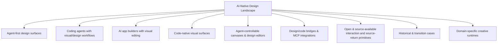
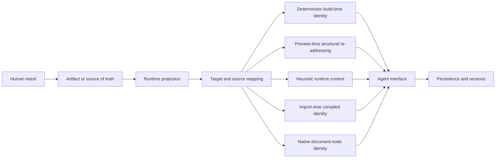

# AI-Native Design Landscape

> A living map of global AI-native design products, teams, visual surfaces, coding-agent design workflows, and open-source infrastructure.

**Snapshot:** 2026-08-11 · **Version:** v0.1 · **Coverage:** 63 canonical project directories

## Current progress

- **Canonical coverage:** 63 project directories registered and coverage-audited against the research collected for v0.1.
- **Source-level dossiers complete:** 14 / 63 — Onlook, stagewise, Tuna, Nimbalyst, OpenPencil (`open-pencil/open-pencil`), OpenPencil (`ZSeven-W/openpencil`), Reframe, Puck, onUI, Open CoDesign, Agentation, Code Inspector, Open Design, Monet.
- **Remaining dossiers:** 49 / 63 at Seed, Product-level, or Architecture-level depth.
- **Repository structure:** canonical project registry, project template, evidence rules, lifecycle/alias rules, and global panorama are established.
- **Current milestone:** v0.1 breadth is established; depth work is in progress project by project.

## Remaining work

The remaining work is intentionally depth-first, one project directory at a time. Depth does **not** mean forcing every project through one table of contents. Before drafting a dossier, identify the product's decisive user journey, unusual technical mechanism and most consequential evidence gaps, then build the document around those questions.

The earlier ten-part chain remains a **research checklist**, not a required structure:

`product facts · technical direction · technology choices · artifact/data model · agent interface · runtime/rendering · source mapping · persistence/versioning · implementation paths · commit history`

Use only the dimensions that explain the project, combine related ones, and add project-specific dimensions when the implementation demands them. A compile-time source locator, a feedback overlay, a vector editor and an agent-run artifact workspace should not read like four instances of the same system.

Priority backlog:

1. Deepen the remaining open-source/source-available projects first and pin immutable commit SHAs.
2. For closed-source products, exhaust official product docs, changelogs, engineering posts, public protocols and integration documentation without guessing undisclosed internals.
3. Trace the project's own critical path deeply enough to establish its artifact/source of truth, decisive mechanism, user-visible failure boundaries and relevant persistence or delivery semantics; do not add irrelevant sections for symmetry.
4. Maintain lifecycle events, aliases/rebrands, acquisitions and discontinued products.
5. Re-run long-tail discovery periodically so coverage can expand without weakening the per-project evidence standard.
6. Evolve the root panorama only from facts established in project dossiers; cross-product synthesis remains root-only.

## Scope

This repository tracks the part of the design-tool ecosystem being reshaped by AI agents, executable artifacts, code-native visual editing, agent-controllable canvases, and design-to-code/code-to-design workflows.

Repository rule:

- Root `README.md`: taxonomy, categorization, panorama, lifecycle, coverage decisions, research depth and project index.
- `projects/<project>/README.md`: only that project's own technical direction, public technology choices, artifact model and primary sources.
- No cross-product comparisons inside project directories.
- No guessed internal stack for closed products.

### Directory unit

A directory represents an independently identifiable product, open-source project, or independently surfaced design workspace.

- Product features/modes stay inside the owning product directory unless they have a distinct product/workspace identity.
- Direct renames/rebrands stay in one canonical directory with aliases recorded as metadata.
- Acquired or discontinued products remain as historical entries.
- Traditional design tools are outside the current scope unless they have an AI-native product/workspace represented here.

### Coverage audit

The v0.1 registry was re-audited against the named products and projects collected during the research thread. Important canonicalization decisions:

| Name encountered during research | Canonical entry |
|---|---|
| Create | [Anything](projects/anything/) |
| MGX / MetaGPT X | [Atoms](projects/atoms/) |
| TRAE SOLO | [TRAE Work](projects/trae-work/) |
| Devin Desktop / Desktop mode | [Devin](projects/devin/) |
| Cursor Design Mode | [Cursor](projects/cursor/) |
| Codex Browser / Annotations / Sites / Product Design workflows | [Codex](projects/openai-codex/) |
| v0 Design Mode | [v0](projects/vercel-v0/) |
| Uizard Autodesigner | [Uizard](projects/uizard/) |
| Canva AI / Magic Design | [Canva Magic Design](projects/canva-magic-design/) |

### Research depth

Coverage and evidence depth are tracked separately. A directory existing in the registry does **not** mean its implementation has already been source-audited.

| Depth | Meaning | Count in current snapshot |
|---|---|---:|
| **Source-level** | Open/source-available implementation pinned to a concrete commit and traced through the project's decisive product and technical questions, relevant implementation paths and failure boundaries, with commit history used where it changes the conclusion | **14** |
| **Architecture/Product-level or Seed** | Product is registered and independently documented, but one or more implementation layers still depend on public docs, incomplete source tracing, or future evidence | **49** |

Current source-level dossiers:

- [Onlook](projects/onlook/)
- [stagewise](projects/stagewise/)
- [Tuna](projects/tuna/)
- [Nimbalyst](projects/nimbalyst/)
- [OpenPencil (`open-pencil/open-pencil`)](projects/open-pencil/)
- [OpenPencil (`ZSeven-W/openpencil`)](projects/openpencil-zseven/)
- [Reframe](projects/reframe/)
- [Puck](projects/puck/)
- [onUI](projects/onui/)
- [Open CoDesign](projects/open-codesign/)
- [Agentation](projects/agentation/)
- [Code Inspector](projects/code-inspector/)
- [Open Design](projects/open-design/)
- [Monet](projects/monet/)

### Project-specific dossier design

Every dossier keeps a small common evidence floor: verified identity and lifecycle, canonical sources, an explicit evidence boundary, research gaps, and immutable revisions for source-derived claims. Everything between those anchors is project-specific.

Examples of questions that can determine a dossier's structure:

| Project shape | Questions that should lead the document |
|---|---|
| Agent design workspace | What is the ordinary-user loop, who owns execution authority, what becomes the durable artifact, and how is it delivered or recovered? |
| Code-native visual editor | What is canonical—source or a design document—how is it rendered, how does a selected element regain identity, and where is a mutation written? |
| Feedback/annotation bridge | What context is captured, how stable is the target, what survives transport to the agent, and what is persisted or lost? |
| Compile-time source locator | Which files are transformed, what identity is injected, how is it resolved at runtime, and which framework/build cases break the chain? |
| Canvas/object editor | What graph or schema owns truth, which operations mutate it, how do renderers project it, and how do undo, collaboration and versioning compose? |
| Closed or historical product | What user-observable journey and public contracts are established, what changed over time, and which internal claims must remain unknown? |

These are prompts, not archetype templates. The final headings should expose the particular system's causal structure rather than demonstrate that every checklist label was filled.

## Panorama



The project index is the ecosystem view; source-level dossiers also support an implementation-oriented reading across products:



These axes distinguish prompts, annotations and direct manipulation; source files, canvas graphs and feedback sessions; DOM, iframe, canvas and native renderers; selectors, component identities and source maps; file tools, MCP and product protocols; and browser storage, databases, snapshots and version graphs. Each dossier pins those distinctions to evidence instead of treating every visible canvas as the same architecture.

Five distinct target-return mechanisms are now established in the current source-level dossiers; this is an evidence-backed starting taxonomy, not an exhaustive claim about the landscape. Code Inspector and Open Design try to return a preview target toward authored source, Agentation transports heuristic runtime context, Reframe returns exported DOM to an imported graph identity, and OpenPencil never leaves its canonical design-document identity domain:

| Target-return route | Established implementation | Identity delivered downstream | Known break |
|---|---|---|---|
| Deterministic build-time identity | [Code Inspector](projects/code-inspector/) rewrites eligible framework source during bundling | file, line, column and node name carried on the rendered element | untransformed/failed files and unresolved multi-root call sites lose or downgrade the mapping |
| Preview-time structural re-addressing | [Open Design](projects/open-design/) parses HTML for its rich preview, prefers authored element ids and adds body-relative child-index paths before re-parsing persisted HTML for bounded patches | authored `data-od-id` or a structural HTML path plus DOM/text/style context | generated paths drift after structural edits; runtime-only DOM and heuristic comment targets do not become component-source identity |
| Heuristic runtime context | [Agentation](projects/agentation/) inspects DOM/React runtime structures while the page is running | DOM context plus optional React hierarchy and file hint | file hints are environment-dependent and do not survive its default SQLite + common MCP projection |
| Import-time compiled identity | [Reframe](projects/reframe/) hashes content-aware DOM paths into `h:` INode ids and re-emits them as `data-reframe-inode` in the HTML canvas | a selected exported DOM element returns to the compiled `SceneGraph`; `NodeMeta` retains structural import provenance | anonymous/duplicate-key ordering can retarget ids, there is no file/line mapping, and the primary MCP recompile path currently bypasses the replay overlay |
| Native document-node identity | [OpenPencil (`ZSeven-W/openpencil`)](projects/openpencil-zseven/) copies each canonical `.op` node ID into its resolved paint scene; paint and hit testing consume that same refreshed scene | the selected canvas target is already the canonical design-document node addressed by editor commands and MCP | the identity ends at the `.op` boundary; conversion provenance and generated code do not create a live reverse pointer to original application source |

The dossiers now also establish four different durable-refinement models. “Structured” does not by itself mean that every product has one equivalent source of truth:

| Durable-refinement model | Established implementation | Durable center | Known break |
|---|---|---|---|
| Canonical design document | [OpenPencil (`ZSeven-W/openpencil`)](projects/openpencil-zseven/) edits one typed `.op` document and projects it into paint scenes and exports | the `.op` document; editor commands, save, undo and collaboration all converge on its node ids | imported/generated code is an asymmetric conversion, not a continuously bound second authority |
| Materialized compile plus rebuild layers | [Reframe](projects/reframe/) keeps a live INode graph and SceneJSON snapshot, with optional HTML source and a partial JSONL edit overlay | current scene snapshot for restart; HTML + replay only for supported regeneration paths | the main MCP compile does not currently replay the overlay, structural edit coverage is incomplete and some graph side-channel metadata is not serialized |
| Filesystem-native deliverable | [Open Design](projects/open-design/) delegates execution to an installed agent and treats project files as the artifact, with optional manifests and per-file versions | canonical project files in the daemon project root or an explicitly imported folder | provider events are not artifact proof; render/edit bridges remain artifact-type-specific and must guard external file changes |
| Path-bound multi-artifact workspace | [Monet](projects/monet/) combines a live timeline store, `.aiveproj.json`, hashed autosave, path-keyed Canvas sidecar, absolute media references and generated source/renders | live `ProjectStore` for editing/export; project file and newer autosave for timeline recovery | Canvas is outside the project file, relocation changes its lookup key, external media is not bundled and MCP mixes live calls with direct disk writes |

The same evidence separates **having an agent interface** from **converging on one mutation authority**:

| Control-plane convergence | Established implementation | Agent/direct-edit relationship | Failure boundary |
|---|---|---|---|
| Native-document convergence | [OpenPencil (`ZSeven-W/openpencil`)](projects/openpencil-zseven/) addresses the same canonical `.op` nodes from editor commands and MCP | human selection, paint scene and agent commands retain one document-node identity | conversion provenance ends at the `.op` boundary rather than roundtripping to original app source |
| Filesystem convergence with verification | [Open Design](projects/open-design/) lets agents and artifact bridges converge on project files | file fingerprints/content diffs, not provider events, establish that the artifact changed | different artifact render/edit bridges still have type-specific fidelity and external-change boundaries |
| Live-graph convergence with partial replay | [Reframe](projects/reframe/) shares the current `SceneGraph` across MCP and Platform UI | direct manipulation and agent tools see one in-memory graph | not every mutation joins the replay log, and the primary compile route currently bypasses replay |
| Split live/file/sidecar control | [Monet](projects/monet/) routes CLI/HTTP mutations to a live store but lets six MCP tools rewrite the project JSON directly; Canvas persists separately | nominally one agent server can operate three authorities | UI saves can overwrite disk-only MCP edits, disk reads can be stale, Canvas acknowledgements precede renderer persistence and fixed MCP port/file discovery can miss the live project |

Open Design also establishes two artifact-production profiles that can converge on one project-file model:

| Artifact production profile | Established implementation | Durable result | Verification boundary |
|---|---|---|---|
| Filesystem-native agent run | Open Design launches a selected CLI/ACP agent in the resolved project workspace and fingerprints files before/after the run | canonical project files plus optional manifests and per-HTML versions | provider tool events are insufficient by themselves; a real content/file diff is the evidence that an artifact changed |
| Stream-to-file materialization | Open Design parses complete supported `<artifact>` blocks from a plain/BYOK adapter | HTML, CSS, SVG or Markdown written through the same project-file API with a generated manifest | incomplete, fenced or unsupported blocks are not a durable artifact merely because text streamed in chat |

## Project index

| Project | Team | Category | Status | Source |
|---|---|---|---|---|
| [Claude Design](projects/anthropic-claude-design/) | Anthropic | Agent-first design | Active / beta | Closed |
| [Codex](projects/openai-codex/) | OpenAI | Coding agent with visual workflow | Active | Core/CLI/App Server open; primary rich clients closed |
| [Cursor](projects/cursor/) | Anysphere | Coding agent with visual workflow | Active | Closed |
| [TRAE Work](projects/trae-work/) | ByteDance / TRAE | Agent workspace with Design Mode | Active | Closed |
| [QoderWork Design](projects/qoderwork-design/) | Alibaba / Qoder | Agent-first design surface | Active | Closed |
| [Replit Design](projects/replit-design/) | Replit | Agent-first design surface | Active | Closed |
| [CodeBuddy](projects/tencent-codebuddy/) | Tencent | Coding agent with design workflow | Active | Closed |
| [Comate](projects/baidu-comate/) | Baidu | Coding agent with design workflow | Active | Closed |
| [Devin](projects/devin/) | Cognition | Coding agent with visual/runtime workflow | Active | Closed |
| [v0](projects/vercel-v0/) | Vercel | AI app builder with visual editing | Active | Closed |
| [Lovable](projects/lovable/) | Lovable | AI app builder with visual editing | Active | Closed |
| [Windsurf](projects/windsurf/) | Cognition | Coding agent with visual workflow | Active | Closed |
| [GitHub Spark](projects/github-spark/) | GitHub | AI app builder with visual editing | Active | Closed |
| [Anything (formerly Create)](projects/anything/) | Anything | AI app builder with design reasoning | Active | Closed |
| [Fusion](projects/builderio-fusion/) | Builder.io | Code-native visual surface | Active | Closed |
| [Stitch](projects/google-stitch/) | Google Labs | Agent-first design | Active | Closed |
| [Google Antigravity](projects/google-antigravity/) | Google | Coding agent with visual workflow | Active | Closed client; agent API available |
| [Base44](projects/base44/) | Wix / Base44 | AI app builder with visual editing | Active | Closed |
| [Bolt.new](projects/bolt-new/) | StackBlitz | AI app builder with design-system workflow | Active | Closed |
| [Atoms (formerly MGX / MetaGPT X)](projects/atoms/) | MetaGPT / Atoms | Multi-agent app builder with visual editing | Active | Commercial product; related MetaGPT open source |
| [Subframe](projects/subframe/) | Subframe | Design-to-code / code-native design | Active | Closed |
| [FlutterFlow](projects/flutterflow/) | FlutterFlow | Visual builder with coding-agent integration | Active | Closed |
| [Figma Make](projects/figma-make/) | Figma | AI design + app builder | Active | Closed |
| [Alloy](projects/alloy/) | Alloy | AI prototyping + code context | Active | Closed |
| [Magic Patterns](projects/magic-patterns/) | Magic Patterns | AI design + code | Active | Closed |
| [Anima](projects/anima/) | Anima | Design-to-code / agent integration | Active | Closed |
| [Kombai](projects/kombai/) | Kombai | Design engineering agent | Active | Closed |
| [Miaoda (秒哒)](projects/baidu-miaoda/) | Baidu | AI app builder with visual editing | Active | Closed |
| [Onlook](projects/onlook/) | Onlook | Code-native visual surface | Active | Open source |
| [Tempo](projects/tempo/) | Tempo Labs | Code-native visual surface | Active | Closed |
| [stagewise](projects/stagewise/) | stagewise | Code-native visual surface | Active | Open source |
| [Dosmos](projects/dosmos/) | Dosmos | Code-native visual surface | Active | Source status unconfirmed |
| [Retune](projects/retune/) | Retune | Visual manipulation layer | Active | Closed |
| [Tuna](projects/tuna/) | Tuna contributors | Visual manipulation layer | Active | Open-source repository |
| [onUI](projects/onui/) | onUI contributors | Visual interaction primitive | Active | Open source |
| [Design Canvas](projects/design-canvas/) | Design Canvas | Agent-controlled runtime canvas | Active | Closed / source status unconfirmed |
| [Rivet](projects/rivet-design/) | Rivet Design | Visual manipulation layer | Active | Closed |
| [pen.dev](projects/pen-dev/) | pen.dev | Agent-controllable design canvas | Active | Closed product; open design format |
| [Paper](projects/paper/) | Paper | Agent-controllable design canvas | Active | Closed |
| [Clearly](projects/clearly/) | Clearly | Agent-controllable design canvas | Active | Closed |
| [MagicPath](projects/magicpath/) | MagicPath | Agent-controllable design canvas | Active | Closed |
| [Superdesign](projects/superdesign/) | Superdesign | Design agent / agent-controllable canvas | Active | Open-source components |
| [Nimbalyst](projects/nimbalyst/) | Nimbalyst | Generic visual workspace over agents | Active | Open source |
| [OpenPencil (open-pencil/open-pencil)](projects/open-pencil/) | OpenPencil | Agent-controllable design editor | Active | Open source |
| [OpenPencil (ZSeven-W/openpencil)](projects/openpencil-zseven/) | ZSeven-W / contributors | AI-native vector design editor and design-as-code runtime | Active; v0.8.3 | MIT |
| [Reframe](projects/reframe/) | Ilya Makarov / contributors | HTML-to-INode design compiler, DOM canvas and agent interface | Public v0.1.0; pinned main 2026-05-01 | AGPL-3.0-or-later; commercial option |
| [Open CoDesign](projects/open-codesign/) | OpenCoworkAI / contributors | Local-first desktop AI design agent | Active; v0.2.1 | MIT |
| [Open Design](projects/open-design/) | nexu-io / Open Design contributors | Local-first agent-native design workspace and artifact studio | Active; v0.18.2 | Apache-2.0 |
| [Agentation](projects/agentation/) | Benji Taylor / contributors | In-app visual feedback and agent-context primitive | Active; package v3.0.2 | PolyForm Shield 1.0.0 source-available |
| [Code Inspector](projects/code-inspector/) | zh-lx / contributors | Compile-time DOM-to-source and in-browser coding-agent bridge | Active; v2.0.7 | MIT |
| [Puck](projects/puck/) | Puck Editor | Visual editor primitive | Active | Open source |
| [Figwright](projects/figwright/) | Figwright contributors | Design/agent bridge primitive | Active / early | Open source |
| [mcp_excalidraw](projects/mcp-excalidraw/) | Community contributors | Canvas/agent bridge primitive | Active / early | Open source |
| [Monet](projects/monet/) | Het Patel / contributors | Agent-operable video timeline and code canvas | Active public alpha; v0.1.9 | MIT |
| [Uizard](projects/uizard/) | Uizard | AI UI design | Active | Closed |
| [Galileo AI](projects/galileo-ai/) | Galileo AI | Historical AI UI generation | Historical | Closed |
| [Diagram](projects/diagram/) | Diagram / Figma | Historical AI design tooling | Acquired / historical | Closed |
| [Framer AI](projects/framer-ai/) | Framer | AI website design / builder | Active | Closed |
| [Relume](projects/relume/) | Relume | AI website design system workflow | Active | Closed |
| [Webflow AI](projects/webflow-ai/) | Webflow | AI website builder | Active | Closed |
| [Canva Magic Design](projects/canva-magic-design/) | Canva | AI visual design | Active | Closed |
| [Firebase Studio](projects/firebase-studio/) | Google | Historical/transitioning AI app builder | Sunsetting 2027-03-22 | Closed |
| [Motiff](projects/motiff/) | Motiff | Historical AI design tool | Discontinued 2026-06-23 | Closed |

## Research rules

1. Prefer official docs, official product/changelog posts and official source repositories.
2. Keep fact, inference and unknown separate.
3. Project directories are monographs, not comparison pages.
4. For open-source projects, source-level dossiers pin immutable commit SHAs before recording implementation details.
5. Keep discontinued/acquired products as history instead of deleting them.
6. Categories may change as products evolve; directory slugs should remain stable.
7. Record aliases/rebrands inside the canonical project directory rather than creating duplicate project entries.
8. Track breadth and research depth separately; a registered directory is not automatically a completed technical dossier.

## Repository structure

```text
.
├── README.md
├── CONTRIBUTING.md
├── PROJECT_TEMPLATE.md
└── projects/
    └── <project-slug>/
        └── README.md
```

## Milestone status

**v0.1 breadth:** complete for the audited 63-project registry.

**v0.1 depth:** in progress — 14 Source-level dossiers complete, 49 remaining.
