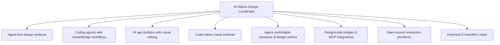

# AI-Native Design Landscape

> A living map of global AI-native design products, teams, visual surfaces, coding-agent design workflows, and open-source infrastructure.

**Snapshot:** 2026-08-10 · **Version:** v0.1 · **Coverage:** 63 canonical project directories

## Scope

This repository tracks the part of the design-tool ecosystem being reshaped by AI agents, executable artifacts, code-native visual editing, agent-controllable canvases, and design-to-code/code-to-design workflows.

Repository rule:

- Root `README.md`: taxonomy, categorization, panorama, lifecycle, coverage decisions, research depth and project index.
- `projects/<project>/README.md`: only that project's own technical direction, public technology choices, artifact model and primary sources.
- No cross-product comparisons inside project directories.
- No guessed internal stack for closed products.

### Directory unit

A directory represents an independently identifiable product, open-source project, or independently surfaced design workspace.

- Product features/modes stay inside the owning product directory unless they have a distinct product/workspace identity.
- Direct renames/rebrands stay in one canonical directory with aliases recorded as metadata.
- Acquired or discontinued products remain as historical entries.
- Traditional design tools are outside the current scope unless they have an AI-native product/workspace represented here.

### Coverage audit

The v0.1 registry was re-audited against the named products and projects collected during the research thread. Important canonicalization decisions:

| Name encountered during research | Canonical entry |
|---|---|
| Create | [Anything](projects/anything/) |
| MGX / MetaGPT X | [Atoms](projects/atoms/) |
| TRAE SOLO | [TRAE Work](projects/trae-work/) |
| Devin Desktop / Desktop mode | [Devin](projects/devin/) |
| Cursor Design Mode | [Cursor](projects/cursor/) |
| Codex Browser / Annotations / Sites / Product Design workflows | [Codex](projects/openai-codex/) |
| v0 Design Mode | [v0](projects/vercel-v0/) |
| Uizard Autodesigner | [Uizard](projects/uizard/) |
| Canva AI / Magic Design | [Canva Magic Design](projects/canva-magic-design/) |

### Research depth

Coverage and evidence depth are tracked separately. A directory existing in the registry does **not** mean its implementation has already been source-audited.

| Depth | Meaning | Count in current snapshot |
|---|---|---:|
| **Source-level** | Open/source-available implementation pinned to a concrete commit and traced through artifact/data model, agent interface, runtime/rendering, source mapping, persistence/versioning and implementation paths | **7** |
| **Architecture/Product-level or Seed** | Product is registered and independently documented, but one or more implementation layers still depend on public docs, incomplete source tracing, or future evidence | **56** |

Current source-level dossiers:

- [Onlook](projects/onlook/)
- [stagewise](projects/stagewise/)
- [Tuna](projects/tuna/)
- [Nimbalyst](projects/nimbalyst/)
- [OpenPencil (`open-pencil/open-pencil`)](projects/open-pencil/)
- [Puck](projects/puck/)
- [onUI](projects/onui/)

The standard deep-dive order for every project is:

`product facts → technical direction → technology choices → artifact/data model → agent interface → runtime/rendering → source mapping → persistence/versioning → implementation map → commit-level evidence`

## Panorama



## Project index

| Project | Team | Category | Status | Source |
|---|---|---|---|---|
| [Claude Design](projects/anthropic-claude-design/) | Anthropic | Agent-first design | Active / beta | Closed |
| [Codex](projects/openai-codex/) | OpenAI | Coding agent with visual workflow | Active | Core/CLI/App Server open; primary rich clients closed |
| [Cursor](projects/cursor/) | Anysphere | Coding agent with visual workflow | Active | Closed |
| [TRAE Work](projects/trae-work/) | ByteDance / TRAE | Agent workspace with Design Mode | Active | Closed |
| [QoderWork Design](projects/qoderwork-design/) | Alibaba / Qoder | Agent-first design surface | Active | Closed |
| [Replit Design](projects/replit-design/) | Replit | Agent-first design surface | Active | Closed |
| [CodeBuddy](projects/tencent-codebuddy/) | Tencent | Coding agent with design workflow | Active | Closed |
| [Comate](projects/baidu-comate/) | Baidu | Coding agent with design workflow | Active | Closed |
| [Devin](projects/devin/) | Cognition | Coding agent with visual/runtime workflow | Active | Closed |
| [v0](projects/vercel-v0/) | Vercel | AI app builder with visual editing | Active | Closed |
| [Lovable](projects/lovable/) | Lovable | AI app builder with visual editing | Active | Closed |
| [Windsurf](projects/windsurf/) | Cognition | Coding agent with visual workflow | Active | Closed |
| [GitHub Spark](projects/github-spark/) | GitHub | AI app builder with visual editing | Active | Closed |
| [Anything (formerly Create)](projects/anything/) | Anything | AI app builder with design reasoning | Active | Closed |
| [Fusion](projects/builderio-fusion/) | Builder.io | Code-native visual surface | Active | Closed |
| [Stitch](projects/google-stitch/) | Google Labs | Agent-first design | Active | Closed |
| [Google Antigravity](projects/google-antigravity/) | Google | Coding agent with visual workflow | Active | Closed client; agent API available |
| [Base44](projects/base44/) | Wix / Base44 | AI app builder with visual editing | Active | Closed |
| [Bolt.new](projects/bolt-new/) | StackBlitz | AI app builder with design-system workflow | Active | Closed |
| [Atoms (formerly MGX / MetaGPT X)](projects/atoms/) | MetaGPT / Atoms | Multi-agent app builder with visual editing | Active | Commercial product; related MetaGPT open source |
| [Subframe](projects/subframe/) | Subframe | Design-to-code / code-native design | Active | Closed |
| [FlutterFlow](projects/flutterflow/) | FlutterFlow | Visual builder with coding-agent integration | Active | Closed |
| [Figma Make](projects/figma-make/) | Figma | AI design + app builder | Active | Closed |
| [Alloy](projects/alloy/) | Alloy | AI prototyping + code context | Active | Closed |
| [Magic Patterns](projects/magic-patterns/) | Magic Patterns | AI design + code | Active | Closed |
| [Anima](projects/anima/) | Anima | Design-to-code / agent integration | Active | Closed |
| [Kombai](projects/kombai/) | Kombai | Design engineering agent | Active | Closed |
| [Miaoda (秒哒)](projects/baidu-miaoda/) | Baidu | AI app builder with visual editing | Active | Closed |
| [Onlook](projects/onlook/) | Onlook | Code-native visual surface | Active | Open source |
| [Tempo](projects/tempo/) | Tempo Labs | Code-native visual surface | Active | Closed |
| [stagewise](projects/stagewise/) | stagewise | Code-native visual surface | Active | Open source |
| [Dosmos](projects/dosmos/) | Dosmos | Code-native visual surface | Active | Source status unconfirmed |
| [Retune](projects/retune/) | Retune | Visual manipulation layer | Active | Closed |
| [Tuna](projects/tuna/) | Tuna contributors | Visual manipulation layer | Active | Source-available |
| [onUI](projects/onui/) | onUI contributors | Visual interaction primitive | Active | Open source |
| [Design Canvas](projects/design-canvas/) | Design Canvas | Agent-controlled runtime canvas | Active | Closed / source status unconfirmed |
| [Rivet](projects/rivet-design/) | Rivet Design | Visual manipulation layer | Active | Closed |
| [pen.dev](projects/pen-dev/) | pen.dev | Agent-controllable design canvas | Active | Closed product; open design format |
| [Paper](projects/paper/) | Paper | Agent-controllable design canvas | Active | Closed |
| [Clearly](projects/clearly/) | Clearly | Agent-controllable design canvas | Active | Closed |
| [MagicPath](projects/magicpath/) | MagicPath | Agent-controllable design canvas | Active | Closed |
| [Superdesign](projects/superdesign/) | Superdesign | Design agent / agent-controllable canvas | Active | Open-source components |
| [Nimbalyst](projects/nimbalyst/) | Nimbalyst | Generic visual workspace over agents | Active | Open source |
| [OpenPencil (open-pencil/open-pencil)](projects/open-pencil/) | OpenPencil | Agent-controllable design editor | Active | Open source |
| [OpenPencil (ZSeven-W/openpencil)](projects/openpencil-zseven/) | ZSeven-W / contributors | AI-native design editor | Active | Open source |
| [Reframe](projects/reframe/) | Reframe contributors | Experimental AI-native design engine | Experimental | Open source |
| [Open CoDesign](projects/open-codesign/) | Open CoDesign contributors | Open-source AI design product | Active / early | Open source |
| [Open Design](projects/open-design/) | nexu-io / contributors | Design tooling for agents | Active / early | Open source |
| [Agentation](projects/agentation/) | Agentation contributors | Visual context primitive | Active | Source-available |
| [Code Inspector](projects/code-inspector/) | Code Inspector contributors | DOM-to-source primitive | Active | Open source |
| [Puck](projects/puck/) | Puck Editor | Visual editor primitive | Active | Open source |
| [Figwright](projects/figwright/) | Figwright contributors | Design/agent bridge primitive | Active / early | Open source |
| [mcp_excalidraw](projects/mcp-excalidraw/) | Community contributors | Canvas/agent bridge primitive | Active / early | Open source |
| [Monet](projects/monet/) | Monet contributors | Domain-specific visual surface | Active / early | Open source |
| [Uizard](projects/uizard/) | Uizard | AI UI design | Active | Closed |
| [Galileo AI](projects/galileo-ai/) | Galileo AI | Historical AI UI generation | Historical | Closed |
| [Diagram](projects/diagram/) | Diagram / Figma | Historical AI design tooling | Acquired / historical | Closed |
| [Framer AI](projects/framer-ai/) | Framer | AI website design / builder | Active | Closed |
| [Relume](projects/relume/) | Relume | AI website design system workflow | Active | Closed |
| [Webflow AI](projects/webflow-ai/) | Webflow | AI website builder | Active | Closed |
| [Canva Magic Design](projects/canva-magic-design/) | Canva | AI visual design | Active | Closed |
| [Firebase Studio](projects/firebase-studio/) | Google | Historical/transitioning AI app builder | Sunsetting 2027-03-22 | Closed |
| [Motiff](projects/motiff/) | Motiff | Historical AI design tool | Discontinued 2026-06-23 | Closed |

## Research rules

1. Prefer official docs, official product/changelog posts and official source repositories.
2. Keep fact, inference and unknown separate.
3. Project directories are monographs, not comparison pages.
4. For open-source/source-available projects, pin a commit SHA before recording source-derived implementation details.
5. Keep discontinued/acquired products as history instead of deleting them.
6. Categories may change as products evolve; directory slugs should remain stable.
7. Record aliases/rebrands inside the canonical project directory rather than creating duplicate project entries.
8. Keep registry coverage and research depth separate; `Seed` is not `Source-level`.

## Repository structure

```text
.
├── README.md
├── CONTRIBUTING.md
├── PROJECT_TEMPLATE.md
└── projects/
    └── <project-slug>/
        └── README.md
```

## Research progression

Each project advances independently through the evidence chain. Open-source projects can reach source-level by pinning a revision and tracing concrete implementation paths. Closed-source projects should stop at the deepest level supported by public first-party evidence instead of inventing missing internals.
