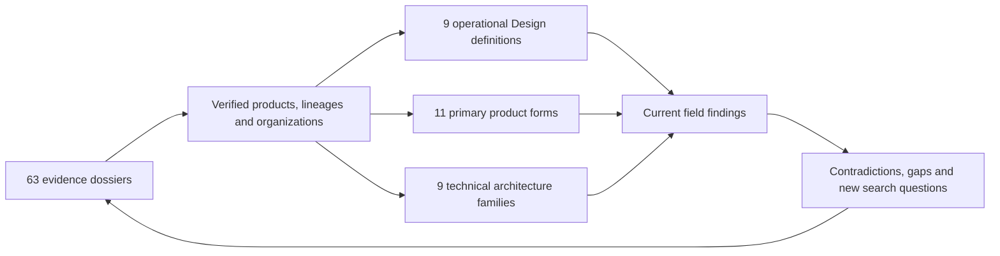

# AI-Native Design Landscape

> An evidence-bounded global census of how teams are defining **Design**, turning those definitions into products, and implementing them as technical systems.

**Snapshot:** 2026-08-11 · **Census schema:** v0.2 · **Canonical project records:** 63

## What this project is trying to learn

This repository does not assume that AI-native Design is one settled category. It asks four prior questions:

1. How many independently attributable team units and products can be verified in the current public landscape?
2. How many operationally different meanings of **Design** do those products implement?
3. How many different product forms have those meanings taken?
4. How many decisive technical architecture families are being used to make them real?

The project dossiers are evidence samples for those questions, not the final product. The root synthesis is the current answer; the machine-readable census makes every count reproducible; new evidence is expected to change the answer.

## Snapshot results

| Observable | Current lower-bound count | What the count means |
|---|---:|---|
| Canonical products / projects | **63** | Independently identifiable products, open-source projects or surfaced Design workspaces with their own dossier |
| Publicly attributable team units | **58–63** | 58 consolidated organization/maintainer umbrellas or 63 distinct product/maintainer lineages, depending on counting boundary; not a claim about undisclosed internal squads |
| Product or maintainer lineages | **63** | Independently attributable teams or maintainer lineages; acquired and historical origins remain visible |
| Organizations / maintainer umbrellas | **58** | Canonical organizational homes used to consolidate related lineages such as Google, Baidu, Figma and Cognition; not necessarily the ultimate legal parent |
| Operational definitions of Design | **9** | Distinct user-visible answers to what work counts as Design; records may adopt several |
| Primary product forms | **11** | Mutually countable primary ways the capability is packaged for users |
| Decisive architecture families | **9** | Different authority, projection, agent-control and mutation arrangements; records may combine several |
| Source-level dossiers | **20** | Public implementation pinned to a concrete revision and traced through its decisive mechanism |
| Architecture-level dossiers | **43** | Closed or distributed implementation researched to its available public evidence ceiling |
| Active or actively transitioning records | **57** | 55 active and 2 active products with a material surface transition underway |
| Historical or sunsetting records | **6** | 4 bounded historical lineages and 2 products in a documented shutdown path |

These are **snapshot lower bounds**, not a claim that every team on Earth has been discovered. Public sources rarely expose stable internal team rosters, so the repository reports both defensible team-like units instead of inventing one falsely precise number. A count changes only when a new canonical object or a genuinely different, evidence-supported family is established—not when a marketing label changes.

## How the census works

Three layers must remain separate:



- **Product and lifecycle facts** come from the individual dossiers and their primary sources.
- **Definitions, forms and architecture families** are this repository's analytical synthesis. They are explicit, testable in [`data/taxonomy.json`](data/taxonomy.json), and may be revised.
- **Names are not records.** [`data/identity-map.csv`](data/identity-map.csv) records aliases, product modes, renamed surfaces and historical/successor cutoffs so discovery does not inflate the census.
- Every record has one **primary** definition, form and architecture so distributions can be counted. Additional definitions and architectures preserve hybrid products instead of flattening them.
- A visible canvas, an AI label or a React stack never establishes a family by itself. Classification follows the ordinary-user loop, working artifact authority, agent boundary, mutation path and persistence semantics.

### Discovery and inclusion boundary

The current registry was discovered across named Design modes in agent platforms, AI app/site builders, code-native visual tools, runtime overlays, agent-controllable canvases, design-code bridges, established visual platforms and long-tail editor infrastructure. Evidence comes primarily from official English- and Chinese-language product material, public source/package registries, shipped distributions and directly observable public surfaces.

A record qualifies only when it has an independently identifiable product/workspace boundary, an evidenced Design-relevant ordinary-user loop and enough public evidence to establish the working artifact authority. Generic models or media generators, coding agents with no visual/Design path, unevidenced AI claims and aliases already owned by another record do not create new rows. The exact tests and known blind spots are encoded in [`data/taxonomy.json`](data/taxonomy.json); canonicalization decisions are in [`data/identity-map.csv`](data/identity-map.csv).

This discovery surface is necessarily uneven. Stealth teams, private deployments, inaccessible paid capabilities and products documented only in unreviewed languages may be absent. Closed products may also hide distinct mechanisms behind one observable boundary. “Global” therefore describes the search horizon and comparison frame; **63 is the verified public lower bound in this snapshot, not an estimate of the unknown total population**.

## Finding 1: Design currently has nine operational definitions

`Primary` counts sum to 63. `Appears in` is multi-label adoption and therefore overlaps.

| Operational definition | Primary | Appears in | What qualifies | Representative products |
|---|---:|---:|---|---|
| **Delegated creation** | 13 | 34 | A person supplies intent or references and an agent creates and repeatedly refines the artifact | [Claude Design](projects/anthropic-claude-design/), [Stitch](projects/google-stitch/), [Magic Patterns](projects/magic-patterns/) |
| **Native artifact authoring** | 14 | 23 | A structured design, scene, page, site or timeline graph remains a first-class editable artifact | [pen.dev](projects/pen-dev/), [OpenPencil](projects/open-pencil/), [Framer AI](projects/framer-ai/) |
| **Visual authoring of executable source** | 5 | 20 | A visual surface renders executable source and changes ultimately return to the code or workspace that owns implementation | [Onlook](projects/onlook/), [Tempo](projects/tempo/), [Fusion](projects/builderio-fusion/) |
| **Runtime correction** | 8 | 28 | A person selects, annotates, adjusts or demonstrates a change on a running artifact so implementation can be repaired | [Retune](projects/retune/), [Agentation](projects/agentation/), [Devin](projects/devin/) |
| **Variant exploration and decision** | 3 | 26 | Alternative directions coexist, can be compared or refined, and have an explicit promotion step | [Replit Design](projects/replit-design/), [Rivet](projects/rivet-design/), [Superdesign](projects/superdesign/) |
| **System governance** | 1 | 17 | Components, tokens, brand rules or layout conventions are extracted, published, applied or validated as reusable constraints | [Subframe](projects/subframe/), [Diagram](projects/diagram/), [Bolt.new](projects/bolt-new/) |
| **Design-code translation and grounding** | 6 | 25 | The decisive workflow converts or joins structured context, identities, components or tokens across design and code | [Figwright](projects/figwright/), [Anima](projects/anima/), [Relume](projects/relume/) |
| **End-to-end product delivery** | 9 | 34 | Design is inseparable from creating a functional app or site and advancing behavior, data and release state | [v0](projects/vercel-v0/), [Lovable](projects/lovable/), [Base44](projects/base44/) |
| **Visual coordination and evidence** | 4 | 15 | A board, preview, screenshot, recording, diagram or spatial artifact coordinates or verifies agent work without owning implementation | [Codex](projects/openai-codex/), [Design Canvas](projects/design-canvas/), [Google Antigravity](projects/google-antigravity/) |

The largest primary definition covers only 14 of 63 records. The word **Design** therefore does not identify one product object: it can mean delegation, a canonical graph, a code projection, a correction channel, a decision process, a reusable system, a translation boundary, product delivery or visual evidence.

## Finding 2: those definitions have produced eleven product forms

Each record receives exactly one primary product form. Product form describes packaging, not internal architecture.

| Primary product form | Count | Product boundary | Examples |
|---|---:|---|---|
| **Standalone design-agent workspace** | 8 | A dedicated product starts with AI-mediated Design creation or refinement | [Claude Design](projects/anthropic-claude-design/), [Stitch](projects/google-stitch/), [Superdesign](projects/superdesign/) |
| **Design surface inside an agent platform** | 5 | Design is a named first-class workspace or mode inside a broader coding/general-agent product | [Cursor](projects/cursor/), [Kombai](projects/kombai/), [Replit Design](projects/replit-design/) |
| **General agent with visual tools** | 6 | The product remains a general agent; browser, preview, annotation or computer-use surfaces provide visual interaction | [Codex](projects/openai-codex/), [CodeBuddy](projects/tencent-codebuddy/), [Comate](projects/baidu-comate/) |
| **AI app or site builder** | 10 | Intent becomes a hosted application or site with visual refinement and delivery | [v0](projects/vercel-v0/), [Anything](projects/anything/), [Miaoda](projects/baidu-miaoda/) |
| **Code-native visual editor or IDE** | 5 | Executable source and its running projection share the central workspace | [Onlook](projects/onlook/), [stagewise](projects/stagewise/), [Tempo](projects/tempo/) |
| **Runtime overlay or context bridge** | 5 | An injected overlay, extension or compiler/preview bridge captures targets and intent for another writer | [Retune](projects/retune/), [onUI](projects/onui/), [Code Inspector](projects/code-inspector/) |
| **Agent-controllable canvas or domain editor** | 10 | A visual artifact can be read or mutated by an external agent through MCP, skills, CLI or a headless API | [pen.dev](projects/pen-dev/), [Paper](projects/paper/), [Monet](projects/monet/) |
| **Design-code bridge** | 2 | The primary value is moving or grounding structured context between design and code | [Anima](projects/anima/), [Figwright](projects/figwright/) |
| **Established visual platform with AI** | 9 | A pre-existing design, site or application-authoring platform embeds agentic generation/control into its native model | [Canva Magic Design](projects/canva-magic-design/), [Framer AI](projects/framer-ai/), [Webflow AI](projects/webflow-ai/) |
| **Visual decision or verification workspace** | 2 | The central surface arranges, compares or captures alternatives and runtime evidence before another authority adopts the result | [Design Canvas](projects/design-canvas/), [Rivet](projects/rivet-design/) |
| **Visual-editor infrastructure** | 1 | The public project is an embeddable editor kernel or interaction primitive rather than a complete workspace | [Puck](projects/puck/) |

No product form covers more than 10 of 63 records. “Design Surface” is one observed form among eleven, not a synonym for the whole field.

## Finding 3: implementation currently resolves into nine architecture families

`Primary` counts sum to 63. `Appears in` includes additional architecture families adopted by hybrid products.

| Architecture family | Primary | Appears in | Decisive arrangement | Characteristic break |
|---|---:|---:|---|---|
| **Source-authority live projection** | 8 | 17 | Repository/workspace files are authoritative; a live visual projection maps deterministic edits or agent intent back to them | Runtime identity drifts, shared instances broaden edits, or source changes invalidate the projection |
| **Runtime-intent relay** | 6 | 13 | An overlay or browser bridge captures target context and desired change; another agent/editor owns the durable write | A correct temporary DOM or intent packet is not proof that source was changed correctly |
| **Native graph authority** | 9 | 20 | A design, scene, site, page or timeline graph is canonical and human/agent operations mutate native objects | Identity usually stops at the graph boundary; exports and generated code fork |
| **External-agent canvas** | 8 | 11 | A separate visual artifact is exposed to third-party agents through MCP, skills, CLI, plugins or a headless API | Canvas, source and agent history rarely share one transaction or revision clock |
| **Hosted generated-artifact workspace** | 9 | 15 | The provider owns generated code/artifact revisions and chat, visual and code editing converge inside the hosted workspace | Source mapping, merge policy and revision semantics are often closed; export creates another authority |
| **Managed application-project graph** | 8 | 11 | A platform project spans UI, logic, data, backend, configuration and release state | Code, data, credentials and deployment cannot usually be restored or exported atomically |
| **Design-code materialization** | 7 | 17 | A design graph, capture, system or semantic join is compiled, exported, reconstructed or grounded into distinct code | Structure and identity normalize at the boundary; later edits rarely roundtrip |
| **Filesystem agent with visual evidence** | 5 | 11 | Files and Git remain authoritative while previews, screenshots, recordings, diagrams or boards coordinate/verify work | Visual evidence can stale and does not prove a file mutation, commit or release |
| **Candidate isolation and promotion** | 3 | 20 | Alternative designs, artifacts or worktrees are isolated and one is explicitly selected, applied or committed | Choosing a candidate does not prove implementation, integration or delivery |

No primary architecture covers more than 9 records: native-graph authority and hosted generated-artifact workspaces tie at that ceiling. Product appearance cannot predict architecture: the four products classified as an agent-platform Design surface already split across source-authority projection, hosted generated artifacts and candidate promotion.

## What the global sample currently says

### 1. The field is redefining four things at once

Teams are not merely adding AI to an established Design category. They are independently changing:

- **the human role** — manual author, delegator, reviewer, demonstrator or promoter;
- **the primary artifact** — design graph, repository, hosted code revision, managed app graph, intent ledger or visual evidence;
- **the product boundary** — standalone workspace, platform surface, builder, IDE, overlay, canvas, bridge or infrastructure;
- **the mutation boundary** — native graph operation, deterministic source write, agent-mediated repair, materialization, managed transaction or candidate promotion.

### 2. Design is expanding and shrinking simultaneously

`product-delivery` appears in 34 records: Design is expanding downstream into application behavior, backend state, testing and release. `runtime-correction` appears in 28: Design is also shrinking into a precise interaction primitive—see, point, adjust, return intent. Both movements are real and coexist.

### 3. Code and native graphs remain the two strongest authority poles

Source-authority products avoid a second design truth but must preserve fragile runtime-to-source identity. Native-graph products preserve direct manipulation, structure and collaboration but normally lose identity when code is materialized. Hosted artifact and managed-project products bridge more of the journey by owning the environment, at the cost of closed authority and multiple export/release clocks.

### 4. Variant promotion is a cross-cutting mechanism, not a niche product type

Only 3 records use candidate promotion as their primary architecture, but 20 adopt it somewhere. Parallel directions, branches and worktrees are becoming a general response to nondeterministic generation; the unresolved problem is promoting one candidate without losing provenance or overstating delivery.

### 5. Open implementation evidence remains the minority

Only 20 of 63 dossiers reach Source-level. The remaining 43 can establish product behavior, public protocols, shipped distributions and failure boundaries, but not undisclosed algorithms or storage models. The census therefore counts observed architecture only to the available evidence ceiling and keeps consequential unknowns explicit.

## Data and reproducibility

- [`data/census.csv`](data/census.csv) is the canonical per-project classification ledger.
- [`data/organizations.csv`](data/organizations.csv) resolves organization identifiers and makes the 58-organization count auditable.
- [`data/identity-map.csv`](data/identity-map.csv) makes the current alias, surface and lineage deduplication decisions auditable.
- [`data/taxonomy.json`](data/taxonomy.json) defines every unit, family, inclusion test and boundary.
- [`scripts/verify-census.ps1`](scripts/verify-census.ps1) checks directory coverage, identifiers, evidence depth and all derived counts.
- [`EVIDENCE_ATLAS.md`](EVIDENCE_ATLAS.md) preserves the detailed cross-project mechanism synthesis from the first evidence pass, including target-return, convergence, persistence and artifact-production boundaries.

Reproduce the snapshot from PowerShell:

```powershell
./scripts/verify-census.ps1 -Json
```

## Evidence registry

The table shows each record's **primary** analytical labels. Hybrid labels and canonical identifiers are in [`data/census.csv`](data/census.csv); product facts and evidence remain in the linked dossier.

| Product | Organization | Primary Design definition | Primary product form | Primary architecture | Evidence · lifecycle |
|---|---|---|---|---|---|
| [Clearly](projects/clearly/) | Clearly | native artifact authoring | Agent-controllable canvas or domain editor | External-agent canvas | architecture · active |
| [MagicPath](projects/magicpath/) | NewCompute | delegated creation | Agent-controllable canvas or domain editor | Hosted generated-artifact workspace | architecture · active |
| [mcp_excalidraw](projects/mcp-excalidraw/) | yctimlin contributors | native artifact authoring | Agent-controllable canvas or domain editor | External-agent canvas | source · active |
| [Monet](projects/monet/) | Het Patel / Monet contributors | native artifact authoring | Agent-controllable canvas or domain editor | External-agent canvas | source · active |
| [Nimbalyst](projects/nimbalyst/) | Nimbalyst | visual coordination and evidence | Agent-controllable canvas or domain editor | Source-authority live projection | source · active |
| [OpenPencil](projects/open-pencil/) | OpenPencil | native artifact authoring | Agent-controllable canvas or domain editor | External-agent canvas | source · active |
| [OpenPencil ZSeven](projects/openpencil-zseven/) | ZSeven-W contributors | native artifact authoring | Agent-controllable canvas or domain editor | External-agent canvas | source · active |
| [Paper](projects/paper/) | Lost Coast Labs | native artifact authoring | Agent-controllable canvas or domain editor | External-agent canvas | architecture · active |
| [pen.dev](projects/pen-dev/) | High Agency | native artifact authoring | Agent-controllable canvas or domain editor | External-agent canvas | architecture · active |
| [Reframe](projects/reframe/) | Reframe contributors | native artifact authoring | Agent-controllable canvas or domain editor | Native graph authority | source · active |
| [Cursor](projects/cursor/) | Anysphere | visual authoring of executable source | Design surface inside an agent platform | Source-authority live projection | architecture · active |
| [QoderWork Design](projects/qoderwork-design/) | Alibaba | delegated creation | Design surface inside an agent platform | Hosted generated-artifact workspace | architecture · active |
| [Replit Design](projects/replit-design/) | Replit | variant exploration and decision | Design surface inside an agent platform | Candidate isolation and promotion | architecture · active |
| [TRAE Work](projects/trae-work/) | ByteDance | delegated creation | Design surface inside an agent platform | Hosted generated-artifact workspace | architecture · active |
| [Anything](projects/anything/) | Anything | end-to-end product delivery | AI app or site builder | Managed application-project graph | architecture · active |
| [Atoms](projects/atoms/) | MetaGPT / Atoms | end-to-end product delivery | AI app or site builder | Managed application-project graph | architecture · active |
| [Base44](projects/base44/) | Wix | end-to-end product delivery | AI app or site builder | Managed application-project graph | architecture · active |
| [Bolt.new](projects/bolt-new/) | StackBlitz | end-to-end product delivery | AI app or site builder | Managed application-project graph | architecture · active |
| [Figma Make](projects/figma-make/) | Figma | delegated creation | AI app or site builder | Hosted generated-artifact workspace | architecture · active |
| [Firebase Studio](projects/firebase-studio/) | Google | end-to-end product delivery | AI app or site builder | Hosted generated-artifact workspace | architecture · sunsetting |
| [GitHub Spark](projects/github-spark/) | GitHub | end-to-end product delivery | AI app or site builder | Managed application-project graph | architecture · sunsetting |
| [Lovable](projects/lovable/) | Lovable | end-to-end product delivery | AI app or site builder | Managed application-project graph | architecture · active |
| [Miaoda](projects/baidu-miaoda/) | Baidu | end-to-end product delivery | AI app or site builder | Managed application-project graph | architecture · active |
| [v0](projects/vercel-v0/) | Vercel | end-to-end product delivery | AI app or site builder | Hosted generated-artifact workspace | architecture · active |
| [Dosmos](projects/dosmos/) | Dosmos | runtime correction | Code-native visual editor or IDE | Runtime-intent relay | source · active |
| [Fusion](projects/builderio-fusion/) | Builder.io | visual authoring of executable source | Code-native visual editor or IDE | Source-authority live projection | architecture · active |
| [Kombai](projects/kombai/) | Kombai | design-code translation and grounding | Design surface inside an agent platform | Design-code materialization | architecture · active |
| [Onlook](projects/onlook/) | Onlook | visual authoring of executable source | Code-native visual editor or IDE | Source-authority live projection | source · active |
| [stagewise](projects/stagewise/) | stagewise | visual authoring of executable source | Code-native visual editor or IDE | Source-authority live projection | source · active |
| [Tempo](projects/tempo/) | Tempo Labs | visual authoring of executable source | Code-native visual editor or IDE | Source-authority live projection | architecture · active-transition |
| [Anima](projects/anima/) | Anima | design-code translation and grounding | Design-code bridge | Design-code materialization | architecture · active |
| [CodeBuddy](projects/tencent-codebuddy/) | Tencent | design-code translation and grounding | General agent with visual tools | Design-code materialization | architecture · active |
| [Comate](projects/baidu-comate/) | Baidu | design-code translation and grounding | General agent with visual tools | Design-code materialization | architecture · active |
| [Figwright](projects/figwright/) | Roya / Figwright contributors | design-code translation and grounding | Design-code bridge | Design-code materialization | source · active |
| [Superdesign](projects/superdesign/) | Superdesign | variant exploration and decision | Standalone design-agent workspace | External-agent canvas | source · active |
| [Canva Magic Design](projects/canva-magic-design/) | Canva | delegated creation | Established visual platform with AI | Native graph authority | architecture · active |
| [Diagram](projects/diagram/) | Figma | native artifact authoring | Established visual platform with AI | Native graph authority | architecture · historical |
| [FlutterFlow](projects/flutterflow/) | FlutterFlow | native artifact authoring | Established visual platform with AI | Managed application-project graph | architecture · active |
| [Framer AI](projects/framer-ai/) | Framer | native artifact authoring | Established visual platform with AI | Native graph authority | architecture · active |
| [Motiff](projects/motiff/) | Motiff | native artifact authoring | Established visual platform with AI | Native graph authority | architecture · historical |
| [Relume](projects/relume/) | Relume | design-code translation and grounding | Established visual platform with AI | Design-code materialization | architecture · active |
| [Subframe](projects/subframe/) | Subframe | system governance | Established visual platform with AI | Design-code materialization | architecture · active |
| [Uizard](projects/uizard/) | Miro | delegated creation | Established visual platform with AI | Native graph authority | architecture · active |
| [Webflow AI](projects/webflow-ai/) | Webflow | native artifact authoring | Established visual platform with AI | Native graph authority | architecture · active-transition |
| [Codex](projects/openai-codex/) | OpenAI | visual coordination and evidence | General agent with visual tools | Filesystem agent with visual evidence | source · active |
| [Devin](projects/devin/) | Cognition | runtime correction | General agent with visual tools | Filesystem agent with visual evidence | architecture · active |
| [Google Antigravity](projects/google-antigravity/) | Google | visual coordination and evidence | General agent with visual tools | Filesystem agent with visual evidence | architecture · active |
| [Windsurf](projects/windsurf/) | Cognition | runtime correction | General agent with visual tools | Filesystem agent with visual evidence | architecture · historical |
| [Agentation](projects/agentation/) | Agentation contributors | runtime correction | Runtime overlay or context bridge | Runtime-intent relay | source · active |
| [Code Inspector](projects/code-inspector/) | zh-lx contributors | runtime correction | Runtime overlay or context bridge | Runtime-intent relay | source · active |
| [onUI](projects/onui/) | onUI contributors | runtime correction | Runtime overlay or context bridge | Runtime-intent relay | source · active |
| [Retune](projects/retune/) | Retune contributors | runtime correction | Runtime overlay or context bridge | Runtime-intent relay | source · active |
| [Tuna](projects/tuna/) | Tuna contributors | runtime correction | Runtime overlay or context bridge | Runtime-intent relay | source · active |
| [Alloy](projects/alloy/) | Alloy | delegated creation | Standalone design-agent workspace | Hosted generated-artifact workspace | architecture · active |
| [Claude Design](projects/anthropic-claude-design/) | Anthropic | delegated creation | Standalone design-agent workspace | Hosted generated-artifact workspace | architecture · active |
| [Galileo AI](projects/galileo-ai/) | Galileo AI | delegated creation | Standalone design-agent workspace | Candidate isolation and promotion | architecture · historical |
| [Magic Patterns](projects/magic-patterns/) | Magic Patterns | delegated creation | Standalone design-agent workspace | Hosted generated-artifact workspace | architecture · active |
| [Open CoDesign](projects/open-codesign/) | OpenCoworkAI | delegated creation | Standalone design-agent workspace | Source-authority live projection | source · active |
| [Open Design](projects/open-design/) | nexu-io | delegated creation | Standalone design-agent workspace | Source-authority live projection | source · active |
| [Stitch](projects/google-stitch/) | Google | delegated creation | Standalone design-agent workspace | Native graph authority | architecture · active |
| [Design Canvas](projects/design-canvas/) | Design Canvas | visual coordination and evidence | Visual decision or verification workspace | Filesystem agent with visual evidence | architecture · active |
| [Rivet](projects/rivet-design/) | Rivet Design | variant exploration and decision | Visual decision or verification workspace | Candidate isolation and promotion | architecture · active |
| [Puck](projects/puck/) | Puck contributors | native artifact authoring | Visual-editor infrastructure | Native graph authority | source · active |

## Research and contribution rules

1. Discover broadly, but create a canonical record only for an independently identifiable product, project or Design workspace.
2. Resolve team lineage, parent organization, aliases, acquisition and lifecycle before counting.
3. Let each dossier follow that project's decisive user journey and causal mechanism. Do not impose one universal outline.
4. Prefer official documentation, official source/distributions and direct observable contracts. Keep fact, inference and unknown separate.
5. Pin immutable source revisions for implementation claims. Closed products stop at the available evidence ceiling.
6. Classify only after the dossier establishes the working artifact, product boundary, agent relationship, visual projection, mutation path and persistence boundary.
7. Add a new definition, form or architecture family only when an existing inclusion test cannot explain the evidence without erasing a consequential difference.
8. Run the census verifier and update the global findings whenever a record or classification changes.

See [`CONTRIBUTING.md`](CONTRIBUTING.md) for the dossier workflow and [`PROJECT_TEMPLATE.md`](PROJECT_TEMPLATE.md) for the common evidence floor.

## Repository structure

```text
.
├── README.md                  # current global census and findings
├── EVIDENCE_ATLAS.md          # detailed cross-project mechanism evidence
├── CONTRIBUTING.md            # research and classification workflow
├── PROJECT_TEMPLATE.md        # project-specific dossier design
├── data/
│   ├── census.csv             # canonical classifications for 63 records
│   ├── organizations.csv      # 58 canonical organization/maintainer labels
│   ├── identity-map.csv       # alias, surface and lineage deduplication decisions
│   └── taxonomy.json          # units, definitions, forms and architecture tests
├── scripts/
│   └── verify-census.ps1      # reproducible coverage and count checks
└── projects/
    └── <project-slug>/
        └── README.md          # evidence dossier about that project only
```

## Current research status

The v0.2 snapshot establishes a reproducible first census across the audited 63-record registry. It is **not “complete” in the sense of a finished landscape**. Completion now means that the current counts are derivable, every family has an explicit boundary, every record is traceable to a dossier, and consequential unknowns remain visible. New teams, product transitions and genuinely new mechanisms should revise the census rather than merely lengthen the archive.
