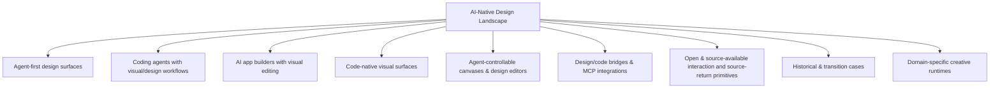
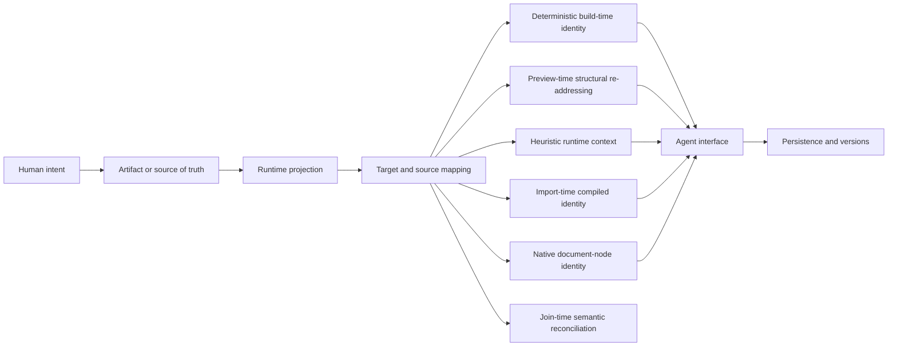

# AI-Native Design Landscape

> A living map of global AI-native design products, teams, visual surfaces, coding-agent design workflows, and open-source infrastructure.

**Snapshot:** 2026-08-11 · **Version:** v0.1 · **Coverage:** 63 canonical project directories

## Current progress

- **Canonical coverage:** 63 project directories registered and coverage-audited against the research collected for v0.1.
- **Evidence-bounded deep dossiers complete:** 21 / 63 — 18 Source-level dossiers plus Claude Design, Replit Design and QoderWork Design at Architecture-level with the closed-source evidence boundary reached.
- **Source-level subset:** 18 / 63 — Onlook, stagewise, Tuna, Nimbalyst, OpenPencil (`open-pencil/open-pencil`), OpenPencil (`ZSeven-W/openpencil`), Reframe, Puck, onUI, Open CoDesign, Agentation, Code Inspector, Open Design, Monet, Superdesign, Figwright, mcp_excalidraw, Codex.
- **Remaining dossiers:** 42 / 63 at Seed, Product-level, or unfinished Architecture-level depth.
- **Repository structure:** canonical project registry, project template, evidence rules, lifecycle/alias rules, and global panorama are established.
- **Current milestone:** v0.1 breadth is established; depth work is in progress project by project.

## Remaining work

The remaining work is intentionally depth-first, one project directory at a time. Depth does **not** mean forcing every project through one table of contents. Before drafting a dossier, identify the product's decisive user journey, unusual technical mechanism and most consequential evidence gaps, then build the document around those questions.

The earlier ten-part chain remains a **research checklist**, not a required structure:

`product facts · technical direction · technology choices · artifact/data model · agent interface · runtime/rendering · source mapping · persistence/versioning · implementation paths · commit history`

Use only the dimensions that explain the project, combine related ones, and add project-specific dimensions when the implementation demands them. A compile-time source locator, a feedback overlay, a vector editor and an agent-run artifact workspace should not read like four instances of the same system.

Priority backlog:

1. Deepen the remaining closed, partial-source and historical products through official product docs, changelogs, engineering posts, public protocols, distribution artifacts and bounded live observation without guessing undisclosed internals.
2. When a closed product exposes an open format, SDK, agent API or related foundation, pin and inspect that component but do not let adjacent source stand in for the product implementation.
3. Trace the project's own critical path deeply enough to establish its artifact/source of truth, decisive mechanism, user-visible failure boundaries and relevant persistence or delivery semantics; do not add irrelevant sections for symmetry.
4. Maintain lifecycle events, aliases/rebrands, acquisitions and discontinued products.
5. Re-audit completed Source-level dossiers and re-run long-tail discovery periodically so coverage can expand without weakening the per-project evidence standard.
6. Evolve the root panorama only from facts established in project dossiers; cross-product synthesis remains root-only.

## Scope

This repository tracks the part of the design-tool ecosystem being reshaped by AI agents, executable artifacts, code-native visual editing, agent-controllable canvases, and design-to-code/code-to-design workflows.

Repository rule:

- Root `README.md`: taxonomy, categorization, panorama, lifecycle, coverage decisions, research depth and project index.
- `projects/<project>/README.md`: only that project's own technical direction, public technology choices, artifact model and primary sources.
- No cross-product comparisons inside project directories.
- No guessed internal stack for closed products.

### Directory unit

A directory represents an independently identifiable product, open-source project, or independently surfaced design workspace.

- Product features/modes stay inside the owning product directory unless they have a distinct product/workspace identity.
- Direct renames/rebrands stay in one canonical directory with aliases recorded as metadata.
- Acquired or discontinued products remain as historical entries.
- Traditional design tools are outside the current scope unless they have an AI-native product/workspace represented here.

### Coverage audit

The v0.1 registry was re-audited against the named products and projects collected during the research thread. Important canonicalization decisions:

| Name encountered during research | Canonical entry |
|---|---|
| Create | [Anything](projects/anything/) |
| MGX / MetaGPT X | [Atoms](projects/atoms/) |
| TRAE SOLO | [TRAE Work](projects/trae-work/) |
| Devin Desktop / Desktop mode | [Devin](projects/devin/) |
| Cursor Design Mode | [Cursor](projects/cursor/) |
| Codex Browser / Annotations / Sites / Product Design workflows | [Codex](projects/openai-codex/) |
| v0 Design Mode | [v0](projects/vercel-v0/) |
| Uizard Autodesigner | [Uizard](projects/uizard/) |
| Canva AI / Magic Design | [Canva Magic Design](projects/canva-magic-design/) |

### Research depth

Coverage and evidence depth are tracked separately. A directory existing in the registry does **not** mean its technical dossier is complete. Completion follows the available evidence ceiling: source-visible projects require implementation tracing, while a closed product can be complete only after its official behavior, public architecture/protocol edges, observable failure boundaries and consequential unknowns have been exhausted for the current snapshot.

| Depth | Meaning | Count in current snapshot |
|---|---|---:|
| **Source-level** | Open/source-available implementation pinned to a concrete commit and traced through the project's decisive product and technical questions, relevant implementation paths and failure boundaries, with commit history used where it changes the conclusion | **18** |
| **Architecture-level / closed-source boundary reached** | Closed implementation, but the decisive user journey, working artifact authority, public runtime/protocol boundaries, delivery and persistence semantics, documented failures, live observable edges and unresolved internals are explicitly established without invented source claims | **3** |
| **Seed, Product-level or unfinished Architecture-level** | Product is registered and independently documented, but its available public evidence has not yet been exhausted around the project's decisive questions | **42** |

Current source-level dossiers:

- [Onlook](projects/onlook/)
- [stagewise](projects/stagewise/)
- [Tuna](projects/tuna/)
- [Nimbalyst](projects/nimbalyst/)
- [OpenPencil (`open-pencil/open-pencil`)](projects/open-pencil/)
- [OpenPencil (`ZSeven-W/openpencil`)](projects/openpencil-zseven/)
- [Reframe](projects/reframe/)
- [Puck](projects/puck/)
- [onUI](projects/onui/)
- [Open CoDesign](projects/open-codesign/)
- [Agentation](projects/agentation/)
- [Code Inspector](projects/code-inspector/)
- [Open Design](projects/open-design/)
- [Monet](projects/monet/)
- [Superdesign](projects/superdesign/)
- [Figwright](projects/figwright/)
- [mcp_excalidraw](projects/mcp-excalidraw/)
- [Codex](projects/openai-codex/)

Current evidence-bounded closed-source dossiers:

- [Claude Design](projects/anthropic-claude-design/)
- [Replit Design](projects/replit-design/)
- [QoderWork Design](projects/qoderwork-design/)

### Project-specific dossier design

Every dossier keeps a small common evidence floor: verified identity and lifecycle, canonical sources, an explicit evidence boundary, research gaps, and immutable revisions for source-derived claims. Everything between those anchors is project-specific.

Examples of questions that can determine a dossier's structure:

| Project shape | Questions that should lead the document |
|---|---|
| Agent design workspace | What is the ordinary-user loop, who owns execution authority, what becomes the durable artifact, and how is it delivered or recovered? |
| Code-native visual editor | What is canonical—source or a design document—how is it rendered, how does a selected element regain identity, and where is a mutation written? |
| Feedback/annotation bridge | What context is captured, how stable is the target, what survives transport to the agent, and what is persisted or lost? |
| Compile-time source locator | Which files are transformed, what identity is injected, how is it resolved at runtime, and which framework/build cases break the chain? |
| Canvas/object editor | What graph or schema owns truth, which operations mutate it, how do renderers project it, and how do undo, collaboration and versioning compose? |
| Closed or historical product | What user-observable journey and public contracts are established, what changed over time, and which internal claims must remain unknown? |

These are prompts, not archetype templates. The final headings should expose the particular system's causal structure rather than demonstrate that every checklist label was filled.

## Panorama



The project index is the ecosystem view; completed deep dossiers also support an implementation-oriented reading across products:



These axes distinguish prompts, annotations and direct manipulation; source files, canvas graphs and feedback sessions; DOM, iframe, canvas and native renderers; selectors, component identities and source maps; file tools, MCP and product protocols; and browser storage, databases, snapshots and version graphs. Each dossier pins those distinctions to evidence instead of treating every visible canvas as the same architecture.

Six distinct target-return mechanisms are now established in the current source-level dossiers; this is an evidence-backed starting taxonomy, not an exhaustive claim about the landscape. Code Inspector and Open Design try to return a preview target toward authored source, Agentation transports heuristic runtime context, Reframe returns exported DOM to an imported graph identity, OpenPencil never leaves its canonical design-document identity domain, and Figwright reconciles native Figma identities with repository-level semantic candidates at join time:

| Target-return route | Established implementation | Identity delivered downstream | Known break |
|---|---|---|---|
| Deterministic build-time identity | [Code Inspector](projects/code-inspector/) rewrites eligible framework source during bundling | file, line, column and node name carried on the rendered element | untransformed/failed files and unresolved multi-root call sites lose or downgrade the mapping |
| Preview-time structural re-addressing | [Open Design](projects/open-design/) parses HTML for its rich preview, prefers authored element ids and adds body-relative child-index paths before re-parsing persisted HTML for bounded patches | authored `data-od-id` or a structural HTML path plus DOM/text/style context | generated paths drift after structural edits; runtime-only DOM and heuristic comment targets do not become component-source identity |
| Heuristic runtime context | [Agentation](projects/agentation/) inspects DOM/React runtime structures while the page is running | DOM context plus optional React hierarchy and file hint | file hints are environment-dependent and do not survive its default SQLite + common MCP projection |
| Import-time compiled identity | [Reframe](projects/reframe/) hashes content-aware DOM paths into `h:` INode ids and re-emits them as `data-reframe-inode` in the HTML canvas | a selected exported DOM element returns to the compiled `SceneGraph`; `NodeMeta` retains structural import provenance | anonymous/duplicate-key ordering can retarget ids, there is no file/line mapping, and the primary MCP recompile path currently bypasses the replay overlay |
| Native document-node identity | [OpenPencil (`ZSeven-W/openpencil`)](projects/openpencil-zseven/) copies each canonical `.op` node ID into its resolved paint scene; paint and hit testing consume that same refreshed scene | the selected canvas target is already the canonical design-document node addressed by editor commands and MCP | the identity ends at the `.op` boundary; conversion provenance and generated code do not create a live reverse pointer to original application source |
| Join-time semantic reconciliation | [Figwright](projects/figwright/) groups Figma instances by main component, scans repository components/tokens/icons, then joins names, props and values with explicit map-file overrides | a tool result can associate Figma instance ids with a candidate component file, or design tokens/icons with repository refs/assets | fuzzy evidence is not a source line or AST identity; durable overrides are keyed by unnamespaced Figma names, and no cross-artifact transaction proves that the agent used the candidate |

[Superdesign](projects/superdesign/) adds an equally important negative result: selected source snippets can condition a hosted HTML draft and a coding agent can later implement that draft, but the public workflow carries no canvas-element identity back to an application file or component. Workflow continuity is not target-return identity.

[Figwright](projects/figwright/) establishes the inverse nuance: native Figma node ids can survive reads, writes and design baselines, while repository joins can return a semantic code candidate, yet the two facts still do not create a durable node-to-code-AST binding. Semantic reconciliation is stronger than an ungrounded prompt and weaker than source identity.

[mcp_excalidraw](projects/mcp-excalidraw/) adds another negative boundary: a coding agent can inspect a repository, draw a diagram and commit the exported <code>.excalidraw</code> file beside source, but the canvas carries no repository scan, component join or node-to-file identity. A repo-native artifact is not automatically source mapping.

[Codex](projects/openai-codex/) establishes a tool-supplied visual-context boundary: the public harness carries images as data or paths and client-supplied context as opaque classified strings, while review comments can address Git diff lines. None of those public types standardizes a rendered DOM/design node back to an authored file or AST location. Rich visual feedback can guide a repair without becoming durable target-return identity.

[Claude Design](projects/anthropic-claude-design/) establishes the corresponding closed-product boundary. Its public surface can click-target a canvas element, directly manipulate layout and let Claude create adjustment sliders for the current artifact, but no public contract exposes the selected node identity, slider representation or a reverse binding to design-system source or code. Precise human targeting and an artifact-specific generated editor are product facts; durable target-return identity is still unknown.

[Replit Design](projects/replit-design/) establishes a stronger closed-product target-return contract without disclosing its mechanism: an eligible rendered element can jump to its source location, and deterministic text/style/layout/image edits update source directly. Reused or loop-rendered elements may update every instance, while hidden complexity routes to Agent. This proves visual-target-to-source behavior at the product boundary, but not the injected identity, framework adapter, AST patch or conflict semantics; it does not increase the six source-inspected mechanism count.

[QoderWork Design](projects/qoderwork-design/) establishes a different closed boundary: lasso/annotation grounds an Agent edit to a Canvas region and Nudge exposes generated design parameters, while Design Files remain directly editable. No public contract returns a selected region or Nudge parameter to a stable file/range/AST identity or exposes its writeback. Grounded visual correction and parametric control are not yet source mapping.

The dossiers now also establish eleven different durable-refinement models. “Structured” does not by itself mean that every product has one equivalent source of truth:

| Durable-refinement model | Established implementation | Durable center | Known break |
|---|---|---|---|
| Canonical design document | [OpenPencil (`ZSeven-W/openpencil`)](projects/openpencil-zseven/) edits one typed `.op` document and projects it into paint scenes and exports | the `.op` document; editor commands, save, undo and collaboration all converge on its node ids | imported/generated code is an asymmetric conversion, not a continuously bound second authority |
| Materialized compile plus rebuild layers | [Reframe](projects/reframe/) keeps a live INode graph and SceneJSON snapshot, with optional HTML source and a partial JSONL edit overlay | current scene snapshot for restart; HTML + replay only for supported regeneration paths | the main MCP compile does not currently replay the overlay, structural edit coverage is incomplete and some graph side-channel metadata is not serialized |
| Filesystem-native deliverable | [Open Design](projects/open-design/) delegates execution to an installed agent and treats project files as the artifact, with optional manifests and per-file versions | canonical project files in the daemon project root or an explicitly imported folder | provider events are not artifact proof; render/edit bridges remain artifact-type-specific and must guard external file changes |
| Thread ledger plus workspace and Git clocks | [Codex](projects/openai-codex/) persists replayable thread JSONL, lets tools and external processes mutate the selected workspace, and uses Git/worktrees for reviewable isolation and versions | the intended workspace files and Git state are the artifact; rollout JSONL preserves orchestration history and SQLite is a rebuildable query projection | resuming a thread does not restore files, streamed turn diffs cover exact tracked patch deltas rather than every side effect, and worktrees do not merge or publish themselves |
| Path-bound multi-artifact workspace | [Monet](projects/monet/) combines a live timeline store, `.aiveproj.json`, hashed autosave, path-keyed Canvas sidecar, absolute media references and generated source/renders | live `ProjectStore` for editing/export; project file and newer autosave for timeline recovery | Canvas is outside the project file, relocation changes its lookup key, external media is not bundled and MCP mixes live calls with direct disk writes |
| Hosted draft graph with local context staging | [Superdesign](projects/superdesign/) reduces a repository into selected context files, then keeps branchable draft nodes and per-node HTML versions on its hosted service | remote project/draft/version graph during design; application source becomes durable only through a later coding-agent implementation | context snippets are evidence inputs rather than source links, the hosted renderer/backend is closed and implemented code can diverge from the approved HTML draft |
| Hosted multi-format project with inferred organization constraints | [Claude Design](projects/anthropic-claude-design/) derives a reusable design system from heterogeneous organization assets, then keeps chat, canvas corrections, saved directions, sharing and exports around a hosted project | the hosted project is the working editing center; the published organization design system governs later projects and each export/handoff creates a new delivery authority | internal project and version schemas are closed, projects are not publicly pinned to an exact design-system revision, and no lossless roundtrip or downstream reverse sync is established |
| Hosted visual branches plus Git-backed application state | [Replit Design](projects/replit-design/) keeps Design frames and live Artifact previews on one hosted Project Canvas, writes eligible direct edits to source, and uses Agent checkpoints when a frame becomes or rewrites an Artifact | Project files and Git own runnable implementation; checkpoints add Agent/context/database recovery; Canvas owns visual branches and layout | public checkpoint fields do not explicitly include complete Canvas state, so Git recovery cannot be equated with visual-branch recovery and frame-to-Artifact Build is not a live binding |
| Task-bound engineering files with opaque visual side state | [QoderWork Design](projects/qoderwork-design/) can bind a task to one local Working Folder, write HTML/React files, retain task conversation and artifacts, and place Design Plan, Canvas, Preview and Nudge around that file-producing run | local folder files are the handoff authority; the task ledger retains context and artifacts | the folder is optional, Canvas/plan/Nudge serialization and atomic versioning with files are undisclosed, and QoderWork Awareness memory is a separate persistence domain |
| Native external document with repository-side reconciliation aids | [Figwright](projects/figwright/) mutates the open Figma file while optionally storing verified name mappings and per-node context baselines in the application repository | Figma owns durable design state; application files own implementation; `docs/figma-*-map.md` and `.figwright/snapshots/` support later reconciliation | the aids are not a mirrored document: map keys lack file identity, snapshots are keyed only by node id, and neither establishes a shared Figma/code transaction |
| Volatile canvas with explicit interchange checkpoints | [mcp_excalidraw](projects/mcp-excalidraw/) keeps live elements, snapshots and image files in one local process, then materializes deterministic Excalidraw or Obsidian files on demand | an explicitly exported <code>.excalidraw</code>/<code>.excalidraw.md</code> file; PNG/SVG are visual deliveries | restart loses live state, named snapshots are process-local and shallow, files have a separate lifecycle, and an open browser tab can become an unintended shadow copy |

The same evidence separates **having an agent interface** from **converging on one mutation authority**:

| Control-plane convergence | Established implementation | Agent/direct-edit relationship | Failure boundary |
|---|---|---|---|
| Native-document convergence | [OpenPencil (`ZSeven-W/openpencil`)](projects/openpencil-zseven/) addresses the same canonical `.op` nodes from editor commands and MCP | human selection, paint scene and agent commands retain one document-node identity | conversion provenance ends at the `.op` boundary rather than roundtripping to original app source |
| Filesystem convergence with verification | [Open Design](projects/open-design/) lets agents and artifact bridges converge on project files | file fingerprints/content diffs, not provider events, establish that the artifact changed | different artifact render/edit bridges still have type-specific fidelity and external-change boundaries |
| App-Server-mediated workspace convergence | [Codex](projects/openai-codex/) gives rich clients one thread/turn/item and approval protocol around tools acting in an explicit cwd/workspace | CLI and rich clients can coordinate commands, patches, review and visual context while the actual mutation lands in workspace files | client-specific visual context creates no public DOM-to-source identity, arbitrary command/external writes exceed exact patch-diff tracking, and approval is not rollback |
| Live-graph convergence with partial replay | [Reframe](projects/reframe/) shares the current `SceneGraph` across MCP and Platform UI | direct manipulation and agent tools see one in-memory graph | not every mutation joins the replay log, and the primary compile route currently bypasses replay |
| Split live/file/sidecar control | [Monet](projects/monet/) routes CLI/HTTP mutations to a live store but lets six MCP tools rewrite the project JSON directly; Canvas persists separately | nominally one agent server can operate three authorities | UI saves can overwrite disk-only MCP edits, disk reads can be stale, Canvas acknowledgements precede renderer persistence and fixed MCP port/file discovery can miss the live project |
| Hosted-draft convergence, downstream source rewrite | [Superdesign](projects/superdesign/) gives web UI and CLI operations common remote project/draft/version identities | agent commands and canvas review converge on the hosted draft, then a coding agent separately writes the application repository after approval | no shared transaction or reverse identity joins the approved HTML head to the resulting framework code |
| Hosted-project convergence with generated controls | [Claude Design](projects/anthropic-claude-design/) brings chat, element comments, direct manipulation, Claude-created sliders and an OAuth-scoped read/write MCP edge to the same hosted design project | users can move between semantic, targeted, continuous and direct corrections before sharing, export or Claude Code handoff | public evidence does not prove one durable node identity or transaction across those paths; comments can be lost, simultaneous editing is basic and downstream handoff has no documented reverse binding |
| Deterministic source edit plus checkpointed Agent materialization | [Replit Design](projects/replit-design/) lets Visual Editor patch eligible source directly, routes hidden complexity to Agent, and asks Agent to create/rewrite an Artifact from a selected Design frame | simple edits converge on project source; Build/apply converges on the Artifact through a checkpointed Agent task | direct-edit classification and mapping internals are closed, reused instances broaden write scope, and no shared identity or transaction keeps the source Design frame synchronized with the resulting Artifact |
| File-centered workspace with opaque visual and parametric bridges | [QoderWork Design](projects/qoderwork-design/) lets Agent writes and direct Design Files edits converge on engineering source while lasso/annotation and Nudge operate through the Canvas | source files remain available for inspection and handoff; visual targeting can ground a requested change without replacing the file artifact | no public contract exposes target identity, Nudge writeback or dirty-file conflict behavior, and stopping a run is not documented as transactional rollback |
| Native-Figma convergence with downstream provider split | [Figwright](projects/figwright/) routes human-visible plugin activity and agent tools to nodes in the same open Figma file, while Figma-to-code hands grounded context to an external coding agent | direct Figma edits and plugin writes converge on the native document; repository output is a later provider-authored artifact | server/plugin feature skew can make a write partial, activity-based file routing is not an explicit file id on every call, and code generation has no shared commit with the Figma mutation |
| REST-centered convergence with browser full-scene return | [mcp_excalidraw](projects/mcp-excalidraw/) routes CLI, MCP and raw HTTP to one in-memory canvas server while the browser projects and edits the same scene | agent-side granular writes and human browser edits normally meet in the server element map | browser edits replace the complete map after a debounce; no scene revision or transaction prevents a stale tab or partial multi-operation call from overwriting earlier work |

The dossiers now separate ten artifact-production profiles that can all look like “the agent made a design” at the UI level:

| Artifact production profile | Established implementation | Durable result | Verification boundary |
|---|---|---|---|
| Filesystem-native agent run | Open Design launches a selected CLI/ACP agent in the resolved project workspace and fingerprints files before/after the run | canonical project files plus optional manifests and per-HTML versions | provider tool events are insufficient by themselves; a real content/file diff is the evidence that an artifact changed |
| Stream-to-file materialization | Open Design parses complete supported `<artifact>` blocks from a plain/BYOK adapter | HTML, CSS, SVG or Markdown written through the same project-file API with a generated manifest | incomplete, fenced or unsupported blocks are not a durable artifact merely because text streamed in chat |
| Thread-coordinated workspace mutation with visual verification | [Codex](projects/openai-codex/) accepts reference images or client/tool context, executes commands and patches under workspace authority, then lets a user inspect a runtime, file preview or Git review | the actual application/document files and intended Git state | a completed turn, image observation or streamed diff is insufficient; acceptance requires repository inspection, the relevant deterministic checks and a real render/visual pass |
| Hosted draft then agent implementation | Superdesign generates or imports a versioned HTML draft, obtains human approval on the hosted canvas, then asks the calling coding agent to implement it | remote HTML/version history plus whatever application files the downstream agent actually writes | a completed draft job proves neither that repository files changed nor that the implementation preserved the approved design |
| Hosted multi-format design with downstream exits | Claude Design builds a hosted result under an inferred organization design system, then exposes HTML/ZIP, PDF, PPTX, partner transfers and Claude Code handoff | the hosted project while editing; the actual exported file, destination-native object or repository after exit | preview success is not export fidelity, different formats preserve different semantics, and a successful handoff proves neither production readiness nor durable canvas-to-source identity |
| Visual branch to checkpointed Project Artifact | [Replit Design](projects/replit-design/) explores sibling Design frames, then asks Agent to create a new Artifact or rewrite an existing one inside the same Project | runnable source and the resulting Artifact, with an Agent checkpoint before/after materialization; the Design frame remains a reference | an interactive mockup is not app behavior, Build is not a proven live frame/source binding, and acceptance requires inspecting the running Artifact for translation, responsive and functional gaps |
| Plan-contracted runnable design project | [QoderWork Design](projects/qoderwork-design/) can turn answers and a visible Design Plan into HTML/React source, then project it through Canvas and Preview before handing the folder/code to Qoder IDE | local Working Folder source when one is bound, or task-retained artifacts when it is not | direct Run can skip the plan, the screenshot-visible `.design.json` contract is unpublished, Preview is not production acceptance, and Handoff/branch mechanics remain closed |
| Context-grounded provider implementation | Figwright serializes a selected Figma subtree, joins it to repository components/tokens/icons, and leaves framework code generation to the connected model | application source and exported assets actually written by the coding agent | a successful context or mapping call is not artifact proof; only a repository diff plus a rendered Figma comparison closes the loop |
| Plugin-mediated native-document mutation | Figwright's model issues typed writes through the local relay and public Figma Plugin API, with retry idempotency and an inverse-allowlisted batch | the open Figma document | a tool result can be unverified under plugin skew, batch rollback can itself be partial, and no simultaneous repository transaction exists |
| Volatile canvas to deterministic diagram artifact | mcp_excalidraw lets an agent create/query elements, use a real browser screenshot to repair layout, then explicitly expand the compact agent model into a byte-stable Excalidraw/Obsidian file | the exported diagram file actually written to the selected path | live-scene success is not durability, structured description is not visual proof, browser writeback changes the graph shape, and a failed multi-step mutation can leave partial state |

mcp_excalidraw also exposes a distribution-truth boundary that product matrices often hide. At the 2026-08-11 snapshot, its source manifest and README announce <code>2.0.0</code> and current containers carry that HEAD, while the recommended <code>npx</code> route still resolves to npm <code>1.1.0</code>; no <code>v2.0.0</code> tag, GitHub Release or npm publish exists. Merged release intent and green source CI do not establish what an ordinary install obtains.

## Project index

| Project | Team | Category | Status | Source |
|---|---|---|---|---|
| [Claude Design](projects/anthropic-claude-design/) | Anthropic | Agent-first design | Active / beta | Closed |
| [Codex](projects/openai-codex/) | OpenAI | Coding agent with visual workflow | Active | CLI/SDK/App Server Apache-2.0; desktop/IDE/cloud clients not public |
| [Cursor](projects/cursor/) | Anysphere | Coding agent with visual workflow | Active | Closed |
| [TRAE Work](projects/trae-work/) | ByteDance / TRAE | Agent workspace with Design Mode | Active | Closed |
| [QoderWork Design](projects/qoderwork-design/) | Alibaba / Qoder | Agent-first design surface | Active | Closed |
| [Replit Design](projects/replit-design/) | Replit | Agent-first design surface | Active | Closed |
| [CodeBuddy](projects/tencent-codebuddy/) | Tencent | Coding agent with design workflow | Active | Closed |
| [Comate](projects/baidu-comate/) | Baidu | Coding agent with design workflow | Active | Closed |
| [Devin](projects/devin/) | Cognition | Coding agent with visual/runtime workflow | Active | Closed |
| [v0](projects/vercel-v0/) | Vercel | AI app builder with visual editing | Active | Closed |
| [Lovable](projects/lovable/) | Lovable | AI app builder with visual editing | Active | Closed |
| [Windsurf](projects/windsurf/) | Cognition | Coding agent with visual workflow | Active | Closed |
| [GitHub Spark](projects/github-spark/) | GitHub | AI app builder with visual editing | Active | Closed |
| [Anything (formerly Create)](projects/anything/) | Anything | AI app builder with design reasoning | Active | Closed |
| [Fusion](projects/builderio-fusion/) | Builder.io | Code-native visual surface | Active | Closed |
| [Stitch](projects/google-stitch/) | Google Labs | Agent-first design | Active | Closed |
| [Google Antigravity](projects/google-antigravity/) | Google | Coding agent with visual workflow | Active | Closed client; agent API available |
| [Base44](projects/base44/) | Wix / Base44 | AI app builder with visual editing | Active | Closed |
| [Bolt.new](projects/bolt-new/) | StackBlitz | AI app builder with design-system workflow | Active | Closed |
| [Atoms (formerly MGX / MetaGPT X)](projects/atoms/) | MetaGPT / Atoms | Multi-agent app builder with visual editing | Active | Commercial product; related MetaGPT open source |
| [Subframe](projects/subframe/) | Subframe | Design-to-code / code-native design | Active | Closed |
| [FlutterFlow](projects/flutterflow/) | FlutterFlow | Visual builder with coding-agent integration | Active | Closed |
| [Figma Make](projects/figma-make/) | Figma | AI design + app builder | Active | Closed |
| [Alloy](projects/alloy/) | Alloy | AI prototyping + code context | Active | Closed |
| [Magic Patterns](projects/magic-patterns/) | Magic Patterns | AI design + code | Active | Closed |
| [Anima](projects/anima/) | Anima | Design-to-code / agent integration | Active | Closed |
| [Kombai](projects/kombai/) | Kombai | Design engineering agent | Active | Closed |
| [Miaoda (秒哒)](projects/baidu-miaoda/) | Baidu | AI app builder with visual editing | Active | Closed |
| [Onlook](projects/onlook/) | Onlook | Code-native visual surface | Active | Open source |
| [Tempo](projects/tempo/) | Tempo Labs | Code-native visual surface | Active | Closed |
| [stagewise](projects/stagewise/) | stagewise | Code-native visual surface | Active | Open source |
| [Dosmos](projects/dosmos/) | Dosmos | Code-native visual surface | Active | Source status unconfirmed |
| [Retune](projects/retune/) | Retune | Visual manipulation layer | Active | Closed |
| [Tuna](projects/tuna/) | Tuna contributors | Visual manipulation layer | Active | Open-source repository |
| [onUI](projects/onui/) | onUI contributors | Visual interaction primitive | Active | Open source |
| [Design Canvas](projects/design-canvas/) | Design Canvas | Agent-controlled runtime canvas | Active | Closed / source status unconfirmed |
| [Rivet](projects/rivet-design/) | Rivet Design | Visual manipulation layer | Active | Closed |
| [pen.dev](projects/pen-dev/) | pen.dev | Agent-controllable design canvas | Active | Closed product; open design format |
| [Paper](projects/paper/) | Paper | Agent-controllable design canvas | Active | Closed |
| [Clearly](projects/clearly/) | Clearly | Agent-controllable design canvas | Active | Closed |
| [MagicPath](projects/magicpath/) | MagicPath | Agent-controllable design canvas | Active | Closed |
| [Superdesign](projects/superdesign/) | Superdesign dev, Inc. | Agent skill over a hosted design-draft graph | Active; skill/plugin v0.4.2, CLI v0.10.0 | MIT skill + packaged CLI; hosted platform closed; legacy extension historical |
| [Nimbalyst](projects/nimbalyst/) | Nimbalyst | Generic visual workspace over agents | Active | Open source |
| [OpenPencil (open-pencil/open-pencil)](projects/open-pencil/) | OpenPencil | Agent-controllable design editor | Active | Open source |
| [OpenPencil (ZSeven-W/openpencil)](projects/openpencil-zseven/) | ZSeven-W / contributors | AI-native vector design editor and design-as-code runtime | Active; v0.8.3 | MIT |
| [Reframe](projects/reframe/) | Ilya Makarov / contributors | HTML-to-INode design compiler, DOM canvas and agent interface | Public v0.1.0; pinned main 2026-05-01 | AGPL-3.0-or-later; commercial option |
| [Open CoDesign](projects/open-codesign/) | OpenCoworkAI / contributors | Local-first desktop AI design agent | Active; v0.2.1 | MIT |
| [Open Design](projects/open-design/) | nexu-io / Open Design contributors | Local-first agent-native design workspace and artifact studio | Active; v0.18.2 | Apache-2.0 |
| [Agentation](projects/agentation/) | Benji Taylor / contributors | In-app visual feedback and agent-context primitive | Active; package v3.0.2 | PolyForm Shield 1.0.0 source-available |
| [Code Inspector](projects/code-inspector/) | zh-lx / contributors | Compile-time DOM-to-source and in-browser coding-agent bridge | Active; v2.0.7 | MIT |
| [Puck](projects/puck/) | Puck Editor | Visual editor primitive | Active | Open source |
| [Figwright](projects/figwright/) | Roya / contributors | Local bidirectional Figma MCP + repository grounding | Active; v0.4.0 | MIT |
| [mcp_excalidraw](projects/mcp-excalidraw/) | yctimlin / contributors | Local agent-driven Excalidraw workbench and interchange tool | Active source; npm 1.1.0, source 2.0.0 release intent | MIT |
| [Monet](projects/monet/) | Het Patel / contributors | Agent-operable video timeline and code canvas | Active public alpha; v0.1.9 | MIT |
| [Uizard](projects/uizard/) | Uizard | AI UI design | Active | Closed |
| [Galileo AI](projects/galileo-ai/) | Galileo AI | Historical AI UI generation | Historical | Closed |
| [Diagram](projects/diagram/) | Diagram / Figma | Historical AI design tooling | Acquired / historical | Closed |
| [Framer AI](projects/framer-ai/) | Framer | AI website design / builder | Active | Closed |
| [Relume](projects/relume/) | Relume | AI website design system workflow | Active | Closed |
| [Webflow AI](projects/webflow-ai/) | Webflow | AI website builder | Active | Closed |
| [Canva Magic Design](projects/canva-magic-design/) | Canva | AI visual design | Active | Closed |
| [Firebase Studio](projects/firebase-studio/) | Google | Historical/transitioning AI app builder | Sunsetting 2027-03-22 | Closed |
| [Motiff](projects/motiff/) | Motiff | Historical AI design tool | Discontinued 2026-06-23 | Closed |

## Research rules

1. Prefer official docs, official product/changelog posts and official source repositories.
2. Keep fact, inference and unknown separate.
3. Project directories are monographs, not comparison pages.
4. For open-source projects, source-level dossiers pin immutable commit SHAs before recording implementation details.
5. Keep discontinued/acquired products as history instead of deleting them.
6. Categories may change as products evolve; directory slugs should remain stable.
7. Record aliases/rebrands inside the canonical project directory rather than creating duplicate project entries.
8. Track breadth and research depth separately; a registered directory is not automatically a completed technical dossier.

## Repository structure

```text
.
├── README.md
├── CONTRIBUTING.md
├── PROJECT_TEMPLATE.md
└── projects/
    └── <project-slug>/
        └── README.md
```

## Milestone status

**v0.1 breadth:** complete for the audited 63-project registry.

**v0.1 depth:** in progress — 21 evidence-bounded deep dossiers complete (18 Source-level and 3 closed-source Architecture-level), 42 remaining.
