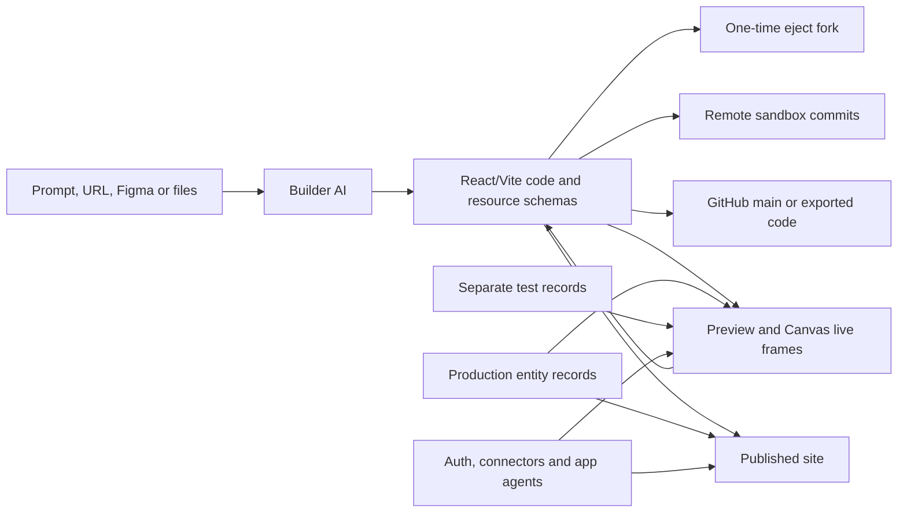

# Base44

> Research status: **Architecture-level / closed-source boundary reached** · Last reviewed: **2026-08-11**

| Field | Value |
|---|---|
| Organization / team | Base44 / Wix |
| Category | Full-stack AI application builder with visual editing and a managed backend |
| Status | Active; acquired by Wix in June 2025 |
| Source availability | Hosted builder, Canvas, generation service and production runtime are closed; official CLI and JavaScript SDK are MIT |
| Previous names / aliases | None established |
| Canonical product URL | https://base44.com/ |
| Canonical source repositories | https://github.com/base44/cli · https://github.com/base44/javascript-sdk |
| Pinned source revisions | CLI `c05161e1e878f01f51b6a63097fb2c3ed6b1173b` · SDK `60a72594526a6d35a75a1b8705bcaee95e91a0d0` |
| Evidence cutoff | Product documentation, changelog, official repositories and npm distributions observed through 2026-08-11 |

## The system to understand

Base44 is not merely a prompt-to-page generator and its Canvas is not the durable design artifact. The ordinary product generates a React application, couples it to Base44-managed entities, functions, authentication, connectors and optional application agents, previews that system inside the builder, and publishes an explicitly selected application state. Visual editing is one mutation route into that application.

The decisive architectural fact is therefore **one apparent app with many independently advancing authorities**:

Code history, production records, test records, branch state, sandbox checkpoints, agent memory, Git and the published site do not form one publicly documented transaction. That split explains both Base44's power and most of its consequential recovery boundaries.

## Ordinary-user critical path

The official [first-prompt flow](https://docs.base44.com/Getting-Started/starting-from-your-first-prompt) and [AI chat contract](https://docs.base44.com/Building-your-app/AI-chat-modes) establish this path:

1. **Enter with intent.** A user can describe an app, attach visual or structured references, start from a public URL, import a Figma frame, or use a template. Signing up is the point at which work is saved to an account.
2. **Choose whether intent may mutate the app.** First-prompt Plan mode asks questions and creates a structured plan; nothing is built until the user selects **Start building**. In the editor, Discuss mode is also non-mutating, while Default mode acts immediately.
3. **Generate a working full-stack draft.** Base44 creates a React frontend and can establish entities, functions, authentication, connectors and other managed resources. The result runs in the builder preview.
4. **Refine through several surfaces.** Chat can change code and data; Edit mode targets a rendered element; Theme changes global styling; Canvas places live page frames beside notes and references; Code exposes the generated files.
5. **Make data authority and permissions explicit.** The user defines or reviews entities, imports records, chooses data-access rules and tests user roles. This step is not safely implied by a visually correct preview.
6. **Exercise a non-production path.** Test Data redirects preview reads and writes to a separate database. A Testing Link exposes unpublished code with that test database. The separate Testing Agent can run browser journeys in another isolated environment.
7. **Choose a change-history regime.** A simple app can stay on Base44 Version History; parallel work can use Base44 branches; a connected project can instead synchronize code with GitHub `main`. Remote coding agents add another checkpointed sandbox history.
8. **Publish deliberately.** The current or an older hosted version can be published without necessarily replacing the current editor draft. GitHub changes become visible in Base44 after merge to `main`, but still require a separate Publish action.
9. **Verify the destination.** Acceptance is the refreshed published URL, correct permissions and production-safe behavior—not an AI completion message, successful preview, request log, test result or Git sync alone.

Base44 documents automatic checks and repair attempts in the builder. Those are useful generation evidence, but they do not establish that a user's chosen journey, production data, external connector or release destination is correct.

## What one Base44 app actually owns

| State surface | Durable authority within its lane | What does not automatically follow |
|---|---|---|
| Generated frontend | Current hosted React/Vite files, or connected Git repository for portable code | Entity records, managed auth, secrets, deployment state and app-agent memory are not source files |
| Backend resource definitions | Entity schemas, functions, auth, connectors, agents and agent skills in the hosted project or local backend-resource files | A schema change does not populate or restore production records |
| Production data | Base44-managed entity records | Code/version rollback does not rewind records |
| Test data | A separate initially empty database retained when the toggle is hidden | No automatic production-to-test or test-to-production synchronization |
| Builder conversation | Prompt lineage, tool work and message-level reverts | Runtime application-agent conversations are a different store |
| Application agents | Agent configuration, skills, tools, memory and per-user/global conversation state | Neither builder Version History nor Git is documented as a complete agent-memory backup |
| Base44 branch | Its own chat and live preview until merge | A merge does not prove publish, data migration or external integration state |
| Remote sandbox | Debounced code-storage commits plus explicit checkpoints | A checkpoint is not a production publish or database snapshot |
| Published application | The version currently made live at the Base44 URL/domain | The editor can continue on a different draft; the live app always uses production data |
| Export/eject destination | ZIP/Git repository, CSV files or a new Base44 backend | These are forks, not live roundtrips to the original project |

This model is more accurate than treating “the Base44 project” as one rewindable object.

## Canvas is a live planning and targeting surface

The official [Canvas documentation](https://docs.base44.com/Building-your-app/Canvas) describes an infinite collaborative board where every app page appears as a live preview frame. Frames can be shown at desktop, tablet or phone widths. Users can add drawings, arrows, sticky notes and images, connect a note to a page, then send that context into chat. A connected note scopes the request to that page; an unconnected note leaves page choice to the AI.

The Canvas state itself autosaves and named cursors expose collaborators. Yet page deletion is not a direct Canvas graph operation—the user asks chat to delete a page. The live frame is a projection of the generated app, while notes and geometry are planning/review context around it. Public evidence does not establish that Canvas maintains an independent canonical component graph.

### Three design-write routes

| Route | User-visible behavior | Persistence boundary |
|---|---|---|
| Theme | Global colors and fonts are adjusted and then applied across the app | Changes become app styling; a workspace Design System remains distinct from one app's theme |
| Manual Edit | Select a rendered element, change supported visual properties or Tailwind classes, delete it, and undo/redo up to 50 steps in the same visual session | Edits autosave and enter Version History; the short visual undo stack is session-scoped |
| AI Edit | Select an element and ask chat to change it; repeated elements can be highlighted for a bulk change | The agent materializes a code/app change and consumes credits; scope may cover all repeated instances |

Dynamic text cannot always be edited as literal text through the visual property panel because its value comes from application logic or data; the documented correction route is AI chat. That is a useful product-level boundary between rendered appearance and authored expression.

### Rendered target to source: established product contract, closed mechanism

The [Code tab](https://docs.base44.com/developers/app-code/editor/code-tab) exposes ordinary React/JSX, a split live preview, a **Files used in this page** view, and access from a selected visual element to its code. Chat responses also expose **View Changes** file diffs. Code-buffer edits require Save; Discard abandons unsaved edits in the active file, and Publish remains separate.

These contracts establish that Base44 can narrow a rendered page or selected element toward generated source. They do **not** disclose:

- whether build-time coordinates, runtime component metadata, source maps, DOM paths or model search produce the mapping;
- whether a manual visual change uses an AST edit, textual rewrite, generated style override or regeneration;
- how mapping survives component reuse, conditional rendering, HMR, source moves or concurrent AI edits;
- whether the selected element and saved code share a revision precondition.

No public CLI or SDK source inspected here contains the builder's renderer-to-source producer. Base44 therefore has a closed target-return boundary, not a source-established mapping mechanism.

### Figma is a one-way reconstruction input

The current [Figma import contract](https://docs.base44.com/Getting-Started/import-from-figma) imports one public Figma Design frame or section and recreates its layout, structure and visual style as a new app or page. Auto Layout, meaningful groups and simplified vectors improve the result. Only the last fill is imported; custom fonts are replaced; variables, multiple backgrounds and some effects may not survive; interactions and responsiveness need later work in Base44.

The imported frame becomes a generated-page foundation. The docs expose no retained Figma node-to-JSX binding, later Figma synchronization or reverse writeback. Re-import is another reconstruction, not a shared document transaction.

## Generated code meets a managed backend

### Frontend and source layout

The [app-code project structure](https://docs.base44.com/developers/app-code/overview/project-structure) identifies standard React applications built with Vite. Public folders include pages, components, API helpers, hooks, libraries and utilities, alongside backend resources such as entities and functions. Pages are route files rather than opaque canvas-only objects.

The public SDK makes the generated application operational rather than merely visual:

- `createClient()` defaults to `https://base44.app` and composes entities, auth, functions, connectors, application agents, logs, analytics and real-time actor modules;
- anonymous clients receive public-permission scope, authenticated clients act as the user, and service-role clients bypass row- and field-level rules;
- service credentials are intended for Base44-hosted backend functions, where `createClientFromRequest()` consumes platform-injected app, user, service, function-version and data-environment headers;
- function invocation and entity CRUD are calls into the hosted API; the public SDK is a client boundary, not the production service implementation.

### Entities are schema plus records, not one artifact

An Entity is a schema-backed table. The [data dashboard](https://docs.base44.com/Building-your-app/Managing-your-app-data) lets an editor inspect schema and records, import CSV/XLS/XLSX/JSON, export CSV, and recover recently deleted records for 30 days. Imports append records instead of overwriting them; AI-assisted import shows a mapping for approval and may propose schema changes.

The [visual permissions editor](https://docs.base44.com/Setting-up-your-app/Managing-security-settings) applies table-wide CRUD rules such as All Users, Creator Only, entity-to-user field comparison and user-property checks. Matching rules have OR semantics. A generated JSON preview exposes the resulting rule expression, while complex expressions can become JSON-only. In the app UI these permissions cover the whole table, not individual fields.

The backend-service configuration exposed by the CLI is richer: its entity schema supports row-level rules for create/read/update/delete/write and field-level security. The two surfaces must not be conflated. The hosted editor offers a simplified policy lane; the source-visible backend resource format exposes a lower-level lane.

AI can generate data permissions for a new app. The docs say an update to existing rules asks for approval. That approval is a configuration gate, not proof that every role and record combination behaves as intended.

### Three data environments matter

| Environment | Where it is used | Important break |
|---|---|---|
| Production | Published application; dashboard/preview when Production is selected; builder AI data tools by default | A casual AI data request can touch production unless test data is requested explicitly |
| Test Data | Dashboard and preview after enabling the Builder-plan feature; shared Testing Link sees unpublished code and test records | Starts empty, never syncs automatically, and hiding the toggle retains rather than deletes it |
| Testing Agent environment | Isolated browser-run environment with a fresh user for each run | Separate from Test Data and cannot test login form, OTP or email-verification flows |

The pinned SDK source reinforces the environment boundary: `createClientFromRequest()` forwards only recognized `dev` or `prod` values from the injected `X-Data-Env` header so downstream entity calls remain in the triggering lane without relaying arbitrary header values.

Elite and Enterprise plans add [entity data version history](https://docs.base44.com/Enterprise/data-version-history): each entity receives automatic snapshots retained for 7 or 30 days respectively, restore replaces that entity's current records, and Base44 first saves the pre-restore records as a backup. This is a per-entity data history, not the application code version graph.

## Application agents add another runtime inside the app

Base44's builder agent and an AI agent created **for the resulting application** are different systems. The [application-agent contract](https://docs.base44.com/Building-your-app/AI-agents-for-apps) gives each app agent:

- description, instructions, model and up to ten context files;
- entity CRUD tools and selected backend functions;
- user-owned OAuth connectors;
- app- or workspace-scoped reusable skills;
- memory that can be global, per-user or both;
- conversations visible to app editors, including messages, tool calls and credit usage;
- optional WhatsApp, Telegram and LINE channels with the app agent's data/function capabilities.

Anonymous access is opt-in and cannot reach per-user private data. For authenticated use, runtime permissions still matter. Giving an agent a tool and granting the current app user access are separate decisions.

The CLI's pinned `AgentConfigSchema` makes part of this artifact concrete: `name`, `description`, `instructions`, entity/function tool configs, selected skills, memory scope/instructions and channel greeting are deployable resource fields. The SDK's `agents.ts` creates, lists and reads conversations, posts messages, subscribes to `/agent-conversations/{id}`, and incrementally replaces or appends streamed messages by message ID. The hosted reasoning, tool scheduler, memory store and channel infrastructure remain closed.

## Six agent and MCP boundaries that must not be collapsed

| Plane | Direction and authority | Authentication / mutation boundary | Persistence evidence |
|---|---|---|---|
| Builder AI chat | Human asks Base44 to inspect or change app files, entities, functions, logs and settings | Discuss is non-mutating; Default acts; Freeze Files/entities and permission confirmations narrow writes | Builder messages and Version History; exact orchestration is closed |
| Runtime application agent | App user talks to an agent embedded in the built app or a connected channel | Configured entity/function tools, app permissions, optional anonymous access and user connectors | Agent config/skills plus hosted memories and per-user conversations |
| Base44 MCP | External assistant manages Base44 apps and queries their schemas/data through `https://app.base44.com/mcp` | OAuth fixes a workspace for the connection and acts with the member's role; membership is checked on every request | Hosted app/project state; MCP is a control edge, not a local mirror |
| Remote-development MCP / sandbox CLI | External coding agent edits and runs one app's cloud sandbox | Read scope is separate from `sandbox:write`; paths are confined; Builder and external mutator cannot write the same app concurrently | Debounced code-storage commits and explicit checkpoint IDs/commits |
| Published App MCP | External assistant works with one published app's selected entities, agents and custom tools | Public mode is read-only; OAuth acts as the app user and checks permissions on every request | Published tool contract; changed tools require republish and user reconnection |
| Custom MCP connected to builder chat | Base44's builder AI calls an external MCP server while constructing the app | External server credentials/tools govern outward access | External side effects are not app-code versions |

The first two planes are product agents; the next three expose Base44 or a Base44 app as a tool server; the final plane points in the opposite direction. Shared use of “agent” or “MCP” does not make their principals, tools, state or rollback semantics interchangeable.

## Two developer execution regimes

### Local backend development is intentionally incomplete

The [local-development overview](https://docs.base44.com/developers/backend/overview/local-dev/local-development-overview) and [setup guide](https://docs.base44.com/developers/backend/overview/local-dev/get-started) document two processes: `base44 dev` serves a backend at `localhost:4400`, while a Vite frontend points its SDK at that URL.

Local mode implements functions with hot reload, entities in an in-memory database, temporary media, email/password authentication and real-time subscriptions. Automations do not run locally. OAuth/social login, core integrations and custom OpenAPI integrations are forwarded to the deployed app. Stopping the server clears local records, and an entity schema change clears that entity's local data.

The current CLI source confirms the in-memory boundary: `Database` creates one `@seald-io/nedb` datastore per entity with no filename, seeds the authenticated CLI user as a local admin and holds password material in a separate private collection. It is an emulator, not a portable snapshot of Base44's production database.

The hybrid forwarding rule is consequential: a developer can believe they are in a local environment while an OAuth or integration operation crosses into a deployed app. Local auth tokens also do not authenticate production. Verification must identify which side handled every stateful action.

The current CLI also exposes `base44 dev --remote`, which deliberately runs the local frontend against the production backend. That mode is useful, but makes production authority explicit rather than providing isolation.

### Remote sandbox development is commit-backed but not ordinary Git collaboration

The [remote-development contract](https://docs.base44.com/developers/skills/base44-remote-dev/index) exposes file read/list/grep, exact old-to-new edit, file write, shell run, status, preview URL and checkpoint tools. Important semantics:

- mutating calls are debounced and auto-committed to Base44 code storage after roughly five seconds;
- `create_checkpoint` flushes pending work and returns a checkpoint ID/name and Git commit;
- a cold sandbox starts from the latest commit, so the debounce window is a small data-loss window;
- resource files auto-synchronize after commit, while pages and CSS live in the sandbox Git store;
- a live Builder mutation blocks the external agent and an external mutation session blocks Builder writes; read-only calls can continue;
- Vite HMR proves that the preview rebuilt, while browser runtime errors still require opening and exercising the preview.

The CLI's public `sandbox/api.ts` is a typed HTTP wrapper over the closed `/api/apps/{id}/sandbox-bridge/` service. It exposes the request shapes and routes, not sandbox isolation, code-storage internals or server-side commit transactions.

## Deployment is an ordered resource reconciliation

For backend-service projects, the pinned CLI implements `base44 deploy` as a visible sequence:

1. set app visibility;
2. push entities;
3. deploy functions sequentially;
4. push agent skills;
5. push agents;
6. push auth configuration;
7. reconcile connectors;
8. deploy the built site when configured.

An empty connector list normally removes remote connectors no longer present locally; the CLI skips that reconciliation for a workspace API key because that principal receives a 403 from the connector-list endpoint. Plugin-owned entities can be extended with new fields, but project config cannot override plugin fields, title, description or row-level policy; the source leaves safe top-level RLS extension as a TODO.

**Inference from the pinned client code:** these operations are sequential awaited network mutations and no compensating rollback appears in `deployAll`. A later failure can therefore leave earlier resources advanced unless the closed service implements an undisclosed transaction. Public evidence does not establish such a transaction, so a successful site step must not be assumed to prove all prior resources match one revision.

## The version graph is a set of ledgers

| Ledger | What the user can recover | What it does not rewind |
|---|---|---|
| Manual Edit undo/redo | Up to 50 visual actions in the current Edit session | Earlier sessions, data, connectors, Git or publication |
| Prompt Revert / edit-and-resend | State before a selected builder message; later builder changes are removed before replay | Production records and external side effects are not documented as transactional participants |
| Base44 Version History | Preview code versions, revert the editor, inspect code, jump to a message, or publish an older version without changing the current draft | Entity data, agent memories, external systems and current editor draft when only publishing an old version |
| Base44 branch | Separate chat/live preview, update from main, AI-assisted conflict resolution and merge to main | Published destination and data environments |
| GitHub `main` | Two-way synchronized portable code history | Managed entities are excluded from the local repository in this mode; Publish and backend state remain separate |
| Sandbox auto-commit/checkpoint | Recover code from the latest debounced commit or explicit checkpoint | Base44 Version History, production records and live publication |
| Entity data history | Restore one entity's records on eligible plans | Code, schema, other entities and release state |
| Published version | Make selected hosted code live | Current draft, production data history and connected external services |

[Base44 branches](https://docs.base44.com/Building-your-app/working-with-branches) and GitHub are mutually exclusive versioning regimes for an app. Each Base44 branch has its own chat and live preview; update-from-main and merge are AI-assisted, and failed reconciliation rolls the branch back to its pre-attempt state according to the product docs.

The [GitHub two-way sync documentation](https://docs.base44.com/developers/app-code/local-development/github) requires a branch named exactly `main`; `master` is unsupported. Local work reaches Base44 only after merge to `main`, then the user publishes separately. Connecting also prevents Version History from reverting to pre-integration versions because those versions do not exist in the repository.

The same page currently contains a documentation conflict: one warning says GitHub sync is permanent and cannot be disconnected or transferred back, while a later section provides **Disconnect repository** and says the same repository name cannot be reconnected afterward. The safe conclusion is limited: disconnection is documented, restoration to the pre-GitHub history and reuse of the same repository are not.

## Testing and release evidence

Base44 exposes three useful but non-equivalent observation surfaces:

1. **Activity Monitor** records preview HTTP method, path, status, timing, request headers/query/body and response headers/body/error. It proves a request occurred, not that the user journey or durable effect was correct.
2. **Testing Link** combines unpublished app changes with Test Data. It is a shareable pre-release environment, not the public release.
3. **Testing Agent** opens a real browser, runs user-described or generated end-to-end flows, emits Critical/Warning issues and an ordered activity trace, and can send selected issues to builder chat for repair. Each run starts with a fresh user in an isolated environment.

The Testing Agent is still documented as gradually rolling out. It cannot test the login form, OTP entry or email-verification link, and scheduled runs are not available. A code change marks an old result stale and requires a rerun. Generated tests, test runs and AI fixes consume credits; exhaustion can pause a run.

A defensible release check therefore needs all of the following where relevant:

- inspect the actual code/resource diff or exact hosted version;
- exercise meaningful flows with the intended roles and data lane;
- include authentication boundaries that the Testing Agent cannot cover;
- refresh the published URL rather than relying on editor preview;
- verify production-safe data, connectors, functions and external side effects separately;
- record the exact Git commit or hosted version and destination that was accepted.

## GitHub, export and eject are different exits

| Exit | What crosses | What stays behind |
|---|---|---|
| GitHub two-way sync | Generated application code synchronized through repository `main` | Entity definitions are managed in Base44 and omitted from the local repo in this integration; publish, data, auth and hosting remain managed |
| Code ZIP / one-time export | Client code/assets and backend functions | Managed hosting, authentication system and database infrastructure; record data requires separate CSV exports |
| `base44 eject` | New local project and a newly created Base44 backend with copied React frontend and backend resource configuration | Original app is unchanged; new database is empty and receives schemas but not records |
| Entity CSV | Records from one collection or version | Relationships, runtime policy, auth identities, secrets and complete backend state are not one portable dump |
| Mobile packaging | PWA-derived native packages and store-submission artifacts | Store approval, live listing and later app/data continuity are separate release processes |

The [eject contract](https://docs.base44.com/developers/backend/overview/start-from-existing-app) is a one-time fork, not an ongoing sync. It is the cleanest Base44-native route to advanced local/PR workflows while deliberately creating a second backend identity.

The [mobile/export documentation](https://docs.base44.com/Building-your-app/Mobile-experience) is explicit that exported code and data can be migrated but managed backend capabilities need replacement. A successful download proves only that an exit artifact was produced, not that the application can run independently.

## What the official open source establishes

The public code is substantial but asymmetrical. It exposes clients, resource schemas, a local emulator, deploy ordering and a remote-sandbox bridge. It does not expose the hosted builder agent, Canvas renderer, visual writeback, code-generation model, production database, hosted function execution, branch merge service, publication service or sandbox server.

### Pinned distributions

| Package | Registry release inspected | Release commit / integrity | Relation to pinned repository head |
|---|---|---|---|
| `base44` CLI | `0.1.8`, MIT, Node `>=20.19` | gitHead `19d798934bdbe58c08570307ccee959eb55f3371`; SRI `sha512-Vquv/Jdzj+XECE2YEtU/oFQVCawqJDAvnsgl9fBEXHpg0gtBiYE/roImzujYiR1zX2Yy9a7XqUMysIDDAIuo2g==` | Repository HEAD is six commits ahead: `v0.1.8-6-gc05161e` |
| `@base44/sdk` | `0.8.41`, MIT | gitHead `ff71968dc833310dcb8e28be1bbcfb4514511944`; SRI `sha512-TpyBpTsiXZdL2Jh3stRjaOvuY7/Bndll8OrVFyCiNigPvtUdDvsBNAyUoN5ElOyw73wG0jGT4ULWF6bLM3uQSA==` | Repository HEAD is two commits ahead: `v0.8.41-2-g60a7259` |

The CLI package ships compiled command code, a full source map, local backend runtime and project templates. The SDK package ships JavaScript and declarations without source maps, while its corresponding source is available at the pinned repository. Registry releases and repository `main` are therefore related but not identical evidence snapshots.

### Implementation map at the pinned commits

| Project-specific concern | Immutable source | What it establishes |
|---|---|---|
| Whole-project deployment | [`packages/cli/src/core/project/deploy.ts`](https://github.com/base44/cli/blob/c05161e1e878f01f51b6a63097fb2c3ed6b1173b/packages/cli/src/core/project/deploy.ts) | Ordered resource writes, sequential function deployment, connector reconciliation and optional site deploy |
| Entity policy shape | [`packages/cli/src/core/resources/entity/schema.ts`](https://github.com/base44/cli/blob/c05161e1e878f01f51b6a63097fb2c3ed6b1173b/packages/cli/src/core/resources/entity/schema.ts) | JSON-schema-like entity fields plus row- and field-level access conditions |
| Plugin/entity authority | [`packages/cli/src/core/resources/entity/merge.ts`](https://github.com/base44/cli/blob/c05161e1e878f01f51b6a63097fb2c3ed6b1173b/packages/cli/src/core/resources/entity/merge.ts) | Project-added fields are allowed; plugin fields/metadata/RLS cannot be replaced |
| Local data emulator | [`packages/cli/src/cli/dev/dev-server/db/database.ts`](https://github.com/base44/cli/blob/c05161e1e878f01f51b6a63097fb2c3ed6b1173b/packages/cli/src/cli/dev/dev-server/db/database.ts) | In-memory NeDB collections, built-in local user and private password collection |
| Application-agent resource | [`packages/cli/src/core/resources/agent/schema.ts`](https://github.com/base44/cli/blob/c05161e1e878f01f51b6a63097fb2c3ed6b1173b/packages/cli/src/core/resources/agent/schema.ts) | Agent instructions, entity/function tools, skills, memory and channel greeting as deployable config |
| Hosted API boundary | [`packages/cli/src/core/clients/base44-client.ts`](https://github.com/base44/cli/blob/c05161e1e878f01f51b6a63097fb2c3ed6b1173b/packages/cli/src/core/clients/base44-client.ts) | App-scoped and sandbox-bridge-scoped authenticated clients against a closed service |
| Remote sandbox tools | [`packages/cli/src/core/resources/sandbox/api.ts`](https://github.com/base44/cli/blob/c05161e1e878f01f51b6a63097fb2c3ed6b1173b/packages/cli/src/core/resources/sandbox/api.ts) | Typed read/write/edit/grep/run/checkpoint wrappers; not the server implementation |
| SDK trust modes | [`src/client.ts`](https://github.com/base44/javascript-sdk/blob/60a72594526a6d35a75a1b8705bcaee95e91a0d0/src/client.ts) | Anonymous/user/service-role clients, injected request context and bounded data-environment propagation |
| Entity runtime client | [`src/modules/entities.ts`](https://github.com/base44/javascript-sdk/blob/60a72594526a6d35a75a1b8705bcaee95e91a0d0/src/modules/entities.ts) | Proxy-addressed CRUD/import plus entity-room subscriptions; oversize broadcasts may require refetch by ID |
| Function runtime client | [`src/modules/functions.ts`](https://github.com/base44/javascript-sdk/blob/60a72594526a6d35a75a1b8705bcaee95e91a0d0/src/modules/functions.ts) | Named function invocation and direct function-path fetch against the hosted API |
| Agent conversation client | [`src/modules/agents.ts`](https://github.com/base44/javascript-sdk/blob/60a72594526a6d35a75a1b8705bcaee95e91a0d0/src/modules/agents.ts) | Conversation CRUD, message posting, real-time room subscription and channel connection URLs |

The entity real-time client contains another fidelity boundary: when a changed record contains fields larger than the broadcast allowance, the update can omit those values and warns consumers to fetch the record by ID. A real-time event is notification context, not necessarily a full durable record image.

### Commits that change the technical conclusion

| Date | Commit | Why it matters |
|---|---|---|
| 2026-02-10 | [`b6f5c636c241d110aecb835d548634e558baf8d8`](https://github.com/base44/cli/commit/b6f5c636c241d110aecb835d548634e558baf8d8) | Added `eject`, establishing a deliberate one-time fork from an editor app into a new backend project |
| 2026-02-24 | [`9724ae42779d6f085cad0650fea286ef08cc0f53`](https://github.com/base44/cli/commit/9724ae42779d6f085cad0650fea286ef08cc0f53) | Added local entity emulation, making the local/production data split inspectable |
| 2026-06-28 | [`e0dd34d79053fac3e23201e3f7d63d36198a9eb0`](https://github.com/base44/cli/commit/e0dd34d79053fac3e23201e3f7d63d36198a9eb0) | Added remote-development sandbox commands and projectless connector control |
| 2026-07-06 | [`85b6b93ac4b4e6d496c686017ae09149ddb18cb3`](https://github.com/base44/cli/commit/85b6b93ac4b4e6d496c686017ae09149ddb18cb3) | Made application-agent memory configuration part of the CLI resource contract |
| 2026-07-14 | [`d6dd7effd076b81e11708da5fd130df241ff435c`](https://github.com/base44/javascript-sdk/commit/d6dd7effd076b81e11708da5fd130df241ff435c) | Propagated the bounded data-environment header so hosted function calls do not silently fall back to production data |
| 2026-07-29 | [`ff71968dc833310dcb8e28be1bbcfb4514511944`](https://github.com/base44/javascript-sdk/commit/ff71968dc833310dcb8e28be1bbcfb4514511944) | Added the current actor namespace for managed real-time stateful messaging |
| 2026-08-04 | [`10ad1416a71669fee9b6fea70194e4ed3c0867e7`](https://github.com/base44/cli/commit/10ad1416a71669fee9b6fea70194e4ed3c0867e7) | Added local frontend development against the production backend, an explicit hybrid-authority mode |
| 2026-08-10 | [`c05161e1e878f01f51b6a63097fb2c3ed6b1173b`](https://github.com/base44/cli/commit/c05161e1e878f01f51b6a63097fb2c3ed6b1173b) | Relaxed CLI entity rejection to match shapes production already accepted, showing that public validation and hosted acceptance can drift |

The last commit is especially instructive: even with an official open CLI, the closed production contract remains authoritative and can temporarily accept more than the local schema validator.

## Product lineage that changes the architecture

- The [Base44 changelog](https://base44.com/changelog) records the built-in IDE and GitHub integration in March 2025, AI controls/security work in April, safer publishing in May, Version History in June, visual editing in July, two-way GitHub sync in December 2025, Test Data in January 2026 and mobile packaging in February 2026. These are successive authority and recovery layers, not cosmetic releases.
- Wix [announced the Base44 acquisition](https://www.wix.com/blog/avishai-abrahami-ai-vision) in June 2025. Base44 remains a distinct product surface while Wix infrastructure and governance increasingly appear at payment, domain and workspace edges.
- The [Design Pack announcement](https://base44.com/blog/meet-design-pack) added side-by-side redesign exploration, section-level redesign, themes and Canvas references around the generated application.
- On 2026-06-29, Base44 [announced Base 1](https://base44.com/blog/maor-shlomo-building-the-model-behind-base), its own model specialized for the builder. This changes model ownership, but it does not make the hosted generation or visual-writeback implementation public.

## Failure and recovery map

| Breakpoint | User-visible consequence | Safe evidence / recovery |
|---|---|---|
| Plan versus action confusion | Default mode mutates immediately; a queued message can later resume | Use Plan/Discuss for exploration, inspect the queue, checkpoint before broad changes |
| Visual target loses authored meaning | Dynamic/reused/runtime-rendered elements may not map to one literal source expression | Inspect **Files used in this page**, exact diff and clean reload; mapping internals remain unknown |
| Figma or URL provenance is normalized away | Generated page looks similar but loses variables, effects, behavior or backend meaning | Treat input as a reference, compare current source and behavior, retain original design separately |
| Test/production lane confusion | Preview or builder AI can write production records | Confirm the visible data lane; explicitly instruct AI to use test data; verify the target entity afterward |
| Code restore mistaken for data restore | An older app version runs against newer production records | Coordinate a separate entity-history restore where available and validate schema compatibility |
| Branch/Git regime mismatch | Base44 branch controls disappear or Git changes never enter the app | Choose one regime; merge to exact `main`; confirm Base44 received it; Publish separately |
| Sandbox debounce/cold start | Last few seconds of an external agent edit can be absent after restart | Create an explicit checkpoint and record its returned commit before handoff |
| Builder/external-agent collision | Mutating tools are blocked while the other editor owns the app | End or pause the active mutator; do not infer a merge from read-only access |
| Hybrid local integration | “Local” flow triggers deployed OAuth/integration state | Trace request destination and use disposable/test accounts; do not treat local entity isolation as global isolation |
| Ordered deploy fails late | Some resources may already have advanced | Inspect every resource result and remote state; redeploy or repair deliberately rather than assuming rollback |
| Old test evidence after code change | Previously passing flow no longer covers current code | Re-run; the product itself marks this state as “App changed since last run” |
| Publish or App MCP change not propagated | Editor/preview is correct but users or connected assistants see old behavior/tools | Publish the intended version; reconnect MCP clients after tool-scope changes; test the public destination |
| Export mistaken for independence | ZIP builds but managed auth/data/functions are missing or incompatible | Inventory every managed dependency, migrate records and services, then perform a fresh deployment acceptance run |

## Evidence boundary

| Claim type | Established here |
|---|---|
| **Fact** | Official docs establish the ordinary workflow, generated React/Vite artifact, Canvas/Edit/Code behavior, entity/test/publish boundaries, branch/Git restrictions, developer modes, MCP contracts and export semantics. Pinned MIT source establishes client/resource schemas, local emulator behavior, deploy ordering and remote bridge calls. |
| **Inference** | Canvas is an intent/review projection rather than an independent canonical design graph; `deployAll` has no public cross-resource rollback; the app must be accepted as several authorities rather than one version. These follow from the documented/source-visible state splits and are labeled as conclusions. |
| **Unknown** | Hosted builder orchestration, model routing beyond product claims, Canvas serialization, renderer-to-source identity, visual patch algorithm, branch merge algorithm, production database/runtime, sandbox service, publication transaction and exact code/data/agent snapshot coupling. |
| **Not established** | Pixel-exact Figma roundtrip, deterministic selected-element-to-AST identity, atomic code/data/auth/connector/publish rollback, Git as a complete backup, local parity with production, or exported-app independence. |

This dossier reaches the closed-source architecture boundary because the decisive journey, artifact authorities, public runtime and agent edges, version/deployment semantics, open client implementations and documented failures have been traced. It does not promote the adjacent CLI/SDK source into evidence for the closed builder core.

## Research gaps

- Capture a logged-in builder session at a recorded product version and inspect the DOM/bundle/network evidence around **Edit**, **Files used in this page**, repeated instances and simultaneous Code-tab changes. No account was created or mutated for this dossier.
- Determine whether a published project exposes immutable build/version identifiers that can bind Testing Agent evidence, App MCP tools and a public URL to the same code revision.
- Test the current GitHub documentation conflict in a disposable app: disconnect behavior, pre-integration Version History loss, repository-name restriction and entity/resource contents.
- Exercise an ordered deploy with a deliberately failing late resource in a disposable backend to distinguish client-side non-transactionality from any server compensation.
- Compare Test Data, Testing Agent and `X-Data-Env` behavior through a backend function that performs both user-scoped and service-role writes.
- Inspect an eject result and each export format at current versions, including auth config, agent skills, connectors, secrets, entity schemas and media—not just whether a ZIP downloads.
- Recheck the Testing Agent rollout, App MCP scopes and model/plan availability because these are fast-moving product contracts.

## Primary sources

### Product, design and lifecycle

- https://base44.com/
- https://docs.base44.com/Getting-Started/starting-from-your-first-prompt
- https://docs.base44.com/Building-your-app/AI-chat-modes
- https://docs.base44.com/Building-your-app/Canvas
- https://docs.base44.com/Building-your-app/Design
- https://docs.base44.com/Getting-Started/import-from-figma
- https://base44.com/blog/meet-design-pack
- https://base44.com/changelog
- https://www.wix.com/blog/avishai-abrahami-ai-vision
- https://base44.com/blog/maor-shlomo-building-the-model-behind-base

### Code, data, testing and release

- https://docs.base44.com/developers/app-code/overview/project-structure
- https://docs.base44.com/developers/app-code/editor/code-tab
- https://docs.base44.com/developers/app-code/editor/activity-monitor
- https://docs.base44.com/Building-your-app/Managing-your-app-data
- https://docs.base44.com/Setting-up-your-app/Managing-security-settings
- https://docs.base44.com/documentation/managing-app-data/testing-your-data
- https://docs.base44.com/documentation/managing-app-data/testing-agent
- https://docs.base44.com/Enterprise/data-version-history
- https://docs.base44.com/Building-your-app/working-with-branches
- https://docs.base44.com/developers/app-code/local-development/github
- https://docs.base44.com/Building-your-app/Mobile-experience

### Backend, agents and external control

- https://docs.base44.com/developers/backend/overview/backend-service-basics
- https://docs.base44.com/developers/backend/overview/project-structure
- https://docs.base44.com/developers/backend/overview/local-dev/local-development-overview
- https://docs.base44.com/developers/backend/overview/local-dev/get-started
- https://docs.base44.com/developers/backend/overview/start-from-existing-app
- https://docs.base44.com/Building-your-app/AI-agents-for-apps
- https://docs.base44.com/developers/backend/overview/mcp-server
- https://docs.base44.com/developers/skills/base44-remote-dev/index
- https://docs.base44.com/Integrations/app-mcp
- https://docs.base44.com/documentation/account-and-billing/setting-up-a-custom-mcp

### Source and distributions

- https://github.com/base44/cli/tree/c05161e1e878f01f51b6a63097fb2c3ed6b1173b
- https://github.com/base44/javascript-sdk/tree/60a72594526a6d35a75a1b8705bcaee95e91a0d0
- https://www.npmjs.com/package/base44/v/0.1.8
- https://www.npmjs.com/package/@base44/sdk/v/0.8.41
