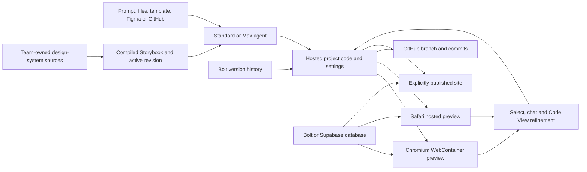
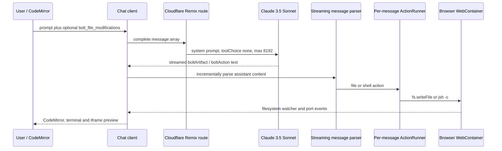

# Bolt.new

> Research status: **Architecture-level / closed-source boundary reached** · Last reviewed: **2026-08-11**

| Field | Value |
|---|---|
| Organization / team | StackBlitz |
| Category | Full-stack AI application builder with design-system compilation and browser/hosted development runtimes |
| Status | Active; legacy v1 Agent retired on 2026-08-03 |
| Source availability | Current hosted agent, code storage, Design System Agent, Bolt Cloud and publishing core are closed; an MIT 2024 v1 implementation remains public as a historical baseline |
| Previous names / aliases | None established; Bolt Agent names the post-v1 agent family, not a product rename |
| Canonical product URL | https://bolt.new/ |
| Canonical source repository | https://github.com/stackblitz/bolt.new |
| Pinned historical source revision | `eda10b121221b30825a4c16eec5da1fd3eb1eb99` on `main`, 2024-12-17 |
| Evidence cutoff | Current public surface, official documentation/release notes and official repository observed through 2026-08-11 |

## The system to understand

Bolt is not just a prompt-to-page service and its Design System Agent is not a visual editor that owns the application. The current product turns prompts, files, templates, Figma frames or repositories into a JavaScript application; executes a development projection in a browser WebContainer or, on Safari, a hosted preview; optionally provisions a managed database; and publishes an explicitly selected state. Chat, rendered-element selection, Code View and GitHub are different routes toward application source.

The design-system path adds a second, team-scoped compiler before generation. Company-owned component code and documentation remain canonical. Bolt reads those inputs into a generated, browse-only Storybook and uses the active team-wide revision as agent context. Attaching or syncing that context does not rewrite an existing project; a later agent request does.



Project code, chat, design-system revision, database records, Git branch, development preview and published site advance on separate clocks. No public operation restores them as one transaction. That split—not the chat box—is the decisive architecture.

The anonymously visible homepage was checked on 2026-08-11. It exposed Plan beside the first prompt, Website/App/Prototype/Slides entry types, direct Figma and GitHub imports, and Standard/Max as product-level choices while saying Bolt routes to underlying models. This is useful product evidence, not evidence for the closed routing implementation.

## Two generations share one name

The official repository is real source, but it is not current source. Treating it as an implementation disclosure for 2026 Bolt would collapse two materially different systems:

| Question | Current hosted Bolt, 2026 | Public repository at `eda10b1`, 2024 |
|---|---|---|
| Agent choice | Standard and Max; underlying model selection is hidden behind the product | `claude-3-5-sonnet-20240620` is hard-coded |
| Legacy status | v1 Agent and Discussion Mode retired on 2026-08-03; remaining projects auto-migrated with files and chat preserved | this is the v1-era browser implementation |
| Code storage | new closed storage format is rolling through projects; `Open in StackBlitz` is unavailable for migrated/new projects | live files exist in one WebContainer filesystem and are reconstructed from stored chat |
| Git | GitHub repositories, branches, automatic commits and polling are product features | the system prompt explicitly says Git is unavailable |
| Backend | Bolt Database, Supabase, auth, storage, secrets and server functions | no managed Bolt backend implementation |
| Design systems | team-source ingestion, generated Storybook, sync and revisions | no Design System Agent or design-system store |
| Recovery | visual Version History, GitHub and ZIP routes; database is explicitly outside code restore | browser IndexedDB stores chat messages, then action replay rebuilds the WebContainer |
| Runtime | Chromium uses WebContainers; Safari uses a hosted preview and read-only Code View | WebContainer boot is the only development execution path |

The public repository's remote had only `refs/heads/main` at the cutoff; its tip is a December 2024 issue-template commit. Later official release notes describe capabilities absent from that tree. The source is therefore valuable for the historical execution grammar and failure model, not as a proxy for the current closed service.

## Ordinary-user critical path

The current [start-project](https://support.bolt.new/building/start-project) and [project-lifecycle](https://support.bolt.new/get-started/project-lifecycle) contracts establish this path:

| Stage | Ordinary action | State that actually changes | Evidence needed before moving on |
|---|---|---|---|
| Frame the product | Choose Website, web app or mobile/Expo early; start from a prompt, files, marketplace/team template, Figma, Stitch or GitHub | a new independent Bolt project and initial context | confirm the requested platform and the copied/imported inputs; a template copy no longer follows its source |
| Constrain generation | Choose Standard or Max, optionally enable Plan, select a design system before the first build and answer Enhance-prompt questions | agent/context configuration; homepage Plan may also create a base app structure | inspect the editable plan and generated file tree rather than treating an enhanced prompt as output |
| Materialize | Run Build; let Bolt create and modify JavaScript source, dependencies and any requested backend resources | hosted project code plus optional database/resources | preview the actual feature, inspect relevant files and logs, and distinguish code generation from database provisioning |
| Refine | Prompt one bounded change, select a rendered element/layer, tag files with `@`, or edit/save in Code View | current project source; selected-element requests still route through the closed agent/writeback path | re-open the target flow; a highlight, answer or agent completion is not a source-diff receipt |
| Make stateful | Accept automatic Bolt Database provisioning or deliberately choose Supabase/local storage | schema, records, auth, storage, functions and secrets outside the code-version ledger | inspect schema/security and exercise the intended user/data boundary |
| Recover and collaborate | Preview/restore a Bolt version, branch through GitHub, download a ZIP, duplicate or share the project | one of several independent version/copy ledgers | verify which ledger moved; code restore does not restore a database and duplicate does not preserve every state |
| Release | Run the appropriate security checks, choose visibility and press Publish/Update | hosted site revision and access policy | load the public/private destination as its intended user and record the publish time; project edits are not auto-published |

Three product semantics deserve special care:

- Plan Mode inside an existing project is documented as non-mutating, but the homepage flow says it first creates the base app structure and then returns a plan. “Plan” is therefore not universally equivalent to “no project state created.”
- Marketplace and team templates create independent projects. Future template changes do not propagate.
- Publish and project sharing are separate. A collaborator can be working against the newest project while the live site intentionally remains on an older published state.

## The Design System Agent compiles context, not application truth

### Source ingestion produces a browsable projection

Paid Teams can point Bolt at several evidence types:

| Input | What official docs establish | Consequential boundary |
|---|---|---|
| Public GitHub repository | component source, documentation and installation context | strongest public input, but private repositories are not listed as a normal source path |
| npm package or private registry | built component code and dependencies; private registry uses URL/token/scopes | a built package can expose less context than source; a firewall may require an expert or file upload |
| Storybook or public website | visual behavior and documentation | documentation alone tends to produce a theme rather than reusable component code |
| Files/ZIP | up to ten PDFs, images, specs, brand files or one archived directory | supporting evidence; static uploads require a new version on later sync |
| Agent instructions | framework/theme choices, deprecated-component exclusions and ambiguity resolution | another human-authored context layer, not a validation proof |

Initial generation normally takes 45–60 minutes. Add and sync operations share a ten-per-team-per-week limit. Bolt generates a Storybook with collections for components, icons, illustrations and tokens plus pages for foundations such as typography and theming. The Storybook is browse-only: users update source inputs and sync; they do not edit the compiled projection directly.

This yields a precise authority order:

1. Team repositories, packages, documentation and files define the design system.
2. Bolt compiles a derived Storybook and agent-readable projection.
3. One active design-system revision supplies generation context.
4. Agent-authored application files record the actual components/imports used by a project.
5. The running preview and published site project those files.

The design-system Storybook can be highly executable evidence without becoming the canonical application or original library.

### The global revision and project code have separate clocks

Sync pulls current live sources, incorporates replacement uploads and identifies changed inputs instead of regenerating everything. New projects use the latest revision. Existing projects only gain access to updated components; their code does not change until prompted.

Revision switching is team-global. Bolt explicitly warns that a previous revision cannot be selected for one project independently: changing the active revision affects every project attached to that design system. Even then, existing source stays unchanged until an agent updates it.

Therefore a project can contain imports authored under revision A while the active agent context now points at revision B. Bolt documents no per-project immutable design-system revision pin or transaction binding an application version to the exact compiled revision that generated it. Version History for application code and revision history for the team design system are separate ledgers.

### Attaching is not migration

Selecting a design system before the first prompt makes it a reference from the start. Attaching one later, detaching it or switching systems does not immediately alter files. Applying it to one component or auditing an entire codebase is another agent run. Official guidance recommends precise component names, `@` tagging and Max for higher-fidelity work.

The marketing blog describes “real components, not inventions” and “no rogue styling.” The operational docs place stricter conditions around that outcome: source quality, consistency, framework ambiguity, active revision, component availability, prompt scope and agent choice all matter, and the troubleshooting section explicitly covers output that does not match the system. The strongest evidence-backed conclusion is **generation grounded by compiled component context**, not a deterministic component compiler with guaranteed conformance.

## Figma crosses two conversion routes

The ordinary Figma integration uses Anima to turn a selected frame into an application. A user can start a project from a frame or add a frame as chat context. Public docs expose no continuing Figma node, component, variable or revision binding after generation.

With an attached Bolt design system, the documented route changes:

1. Select the design system and its active revision.
2. Import the Figma frame using **Screenshot**.
3. The Design System Agent interprets pixels plus prompt context and recreates the frame with components it knows.

The same guide warns not to select **Code** in this case because that converter is unaware of the Bolt design system. Interaction states, content rules and desired variants must be supplied in the prompt when pixels do not contain them.

This is a revealing split: the normal code-conversion route has more Figma-derived structure but lacks Bolt design-system awareness; the design-system route deliberately chooses a screenshot and performs semantic reconstruction. Neither public path establishes Figma-to-source identity, reverse synchronization or pixel/component equivalence. The external Figma file remains design authority; generated Bolt code is a new implementation lineage.

## Runtime transport depends on the browser

### Chromium: device-backed WebContainer development

Current troubleshooting docs still identify StackBlitz WebContainers as Bolt's browser development runtime. A WebContainer uses local device resources to provide a Node-oriented filesystem, terminal, package manager and servers. Chromium users can edit in Code View and see the in-browser development projection.

This architecture has user-visible constraints:

- Bolt focuses on JavaScript frontends and Node.js backends; PHP and Python backends are unsupported.
- insufficient local memory can prevent the environment from starting or crash it;
- cache, extensions, ad blockers and VPN/network behavior can interfere with boot;
- a working preview proves the development runtime, not production publishing.

### Safari: hosted preview and read-only source surface

Safari support introduced in July 2026 does not reproduce the same execution boundary. Code View is read-only, previews are hosted, opening a Chrome-created project may require prompting Bolt to load it, and each source change can leave the visible hosted preview temporarily stale while another preview build finishes.

A Safari hosted preview is still not the published site. The same project can therefore have three visible projections: an in-browser Chromium development server, a Safari hosted preview build and an explicitly published release. “Runs in the browser” is no longer a universal description of current Bolt.

### Storage and execution are no longer the same claim

Since the 2026 code-storage migration, new or migrated projects can no longer use **Open in StackBlitz** from Export. Code View remains available and Chromium still uses WebContainers. This proves that current durable project storage cannot be equated with the temporary browser filesystem, but official docs do not expose the new storage schema, synchronization protocol or snapshot transaction. Runtime locality and source durability must be treated separately.

## Four context and mutation planes

| Plane | Public contract | Mutation authority | Boundary |
|---|---|---|---|
| Standard / Max Build | Bolt selects underlying models; Standard favors bounded everyday work and Max deeper large/open work | current project files and requested Bolt resources | model identity/routing, tool protocol, diff algorithm and transaction semantics are closed |
| Plan Mode | reads code/recent context and can research without code changes inside a project | discussion/plan only in an existing project | homepage Plan first creates a base structure; accepting or leaving a plan has no public immutable plan-to-diff receipt |
| Select, file tags and Code View | Select highlights a preview element or a layer; `@` names files/folders; Code View edits/creates/deletes/locks/targets files | selected-element requests go through Bolt; Code View writes source directly | no public selection packet, file/range/AST identity, source-marker producer or revision guard is documented |
| Skills and knowledge | knowledge applies to every prompt; skills trigger by description or `/$skill-name` | project skills live in project code and are always on; workspace skills are separate configuration | imported GitHub skills detach from their source; workspace skills do not transfer with a project; tool access requires connectors rather than skills |

Project skills use Markdown/MDX with `name` and `description` frontmatter and instructions. Workspace skills can be enabled per project, while project-level skills are stored with project code. This distinction matters for export and transfer: project skills can travel with project files; workspace skills remain owned by the workspace.

Real-time collaboration adds a human concurrency rule. Every project has one shared chat thread and Bolt accepts one prompt at a time, but users can still edit together. Only the owner manages GitHub; collaborator changes may wait until the owner reopens the project before synchronization. Prompt serialization is not a general transaction across manual source edits, Git or database changes.

## Rendered selection is established; source return is closed

The current Select tool can hover a UI element, choose among overlapping layers and attach the choice above the chat box. This establishes a product-level target contract stronger than an ungrounded prompt. It does not reveal what identity reaches the agent or source writer.

No current public repository or document establishes:

- injected `file:line:column`, source-map or AST identities on rendered nodes;
- how repeated component instances are distinguished;
- whether selection is resolved at click time, send time or write time;
- how a target survives HMR, a hosted-preview rebuild or a concurrent manual edit;
- whether some changes are deterministic patches and others model-authored rewrites;
- an atomic relationship between the visible target, produced diff, Bolt version and Git commit.

The historical public tree does not contain the current Select implementation. It can explain how old streamed file actions reached a WebContainer, but cannot fill this mapping gap. Bolt therefore establishes **closed preview-context-to-agent source refinement**, not another source-inspected target-return mechanism.

## The project is a set of ledgers

| State | Durable center | Copy/restore behavior | What it does not restore or prove |
|---|---|---|---|
| Current project source | Bolt's closed hosted code storage and current files | Code View, agent writes, ZIP export and optional Git sync | exact storage schema, write transaction and new-format relationship to WebContainer are undisclosed |
| Bolt Version History | automatic named/bookmarked code backups with preview and restore | selects an older project-code state | explicitly does not rewind Bolt or Supabase databases |
| Shared project chat | one project thread, also used for recent restore entries | v1 auto-migration preserved chat; duplicating a project clears it | not equivalent to a code snapshot, database journal or Git history |
| GitHub | repository branch and commit graph outside Bolt | new repositories start private on `main`; branches can be created/switched; merges happen on GitHub | does not back up Bolt DB data, design-system projection, publish state or all hosted settings |
| Bolt Database | managed schema, rows, auth, files, functions, secrets and logs | project transfer includes it; project duplicate copies schema but not rows | code/Version History restore leaves it current |
| Supabase | external project and data authority | duplicate may keep the same Supabase connection or copy structure to a new Bolt DB | Supabase-to-Bolt conversion is unsupported; shared connection can let two app copies mutate one backend |
| Design system | team source inputs plus one active compiled revision | duplicate keeps the same attached system; sync creates global revision history | no per-project revision pin and no automatic code migration |
| Skills | project-code files or workspace library | project skills transfer; same-workspace duplicates retain available skills | workspace skills do not transfer to another workspace; imported skill has no ongoing Git link |
| Development preview | WebContainer server or Safari hosted preview | regenerated from current code/runtime | not a durable source snapshot and not the live release |
| Published site | explicitly published/updated Bolt Hosting revision and visibility | remains stable until Update; can be unpublished | project changes, preview success and Git commit do not update it automatically |
| Figma/template input | external source or copied starting state | one-way reconstruction/copy | later upstream changes and native identity do not propagate |

### Git is strong portability with a sharp conflict policy

Bolt can import an existing repository or create a private repository on `main`. It creates commits whenever a change does not break the project, polls GitHub about every 30 seconds and keeps branches separate. It cannot merge branches in-app.

The current documentation also states a rare but consequential policy: if Bolt and GitHub update at nearly the same time, Bolt keeps its version and overwrites GitHub's version. That is not a merge protocol. A reviewed remote commit is a stronger portable code receipt than the preview, but users still need to fetch/inspect and independently validate the intended branch.

### Duplicate, download and transfer create different forks

- A ZIP contains project files and can be run locally with Node.js, but it does not by itself reproduce managed databases, secrets, hosting or active workspace context.
- A duplicate keeps code/settings and the same design-system association, drops GitHub/Netlify settings, clears chat and copies only Bolt Database structure—not rows.
- A transfer moves the project rather than copying it. Bolt Database transfers; GitHub and Supabase require destination-dependent handling; custom domains do not transfer.

### Publish is an explicit promotion

Bolt Hosting creates a `bolt.host` site with public or private visibility. Only owners/co-owners can publish. Later source changes do not become live until **Update** is pressed. A security audit can inspect code and database on paid plans, but an audit or auto-fix completion still needs release and ordinary-user acceptance evidence.

## Bolt Database creates a code/data split by default

Bolt can provision a database automatically when a requested feature appears to need one. A user who does not want this must explicitly request local storage/no database or choose Supabase during setup. Bolt Database includes tables, auth, file storage, secrets, logs, security, server functions and user management.

This convenience changes the source-of-truth model:

- application code can be restored without its current schema/rows moving;
- unpublished low-activity databases may pause after six days, while published databases no longer pause for inactivity;
- a database can need an explicit restart even when project source is unchanged;
- duplicating a Bolt-backed app copies columns/tables but not records;
- data export, authentication and server behavior require separate inspection from a successful frontend build.

The database is therefore part of the runnable product but not part of the application-version transaction. A visual or code rollback can produce old code against new data.

## What the historical MIT implementation actually establishes

### Reproduction boundary

The official repository was inspected at:

```text
repository: https://github.com/stackblitz/bolt.new
branch:     main
commit:     eda10b121221b30825a4c16eec5da1fd3eb1eb99
date:       2024-12-17T00:29:27-06:00
license:    MIT
package:    private Remix application, pnpm 9.4.0
```

At this revision the tree contains 138 tracked files. It uses Remix/Vite, Cloudflare Pages/Workers bindings, AI SDK 3.3, Anthropic, Nanostores, CodeMirror, xterm and `@webcontainer/api` `1.3.0-internal.10`. There are no tags in the remote and no current-product packages for Design Systems, Bolt Database, new code storage, GitHub sync or Safari hosted previews.

### The old execution protocol



The model does not call a typed filesystem tool. The system prompt asks it to emit one `<boltArtifact>` containing ordered `<boltAction type="file">` or `<boltAction type="shell">` elements. A streaming parser recognizes those tags and callbacks enqueue actions. File actions create directories and write full content; shell actions spawn `jsh -c`. WebContainer port events become preview URLs.

The Cloudflare route sets `toolChoice: 'none'`. If an 8,192-token response ends for length, it appends the partial assistant message plus a continuation prompt and can switch the stream once more; `MAX_RESPONSE_SEGMENTS` is two. This is string-protocol execution with bounded continuation, not a general current-agent tool interface.

### Implementation map at the pinned commit

| Path | Source-visible responsibility | Technical conclusion |
|---|---|---|
| `app/lib/.server/llm/model.ts` | creates Anthropic client and selects `claude-3-5-sonnet-20240620` | model choice is fixed in this historical template |
| `app/lib/.server/llm/prompts.ts` | defines WebContainer constraints, file-modification syntax and artifact/action grammar | prompt explicitly excludes Git/native binaries/pip and requires complete file content |
| `app/lib/.server/llm/stream-text.ts` | wraps AI SDK `streamText` with model, system prompt and token limit | current Standard/Max routing is absent |
| `app/routes/api.chat.ts` | accepts complete messages, streams response and performs one continuation | server receives conversation text; no project database or Git transaction appears |
| `app/lib/runtime/message-parser.ts` | incrementally recognizes artifact/action tags and emits callbacks | only file and shell actions form the mutation protocol |
| `app/lib/hooks/useMessageParser.ts` | opens workbench, adds actions and runs them when tags close | streamed text can begin mutating the environment before the whole answer finishes |
| `app/lib/runtime/action-runner.ts` | serializes actions within one assistant message and executes them in WebContainer | ordering exists per artifact/message, not as a documented global project transaction |
| `app/lib/webcontainer/index.ts` | boots one client-side WebContainer with `/home/project` | development filesystem/runtime is browser-owned in this implementation |
| `app/lib/stores/files.ts` | watches WebContainer paths, mirrors text/binary files and tracks manual edits | current editor state follows runtime files; `.git` and `node_modules` are excluded from projection |
| `app/utils/diff.ts` | turns manual changes into a unified diff or full-file `<bolt_file_modifications>` packet | manual source edits reach the model only on a later user message |
| `app/lib/stores/previews.ts` | maps WebContainer port open/close events to preview URLs | preview availability is runtime-event state, not a release artifact |
| `app/lib/persistence/db.ts` | stores chat id, URL id, description, timestamp and message array in IndexedDB `boltHistory` | it persists conversation, not a filesystem snapshot |
| `app/lib/persistence/useChatHistory.ts` | reloads messages, assigns chat identity and writes history after message changes | history recovery depends on assistant action replay |
| `app/lib/stores/workbench.ts` | composes files/editor/terminal/preview and creates one `ActionRunner` per message | workbench state is Nanostores/HMR state; `abortAllActions()` is still a TODO |

### Chat replay, not file persistence, is the old durability mechanism

IndexedDB stores messages but no WebContainer filesystem image. When stored assistant messages are rendered again, `useMessageParser` parses their action markup and re-executes it. Historical project recovery is therefore closer to replaying a generated build program than restoring a versioned source tree.

Manual CodeMirror edits are written to the live WebContainer and remembered in an in-memory `modifiedFiles` map. On the next prompt, the client prefixes the user's hidden model message with either a compact unified diff or full file content. It then clears that modification set. A manual edit that is never followed by a message has no source-visible durable path into IndexedDB; on reload, only stored assistant actions can reconstruct files.

There is also no single replay runner. `WorkbenchStore` creates an `ActionRunner` for each assistant `messageId`. Each runner serializes its own actions, but historical messages can schedule separate chains against the same WebContainer. The conclusion that cross-message replay can interleave is an implementation inference from these independent promise chains, not an observed current-product claim.

### Historical success reporting is weaker than execution success

The old runner exposes several concrete failure boundaries:

- shell exit codes are logged but a non-zero code is not converted into a failed action;
- directory/file write exceptions are caught and logged inside `#runFileAction` without rethrowing, after which the outer executor can mark the action complete;
- stopping the model stream calls `workbenchStore.abortAllActions()`, whose implementation is only a TODO;
- a file action executes as soon as its closing tag arrives, so later truncation or a malformed remaining answer does not roll back earlier writes;
- the model is instructed not to rerun an existing dev server, but history replay reprocesses stored shell actions rather than restoring the prior process graph.

The public source therefore proves that UI action completion in this generation was not sufficient evidence for file/process correctness. That lesson remains useful, but it must not be projected onto the closed current runner as an unchanged bug.

## Commits that change the conclusion

| Commit | Date | Evidence | Why it matters |
|---|---:|---|---|
| [`6fb59d2`](https://github.com/stackblitz/bolt.new/commit/6fb59d2bc5c6e15c4e732d0f556b3a1bcbf957aa) | 2024-09-25 | “remove monorepo” imports the Remix UI, prompt grammar, parser, WebContainer stores, IndexedDB persistence and runner into the public shape | establishes the historical architecture as one large baseline rather than a gradually disclosed current core |
| [`2a29fbb`](https://github.com/stackblitz/bolt.new/commit/2a29fbbe82fc9f7188a8b20a22f18dca9699a94b) | 2024-09-26 | removes authentication, sessions and analytics from the template | proves the public tree was deliberately simplified for open use; hosted account/service behavior cannot be inferred from it |
| [`31c07c0`](https://github.com/stackblitz/bolt.new/commit/31c07c06cbf80317140603c5a11ff3d0d158f6b8) | 2024-10-07 | adds `npm_config_yes` to agent shell processes to prevent npm hangs | shows that command execution behavior lived in the browser runner and changed independently of prompting |
| [`eda10b1`](https://github.com/stackblitz/bolt.new/commit/eda10b121221b30825a4c16eec5da1fd3eb1eb99) | 2024-12-17 | current `main` tip only updates the bug-report template | the official open implementation stops before every material 2025–2026 product architecture described above |

The absence of later commits is evidence about source availability, not evidence that the product stopped evolving.

## Product evolution changed the authority model

| Time | Officially visible change | Architectural consequence |
|---|---|---|
| 2024 | public v1 implementation centers WebContainer actions and local IndexedDB chat replay | browser conversation acts as the recoverable build program |
| 2025-08 | Bolt Hosting and visual Version History become product features | hosted code/version and delivery ledgers separate from the browser runtime |
| 2025-09 | Claude Agent and Bolt Database launch as Bolt V2 | managed agent/backend state moves far beyond the public template |
| 2026-01 | Figma import enters projects | external visual source becomes one-way generation context |
| 2026-03/04 | team Design Systems launch, followed by attach/detach for existing projects | a team-global compiled component context gains its own revision line |
| 2026-05 | Standard/Max replace model names; new code storage removes `Open in StackBlitz` for affected projects | model implementation and durable source storage are both abstracted behind product contracts |
| 2026-07 | visual Version History moves to top navigation; Skills and Safari support launch | reusable instruction state and browser-dependent execution add more clocks |
| 2026-08-03 | v1 Agent and Discussion Mode retire; remaining v1 projects auto-switch with files/chat preserved | the public repository becomes unambiguously historical |

Release-note chronology also resolves an official-document drift. A March notice warned that v1 projects/sites would become inaccessible after August 3; July/August entries later established automatic migration with chat preserved, and the August entry says files and chat remain unchanged. The latest dated outcome is used here. Older switch instructions are historical evidence, not the current migration result.

## Failure and recovery map

| Break | Observable consequence | Bounded recovery / verification |
|---|---|---|
| Wrong platform chosen late | web/mobile structure and delivery path need broad rework | decide Website/web app/mobile before generation; inspect generated stack before feature expansion |
| Homepage Plan assumed to be read-only | a base project exists before the plan is returned | distinguish planning discussion from project creation; inspect files before approving build work |
| Weak or conflicting design-system inputs | generated Storybook is theme-like, mixed-framework or inconsistent | prefer source plus docs, add exclusions/framework instructions, inspect Storybook and sync deliberately |
| Team-global design-system rollback | every attached project sees a different active context while existing files stay unchanged | record active revision, audit one project at a time and do not infer code migration from revision switching |
| Figma **Code** used with Bolt design system | generated result bypasses known design-system components | use Screenshot for that route, name components/variants and verify actual imports |
| Selected preview target stales | agent changes the wrong instance/file after HMR, rebuild or manual edit | reselect immediately before sending, scope prompt and inspect resulting source; mapping/revision guard remains unknown |
| WebContainer startup/OOM | Chromium preview or terminal fails despite intact hosted source | close competing tabs/apps, clear cache, disable interfering extension/VPN and reload; do not rewrite source before isolating runtime failure |
| Safari preview lag | visible hosted preview reports it may be outdated | wait for the preview build, reload through a prompt if required and test the explicit publish separately |
| Automatic database provision surprises the user | new managed state exists outside expected local/source model | say “no database/use local storage” before build or choose Supabase explicitly; inspect database settings afterward |
| Code version restored as if it included data | old code runs against current schema/records | coordinate a separate data backup/migration and validate code-schema compatibility |
| Near-simultaneous Git/Bolt changes | Bolt can overwrite the GitHub version | isolate a branch, wait for sync, inspect remote commit/diff and merge on GitHub rather than assuming reconciliation |
| Collaborator change waits for owner | Bolt project is newer than its Git repository | owner opens the project, then verify the exact remote commit before review/release |
| Duplicate assumed complete | chat and rows disappear; Git/Netlify links are absent | inventory code, database, skills, design system and integrations in the copy before using it as recovery |
| Preview mistaken for release | editor looks correct while public users still receive the previous version | press Update, visit the destination with intended access and record the publish timestamp |
| Historical source treated as current | architecture claims contradict current agents, storage, database and Safari behavior | pin `eda10b1`, label every source-derived statement v1-era and use current release notes for product facts |
| Historical runner marks weak execution complete | non-zero shell/file errors can look completed in the old UI | inspect files, process exit and preview behavior; do not use action status alone as artifact evidence |

## Evidence boundary

| Claim type | Established here |
|---|---|
| **Fact** | Current official docs and the visible public entry establish the start/refine/recover/publish journey, Standard/Max abstraction, Select and Code View behavior, Design System Agent source/revision contracts, Figma route split, WebContainer/Safari runtime split, database separation, Git/Version History/duplicate semantics and explicit release. The pinned MIT tree establishes the v1 string-action protocol, WebContainer runner, file projection and IndexedDB replay implementation. |
| **Inference** | the generated Storybook is a derived design-system projection rather than canonical design truth; current hosted storage is durable independently of a WebContainer; cross-message v1 replay can interleave; the product must be accepted as several ledgers. These conclusions follow from explicit state splits or source control flow and are labeled accordingly. |
| **Unknown** | current agent orchestration/model routing, project-code storage schema, Select packet and renderer-to-source mapping, deterministic versus model patch routing, design-system internal representation, Git conflict/commit transaction, hosted Safari builder, Bolt Database implementation, version snapshot schema and publish transaction. |
| **Not established** | current core source availability, pixel-exact or identity-preserving Figma conversion, deterministic design-system conformance, per-project design-system revision pinning, selected-element-to-AST identity, atomic code/data/Git/publish restore, or preview/agent completion as release proof. |

This dossier reaches the closed-source architecture boundary because the current decisive user journey, design-system compiler boundary, runtime transports, source/data/version authorities, target-return gap, product evolution and documented failures have been exhausted against public evidence; the historical implementation is separately traced to commit-level source. It does not promote that frozen v1 code into evidence for the current hosted core.

## Research gaps

- Use a disposable signed-in project to record the current Select packet, resulting file diff, Bolt version and Git commit around repeated components, HMR and simultaneous Code View edits. No account or third-party state was created or mutated for this dossier.
- Determine the new code-storage format's backing objects, version granularity, WebContainer hydration path and failure recovery. The disappearance of `Open in StackBlitz` proves a transition, not its schema.
- Generate a small controlled design system from a pinned component repository and inspect the Storybook, imports, active-revision behavior, revision rollback and exported/Git state.
- Compare Figma **Code** and design-system **Screenshot** imports of the same frame, including whether any node, component, variable or revision identifiers survive into source or history.
- Exercise Bolt/GitHub concurrent edits in a disposable repository to measure auto-commit boundaries, 30-second polling, overwrite policy and branch memory behavior.
- Test Version History against schema and data changes, and inspect whether any immutable project-version identifier appears in the database, publish or security-audit receipts.
- Compare the same project in Chromium and Safari to bind source revision, WebContainer/hosted preview build and public publish to observable identifiers.
- Recheck Standard/Max, Skills, v1 migration and design-system quotas frequently; these contracts changed within weeks of the evidence cutoff.

## Primary sources

### Current product and ordinary journey

- https://bolt.new/
- https://support.bolt.new/llms.txt
- https://support.bolt.new/building/start-project
- https://support.bolt.new/get-started/project-lifecycle
- https://support.bolt.new/building/using-bolt/agents
- https://support.bolt.new/best-practices/plan-mode
- https://support.bolt.new/building/chat-tools
- https://support.bolt.new/building/using-bolt/code-view
- https://support.bolt.new/building/using-bolt/collaborate
- https://support.bolt.new/concepts/supported-technologies
- https://support.bolt.new/troubleshooting/issues

### Design systems and Figma

- https://bolt.new/blog/bolt-design-system-agents
- https://support.bolt.new/building/design-system/introduction
- https://support.bolt.new/building/design-system/add-design-system
- https://support.bolt.new/building/design-system/view-design-system
- https://support.bolt.new/building/design-system/use-design-system
- https://support.bolt.new/building/design-system/sync-design-system
- https://support.bolt.new/building/design-system/best-practices
- https://support.bolt.new/integrations/figma

### Code, data, versions and delivery

- https://support.bolt.new/building/using-bolt/projects-files
- https://support.bolt.new/building/using-bolt/rollback-backup
- https://support.bolt.new/concepts/version-history-github
- https://support.bolt.new/integrations/git
- https://support.bolt.new/cloud/database
- https://support.bolt.new/integrations/supabase
- https://support.bolt.new/cloud/hosting/publish
- https://support.bolt.new/building/skills
- https://support.bolt.new/release-notes

### Historical source and commits

- https://github.com/stackblitz/bolt.new/tree/eda10b121221b30825a4c16eec5da1fd3eb1eb99
- https://github.com/stackblitz/bolt.new/blob/eda10b121221b30825a4c16eec5da1fd3eb1eb99/app/lib/.server/llm/prompts.ts
- https://github.com/stackblitz/bolt.new/blob/eda10b121221b30825a4c16eec5da1fd3eb1eb99/app/lib/.server/llm/stream-text.ts
- https://github.com/stackblitz/bolt.new/blob/eda10b121221b30825a4c16eec5da1fd3eb1eb99/app/routes/api.chat.ts
- https://github.com/stackblitz/bolt.new/blob/eda10b121221b30825a4c16eec5da1fd3eb1eb99/app/lib/runtime/message-parser.ts
- https://github.com/stackblitz/bolt.new/blob/eda10b121221b30825a4c16eec5da1fd3eb1eb99/app/lib/runtime/action-runner.ts
- https://github.com/stackblitz/bolt.new/blob/eda10b121221b30825a4c16eec5da1fd3eb1eb99/app/lib/hooks/useMessageParser.ts
- https://github.com/stackblitz/bolt.new/blob/eda10b121221b30825a4c16eec5da1fd3eb1eb99/app/lib/webcontainer/index.ts
- https://github.com/stackblitz/bolt.new/blob/eda10b121221b30825a4c16eec5da1fd3eb1eb99/app/lib/stores/files.ts
- https://github.com/stackblitz/bolt.new/blob/eda10b121221b30825a4c16eec5da1fd3eb1eb99/app/lib/stores/workbench.ts
- https://github.com/stackblitz/bolt.new/blob/eda10b121221b30825a4c16eec5da1fd3eb1eb99/app/lib/persistence/db.ts
- https://github.com/stackblitz/bolt.new/blob/eda10b121221b30825a4c16eec5da1fd3eb1eb99/app/lib/persistence/useChatHistory.ts
- https://github.com/stackblitz/bolt.new/commit/6fb59d2bc5c6e15c4e732d0f556b3a1bcbf957aa
- https://github.com/stackblitz/bolt.new/commit/2a29fbbe82fc9f7188a8b20a22f18dca9699a94b
- https://github.com/stackblitz/bolt.new/commit/31c07c06cbf80317140603c5a11ff3d0d158f6b8
- https://github.com/stackblitz/bolt.new/commit/eda10b121221b30825a4c16eec5da1fd3eb1eb99
