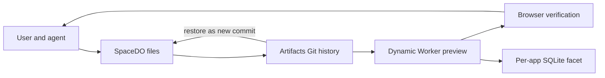

# Cloudflare VibeSDK

> Research status: **Source-level** · Lifecycle: **active** · Last reviewed: **2026-08-13**

VibeSDK is Cloudflare's open agentic app-building platform and the upstream source for the `vinilana/aicoders-prompt-to-app` fork discovered in the UI stratum. A user clarifies a request with the agent, watches file/tool changes, deploys branch-scoped previews, inspects browser failures and restores earlier source states.

## Four Cloudflare authorities cooperate without becoming one

Pinned revision: `a318f08625dbb443af7f70dd08d295fd49a0b96b`.

`ThinkAgent` owns the model-and-tool loop. A project-specific `SpaceDO` owns current workspace files. Cloudflare Artifacts provides Git commits, branches and restore points. Worker Loader turns a committed state into a Dynamic Worker preview, while an application Durable Object Facet owns generated-app SQLite data.

## Restore preserves lineage but not application data

Rollback restores a selected commit into the current branch, creates another commit and redeploys, avoiding destructive history rewrite. The generated application's SQLite data has its own inspect/reset controls and is not implied to roll back with code. Export creates an external continuation copy.

## Pinned evidence

- [Repository](https://github.com/cloudflare/vibesdk)
- [Space workspace API](https://github.com/cloudflare/vibesdk/blob/a318f08625dbb443af7f70dd08d295fd49a0b96b/sdk/src/workspace.ts)
- [Artifact synchronization](https://github.com/cloudflare/vibesdk/blob/a318f08625dbb443af7f70dd08d295fd49a0b96b/space/src/space/artifacts-sync.ts)
- [Deployment engine](https://github.com/cloudflare/vibesdk/blob/a318f08625dbb443af7f70dd08d295fd49a0b96b/space/src/space/deploy-engine.ts)
- [Pre-deploy safety gate](https://github.com/cloudflare/vibesdk/blob/a318f08625dbb443af7f70dd08d295fd49a0b96b/worker/agents/utils/preDeploySafetyGate.ts)
