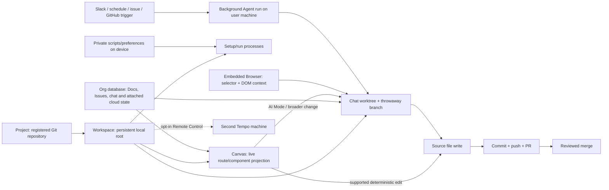

# Tempo

> Research status: **Architecture-level / closed-source boundary reached / v1.0** · Last reviewed: **2026-08-11**

| Field | Value |
|---|---|
| Organization / team | Tempo Labs |
| Current category | Local-first AI software factory with a code-backed Canvas and worktree-isolated agents |
| Status | Active desktop product; stable `0.0.91` dated 2026-08-10 |
| Product discontinuity | The former hosted Web editor is being wound down; projects move by GitHub or ZIP rather than by a native state migration |
| Source availability | Closed current core; proprietary desktop distribution is inspectable in part but is not published as source |
| Pinned implementation snapshot | Windows `Tempo.Setup.0.0.91.exe`, SHA-256 `ceb443121de7447de578cd53eaffa0ae5295ba2aa634469e7e5f16c2a212c2ed` |
| Evidence ceiling reached | Official product/docs/changelog, current distribution and readable shipped implementation slices; hosted schemas, bytecode-protected main/preload logic and server internals remain unknown |

## Executive finding

Tempo is no longer adequately described as a visual React editor. The [current introduction](https://docs.tempo.new/introduction) calls it an “AI software factory” organized around five surfaces—Docs, Canvas, Issues, Chat and Agents—over the same repository workspace. The important durable center is the **branch-scoped local codebase**, not a freestanding canvas document:

- Canvas storyboards are typed React source committed with the repository;
- deterministic visual edits return through source annotations and guarded file writes;
- Chat and background Agents do broader work in isolated Git worktrees;
- Docs, Issues, chat history and project-attached cloud state live in Tempo's organization service;
- private scripts and some workspace preferences are device state;
- a pushed branch or reviewed PR—not an agent's “done” state or a correct iframe—is the portable implementation receipt.

This model also explains Tempo's sharpest boundary. A Canvas iframe is a source-annotated projection of code and can support deterministic return. The embedded Browser can inspect an arbitrary page, but its shipped picker returns a CSS selector, DOM excerpt, geometry and computed styles rather than a file/range/revision identity. They are two visual planes, not two versions of the same source-mapping system.

## The 2026 migration changes the artifact authority

The [migration guide](https://docs.tempo.new/guides/migrate) describes the desktop app as a ground-up rebuild around local execution, frontier coding agents and Git worktrees. The old hosted editor is not upgraded in place:

- a Web project on GitHub is pushed and cloned into Desktop;
- an unconnected project is downloaded as ZIP and opened as a new local repository lineage;
- prompt credits and billing access can carry over, but editor history and hosted project state are not described as migrating;
- old repositories are retained for 60 days after the June 14 wind-down and can be exported on request.

The surrounding Desktop changelog begins on 2026-06-20, so the guide's undated “June 14” is consistent with the 2026 cutover. That year is an inference from the release sequence, not text printed beside the date in the migration page.

The result is a deliberate authority reset: after transfer, the local/remote Git repository is the code lineage. A ZIP proves file export, not continuity of hosted history, comments, issues, prompts, billing or deployment.

## Authority topology: one repository, several state planes

The [Organizations & Workspaces guide](https://docs.tempo.new/guides/organizations-and-workspaces) defines the nesting precisely:

| Layer | Public meaning | Authority / lifetime |
|---|---|---|
| Organization | membership boundary and owner of cloud data | teams, projects, Docs, Issues, canvases and chat history remain service state |
| Project | one repository registered to an organization | team projects require a remote URL; private organizations can register local-only repositories |
| Workspace | that project's folder on one machine | one persistent local root plus zero or more worktrees, Canvas state, dev configuration and view modes |
| Worktree | isolated checkout for one AI chat | disposable branch named like `{git-user}/{workspace-slug}`; review/push/PR or discard |

Two official pages disagree on materialization time. [Chat](https://docs.tempo.new/product/chat) says starting a session creates a fresh worktree, while the hierarchy guide says it is created lazily on the agent's first edit. The safe conclusion is isolation **before mutation**, not a guaranteed allocation event at chat-open time.

## Ordinary journey and the receipts that matter

### 1. Open the real repository and establish runnable context

The [Quick Start](https://docs.tempo.new/guides/quick-start) connects Claude or Codex through the user's provider login and opens a local or remote repository. A project can attach Docs, Issues and Canvas material, but those attachments do not replace the checkout.

If the repository has no commit, the shipped `ensureGitRepo` path initializes Git—preferring `main`—and creates an `Initial commit` as `Tempo <tempo@local>`. That convenience creates a baseline; it does not publish it or prove that generated ignore rules, secrets or build output are appropriate.

### 2. Make the product intent inspectable before handing it to an agent

[Docs](https://docs.tempo.new/product/docs) use a rich editor over Markdown semantics and can be attached to a chat so the agent receives them on every turn. Despite the page's phrase “stored alongside your codebase,” its persistence section explicitly says Docs live in the organization database and are workspace-scoped. [Issues](https://docs.tempo.new/product/issues) also live in that database and can link a branch, PR, Canvas, Doc or Chat.

That makes links and context useful coordination records, not repository backup. A clone alone does not restore their content or attachment graph.

### 3. Use Canvas for a code-backed visual slice

The [Canvas guide](https://docs.tempo.new/product/canvas) makes each frame a live iframe of a real route or React component. A storyboard is a typed React export in an `index.canvas.tsx` file under `tempo/designs/canvases/`; the file commits to Git like other source. Users can arrange frames, inspect layers, edit style/layout/text, drag elements and jump to code while the app server hot-reloads.

This is not “production DOM saved as design.” The repository retains component and storyboard source; the iframe, Fiber tree, transient DOM ids, computed styles, form state and scroll state are runtime projections.

### 4. Let the edit choose its correct lane

The current desktop has two code-changing Canvas lanes:

- a supported element can be rewritten deterministically by the Canvas source editor;
- an unsupported/computed/ambiguous element can be staged in **Canvas AI Mode** and sent through Chat for agent materialization.

The public changelog introduced AI Mode in [`0.0.89`](https://docs.tempo.new/changelog). The shipped implementation additionally freezes ordinary Canvas writes while an AI Mode session is open, then either applies the staged set through Chat or cancels it. A staged preview is therefore intent, not a landed file change.

### 5. Review the branch, then promote deliberately

Every Chat uses Claude or Codex over a full worktree and Git history. Plan Mode remains non-mutating until accepted. For an Issue assigned to an agent, the documented loop is: create isolated worktree, read linked context, change code, open PR and move the Issue to review.

The ordinary completion chain is:

1. inspect the actual changed files and working-tree status;
2. rebuild or hot-reload the intended route and exercise the user journey;
3. commit and push the correct repository branch;
4. open and review the provider PR;
5. merge deliberately;
6. verify the independently deployed environment if release was requested.

An iframe repaint, generated preview snapshot, agent run completion, PR creation or merge is not by itself evidence that production data, environment, external services or delivery are correct.

## Canvas artifact and parser constraints

The readable `0.0.91` `canvas-validation` chunk exposes the concrete Canvas file contract rather than only UI claims:

- `tempo-sdk/canvas` supplies `Canvas`, `Storyboard`, `LegacyStoryboardV1`, `RouteStoryboard` and `HtmlStoryboard`;
- OXC parses `index.canvas.tsx` into exact byte spans;
- a file must contain exactly one `<Canvas>`;
- storyboard declarations must be direct children of that Canvas;
- ids, names, route paths, backgrounds and layouts are editable only when the parser can prove a literal range;
- add/remove/rename/layout operations are reverse-sorted, non-overlapping source edits and refuse invalid or unavailable spans;
- file discovery defaults to `tempo/designs` unless configuration supplies another Canvas path;
- the asset index recursively scans JS/TS/JSX/TSX, ignores dependency/build/dot directories, hashes content to avoid re-parsing and requires explicit asset declarations in strict design-system/library zones.

The public guide's `tempo/designs/canvases/` convention and the runtime's configurable/default root are compatible: the first is the user-facing layout, while the latter is the implementation's discovery boundary.

Canvas configuration itself has a documentation skew worth preserving. The [Setup & Run Scripts guide](https://docs.tempo.new/guides/setup-run-scripts) calls `tempo/tempo.config.json` canonical and says `apps[0].appStart` powers route storyboards, but several examples and storage tables shorten the path to `tempo.config.json`. The canonical path statement is stronger than the shorthand examples; automation should still discover rather than assume when supporting older repositories.

## Source return: annotated React projection plus guarded writes

Tempo `0.0.91` exposes an unusually complete closed-distribution implementation slice for target return.

### Annotation production is a build/runtime requirement

The app-server supervisor starts project commands with `TEMPO=true`. Its own comment says this activates `tempoVitePlugin`, `tempoNextjsPlugin` or the Expo Babel plugin; without `data-tempo-*` source annotations, route-storyboard elements cannot map back and are not selectable. The shipped Expo scaffold imports `tempoExpoBabelPlugin` from `tempo-sdk/expo/plugin`, annotates paths relative to the sidecar root and keys Metro's transform cache on the Tempo flag so annotated and unannotated builds cannot silently share cache entries.

### The projection carries authored and transient identity separately

The readable `postmessage` preload wraps `window.__REACT_DEVTOOLS_GLOBAL_HOOK__`, follows committed Fiber roots and captures a semantic component/host/text tree. Authored source annotations include:

| React projection | HTML storyboard projection |
|---|---|
| `data-tempo-filepath` | `data-tempo-html-filepath` |
| `data-tempo-position` | `data-tempo-html-offset` |
| `data-tempo-modifiedts` | `data-tempo-html-modifiedts` |
| `data-tempo-source-version` | `data-tempo-html-source-version` |

It also carries `data-tempo-supports-style`, `data-tempo-supports-classname` and `data-tempo-supports-children`. The bundled TypeScript server plugin calculates those flags for custom JSX components from the actual contextual prop types: whether `style` accepts Web `CSSProperties` or React Native `ViewStyle`, `className` accepts a string and `children` accepts a React node. Files analyzed only under an inferred TypeScript project are flagged as fallback results and are not cached as authoritative.

`data-dom-id` is different. The preload generates it from a random four-character session prefix plus a counter and skips contenteditable subtrees. It binds a live DOM element to a current projection packet, not to source across reloads.

### Rebinding prefers live identity, then a guarded source anchor

When a new projection replaces an old one, the renderer first claims an unused element by `data-dom-id`. If that fails, it matches the annotated byte position/HTML offset only when the canonicalized file agrees and the new element's mtime covers the prior mtime. Repeated candidates are claimed once. Missing or duplicate runtime ids, wrong file, stale mtime, contenteditable boundaries, suspended Fibers and render failure all reduce or prevent a confident bind.

This is stronger than a CSS-selector hint: it carries a file, byte address and observed source version into a React-aware projection. It is still not a permanent AST id. Insertions before an element move the byte address, HMR replaces the DOM and generated/component instances can share source coordinates.

### Deterministic mutation is optimistic, merge-aware and reversible

For direct edits, the renderer reads the current file and records its content plus mtime, calculates exact JSX/HTML replacements, then sends a `FileWrite` containing `beforeContent`, `afterContent`, `fromMtime` and replacement ranges. The write pipeline:

1. writes directly when disk mtime still equals `fromMtime`;
2. otherwise performs a three-way merge from planned-before, current-disk and planned-after;
3. returns no-op when the intended result has already landed;
4. refuses a merge conflict;
5. passes current mtime as the conditional-write precondition and refuses a stale response;
6. rolls back already-written files in reverse order if a later file in the batch fails;
7. after success, calculates a source-version hash, re-stamps affected layer/DOM annotations and records the landed transition for undo/redo.

Canvas mutations also acquire per-surface/file coordination and reject overlapping source edits. Cross-file structural moves produce separate writes and depend on the same batch rollback. This is an optimistic source transaction over local files, not a Git transaction: external script side effects, generated files outside the batch and a later commit/push remain separate.

One adjacent editor path is weaker. The shipped left-panel Monaco adapter accepts an `expectedMtime` argument but calls the general `saveFileContent` store action without forwarding it, then returns `stale: false`. That finding applies to this file-viewer adapter; it should not be generalized to the direct Canvas pipeline above, which uses `electronAPI.sourceEditor` and explicit stale/merge handling.

## The embedded Browser is a second, heuristic visual plane

The readable `browser-webview-preload.cjs` implements selection inside the embedded Browser. It intercepts a click and sends `tempo-browser:element-picked` with:

- page URL/title;
- a unique id selector when possible, otherwise tag/class/`nth-of-type` path through at most four ancestors;
- tag, id and classes;
- viewport rectangle and clipped capture rectangle;
- text limited to 300 characters and outer HTML limited to 2,000;
- computed color, background, font family and font size.

It contains no authored file, byte range, component/Fiber identity, source map, mtime, source version or repository revision. Its selector can drift after DOM or sibling changes. Browser selection is valuable agent context and can initiate a repository repair, but only the later file diff/commit proves materialization.

This distinction also clarifies Web/Figma capture. The changelog documents Web Clipper and Figma paste producing editable HTML storyboards; the renderer contains flat-JSX capture modes and generated preview HTML. Those are **new authored storyboards** derived from a page/design, not a retained reverse pointer to the original website or Figma node graph.

## Agent execution: local authority triggered from the cloud

The [Agents guide](https://docs.tempo.new/product/agents) defines an Agent as a standing prompt plus one or more triggers:

| Trigger | Run boundary |
|---|---|
| Issue assignment/event | project Issue creates or resumes work |
| Schedule | local-time cron fires |
| Slack | selected channel message/mention; thread replies return to the same session |
| GitHub | configured webhook event arrives |

Every run starts a Tempo session on the user's machine and acts with that user's identity/access. New Agents are born disabled, templates never auto-create or auto-enable them, and nothing runs while Tempo is not running. Runs appear as Chats and can be steered.

Later changelog entries qualify the original local-only lifecycle:

- `0.0.89` lets runs survive session death and retain queued messages;
- `0.0.87` adds organization-shared custom Agents;
- `0.0.84` adds opt-in Remote Control, where another machine runs the workspace while the current one mirrors and controls it.

Remote Control moves execution placement; it does not move repository authority or make two machines' local roots identical. The exact remote transport, encryption, session resumption and failure reconciliation remain closed.

## Setup and run scripts are a trust boundary outside Git rollback

The [script guide](https://docs.tempo.new/guides/setup-run-scripts) separates shared repository configuration from personal device configuration:

| Script state | Public storage claim | Consequence |
|---|---|---|
| workspace setup | repository config | automatically runs when a workspace is created; review before opening an untrusted repo |
| private setup | device-only state | runs after shared setup; one failure does not prevent the other from running |
| repo run scripts | repository config | shared with teammates; spawned in background terminal tabs |
| private run scripts | Browser localStorage according to the docs | personal and machine-specific; absent from clone/recovery |
| app dev server | `apps[0].appStart`, legacy `scripts.appStart` | powers route storyboards; `${PORT}` resolves to Canvas's selected port |

`TEMPO_SOURCE_PATH` lets a workspace setup script point back to the original checkout, typically for symlinking secrets or dependencies. That is useful but explicitly creates state outside the worktree. A discarded branch cannot undo commands, symlinks, package caches, external service calls or files written elsewhere. The docs say non-zero setup/run exits surface as a toast; they are not a transactional workspace-creation barrier.

## Multi-repo support is federated Git, not one atomic workspace commit

The [Multi-Repo guide](https://docs.tempo.new/guides/multi-repo) supports multiple repositories only through Git submodules. The parent stores child commit pointers while each child retains its own branch, history and remote. Tempo groups staged/unstaged changes and target-branch diffs per repository, and the agent can operate across all of them.

The completion receipts remain federated:

- commit/push/pull happen per child repository;
- the parent must separately commit updated submodule pointers;
- a PR description can summarize the set, but no public protocol makes several repository commits or PRs atomic;
- selecting a child folder hides the other repositories;
- a nested repository that is not a submodule risks being committed as ordinary parent files, duplicating content and losing the intended child history.

Before a destructive “convert nested repos to submodules” request, child work must be committed and pushed. The Changes panel's Discard action is documented as irreversible, so UI convenience does not lower the need for exact scope review.

## Persistence, recovery and completion are plural

| State | Authority / recovery | Important break |
|---|---|---|
| application and storyboard source | local root/worktree and Git commit graph | uncommitted direct edits can be lost; HMR is not a durable receipt |
| Chat task branch | one worktree and throwaway branch | Discard removes worktree **and branch**; archive (added in `0.0.82`) removes worktree but retains branch |
| Docs / Issues / chat / attached cloud state | organization database scoped to project/workspace | clone, branch reset and repository backup do not restore it |
| Canvas projection | iframe/Fiber/DOM state plus observed source metadata | reload/HMR/process death remounts it; transient ids are not durable |
| Canvas comments/previews | branch- and project-attached service state in the shipped client | no public schema or Git mapping; branch rename/delete semantics are only partially documented |
| repo/private run configuration | Git config versus device state | different teammates can execute different private commands; side effects exceed branch rollback |
| agent definition/run | organization definition plus local execution session | disabled/enabled state and triggers are service state; execution stops without a running Tempo machine |
| submodule set | independent repositories plus parent pointers | no cross-repository atomic commit, push, PR or rollback |
| Remote Control | workspace executes on one machine and mirrors to another | transport/session internals and local-state convergence are closed |
| deployment | external Git host/deployment system | current docs establish PR production, not a Tempo-owned atomic publish receipt |
| old Web project | retained hosted repository during the migration window | Git/ZIP export omits an explicit migration for history, issues, comments, previews and billing state |

A sound restore claim must name which row it restores. “The branch is back” does not imply the Issue, Doc, Agent run, private script, submodule remotes or deployed environment is back.

## Version-level evolution replaces commit-level history

There is no current public implementation repository to pin. The homepage's organization metadata points toward GitHub, but no public Tempo source corresponds to the Desktop product, and the shipped updater names private `TempoLabsAI/tempo-monorepo`. Consequently the evidence unit for the current core is an immutable distribution plus official version history, not a Git commit.

The stable [changelog](https://docs.tempo.new/changelog) starts at `0.0.75` on 2026-06-20 and reaches `0.0.91` on 2026-08-10. The sequence exposes architectural movement:

| Releases | Architecture-changing evidence |
|---|---|
| `0.0.75`–`0.0.79` | React Native styles, `.tempo` writes, comments/restore, `canvas_share`, source-adjacent image assets |
| `0.0.80`–`0.0.83` | Figma-to-editable-HTML, Slack Agents, layout inference, worktree archive, embedded Browser/Web Clipper and background helper |
| `0.0.84`–`0.0.87` | Remote Control, path-addressed/live component previews, atomic multi-element drags, content-addressed Canvas index, restamped undo history and shared Agents |
| `0.0.88`–`0.0.91` | off-thread type checking, Expo host, AI Mode, persistent Agent runs, signed updater verification, selection-to-chat and workspace-scoped rescans |

This is release evidence, not proof that every older workspace migrated perfectly. In fact the changelog repeatedly records path, cache, worktree, selection, update and HMR failures—the observable edges that make source/restamping and review receipts necessary.

## Pinned distribution and implementation evidence

The official [Windows download endpoint](https://www.tempo.new/download/win32) resolved on 2026-08-11 to `Tempo.Setup.0.0.91.exe`. It was downloaded and unpacked for static inspection only; the application was not installed, signed in or executed.

| Artifact | Bytes | SHA-256 | What it establishes |
|---|---:|---|---|
| Windows installer | `491702632` | `ceb443121de7447de578cd53eaffa0ae5295ba2aa634469e7e5f16c2a212c2ed` | ordinary Windows distribution and version |
| `package.json` | `1838` | `ffa73bdfbd5d0c2db9c8a6e01184e46595f1baeeffe753b5a1bb28fd11cf64b4` | Electron `0.0.91`; Claude/Codex/OpenCode SDK, MCP, OXC, TypeScript, Git, watcher, CSS, PTY and updater dependencies |
| `canvas-validation-BBLEQRE4.cjs` | `873358` | `ce789e93f1a74ea50846183fed80dba1d40965ebdcd7dde9fe8156c0aa6441f0` | app server, Canvas parser/config, source mutation and asset-index slice |
| `postmessage-X6onPskG.cjs` | `193184` | `c5acd5e1afea71b02c33464644e58e522904637bd2787de5021424c0ae69e948` | React/Fiber projection and source-annotation transport |
| `browser-webview-preload.cjs` | `11356` | `d2b0dc87309bfb5ae1019978d73668152a5dd8ac24b2406d8a60c5ae4ed189a1` | separate embedded-Browser picker packet |
| `tempo-element-support/plugin.cjs` | `17566` | `465cfee0b77c17201433d5de2ceef1215a0c7d243eb4add3b640aa6fa952ad5b` | TypeScript prop-capability analysis and mtime-aware project refresh |
| `app-update.yml` | `115` | `09721342ee9b78b7ac2404bcaeeb96578ebfcd65ae36bb7b44a8a6b8cd0aed12` | updater targets private `TempoLabsAI/tempo-monorepo` |

The renderer is minified/obfuscated but retains substantial readable modules; main and preload entry points also include V8 cached-bytecode `.cjsc` payloads and the bundle publishes no source maps. Dependency names do not prove how a feature is implemented. The table cites only behavior present in the corresponding readable slice.

The package is marked `private`, no product source license accompanies these application files, and third-party notices cover dependencies rather than granting a license to the Tempo core. “Inspectable distribution” is therefore an evidence classification, not “open source.”

## Evidence traps and consequential unknowns

- The published [`openapi.json`](https://docs.tempo.new/api-reference/openapi.json) is Mintlify's sample **Plant Store** (`/plants`), not a Tempo API. It must not be cited as an application contract.
- Public docs do not expose the organization database schema, comment/Canvas attachment schema, agent scheduler protocol, cloud authorization model or Remote Control transport.
- The shipped current core has no public commit, tag, reproducible build or source map; static bundle inspection cannot establish server behavior or every bytecode-protected caller.
- The generic projection helper can default `postMessage` target origin to `*`, but the closed caller/options are not fully visible; this is insufficient evidence to claim the actual product uses an insecure origin policy.
- Current docs establish Git-host PR delivery, not a Tempo-owned deployment engine or an atomic link from commit to production environment.
- A Canvas file and cloud “canvas” attachment coexist, but no public schema defines their synchronization, branch-copy or deletion transaction.
- Worktree creation timing and config path spelling conflict across official pages; behavior should be observed for the exact build rather than normalized into one invented contract.
- No logged-in live session was used in this review, so ordinary-account quotas, team permissions, merge UI, comments, Remote Control and Agent trigger delivery were not browser-validated.

## Evidence snapshot and reproducibility

Official docs were fetched on 2026-08-11. Hashes pin mutable documentation without pretending they are repository commits:

| Snapshot | SHA-256 |
|---|---|
| [`llms.txt`](https://docs.tempo.new/llms.txt) | `57a29d3d8d565951c7926124c038e51f1718ff793b5c78167b21c15fac20d70d` |
| [`llms-full.txt`](https://docs.tempo.new/llms-full.txt) | `3f691ea0c2862c35ee8bd1ddd29a1b2928c20190493c782bafafaa92c2ad7343` |
| [Introduction Markdown](https://docs.tempo.new/introduction.md) | `ffab5d36adc062874a8fea1b7565008a47bc4fed91b7798f40ed7c78346bee97` |
| [Canvas Markdown](https://docs.tempo.new/product/canvas.md) | `4458d78d59d4abd12a55c8dfc2163813dd8f3ceb1a30b842d6d4ea40f0ac37e6` |
| [Organizations & Workspaces Markdown](https://docs.tempo.new/guides/organizations-and-workspaces.md) | `837d1c1dec485980c5da98844117039660c6d15d6c4fb264d46728c0a23bf9a5` |
| [Setup & Run Scripts Markdown](https://docs.tempo.new/guides/setup-run-scripts.md) | `3ea708447c4ea75ef1bbea677cf0c752b6c16514f6e51194ff46ed503fdad95f` |
| [Migration Markdown](https://docs.tempo.new/guides/migrate.md) | `28e215d851419396c80a8da7a88a9667506c85807bbaad5a8290f27d170b94f7` |
| [Stable changelog Markdown](https://docs.tempo.new/changelog.md) | `444a58f5d6896e885ec37703f9ac9dd113fd43ee4b74d134f49e2c23ae03e957` |

## Primary sources

- [Tempo homepage](https://www.tempo.new/)
- [Documentation index](https://docs.tempo.new/llms.txt)
- [Introduction](https://docs.tempo.new/introduction)
- [Quick Start](https://docs.tempo.new/guides/quick-start)
- [Canvas](https://docs.tempo.new/product/canvas)
- [Docs](https://docs.tempo.new/product/docs)
- [Issues](https://docs.tempo.new/product/issues)
- [Chat](https://docs.tempo.new/product/chat)
- [Agents](https://docs.tempo.new/product/agents)
- [Organizations & Workspaces](https://docs.tempo.new/guides/organizations-and-workspaces)
- [Setup & Run Scripts](https://docs.tempo.new/guides/setup-run-scripts)
- [Multi-Repo Workspaces](https://docs.tempo.new/guides/multi-repo)
- [Migrating From Web to Desktop](https://docs.tempo.new/guides/migrate)
- [Stable product changelog](https://docs.tempo.new/changelog)
