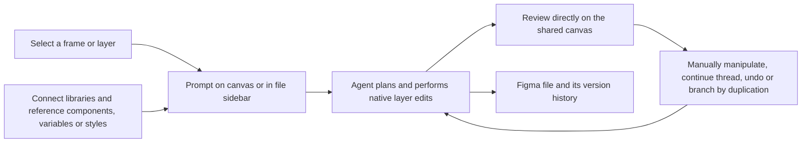
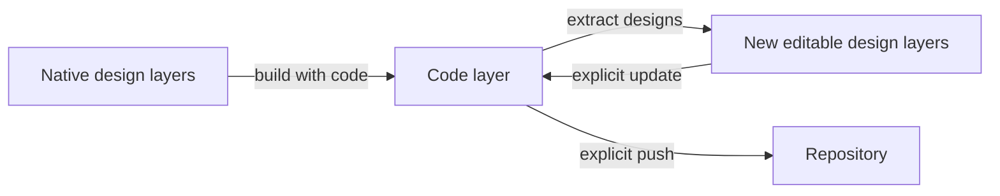

# Figma Design Agent

> Research status: **Architecture-level / closed-source boundary reached** · Last reviewed: **2026-08-11**

| Field | Value |
|---|---|
| Organization / team | Figma; the public surface is the agent embedded in Figma Design |
| Ordinary job | create, inspect, critique and batch-edit native design layers without leaving the shared design file |
| Status | active open beta; rollout began 2026-05-20 on paid Figma plans |
| Product boundary | the agent in Figma Design, not Figma Make and not the external Figma MCP server |
| Working artifact | editable Figma Design layers, components, variables, styles and newer code layers in the shared file |
| Canonical URL | [Figma AI Design Agent](https://www.figma.com/solutions/ai-design-agent/) |
| Source availability | closed source |
| Pinned source revision | N/A — closed source |
| Evidence ceiling | official product contracts establish the native-canvas loop, context, chats, undo and file history; model orchestration, internal graph representation and transaction implementation are undisclosed |

## This agent edits where the design already lives

Figma's defining choice is not merely to show generated imagery on a canvas. The [official product page](https://www.figma.com/solutions/ai-design-agent/) says the agent lives in Figma Design and creates and edits layers using the file's real components, tokens and variables. The [operating guide](https://help.figma.com/hc/en-us/articles/37998629035799-Work-with-the-Figma-agent-in-design-files) starts from a selected layer or the file's Agents sidebar, requires edit access and deposits results in that same file.

The ordinary loop is:

This differs from a hosted code generator whose preview is authoritative only through provider-managed source. Here the AI output is intended for direct manipulation by the same tools and collaborators as ordinary Figma layers.

## Parallel prompts produce branches in space, not a formal merge graph

The help center documents multiple prompts running at once on different frames. Each prompt has a loading marker and a back-and-forth chat; the sidebar collects chats for the file. Figma's launch post frames this as exploring several directions side by side.

The public behavior supports parallel **exploration**, but it does not establish a formal branch object for every agent run:

- a user can duplicate a frame before undo to preserve an alternative;
- separate prompts can act against separate frames concurrently;
- chats have identities, status and recency inside the file;
- the native canvas holds whichever candidate layers the user keeps.

Selection or promotion is therefore spatial and human-mediated unless the user adopts a separate branch/version workflow. Public documentation does not say that every chat maps to an isolated document transaction or mergeable artifact branch.

## Context is a governed subset of the file and its libraries

The agent can use the selected layer, directly referenced design elements and libraries explicitly connected to a chat. Users can mention components, variables and styles with `@`. Figma says the agent may infer appropriate library elements and can apply design-system conventions in bulk.

That context model has an important governance boundary. The product page says generated work may draw from the connected system but the agent does not publish new assets into a shared library autonomously; a person performs that publication step. This keeps generation authority and shared-system publication authority separate.

The June 2026 [custom tools and context update](https://www.figma.com/blog/agent-custom-tools-context-skills/) adds references to other Figma files, reusable skills, generative plugins and shaders. These make the file more legible and executable to the agent, but public material does not disclose the full context serialization, retrieval ranking, token budget or permission-filtering implementation.

## Chats are collaborative state; layers are design state

Figma distinguishes several clocks that must not be collapsed:

| State | Public behavior | Authority boundary |
|---|---|---|
| prompt execution | animated status and completed steps in a chat | transient agent-run state |
| chat thread | messages and follow-up context collected under Agents in the file | collaborative conversation associated with the file |
| native layers | editable frames, text, components, variables and styles produced or changed by the run | working design artifact |
| chat undo | reverts the most recent agent change; ordinary `Cmd/Ctrl+Z` is also documented | operation recovery in the current editing context |
| file version history | autosaved checkpoints plus named, shareable, restorable or duplicable versions | durable Figma file history |

Starting 2026-06-23 new agent chats are visible by default to Full-seat editors of the file, while earlier chats remain private unless shared. This confirms that a chat has its own collaboration policy; it does not make the chat the canonical design artifact.

The separate [file version-history contract](https://help.figma.com/hc/en-us/articles/360038006754-View-a-file-s-version-history) documents automatic checkpoints, named versions, restoration, duplication and version links. It establishes recoverability at the file level. It does not document whether one multi-step agent run is committed as one atomic checkpoint or how concurrent human and agent edits are grouped internally.

## Code layers extend the artifact without replacing native design layers

Figma's June 2026 [code-on-canvas announcement](https://www.figma.com/blog/code-on-the-figma-canvas/) adds interactive React-based code layers to Figma Design. A person can create one, ask the agent to generate one, import a repository or folder, extract a code state into editable design layers and later update the code layer from those edits. The product post also describes pushing source back to a repository.

This creates two authorities inside one collaborative surface:

The arrows are explicit materialization steps rather than evidence of universal live bidirectional synchronization. Figma's launch material also distinguishes the built-in agent from the MCP server: the native agent has deeper Figma and design-system context; MCP/code-to-canvas handles movement between external code and the canvas. This dossier does not merge those separate surfaces into one imaginary mechanism.

## Product boundary and nearby Figma surfaces

| Surface | Decisive job | Why it is not silently merged here |
|---|---|---|
| Figma Design Agent | agent creates and mutates native layers in the shared design file | this dossier's canonical surface |
| Figma Make | separate prompt-to-functional-prototype product and hosted code workspace | already an independent product lineage in this repository |
| Figma MCP server | external agents read design context or move work between code and Figma | a protocol bridge with a different invocation and authority boundary |
| First Draft | earlier AI wireframe/design generation entry | official help says the agent became its new entry point on 2026-05-20; treat as predecessor functionality rather than another current product |
| generative plugins and shaders | tools created through prompting and hosted by Figma | output/tool type inside the broader agent surface |

The verified-sample unit is therefore an independently surfaced agentic workspace within Figma Design, not a claim that every Figma AI feature is one product or that the entire Figma company is one team.

## What the closed boundary does and does not establish

- **Established:** the agent is built into Figma Design; it can create and edit native layers, use connected libraries, run prompts in parallel, retain file-associated chats, undo recent changes and participate in the host file's durable version history.
- **Established:** access is beta and gated by plan, seat, edit permission and rollout; absence in an eligible user's UI is not evidence that the product does not exist.
- **Inference:** because results are directly manipulable native layers and participate in the host file/version system, the Figma file graph is the working design authority rather than a chat-only generated snapshot.
- **Unknown:** internal model routing, plan representation, layer-operation protocol, concurrency control, transaction boundaries, safety checks, rollback implementation and exact context packing.
- **Not tested in this pass:** a signed-in ordinary-user sequence from prompt through parallel edit, library use, undo, named version, restore and code-layer round trip. The beta rollout and account requirements prevent treating public docs as a completed live acceptance test.

## Primary sources

- [Figma AI Design Agent product page](https://www.figma.com/solutions/ai-design-agent/)
- [Work with the Figma agent in design files](https://help.figma.com/hc/en-us/articles/37998629035799-Work-with-the-Figma-agent-in-design-files)
- [Beta access and 2026-05-20 rollout](https://help.figma.com/hc/en-us/articles/34932042346775-How-do-I-access-the-AI-agent-beta-in-Figma-Design)
- [Figma Design Agent launch](https://www.figma.com/blog/the-figma-agent-is-here/)
- [Custom tools, context and skills update](https://www.figma.com/blog/agent-custom-tools-context-skills/)
- [Code on the Figma canvas](https://www.figma.com/blog/code-on-the-figma-canvas/)
- [Figma file version history](https://help.figma.com/hc/en-us/articles/360038006754-View-a-file-s-version-history)

## Research gaps

- Observe a live beta account to distinguish chat-level undo from Figma's global undo stack and autosave checkpoint grouping.
- Test concurrent prompts against overlapping layers and document conflict or cancellation behavior.
- Trace code-layer import, extraction, update and repository push with one real repository to establish identity preservation and failure recovery.
