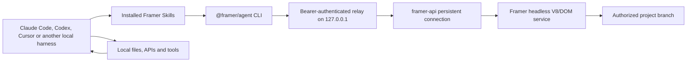

# Framer AI

> Research status: **Architecture-level / closed Agent core with public External Agent boundary inspected** · Last reviewed: **2026-08-11**

| Field | Value |
|---|---|
| Organization / team | Framer B.V. |
| Category | Canvas-native website Agent, hosted site builder and integrated publishing system |
| Status | Active; current Framer 3 Agent/Branching generation launched 2026-06-16 |
| Ordinary working artifact | A hosted Framer project graph containing pages, native canvas nodes, reusable components, styles, code files, CMS/localization content and site configuration |
| Promotion authority | An isolated whole-project branch is reviewed and applied to `main`; `main` is then published, and a selected published version may separately be deployed to a custom domain |
| Current agent surfaces | In-app Agent in the Properties panel; External Agents through `@framer/agent`; model-free automation through the Server API |
| Inspected distributions | `@framer/agent` 0.0.44 and its exact dependency `framer-api` 0.1.29 |
| Source availability | Editor, native Agent harness, branch merge service, project storage and renderer are closed. `@framer/agent` ships readable bundled JavaScript and Skills but declares no license or public source repository. `framer-api` 0.1.29 is MIT and ships readable JavaScript plus extensive declarations. |
| Evidence ceiling | Product behavior, Agent architecture statements, native graph/API contracts, External Agent transport, local adapter implementation, branch/publish/version semantics and public delivery behavior are established. Internal storage schema, model prompts, full edit language, canvas renderer, conflict algorithm and production infrastructure remain closed. |

## The Agent edits a real Framer project, not an exported code draft

The defining product fact is not that Framer can generate a page. It is that generation lands inside the same hosted object graph that a person edits and publishes. The current [Framer AI page](https://www.framer.com/ai/) and [from-scratch workflow](https://www.framer.com/help/articles/how-to-build-a-website-from-scratch-with-framer-agents/) say Agent output behaves like ordinary Framer content: text, layout, colors, images and spacing remain editable on the canvas, and the result is a normal publishable Framer page.

That makes the hosted project—not a prompt transcript, screenshot, JSX export or published URL—the working artifact. A correct journey has several explicit promotion gates:

```mermaid
flowchart LR
    I["Brief, current project, selected section and references"] --> B["Whole-project branch"]
    B --> A["Agent and human edit native project graph"]
    A --> M["Inspect message changes, canvas and responsive behavior"]
    M --> R["Review branch changes"]
    R -->|Apply| P["main project"]
    R -->|Discard or keep draft| B
    P --> U["Publish main"]
    U --> V["Immutable published version link"]
    V --> S["Base-domain staging"]
    S --> D["Deploy selected version to custom domain"]
    D --> J["Verify the real visitor journey"]
```

Four states that look similar in the editor are therefore not interchangeable:

1. an Agent has finished responding;
2. its native canvas changes look right on a branch;
3. the branch has been applied to `main`;
4. a published version has been deployed to the visitor-facing domain.

Only the last state is delivery, and even it still needs ordinary interaction, content, responsive, accessibility and integration validation.

## The ordinary-user journey is branch-first and release-explicit

The public Agent, Branching and publishing documentation supports this end-to-end path:

| Stage | Ordinary action | Authority actually advanced | Evidence before continuing |
|---|---|---|---|
| 1. Choose the base | open the intended project and confirm `main`, or create a named branch for the task | branch ancestry and active-project identity | project URL/name, active branch and intended base are unambiguous |
| 2. Scope the work | open Agent in the right Properties panel, select the exact section when appropriate, and attach screenshots, assets or a live interaction URL | prompt/session context; no durable design change yet | selected region and page match the request; a live URL is reference context, not an import binding |
| 3. Generate or edit | ask for one bounded section or structured update | native page/component/style/CMS/code resources on the active branch | the Agent produced actual graph changes rather than only advice or a completion message |
| 4. Inspect and refine | review the canvas, Agent change/debug information and responsive breakpoints; edit directly or continue the same session | newer branch state and, for the in-app Agent, a message-level rollback point | intended nodes changed, unrelated areas did not, and required components/styles were reused rather than duplicated |
| 5. Exercise behavior | preview links, overlays, forms, CMS detail pages, code components and narrow/wide layouts | runtime observation of the branch projection | the real flow works; screenshots and the Agent linter are supporting evidence rather than acceptance |
| 6. Review the branch | optionally publish a branch preview URL, then open **Review Changes** | reviewable whole-project diff; branch preview deployment if published | changed pages, CMS entries, code files, styles and settings are all expected; overlapping work is resolved consciously |
| 7. Apply | apply the branch to `main` | reviewed project authority | `main` contains the intended changes; this action still has not changed the live site |
| 8. Publish | inspect **View Changes** and optimization issues, then publish `main` | a new published deployment/version; base domain updates according to staging configuration | deployment reaches a ready state, warnings are inspected and the exact version URL is recorded |
| 9. Promote and verify | when staging is enabled, deploy the chosen version to the custom domain | visitor-facing domain pointer | domain serves the expected version and the ordinary visitor journey succeeds in supported browsers/devices |

[Branching documentation](https://www.framer.com/help/articles/how-to-use-branches-in-framer/) is unusually explicit about the middle gates: a branch is an isolated copy of the **entire project**, a branch preview does not affect `main` or the live site, and applying a branch updates `main` without publishing it. [Publishing documentation](https://www.framer.com/help/articles/publishing-your-framer-website/) adds another check: a deployment can expose optimization problems such as nested links or code errors, so a nominal Publish action is not proof of a healthy release.

## One project graph federates several native resource families

Framer does not publish its storage schema. The MIT [`framer-api` 0.1.29 declarations](https://unpkg.com/framer-api@0.1.29/dist/index.d.ts) do expose a supported projection of the artifact, however. It includes `WebPageNode`, `DesignPageNode`, `FrameNode`, `TextNode`, `SVGNode`, `ComponentNode`, `ComponentInstanceNode`, code files and their versions, CMS collections/items/fields, localization groups, assets, color/text styles, branches and deployments.

That public type surface is evidence for addressable resource families, not evidence that Framer stores those exact TypeScript objects internally:

| Resource family | Public identity / behavior | Durable role | Important boundary |
|---|---|---|---|
| web and design pages | opaque page/node ids, paths and nested native nodes | primary visual/site structure inside a project branch | public API projection is not the private persistence schema |
| layout and content nodes | canonical node ids plus type-specific traits, children, dimensions, styles, links and component references | direct-manipulation and Agent mutation targets | published DOM identity is not documented as a durable reverse pointer to these ids |
| components and templates | reusable native components, instances, variants, controls and layout templates | maintainable design-system structure within the project | flattening or localizing a component can deliberately fork reusable identity |
| code files | file id/name, source content, exports and `versionId`; setting content creates a new code-file version | hosted React code-component and override source | it is Framer-hosted source, not a checked-out application repository |
| CMS and localization | collections, fields, items, locales and per-source localized values | structured site content that branches and publishes with the project | upstream CSV/API/database state remains a separate authority unless a sync workflow is maintained |
| styles, variables and assets | native project resources referenced by nodes | reusable visual and media system | an attached image or local token file has no automatic revision-pinned provenance after ingestion |
| branch | branch id, title, URL, base, contributors and semantic changed-resource summaries | isolated whole-project work line | branch objects returned by the API are snapshots and need refetching after operations |
| deployment | deployment id, status, version URL, hostnames and optional publish/optimization failure stage | published build/version evidence | initial Publish return does not wait for optimization; `ready` may still carry warnings |

The branch change contract can summarize pages, collections and items, design pages, settings, components, templates, vector sets, code files, styles and localization. This breadth explains why a branch is the useful trust boundary: Agent work can cross far more than canvas pixels.

## The native Agent is a graph editor with a visual feedback loop

Framer's engineering account, [Building Agents for Framer](https://www.framer.com/blog/building-framer-agents/), exposes more mechanism than the product slogan:

- the Agent reads the current project tree and existing layout, style and color patterns;
- verbose tree state is compressed by shortening property names and omitting defaults;
- Framer created a compact language for expressing the tree and its edits rather than repeatedly sending full HTML-like JSON;
- the model makes many small edits, which lets the in-app canvas stream progress instead of receiving one final replacement;
- structured tasks can query and update the project tree with background JavaScript;
- layout rectangles report where elements landed;
- a deterministic linter checks hard rules across layout, type, contrast and accessibility;
- an on-demand server-side browser render supplies pixels when geometry and rules are insufficient;
- a skill system dynamically loads detailed task guidance;
- nightly repeated evals and sampled-session analysis test harness, prompt, skill and tool changes rather than treating a few attractive runs as proof.

The public Server API does not expose the private in-app prompt or prove that its syntax is byte-for-byte identical. It does expose a closely aligned Agent namespace. `framer.agent.applyChanges(dsl, { pagePath })` creates, updates, removes, moves or duplicates nodes on one page and returns canonical ids for newly created nodes. Read helpers retrieve nodes, ancestors, top-level ground nodes, measured rectangles, referenced styles/tokens and bounded serializations. This is a native graph mutation interface, not browser mouse automation.

The feedback loop remains fallible. Framer says the browser-pixel path is slower and invoked only when requested, while model inference can stall or fail despite provider switching and retry logic. The [July efficiency engineering note](https://www.framer.com/blog/making-the-framer-agent-cheaper-faster/) also reveals that bulk updates return diagnostics immediately and that detailed node data is now fetched only when needed. A concise diagnostic can steer another edit; it is not an independent user-journey test.

## Selection stays inside native project identity

The in-app [Agent workflow](https://www.framer.com/help/articles/how-to-use-agents/) recommends selecting a section before the next prompt. This activates the context tool and scopes attention to that area. The public API makes the corresponding identity explicit:

- `selectionNodeIds` can be attached to an Agent turn;
- `pagePath` chooses the page scope;
- `getScopeNode`, `getGroundNode`, parents and ancestors recover native containment;
- `applyChanges` returns canonical system ids;
- code files have their own ids and version ids.

This is strong **native-document target identity**. It is not a mapping from a rendered website element to an external repository file, line, AST node or Git revision. The Agent never needs such a return path for ordinary visual work because its source of truth is already the Framer graph. When local CSV, JSON, token or translation files condition an External Agent task, the public contract does not preserve a live reverse binding from resulting Framer nodes back to those files. A later local-file change therefore needs another deliberate comparison/sync.

The same boundary applies to published output. Framer documents pre-rendered HTML and React delivery, but no public contract promises that a DOM node on a version URL carries a stable project node id that an external tool can use to patch the project. Native canvas targeting and published-DOM source return are different claims.

## In-app, External Agent and raw Server API are three control paths

Framer exposes related capabilities through three surfaces, but their context and safety behavior differ:

| Surface | Entry and execution | Context advantage | Mutation / promotion behavior | Material limitation |
|---|---|---|---|---|
| in-app Agent | Properties-panel conversation inside the open editor | rich current-canvas context, selection tool and real-time streamed small edits | edits the active branch/project; every Agent message has rollback according to the engineering post | consumes Framer AI credits; internal prompts, exact tools and rollback storage are closed |
| External Agent | local harness invokes installed Skills and `@framer/agent` CLI, which reaches the hosted project through the Server API | combines Framer resources with local files, scripts, APIs and the user's chosen model | package README says External Agent changes automatically occur on a branch; the Agent may publish only through the explicit supported flow and permissions | no in-app streaming and, without an open canvas, less rich canvas context; updates arrive in larger blocks and prompts need tighter scope |
| raw Server API | user-authored JavaScript connects with `framer-api` and a project API key | deterministic programmatic access without an editor or model | acts through Plugin-like methods on the active project/branch and can publish/deploy when permitted | not automatically an AI workflow and explicitly non-transactional; the script owns error handling, branch choice and review policy |

The [External Agent setup article](https://www.framer.com/help/articles/use-external-agents-with-framer/) correctly says no separate MCP server is required. The package installs Agent Skills and uses a purpose-built CLI/Server API path. Framer's engineering post says External Agents receive the same Framer Agent capabilities, but also records two UX losses: Framer cannot hook into the local model's streaming, and a closed canvas cannot provide the same rich visual context.

Public capability statements are currently inconsistent at one edge. The 0.0.44 Skill advertises analytics and `framer-api` declares `queryAnalytics`, while the help article updated 2026-08-07 says External Agents cannot currently access analytics. The safe ordinary-user conclusion is that analytics is permission/surface gated and must not be promised for an External Agent until a live authorized project proves it. The same article excludes some project/domain settings and assigning overrides even though lower-level API families are broader.

## The External Agent adapter is locally inspectable

The current package establishes a concrete transport and persistence boundary:

Static inspection of [`dist/cli.js`](https://unpkg.com/@framer/agent@0.0.44/dist/cli.js), [`dist/start-relay-server.js`](https://unpkg.com/@framer/agent@0.0.44/dist/start-relay-server.js) and the bundled [`framer` Skill](https://unpkg.com/@framer/agent@0.0.44/skills/framer/SKILL.md) establishes the following:

1. `setup` renders Skills into `~/.agents/skills` and `~/.claude/skills`.
2. first project use opens a Framer browser authorization flow; an ephemeral loopback callback validates a random `state` and receives a project API key.
3. project credentials are cached in platform configuration (`%APPDATA%\framer\projects.json` on Windows, XDG/macOS equivalents elsewhere). The file is plain JSON; POSIX writes request mode `0600`, while Windows protection remains the host account/ACL's responsibility.
4. the CLI starts a background relay bound only to `127.0.0.1`, validates the exact loopback Host header and a random bearer token, and stores that relay token in the same configuration area.
5. a `session new` call opens one Server API connection, generates a project-specific inventory and prompt bundle under the installed Skill, and returns a small local session id. Reusing the id preserves the local `state` object and avoids creating unnecessary new auto-branches.
6. the generated inventory is a dated snapshot of pages, components, CMS data, styles, fonts, icons and available ids. It helps orientation but can stale; live node reads remain necessary after concurrent changes.
7. `exec` evaluates JavaScript in a local Node `vm` context with `framer`, per-session `state`, `fetch`, timers and a small allowlist of built-in modules. Filesystem calls are realpath-confined to the supplied working directory and temporary directories; symlink escape is rejected. `child_process` and arbitrary installed modules are not exposed, but outbound `fetch` is.
8. local execution has a ten-minute outer timeout. The connection idles closed after 60 seconds and reconnects to the expected branch when possible; relay process state itself is in memory and disappears on restart.
9. the relay watches active-branch changes and emits `[FRAMER_BRANCH_CHANGE]`. The visible local code does not implement auto-branch creation, so that policy remains in the closed Server API/Agent service.
10. telemetry is enabled by default, sends operational events to Framer and can be disabled with the packaged command.

This local `vm` boundary is adapter-level containment, not an operating-system sandbox for the user's chosen coding agent. The local harness may already have much broader file, command, email or API access—the exact reason Framer gives for using it. Framer project authorization constrains the hosted project connection; it does not undo or contain effects the external harness performs elsewhere.

The remote Server API has a different execution boundary. Its [FAQ](https://www.framer.com/developers/server-api-faq) says project code runs in a server-side V8 sandbox with a full DOM API and communicates over a persistent WebSocket. Cold starts and warm reconnection are part of that service. The npm client and local relay are therefore not the project renderer or storage engine; they are control adapters to a closed hosted runtime.

## Branch isolation does not make a multi-operation edit atomic

The most consequential public failure contract is easy to miss:

- the Server API FAQ says it is **not transactional** and scripts can fail after partial writes;
- `framer.agent.applyChanges` says failed commands, including syntax errors, are returned in `errors` **without blocking remaining commands**;
- branch application can encounter overlapping changes that require a human choice;
- a branch rollback or discard cannot reverse local-file writes, external API calls, emails, scheduled jobs or other side effects made by an External Agent;
- publishing and deployment are later operations with their own failure states.

Branching contains partial project mutations away from `main`; it does not turn them into all-or-nothing transactions. Safe bulk work therefore needs a read/plan/apply/read-back loop, exact ids, idempotent matching keys for CMS data, explicit handling of every returned error and a branch review before promotion.

The public Branch API adds useful precision:

- branch instances are snapshots and must be fetched again after mutation;
- semantic change summaries identify changed/removed resources but are not a full serializable project diff;
- nested branches are supported;
- merging switches to the compatible target but does not publish it;
- deleting the active branch switches to its base;
- published branch content can technically be deployed to a custom domain through the generic API, which the declarations warn should happen only intentionally.

## Recovery is a stack of non-equivalent clocks

Framer exposes several recovery and persistence mechanisms. None rewinds the complete system:

| Clock | Persistence / promotion semantics | What it does not rewind or prove |
|---|---|---|
| Agent turn | in-app engineering post promises rollback on every Agent message | public evidence does not define storage duration, granularity for concurrent human edits or equivalence for External Agent script calls |
| external local session | relay memory retains `state`, active connection and expected branch; generated inventory persists on disk | relay restart destroys session state; inventory can stale and is not a project backup |
| code-file version | every `CodeFile.setFileContent` creates a version retrievable through `getVersions` | does not restore canvas/CMS/settings/branch/deployment as one unit |
| project branch | isolated copy of the entire project with review/apply/revert workflows | merge conflicts need human resolution; external side effects and published domains are outside the branch rewind |
| `main` | reviewed editable project and normal source for live publication | applying to `main` is not delivery and does not select a published version for a domain |
| file Version History | view-only automatic snapshots every five minutes for four hours, hourly for 24 hours, then daily | [recovery is copy/paste into the current canvas](https://www.framer.com/help/articles/how-can-i-revert-to-a-previous-working-version-of-my-file/), not a documented whole-project rewind |
| branch preview deployment | shareable version of branch content | does not change `main` or the live site |
| published version | each Publish creates a static version link tied to publisher/time/status | a version can have optimization warnings and does not by itself prove visitor behavior |
| base/staging domain | normally follows the latest publish and can act as staged preview when a custom domain is connected | is a mutable pointer, not an immutable artifact id |
| custom/live domain | points to the explicitly deployed version when staging is enabled | rollback changes the delivery pointer, not editable project, Agent history or external systems |
| analytics and external data | continue advancing from visitors, CMS sources and outside APIs | design/branch/version restore cannot reconstruct or retract those observations and effects |

This is why “revert” must be qualified. Reverting an applied branch moves its changes out of `main` and back to draft. Recovering older file content copies selected elements forward. Rolling back production repoints a domain to a published version. They solve different failures.

## Publishing produces a React delivery projection with its own evidence

Framer's [AI-readable-site documentation](https://www.framer.com/help/articles/make-site-readable-by-ai-agents/) establishes that published sites are built with React but each page is pre-rendered to HTML on Framer's servers. Non-JavaScript crawlers receive text, semantic HTML, metadata and structured data. Optimized pages also support content negotiation with `Accept: text/markdown` or the `?md` query parameter.

That public rendering edge is useful but bounded:

- code components still need to be SSR-compatible, which the Agent is explicitly trained to enforce;
- client interactions, forms, overlays and custom components require runtime exercise beyond static HTML;
- markdown is unavailable for non-optimized pages and can disappear under rate limiting;
- Framer does not publish the canvas renderer, bundler graph, hydration scheduler, CDN topology or project-to-production compiler;
- an Agent's server-side pixel render is design feedback, while the version URL is the actual delivery candidate.

The generic API's publish contract is also asynchronous. `publish()` returns an initial deployment snapshot without waiting for optimization. Status can be `pending`, `optimizing`, `ready` or `failed`; failure can occur during publish or optimization; a ready deployment can still expose warning issues. A robust Agent release flow therefore needs the preview/confirm/publish distinction, deployment polling, issue inspection and a final request against the intended domain/version.

[Staging and Versions](https://www.framer.com/help/articles/staging-and-versions/) makes the final pointer model explicit. Every Publish creates a version; version links remain pinned after later publishes. With staging enabled, the base domain can follow the latest version while the custom domain stays on an earlier selected version until Deploy. This separation is a safety feature only if the team records which version it actually tested.

## Failure and recovery map

| Failure boundary | Observable result | Safest interpretation and recovery |
|---|---|---|
| broad or subjective prompt | attractive but unrelated sections/styles also change | select the exact section, work one section at a time and inspect the semantic branch change list plus canvas |
| stale or unloaded selection id | Agent cannot find the node or scopes incorrectly | re-read the live page tree/selection in the same session; do not reuse an old generated inventory blindly |
| one DSL command fails | later commands can still succeed, leaving a mixed partial result | inspect the complete `errors` result, read back each intended resource and repair idempotently on the branch |
| raw Server API script throws midway | earlier CMS/node/code writes remain | catch per-operation failures, preserve a reconciliation log and discard/rebuild the isolated branch when simpler |
| model stalls or provider is unavailable | incomplete turn, retry or provider switch interrupts flow | verify actual project changes before retrying; a new completion can duplicate earlier partial work |
| several people/Agents touch the same content | branch application reports overlap or silently needs a keep-choice | compare branch changes against current base and choose manually; do not infer Git-style text merge semantics |
| replacement External Agent session | another automatic branch may appear and local `state` is empty | reuse the original session id for follow-ups; if replaced, enumerate branches and identify the actual mutation line before editing |
| relay restart or 60-second connection idle | session id expires/disconnects; reconnect may be needed | create/reconnect a session, confirm expected branch and refresh generated project context before mutation |
| cached API key is revoked | authorization error and local cache removal | rerun browser grant for the exact project; treat `%APPDATA%\framer\projects.json` as a secret-bearing file |
| External Agent asks for unsupported analytics/domain/override work | declared method may exist but permission/current product surface rejects it | prefer the current help-center limitation and perform a live read-only permission probe before promising capability |
| branch preview is approved as “live” | stakeholder sees correct URL while `main` and production remain unchanged | record hostname type/version, apply to `main`, publish and then verify the real custom domain |
| Apply is mistaken for Publish | `main` changes but visitors see the old version | inspect unpublished changes and create a deployment deliberately |
| Publish returns before optimization | deployment later fails or remains warning-bearing | poll deployment status, read issues, fix nested links/code errors and publish a new version if necessary |
| file Version History treated as full restore | copied section returns but CMS/settings/code/other pages stay newer | inventory every affected authority; use branch/published-version recovery for their respective layers |
| External Agent calls outside APIs or edits local files | Framer branch discard leaves those effects intact | design compensating/idempotent operations and retain an external audit log; Framer rollback is not distributed rollback |
| markdown endpoint is used as release acceptance | static content looks correct while interaction is broken, or markdown is missing | verify HTML and real browser flows on the exact version; optimized markdown is an additional delivery projection only |

## Distribution evidence stops at the adapter boundary

The current release surfaces have different legal and evidentiary weight:

| Surface at 2026-08-11 | Pinned evidence | What it establishes |
|---|---|---|
| Framer editor, Agent, branches and hosting | current official help, product, engineering and changelog pages | behavior and selected architecture claims; no source implementation |
| `@framer/agent` | npm 0.0.44, published 2026-08-05; package `gitHead` `3746a1d1193656ff96b31312cc3e38b7c662a7ba`; tarball SHA-256 `ec3a687d4ac6667578d5ea6519b796c20203b74de5357d48dd10df4b7226b390`; npm integrity `sha512-ipKeHhds5a3UxksQC4YAyoEu+hlnM2hYKQ9+QTBJT50abjjsujphg/IsXNmQkrkjxJWnRtOK/GFW6XdvGuw2zg==` | readable local CLI, relay and Skills implementation; package has no declared license, license file or public source URL, so it is auditable distribution code rather than established open source |
| `framer-api` | stable npm 0.1.29, published 2026-08-05; MIT; package `gitHead` `6690eca63f9be1a3a5f52e197769ad8aeb868b20`; tarball SHA-256 `e1544332a84645d237c7d3b970c53d137655b7c8f5951e40ff03d0561028e35c`; npm integrity `sha512-LRWUT7P/QmyriCJiReH5vCdyLZCIsy9DgTtQ2jldoVsYsaXt4QtPV5jBHPNRmbvGCAkQmFfQXrH0fKTxjbWmQA==` | public client transport, Plugin/Agent API classes and exact type contracts; hosted method handlers and persistence remain closed |
| `framer/server-api-examples` | public repository pinned at `383b4585d0fdb8607149c71f685a4908a2115595`; no repository license detected | source examples for connection, CMS/REST wrapping and separate publish/deploy; not the Server API implementation and currently pinned to older package generations |

`@framer/agent` began publishing on 2026-06-09 and its launch-day 0.0.33 distribution still carried static skill documents. Version 0.0.44 has installable `SKILL.md` packages, generated per-project inventories, a bearer-protected local relay, reconnect/branch monitoring and an exact `framer-api` 0.1.29 dependency. There is no public package changelog or source history tying each bundled change to a reviewable repository commit, so npm publish timestamps, integrity values and distributed bytes—not the opaque `gitHead` alone—are the reproducible evidence.

The stable `framer-api` tag remains 0.1.29 even though an `0.1.30-alpha.0` was published on 2026-08-10. The External Agent's exact dependency keeps the ordinary inspected path on 0.1.29; an alpha package should not be substituted when describing current user behavior.

## The product evolved from generators into a general project Agent

| Date | Public transition | Architectural consequence |
|---|---|---|
| 2023-06 | Framer's June update already references the earlier **Start with AI** entry point | prompt generation existed, but this evidence alone does not establish the current branch-native Agent architecture |
| 2023-10 | AI Localization shipped with structured text/image/CMS-aware translation | AI began operating on native site semantics beyond initial layout generation |
| 2025-05-21 | [Wireframer](https://www.framer.com/updates/wireframer) generated responsive structure-first layouts directly into the Canvas | generation ended in editable native pages rather than a detached wireframe export |
| 2025-05-21 | [Workshop](https://www.framer.com/updates/workshop) generated working code components with property controls | conversational generation gained a hosted code-file/component artifact path |
| 2025-07-01 | Workshop added Claude 4 and image attachment support | model and visual-context iteration became explicit, while component generation remained a specialized surface |
| 2026-02-12 | [Server API](https://www.framer.com/updates/server-api) launched in open beta over stateful WebSockets | project graph, CMS, settings and publishing became available without an open editor, enabling automation and later External Agents |
| 2026-06-16 | [Framer 3](https://www.framer.com/blog/framer-3/) launched general Agents, Branching and External Agents | layout generation, editing, components, code, CMS, audits, analytics and publishing became one branch-aware project workflow |
| 2026-07-09 | [CanvasBench 0.1](https://www.framer.com/canvasbench/) published 236 internal canvas challenges | Framer exposed a quality/efficiency evaluation surface, though not fixtures, harness source or independent reproducibility |
| 2026-07-21 | Agent diagnostics, caching and step efficiency were revised | tool results became denser and unintended-side-effect feedback moved closer to each bulk update |
| 2026-07-29 | [July Agent update](https://www.framer.com/updates/july-update-2026) added page effects, accessibility attributes, richer interaction and CMS/code support | mutation coverage widened after launch, so static June capability matrices are already incomplete |
| 2026-08-05 | `@framer/agent` 0.0.44 and `framer-api` 0.1.29 published | current inspected External Agent and Server API client boundary |

Wireframer and Workshop should therefore be read as lineage inside the current Framer AI surface, not as the whole 2026 product. The decisive current mechanism is a general Agent operating over a branchable production project graph.

## What remains unknown

The following cannot be concluded from the public product, API declarations or distributed adapters:

- the canonical on-disk/database serialization of a Framer project and its migration rules;
- whether in-app and External Agent requests use exactly the same prompt, DSL, tool graph or model-routing policy at a given moment;
- the complete Agent message rollback algorithm, retention and treatment of concurrent human edits;
- the server-side auto-branch trigger, idempotency key and behavior after a network loss during first mutation;
- full `applyChanges` grammar, validation order and atomicity within any single successful command;
- the branch merge/rebase/conflict algorithm below semantic change summaries;
- a stable published-DOM-to-native-node reverse mapping;
- the canvas renderer, server pixel-render implementation, build compiler, hydration and hosting topology;
- exact authorization scopes and permission changes across plans for every External Agent/API method;
- retention of Agent prompts, debug traces, attached assets and generated inventory beyond the published privacy statement;
- whether all project resource families, CMS side effects and code-file versions are captured at the same logical instant by branches or file Version History;
- an export that losslessly recreates the complete native project, branch graph, comments, Agent history, CMS/settings and delivery configuration outside Framer.

These are evidence gaps, not invitations to substitute the Plugin API, npm adapter or published React output for the closed core.

## Primary sources

### Current product and Agent behavior

- [Framer AI](https://www.framer.com/ai/)
- [Introducing Framer 3.0 with Agents, Branching, and a new Community](https://www.framer.com/blog/framer-3/)
- [Building Agents for Framer](https://www.framer.com/blog/building-framer-agents/)
- [How to use Agents](https://www.framer.com/help/articles/how-to-use-agents/)
- [How to build a website from scratch with Framer Agents](https://www.framer.com/help/articles/how-to-build-a-website-from-scratch-with-framer-agents/)
- [Use external agents with Framer](https://www.framer.com/help/articles/use-external-agents-with-framer/)
- [What you can do with External Agents](https://www.framer.com/help/articles/what-you-can-do-with-local-agents/)
- [Making the Framer Agent cheaper and faster](https://www.framer.com/blog/making-the-framer-agent-cheaper-faster/)
- [CanvasBench](https://www.framer.com/canvasbench/)

### Branching, persistence and delivery

- [How to use branches in Framer](https://www.framer.com/help/articles/how-to-use-branches-in-framer/)
- [Publishing your Framer website](https://www.framer.com/help/articles/publishing-your-framer-website/)
- [Staging and versions](https://www.framer.com/help/articles/staging-and-versions/)
- [Recovering content through file Version History](https://www.framer.com/help/articles/how-can-i-revert-to-a-previous-working-version-of-my-file/)
- [Make your site readable by AI agents](https://www.framer.com/help/articles/make-site-readable-by-ai-agents/)

### Public API and distributed implementation boundary

- [Server API introduction](https://www.framer.com/developers/server-api-introduction)
- [Server API quick start](https://www.framer.com/developers/server-api-quick-start)
- [Server API FAQ](https://www.framer.com/developers/server-api-faq)
- [`@framer/agent` 0.0.44 package](https://www.npmjs.com/package/@framer/agent/v/0.0.44)
- [`@framer/agent` 0.0.44 manifest](https://unpkg.com/@framer/agent@0.0.44/package.json)
- [`@framer/agent` 0.0.44 CLI bundle](https://unpkg.com/@framer/agent@0.0.44/dist/cli.js)
- [`@framer/agent` 0.0.44 relay bundle](https://unpkg.com/@framer/agent@0.0.44/dist/start-relay-server.js)
- [`@framer/agent` 0.0.44 Framer Skill](https://unpkg.com/@framer/agent@0.0.44/skills/framer/SKILL.md)
- [`framer-api` 0.1.29 package](https://www.npmjs.com/package/framer-api/v/0.1.29)
- [`framer-api` 0.1.29 declarations](https://unpkg.com/framer-api@0.1.29/dist/index.d.ts)
- [`framer-api` 0.1.29 implementation](https://unpkg.com/framer-api@0.1.29/dist/index.js)
- [`framer/server-api-examples` at `383b4585d0fdb8607149c71f685a4908a2115595`](https://github.com/framer/server-api-examples/tree/383b4585d0fdb8607149c71f685a4908a2115595)

### Product lineage

- [Wireframer](https://www.framer.com/updates/wireframer)
- [Workshop](https://www.framer.com/updates/workshop)
- [Workshop: Claude 4.0](https://www.framer.com/updates/workshop-plugins-june-2025)
- [Server API launch](https://www.framer.com/updates/server-api)
- [July 2026 Agent update](https://www.framer.com/updates/july-update-2026)
- [Agents efficiency update](https://www.framer.com/updates/agent-credit-usage)
