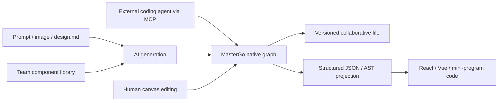

# MasterGo AI

> Research status: **Architecture-level** · Last reviewed: **2026-08-11**

| Field | Value |
|---|---|
| Team | Beijing Chuangzuo Meihao Technology / MasterGo · China |
| Ordinary job | generate production-aligned interface work from intent or references and continue it as editable MasterGo design-system content |
| Native authority | MasterGo file with vector layers, components, styles and history |
| Agent surfaces | in-canvas Design Assistant, AI 快搭 generation and external MCP control |

## The differentiator is governed generation

MasterGo AI can generate a whole interface, a component or a page framework from natural language, reference images or `design.md`. The result can be inserted into the MasterGo canvas as editable vector layers and components. For enterprise use, generation can call an existing team library so the output uses approved components, styles and icons rather than imitating their appearance.

That constraint makes system governance the primary Design definition for this record. The agent is not only creating pixels; it is operating inside a reusable design identity that subsequent human and AI edits must preserve.

## Three entry points converge on one native graph

| Surface | Input and operation | Authority consequence |
|---|---|---|
| AI 快搭 | prompt, image or `design.md` generates UI and front-end code | generated UI can be promoted into editable native layers |
| AI 设计助手 | agent directly calls canvas-editing capabilities | current MasterGo file is mutated in place |
| MCP | coding tools create or modify layers and read structured layout | external agent reaches the same host-owned graph |

The Design Assistant also offers Agent and Chat modes. Only Agent mode has direct editing capabilities; advice in Chat mode is not artifact mutation. Its setting can allow tools to run automatically, which changes the confirmation policy but not the host authority.

## Code is a materialized projection

First-party material describes a higher-level JSON representation and one AST kernel that can target React, Vue and mini-program stacks while mapping design tokens, component libraries and layer metadata. This is public product architecture, not public implementation source. Generated code is classified as a projection from the design graph; the evidence does not establish a lossless reverse update from arbitrary code edits.

## Persistence and evidence ceiling

MasterGo's standard file layer provides cloud storage, collaboration and history, and the AI result becomes normal file content after insertion. Agent conversation history is scoped to the current file and private to the user. Public documents do not expose graph schemas, MCP transaction boundaries, rollback behavior for multi-operation agent runs or source-map fidelity.

## Team evidence

The current service agreement identifies the provider and a Beijing address. This supports a China team-region classification without inferring geography from the Chinese product language.

## Primary evidence

- [MasterGo AI product and architecture claims](https://mastergo.com/ai)
- [AI Design Assistant help](https://mastergo.com/help/AI/Agent)
- [MasterGo file and native-canvas model](https://mastergo.com/help/get-started/get-started)
- [Provider and Beijing address](https://mastergo.com/serviceAgreement)
