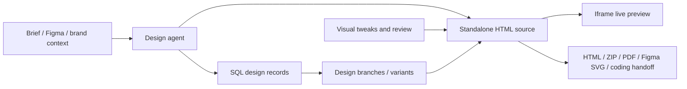

# Agent-Native Design

> Research status: **Source-level** · Last reviewed: **2026-08-11**

| Field | Value |
|---|---|
| Team | Builder.io Agent-Native project |
| Ordinary job | generate several interactive product or brand directions, refine the selected prototype visually or conversationally and export owned source |
| Canonical artifact | self-contained Alpine/Tailwind HTML plus SQL-backed design/project records |
| Preview contract | the iframe, editable source and exports read the same prototype files |
| Pinned source | [`16977942293d8f6953722e2f496847def4883f40`](https://github.com/BuilderIO/agent-native/tree/16977942293d8f6953722e2f496847def4883f40) |

## It is a cloneable application, not only a framework demo

Agent-Native is a general framework, but its `templates/design/` tree is a complete Design application with its own actions, data model, skills, editor bridge and documentation. A user can scaffold it with the Design template, run it locally or deploy it, and then modify the application itself. The census counts that surfaced application once; it does not count every Agent-Native app or every copy created from the template.

The agent generates standalone Alpine/Tailwind prototypes. The same files feed the preview and export paths, avoiding a hidden conversion from a proprietary canvas into “approximately matching” code.

## Branches make alternatives explicit

The template includes actions to create, duplicate, edit and delete designs and to create design branches. Variants can be compared before one direction is continued. Visual tweak actions, source edits, component operations, breakpoints, motion and shader changes all converge on the prototype state rather than producing untracked screenshots.

## One action contract crosses UI and agent surfaces

The parent framework's central mechanism is an action that can be invoked from UI, agent, HTTP, MCP, A2A or CLI. The Design template defines concrete actions such as creating a design, applying visual/source/token edits, capturing design state, creating branches, running quality fixes and exporting a coding handoff. Human approval and audit facilities come from the framework layer.

That shared contract reduces drift between a button and the agent tool that performs the same job. It does not imply that every free-form source rewrite is reversible. Some actions touch files or multiple database records and need acceptance at both data and rendered levels.

## Source location bridges visual intent back to code

Generated editor-bridge modules cover hit testing, source locations, tweak controls, motion previews and navigation. A selected runtime element can therefore carry enough context for a visual edit action to target source. The strongest evidence is the paired action tests for local-file and interleaved mutation paths, not the “open-source Figma” metaphor on the marketing page.

## Evidence map

| Pinned path | Evidence |
|---|---|
| `templates/design/actions/` | exact application operations and tests |
| `templates/design/actions/create-design-branch.ts` | candidate isolation in project data |
| `templates/design/actions/apply-visual-edit.ts` | visual-intent-to-source path |
| `templates/design/.generated/bridge/` | runtime hit-test and source-location projection |
| `templates/design/.agents/skills/design-generation/` | agent authoring contract |
| `templates/design/actions/export-coding-handoff.ts` | delivery to an implementation workflow |
| `packages/core/docs/content/template-design*.mdx` | ordinary-user contract and known boundaries |

## Distinction from Builder.io Fusion

Fusion is a separately surfaced Builder.io product focused on visually editing a connected application/codebase. Agent-Native Design is an open, cloneable agent application centered on self-contained prototype artifacts and SQL records. Shared organization and some conceptual overlap do not make their ordinary projects, persistence or release lineages the same.

## Primary evidence

- [Pinned repository](https://github.com/BuilderIO/agent-native/tree/16977942293d8f6953722e2f496847def4883f40)
- [Official Design application page](https://www.agent-native.com/apps/design/)
- [Official Design documentation](https://www.agent-native.com/docs/template-design/)
- [Pinned Design template](https://github.com/BuilderIO/agent-native/tree/16977942293d8f6953722e2f496847def4883f40/templates/design)
