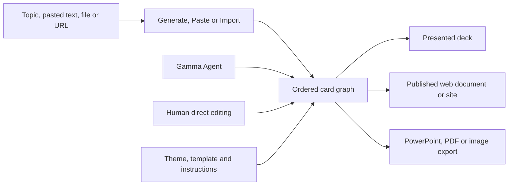

# Gamma

> Research status: **Architecture-level / closed-source boundary reached** · Last reviewed: **2026-08-11**

| Field | Value |
|---|---|
| Organization / team | Gamma; official team page describes a San Francisco-based product team |
| Ordinary job | turn a topic, source text, file or URL into a structured deck, document or site and keep refining the same card-based artifact with AI and direct editing |
| Status | active; current help center documents Gamma Agent, cards, collaboration and version history |
| Canonical artifact | a hosted Gamma made of ordered structured cards plus theme, sharing and publication state |
| Canonical URL | [gamma.app](https://gamma.app/) |
| Documentation | [Gamma Help Center](https://help.gamma.app/en/) |
| Source availability | closed source |
| Pinned source revision | N/A — closed source |
| Evidence ceiling | official help establishes the card graph, AI/manual mutation, template context, recovery and delivery surfaces; renderer, operation protocol, storage schema and model orchestration are private |

## A card graph is simultaneously deck, document and webpage

Gamma does not make a traditional fixed-size slide the only authority. Its [card contract](https://help.gamma.app/en/articles/11016396-what-are-cards-in-gamma-and-how-do-they-work) calls cards the fundamental building blocks of presentations, documents and webpages. A card can behave like a flexible slide, section or canvas, grow with content or use a fixed ratio, contain text and media, be hidden from presentation/publication and be manually or AI generated.

Presentation, document and site are therefore delivery modes over one structured authoring model. An export is a representation of a Gamma version; it is not the live card graph or proof that later edits propagated into an older file.

## Creation starts from three materially different inputs

The current [creation guide](https://help.gamma.app/en/articles/7838093-how-do-i-create-a-new-presentation-document-or-webpage-in-gamma) exposes three modes:

- **Generate** asks AI for a structured first draft from a topic;
- **Paste** asks AI to format and refine supplied text;
- **Import** converts an uploaded deck/document or URL into Gamma structure.

These paths share an output type but not the same provenance or fidelity risk. Generate must be checked for factual and structural invention; Paste for reorganization that changes meaning; Import for loss of source layout, objects or interactions. The help center does not publish a round-trip guarantee back to every imported format.

## Agent edits are proposed at a scope, then applied to the graph

Gamma lets a person type and format directly or open Agent from one selected card. AI can generate another card, rewrite content or suggest a different layout. Pro users can invoke a whole-artifact edit and review before `Accept all`.

That public workflow separates generation from adoption:

| Scope | Public behavior | Acceptance obligation |
|---|---|---|
| one card | preview an AI edit and apply it to the selected card | inspect the resulting text, media and layout |
| new card | Agent proposes related topics or takes a custom prompt and inserts one card | verify position, content and relation to surrounding narrative |
| all cards | bulk AI operation produces changes for review and explicit acceptance | inspect every affected card; one accepted command may alter the whole artifact |
| manual edit | direct content, layout, theme and media manipulation | same native card graph without an AI boundary |

The documentation says AI editing is unavailable while generation is still running, which exposes a run-state boundary. It does not disclose whether a bulk operation is transactionally atomic or how partial provider failures are recorded.

## Templates contain an invisible governance layer

Gamma's [template-instruction system](https://help.gamma.app/en/articles/16056626-what-are-template-instructions-and-how-can-i-use-them) stores overall and per-card instructions on a template. The instructions travel with saved template copies, are included in the AI prompt and do not appear in the generated deck. A card can be marked locked for AI generation, but the documentation emphasizes that this is guidance to AI rather than an editing permission for humans.

This creates three distinct authorities:

1. visible card content and layout;
2. theme and reusable template structure;
3. invisible AI-generation instructions.

A visual review of the output cannot recover the full generation policy. Conversely, copying a template manually does not apply those instructions. The governance layer matters only on the AI generation path.

## Undo, hidden alternatives and version restore solve different problems

The [version-history guide](https://help.gamma.app/en/articles/11048579-can-i-undo-a-change-or-restore-a-previous-version-in-gamma) documents ordinary multi-step undo and a history of prior Gamma versions. Restoring replaces current content with the selected version; the guide recommends duplicating first if the current direction must remain available.

Cards can also be hidden without deletion, keeping alternate or backup material inside the same artifact. These are not interchangeable:

- undo reverses recent operations in sequence;
- a hidden card preserves content but removes it from presentation or site delivery;
- duplication creates a separate artifact-level candidate;
- version restore replaces the current Gamma state with an earlier snapshot.

Public help does not state checkpoint cadence, retention, collaboration conflict behavior or whether one Agent bulk edit always maps to one version.

## Sharing and export are projections with their own permissions

Gamma's [sharing contract](https://help.gamma.app/en/articles/11047226-how-do-collaboration-and-sharing-settings-work-in-gamma) exposes view, comment and edit roles at artifact and workspace levels, with workspace permissions able to override an individual share setting. Published discovery, password access and branding depend on plan.

The same guide warns that changes may require refresh and re-export. That is evidence against treating an exported deck or previously rendered public copy as a live mirror. A complete delivery check must identify the intended Gamma version, audience permission and exact output surface.

## Imagine is a nested graphic artifact, not the card graph

Gamma also ships [Imagine](https://help.gamma.app/en/articles/13928852-what-is-imagine-and-how-do-i-design-with-it), a dedicated AI graphic canvas with up to three variants, freeform edits and per-graphic version history. Finished graphics are saved to an AI Images dashboard and can be inserted into a Gamma as images.

That handoff flattens the graphic into media used by a card. Imagine's internal edit history is not the Gamma card history, and card-level layout editing does not recover the graphic's generative state. The product therefore contains nested artifact authorities rather than one universal undo stack.

## Team evidence supports a location boundary, not an invented squad

Gamma's official [team page](https://team.gamma.app/) names leadership and functional groups and says the company is building in San Francisco. This supports a North America public team-region label. It does not expose which individuals own Agent, cards, Imagine or versioning, so the verified sample represents one Gamma product lineage rather than several guessed internal teams.

## Evidence boundary

- **Established:** Gamma is an active AI-mediated card workspace for decks, documents and sites; AI and manual edits converge on structured cards; templates carry generation instructions; undo, version restore, collaboration, publication and export are first-party documented.
- **Inference:** the hosted Gamma card graph is the working authority because all creation modes and editing paths converge there and delivery surfaces project from it.
- **Unknown:** storage and rendering implementation, model/provider routing, card-operation protocol, checkpoint cadence, concurrency and transaction semantics, and import/export fidelity by format.
- **Not tested in this pass:** a live generate-to-bulk-edit-to-version-restore journey, real-time coediting, password publication and PowerPoint round trip.

## Primary sources

- [Create a presentation, document or webpage](https://help.gamma.app/en/articles/7838093-how-do-i-create-a-new-presentation-document-or-webpage-in-gamma)
- [Gamma card model](https://help.gamma.app/en/articles/11016396-what-are-cards-in-gamma-and-how-do-they-work)
- [Template instructions](https://help.gamma.app/en/articles/16056626-what-are-template-instructions-and-how-can-i-use-them)
- [Undo and version history](https://help.gamma.app/en/articles/11048579-can-i-undo-a-change-or-restore-a-previous-version-in-gamma)
- [Sharing and collaboration](https://help.gamma.app/en/articles/11047226-how-do-collaboration-and-sharing-settings-work-in-gamma)
- [Gamma team](https://team.gamma.app/)

## Research gaps

- Measure version checkpoints around one whole-artifact Agent edit and a simultaneous human edit.
- Compare imported PowerPoint structure with exported PowerPoint after card edits.
- Trace whether nested Imagine asset versions remain linked or become immutable media references after insertion.
