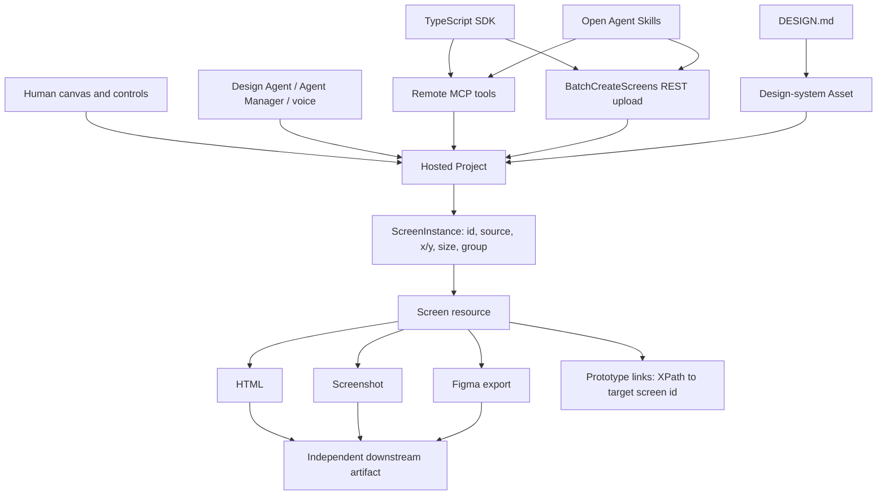

# Stitch

> Research status: **Architecture-level / closed-source boundary reached** · Last reviewed: **2026-08-12**

| Field | Value |
|---|---|
| Organization / team | Google Labs |
| Category | Agent-first design workspace |
| Status | Active / beta |
| Core source availability | Closed |
| Public implementation boundary | Official TypeScript SDK, DESIGN.md CLI/specification, Agent Skills and Gemini CLI extension |
| Primary working authority | Hosted Stitch project containing positioned screen instances, generated screen resources and design-system assets |

## The shortest accurate description

Stitch is not just a prompt-to-page generator. Its current public contract is a hosted **project graph** that can be operated from several planes:

- a human infinite canvas;
- a real-time design agent, Agent Manager and voice interaction;
- a remote read/write MCP server;
- an object-oriented TypeScript SDK over that MCP server plus a file-upload REST edge;
- portable `DESIGN.md` design intent;
- open Agent Skills that move snapshots and generated code between Stitch and a repository.

Those planes meet around project, screen and design-system resource identities. They do **not** establish a lossless shared identity between an original application component, a generated canvas element, a Figma layer and regenerated React code.

The decisive technical distinction is:

```text
Screen                  = generated source resource and downloadable outputs
ScreenInstance          = one spatial placement/reference on the project canvas
DesignSystem Asset      = reusable/versioned design intent applied to instances
DESIGN.md               = portable intent document, not an executable rendering snapshot
exported code/Figma/app = a new downstream authority
```

## From generator to design operating surface

The product boundary expanded materially in four public steps:

| Date | Publicly established change | Architectural consequence |
|---|---|---|
| 2025-05-20 | Text or image prompts generated UI and frontend code; users could create variants, chat, adjust themes, paste into Figma and export code | A hosted generated screen plus visual/code projections formed the first artifact boundary |
| 2025-12-10 | Gemini 3 and interactive Prototypes connected screens into flows | Screen identity began participating in a user-journey graph rather than only a gallery |
| 2026-03-18 | Infinite canvas, whole-project Design Agent, parallel Agent Manager, URL-derived design systems, `DESIGN.md`, prototypes and voice were announced | Project-level context and reusable design intent became first-class |
| 2026-05-19 | Text/voice/codebase/design-file input, streamed canvas work, pre-completion steering, AI Studio sharing, Antigravity export and Netlify publishing were announced globally | Generation became an observable, steerable run with multiple downstream delivery authorities |

This history matters because older “prompt to Figma/code” descriptions omit the current project graph, programmatic mutation surface and portable design-system layer.

## One graph, six control planes



The graph above combines official public interfaces; it does not claim that the proprietary editor uses the open SDK internally.

### Human canvas

The current signed-in product exposes a spatial canvas with generated screens, separate design-system boards, chat, an agent log, zoom, screen selection and project-level actions. Public controls document save, undo/redo, copy/paste, duplicate, delete, marquee selection, multi-screen selection and keyboard navigation across dozens of screens.

### Design Agent, Agent Manager and voice

Google describes the Design Agent as reasoning across the project and streaming work onto the canvas. Agent Manager can run multiple ideas in parallel. Voice can critique, interview and make edits in real time. These are product facts; their internal planning state, conflict rules and transaction semantics are not public.

### Remote MCP

`https://stitch.googleapis.com/mcp` exposes read and destructive tools over the same project/screen/design-system resource vocabulary. This is a real write interface, not a read-only context adapter.

### TypeScript SDK

`@google/stitch-sdk` wraps MCP as `stitch → Project → Screen` and exposes raw `listTools` / `callTool` access. File upload is different: the SDK calls a non-MCP `BatchCreateScreens` REST route because large base64 payloads do not fit agent output limits.

### DESIGN.md

`DESIGN.md` carries machine-readable YAML tokens plus human-readable Markdown rationale. Stitch can generate, import, edit, apply and export it. It is portable outside Stitch and can be linted, diffed and converted by `@google/design.md`.

### Agent Skills

The open skills orchestrate source scanning, static HTML capture, uploads, screen generation, design-system management and new code generation. They are repository-side automation instructions and scripts, not the proprietary Stitch agent implementation.

## The hosted artifact graph

The pinned SDK types expose the clearest public artifact model.

### Project

A project is described as one app and contains:

- a resource name and title;
- create, read and update timestamps;
- `MOBILE`, `DESKTOP`, `TABLET` or `AGNOSTIC` device type;
- private/public visibility;
- owner/reader role metadata;
- origin, including an `IMPORTED_FROM_GALILEO` enum;
- a thumbnail, theme and spatial `screenInstances[]` array.

No public project revision, branch, checkpoint or rollback identifier appears in that type.

### ScreenInstance

A canvas instance has its own `id`, `x`, `y`, width, height, hidden/favourite state, label and grouping. It can reference `sourceScreen` or `sourceAsset` and can be a normal screen, design-system instance or group.

This creates two identities that callers must not collapse:

```text
projects/{project}/screens/{screen}  <- generated source screen
ScreenInstance.id                   <- placement selected on the canvas
```

`apply_design_system` requires both the instance ID and the source-screen resource name. Passing a screen ID where an instance ID is expected addresses the wrong layer of the model.

### Screen

A screen can carry:

- prompt, title, device type, width and height;
- screenshot, complete HTML and Figma-export file references;
- a design-system asset and resolved theme;
- group identity for variants;
- generation status, agent type, suggestions and summary;
- component-region bounding boxes and XPath annotations;
- prototype metadata;
- whether it was created by a client upload.

Public screen kinds include design, image, prototype, document and V2 prototype. The older `Design` container is explicitly marked deprecated in the SDK types; current logic is expected to use screen properties instead.

### Design-system Asset

A design-system asset has an `assets/{asset}` resource name, content and a string version counter. This is the only explicit public version field in the core project/screen/design-system types examined here. It must not be generalized into project or screen history.

## Ordinary-user journey

The current evidenced journey is:

1. Start an App or Web project, or open an existing project.
2. Supply a prompt and optionally images, code, a design file, an existing app/site or voice context.
3. Choose a generation mode and optional visual preset.
4. Watch work stream onto the project canvas and steer it before completion when the active mode supports that behavior.
5. Inspect generated screens, agent output and the design-system board.
6. Refine a named screen or element with a small prompt, or generate one to five variants with a chosen creative range.
7. Apply or edit a design system; separately bring older screens into alignment.
8. Connect screens into a prototype and test the user flow in Play mode.
9. Select the actual screen or screens to deliver.
10. Export to files, code, Figma or another hosted system, then verify the destination artifact independently.

The journey is project-centered while editing and destination-centered after export.

## Device type is an interpretation contract, not a responsive checkbox

Stitch documentation calls the App/Web choice a **Primary Design Surface**. App mode biases toward vertical scroll, bottom navigation and stacked content; Web mode biases toward horizontal navigation and multi-column layouts.

The consequential failure is documented explicitly:

- a project retains its original device-type frame;
- asking for a web design inside an App project can put web content inside an app-sized frame;
- the user must switch Preview device type and manually resize;
- content may exist below the original short frame and remain hidden until the height is extended.

Moving platforms is therefore translation, not resize. The recommended clean path is a new target-mode project or a generated image used as reference in that project. A visually plausible preview inside the wrong frame is not responsive acceptance.

## Generation is asynchronous and weakly idempotent

The MCP generation surface includes:

| Tool | Target | Result |
|---|---|---|
| `generate_screen_from_text` | project + prompt + optional device/model | generated screen references and session output components |
| `edit_screens` | project + selected source-screen IDs + prompt | updated/generated screen results |
| `generate_variants` | source-screen IDs + prompt + count/range/aspects | one to five grouped screen variants |

The public response types include `projectId`, `sessionId` and output components carrying text, suggestions, progress and design references. The same public tool set exposes no session lookup, cancellation, resume or rollback method.

The reference warns that generation/editing can take minutes and that a connection error does not necessarily mean failure. It tells callers **not to retry** and instead to query `get_screen` later. No idempotency key is documented. An ordinary retry can therefore create duplicated work after a request that succeeded server-side but lost its response.

There is a second interface seam: `get_screen` documents `name` as the replacement for deprecated `projectId` and `screenId`, yet its current JSON schema marks all three required. The generated SDK supplies all three fields. This is a public compatibility burden, not evidence that callers should invent their own resource identity.

## Variants are branch-like, not version history

Variation generation supports one to five outputs and three effective creative ranges:

- `REFINE`: preserve more structure;
- `EXPLORE`: broader changes;
- `REIMAGINE`: radical alternatives.

Aspects can target layout, color scheme, images, fonts or text content. A user can choose a variation and generate more variations from it, which creates an iterative lineage in the product experience.

No public parent-revision graph, merge operation, immutable version ID or restore contract is exposed. Combining one variant's layout with another's colors is documented as selecting a base and prompting for the desired combination, not merging two structured branches.

## DESIGN.md is portable intent with two authorities inside one file

A `DESIGN.md` has:

1. YAML front matter for colors, typography, roundedness, spacing and components;
2. Markdown sections for rationale, layout, component rules and do/don't guidance.

The formal specification says token values are normative within the document and unknown valid extensions should be preserved. The implementation repository adds an important interpretation boundary: tokens are context, not rendering commands, and the prose is the most important design guidance.

Thus `DESIGN.md` can be a source of design intent without being a deterministic renderer input.

### Project-default and per-screen clocks

Stitch can set one design system as the project default for **future** screens. Existing screens are not changed retroactively; each must be updated separately. A project may therefore contain screens using different design-system versions or assets at the same time.

Direct edits in the Design System panel update structured tokens and the Markdown summary. More detailed component rules and rationale require editing the Markdown itself. Public documentation does not define conflict resolution if panel and Markdown edits race.

### Import is a two-step resource conversion

MCP import is not simply “attach this file”:

1. `upload_design_md` base64-uploads UTF-8 Markdown and returns a screen-instance-shaped object.
2. `create_design_system_from_design_md` consumes that instance and creates a design-system asset.

The resulting asset can then be applied to selected screen instances. This makes upload instance identity, resulting asset identity and later applied screen identities separate checkpoints.

### Export survives Stitch

When a project is exported, documentation says the ZIP includes `DESIGN.md` beside generated screens. The file is standalone and can be validated, diffed or exported to Tailwind and W3C Design Token formats with `@google/design.md` 0.4.0.

A local CLI diff compares two files; it does not provide hosted project rollback.

## Remote agent authority

The current MCP reference exposes fourteen tools:

| Domain | Read-only | Mutating / destructive annotation |
|---|---|---|
| Projects | `get_project`, `list_projects` | `create_project` |
| Screens | `list_screens`, `get_screen` | `generate_screen_from_text`, `edit_screens`, `generate_variants` |
| Design systems | `list_design_systems` | create, update, apply, upload `DESIGN.md`, create from `DESIGN.md` |

The mutating tools can create projects and screens, restyle selected instances and change reusable assets. A remote coding agent therefore has material design authority once credentials are configured.

Authentication has two different clocks:

- Stitch API keys are documented as persistent until manually revoked and travel in `X-Goog-Api-Key`;
- Google Cloud access tokens typically last about one hour and travel with `Authorization: Bearer` plus `X-Goog-User-Project`.

The setup guide's shell example overwrites an existing `.env` before appending a token. That command is a reproducible local-data hazard for users who copy it into a real project without first preserving the file.

## The SDK provides client identity, not artifact history

At commit `575a9fb6319bd9d1ce8175e4a89e5958e024bbfd`, the SDK is version 0.3.5 and establishes:

- the default remote MCP URL;
- API-key or OAuth header construction;
- generated `Stitch`, `Project`, `Screen` and `DesignSystem` classes;
- a schema-driven domain map from MCP tools to those classes;
- direct REST upload for files;
- runtime repair of missing `$defs` in upstream MCP schemas.

Its `EntityManager` caches an entity by class plus canonical resource ID and returns the same JavaScript object for repeated resolutions during one process. New response data is merged into that instance.

That provides referential equality for SDK consumers. The cache can be cleared or disappears with the process; it is not cloud persistence, optimistic locking or version history.

The SDK source also records real public-interface instability:

- a May 2026 fix repairs missing referenced schema definitions before MCP SDK validation;
- upload uses a private REST endpoint absent from the MCP manifest;
- Design.md support and the centralized identity map landed after the published 0.3.5 release commit, while the package manifest still reports 0.3.5 at current HEAD. No later npm publication was present in the inspected registry metadata, so those June HEAD features must not be attributed automatically to an ordinary 0.3.5 install.

### Open implementation chronology

| Date | Repository commit | What changed at the public boundary |
|---|---|---|
| 2026-01-26 | Gemini CLI extension [`e22b3aa`](https://github.com/gemini-cli-extensions/stitch/commit/e22b3aac9a43bce2d740c5172844e9a2eebba37f) | Current extension configuration made the gcloud path optional while retaining API-key and ADC variants |
| 2026-05-06 | SDK [`edeb1f1`](https://github.com/google-labs-code/stitch-sdk/commit/edeb1f1d9076e7d25f95992eb92538bc125e0455) | File upload graduated to the unified `Project.upload()` surface |
| 2026-05-12 | SDK [`23e5230`](https://github.com/google-labs-code/stitch-sdk/commit/23e52308c9475a60f5d3c01a2dc9afd6fa7e8f5b) | Tool schemas were repaired before AJV compilation to survive missing upstream references |
| 2026-05-12 | SDK [`8e853eb`](https://github.com/google-labs-code/stitch-sdk/commit/8e853ebcbc1cd82af20bd22993eb250dbebdb2eb) | Package version 0.3.5 was published/tagged as latest |
| 2026-06-01 | SDK [`389480d`](https://github.com/google-labs-code/stitch-sdk/commit/389480d8fa6c255c550ef7befc4b1cec02ba2e1c) | Centralized schema-driven resource identity mapping landed after that package release |
| 2026-06-01 | SDK [`575a9fb`](https://github.com/google-labs-code/stitch-sdk/commit/575a9fb6319bd9d1ce8175e4a89e5958e024bbfd) | The repository added the two-step DESIGN.md design-system workflow |
| 2026-07-27 | DESIGN.md [`9bf8eae`](https://github.com/google-labs-code/design.md/commit/9bf8eae67128b6cc55ad9bf86665767deb4c11cd) | The independent CLI/specification reached 0.4.0 |
| 2026-07-29 | Agent Skills [`bf2f67d`](https://github.com/google-labs-code/stitch-skills/commit/bf2f67da80c934e584b7e8c04ec078c90cc47d19) | Static HTML capture added stronger overlay removal and route titling immediately before the pinned HEAD |
| 2026-07-30 | Agent Skills [`535b088`](https://github.com/google-labs-code/stitch-skills/commit/535b0889a46868c9b08f8a7f7084db3c1958a2b6) | Current pinned head merges the static-capture work into the official skill collection that also exposes generate edit variant DESIGN.md upload and React or React Native delivery paths |

This chronology belongs to the open client/tooling edge. It must not be used as a release log for the proprietary canvas or model backend.

## “Code to Design roundtrip” is a lossy relay

The open skills call this workflow a roundtrip, but the source establishes the actual transformations:

```text
application source
  -> framework/token scan -> .stitch/DESIGN.md
  -> running DOM capture -> self-contained HTML snapshot
  -> BatchCreateScreens -> hosted source screen + canvas instance
  -> agent edit/generation -> new Stitch screen HTML
  -> download HTML + screenshot
  -> LLM decomposition -> new React components + mock data + routing
```

### Code to Stitch

The snapshot script can inline CSS, images, fonts, same-origin iframes and optional canvas pixels. Before serialization it removes every `<script>` tag and multiple development overlays. The result preserves a rendered visual state, not application state, event handlers, data fetching, original modules or component identity.

The uploader base64-encodes HTML, image or Markdown and calls:

`POST /v1/projects/{projectId}/screens:batchCreate`

It creates a `DOCUMENT` or `IMAGE` screen and normally asks the server to create screen instances. Route names can be retained as screen titles, but no authored component/file/range identity is uploaded.

### Stitch back to code

The React skill:

- calls `get_screen` for every screen;
- downloads complete HTML and a full-resolution screenshot;
- writes local screen-level metadata including screen ID, source-screen reference, dimensions and canvas position;
- visually audits the screenshot;
- extracts Tailwind configuration from generated HTML;
- asks the agent to split patterns into React components;
- moves static content into `mockData.ts`;
- replaces placeholder `href="#"` navigation;
- validates component structure with an AST script.

The screen-level ledger supports later re-fetching. It does not bind each React AST node to a Stitch component-region XPath or original application component. Generated React is a new implementation that must be diffed and run.

## Prototype identity stays inside the generated-screen domain

The public SDK types show a V2 prototype as:

- an initial screen ID;
- a set of screen IDs;
- optional named states;
- per-screen links containing XPath, target screen ID and transition.

Screen metadata can also contain component regions with XPath and bounding boxes. This is meaningful runtime structure: one generated HTML element can address another hosted screen in a prototype.

It is not a source map to the user's original React/Vue/Angular files. The open React export skill does not consume those XPaths into a durable AST mapping, and generated HTML commonly contains placeholder links that must be rewired during implementation.

## Current UI and documentation drift

Read-only observation of the signed-in web product on 2026-08-11 established a live mode menu with:

- `3 Flash`;
- `Thinking with 3.1 Pro`;
- `Redesign`;
- `Ideate`.

The public Design Modes page still describes `Thinking with 3 Pro`, `Redesign`, `2.5 Pro` and `Fast`. The MCP schema separately deprecates `GEMINI_3_PRO` in favor of `GEMINI_3_FLASH` or `GEMINI_3_1_PRO`.

The live style menu also exposed named presets such as Alexandria, Bauhaus, Glacier, Carbon, Neon Tokyo and Terra. These are current UI labels, not proof of a stable API enum or model checkpoint.

The Agent Skills documentation says the suite contains 13 skills. The pinned repository currently contains 15 skill directories, including additional React Native and React/Vite dashboard material not listed in the public reference. Product UI, docs, schemas and repositories are separate release surfaces.

## Delivery is a set of forks

The 2026-08-11 export dialog is selection-scoped and exposed these destinations:

| Exit | Current observed boundary | Resulting authority / loss |
|---|---|---|
| AI Studio | Opens AI Studio and transfers/downloads HTML and image context | AI Studio terms and its generated application become the next authority |
| Figma | Sends HTML to `code.to.design` for conversion | Third-party conversion creates a Figma-owned object graph; fidelity and identity are not a Stitch transaction |
| MCP | Offers client setup and a prompt for operating the hosted resources | Keeps Stitch as authority until an agent downloads or rewrites another artifact |
| Netlify preview | Deploys one selected screen as a live site that the user must claim | A single screen is not a multi-page application; deployment enters Netlify's domain |
| Lovable / Bolt previews | Loads screen design and HTML into the destination builder | Destination-generated app and terms become authoritative |
| `.zip` | Downloads selected material; project export documentation includes `DESIGN.md` | Local files become independent and receive no reverse sync |
| Copy code | Copies generated code to the clipboard | Plain text loses hosted project/version context immediately |

Google's May 2026 post also documents Antigravity delivery. A destination opening successfully proves transfer, not behavior, responsive fidelity, data wiring or recoverability.

## Persistence, sharing and privacy are separate clocks

Public evidence establishes:

- project create/read/update timestamps and private/public visibility;
- owner and reader roles;
- save and undo/redo UI controls;
- screen instances positioned in a hosted project;
- design-system asset versions;
- API-key and access-token lifetimes;
- local `DESIGN.md` files and CLI diffs;
- downstream copies under destination services.

It does **not** expose one version graph joining all of them. In particular, no public project/screen history API, branch/merge contract, collaboration conflict model or cross-destination rollback was located.

Stitch's privacy notice, last updated 2025-05-20, says Google collects prompts, attachments, generated outputs, usage information and feedback for product/model development and that some conversations may be reviewed by humans. Users can opt future conversations out of generative-model training in settings, but submitted feedback and related context may still be used. The signed-in product additionally warns that a shared-project owner may see input.

Do not put secrets into prompts, attachments, exported descriptions, an overwritten `.env` or a shared project merely because the visual task feels temporary.

## Failure atlas

| Boundary | User-visible failure | Established cause / limit | Recovery evidence |
|---|---|---|---|
| Primary design surface | Web content is clipped or placed in a mobile frame | Project device type persists and translation is not resize | Generate in a target-mode project or resize Preview and inspect hidden content |
| Generation connection | Client reports failure while a screen appears later, or retry duplicates work | Long-running mutation can outlive the connection; no idempotency key is public | Do not retry immediately; inventory project/screens and call `get_screen` later |
| `get_screen` compatibility | Client rejects an apparently valid resource name | Deprecated IDs and new resource name are all currently marked required | Use the current SDK/complete triplet and record the schema snapshot |
| Model/mode selection | UI label, docs and MCP enum disagree | Independent release surfaces have drifted | Record date, client, exact mode label and returned screen metadata |
| Variant workflow | A promising branch cannot be merged/restored structurally | Variants are grouped screens, not a public VCS graph | Preserve screen IDs and exports; manually verify the chosen base |
| Design-system default | Older screens remain visually inconsistent | Default applies only to future screens | Apply the chosen asset to each existing screen instance and re-inspect |
| Design-system addressing | Apply call targets the wrong object or fails | It requires canvas instance ID plus source-screen name | Build the pair from `get_project`, not `list_screens` alone |
| DESIGN.md determinism | Two generations obey rules differently | Tokens/prose guide generation but are not imperative renderer commands | Compare resolved screen theme and output; lint the file but visually accept each screen |
| Static HTML import | Imported design looks right but interactions/data vanish | Snapshot removes scripts and severs module/component identity | Keep source authoritative; test imported appearance and separately inventory lost behavior |
| React export | New code diverges from original architecture or content | LLM decomposes generated HTML into a new component tree and mock data | Review the Git diff, replace mock data, run routes/interactions and compare screenshots |
| Prototype-to-code | Canvas links become dead `href="#"` anchors | Prototype XPath/screen IDs are not exported as React router identity | Build and test explicit destination routes |
| Figma export | Layers or semantics differ despite a similar screenshot | HTML is converted by `code.to.design`; no lossless schema is public | Inspect the native Figma object model and compare every required state |
| Netlify preview | Only one page is deployed | Current dialog describes single-screen deployment | Test the claimed URL, then build routing/state in the real application |
| SDK identity cache | A caller mistakes object equality for durability | Identity map is process-local and clearable | Re-query server resources and use explicit IDs/timestamps |
| Credentials | Long-lived agent retains write authority | API key persists until revoked | Scope access, avoid committing keys and revoke after the workflow |
| Shared/privacy boundary | Prompt or attachment is visible or used beyond the immediate task | Owner visibility, review and training rules have separate controls | Remove sensitive material, configure data choice and verify destination terms |

## Direct facts, bounded inferences and material unknowns

### Directly established

- Stitch's core product is proprietary, while its SDK, DESIGN.md implementation, Agent Skills and Gemini CLI extension are public.
- The hosted project publicly exposes screen instances, source screens and design-system assets as distinct identities.
- Screens have downloadable HTML/screenshot/Figma references and can carry prototype/component XPath metadata.
- Remote MCP exposes read and destructive project/screen/design-system tools.
- The SDK uses MCP for tool calls and a direct REST BatchCreateScreens edge for file uploads.
- SDK object identity is cached by resource ID inside one client process.
- `DESIGN.md` is standalone, extensible and exportable; project-default application does not update existing screens.
- Code import captures a script-free static DOM snapshot.
- React export creates a new component/data/routing structure from Stitch HTML.
- Current delivery routes fork into independent files or external services.

### Evidence-backed inferences

- The hosted project is the editing center, with screens as reusable generated resources and screen instances as canvas placements.
- Project UI, MCP and SDK operate a compatible resource graph, although the proprietary UI's internal client protocol is not established.
- Screen-instance/source-screen separation allows one source screen or asset to participate in multiple canvas arrangements, but public duplication/copy-on-write semantics remain unknown.
- `DESIGN.md` is the strongest portable continuity artifact across tools, but its influence remains generative rather than bit-deterministic.
- The advertised code-to-design roundtrip is better described as snapshot import followed by code re-materialization.
- Prototype XPath is an internal generated-artifact address, not original-source return.
- A destination export creates a new authority because no reverse synchronization or cross-service transaction is documented.

### Material unknowns

- Core editor schema, database, rendering stack, collaboration transport and agent orchestration.
- Autosave cadence, undo persistence across reload, project history, restore and deletion/retention semantics.
- Whether generation/edit tools replace source-screen state or always create new source identities in every UI path.
- Server-side idempotency, cancellation, timeout and partial-write rules for sessions.
- Exact model routing behind current mode names and how project context is selected or truncated.
- Agent Manager scheduling, isolation and conflict resolution when parallel runs touch the same project.
- Design-system update atomicity and whether a screen records an immutable asset version or a mutable reference.
- Download-URL expiry, access scope and revocation behavior.
- Complete public/share permission semantics and concurrent-editor conflict handling.
- Exact Figma-export representation and fidelity through `code.to.design`.
- Whether prototype states/transitions roundtrip through every export target.
- A durable element/component binding from imported application source through Stitch and back to regenerated code.

## Evidence boundary

The Architecture-level boundary is reached because the decisive project graph, ordinary-user journey, six public control planes, remote write protocol, SDK identity model, design-system portability, prototype addressing, code-import/export transformations, persistence gaps, live delivery forks and ordinary-user failures are established.

The proprietary editor and agent backend remain closed. The open SDK, CLI, extension and skills prove their own interfaces and transformation code; they do not stand in for Stitch's private storage, canvas renderer, collaboration engine or model orchestration.

Read-only signed-in observation used existing sample/shared projects and opened menus without generating, editing, exporting, sharing, creating credentials or deploying anything.

## Acceptance checklist for a real Stitch workflow

- Record project resource name, device type, visibility and relevant timestamps before generation.
- Inventory both `get_project.screenInstances[]` and `list_screens`; preserve the instance-ID to source-screen mapping.
- Treat App/Web as a generation contract and verify the target viewport, scroll extent and responsive behavior.
- On a connection error, wait and query existing resources before any retry.
- Preserve prompt, model/mode label, returned session/screen IDs and evidence timestamp.
- Compare every selected variant as an actual screen; do not assume branch merge or rollback.
- Pin the design-system asset used by each accepted screen and reapply it explicitly to older screens.
- Lint and archive `DESIGN.md`, while visually testing the screens it conditions.
- For imported applications, inventory everything removed by static capture: scripts, state, network behavior, routes and original component identity.
- For prototypes, test every state and transition; then separately test destination routing after code export.
- For React output, inspect the repository diff, replace mock data, run the app and compare responsive screenshots and interactions.
- For Figma, inspect layers/components/styles after conversion, not only pixels.
- For AI Studio, Netlify, Lovable, Bolt or Antigravity, verify the actual destination artifact and its governing terms.
- Download and open the ZIP/local files; a completed export dialog is not artifact proof.
- Keep credentials out of source and revoke persistent API keys when no longer needed.
- Apply privacy/data choices before sensitive work and assume shared-project owners can inspect supplied context.

## Primary sources and evidence pins

### Product evolution and current product surface

- [Stitch launch, 2025-05-20](https://developers.googleblog.com/en/stitch-a-new-way-to-design-uis/)
- [Gemini 3 and Prototypes, 2025-12-10](https://blog.google/innovation-and-ai/models-and-research/google-labs/stitch-gemini-3/)
- [Infinite canvas, Design Agent, Agent Manager, DESIGN.md and voice, 2026-03-18](https://blog.google/innovation-and-ai/models-and-research/google-labs/stitch-ai-ui-design/)
- [Real-time streaming, steering and delivery updates, 2026-05-19](https://blog.google/innovation-and-ai/models-and-research/google-labs/stitch-updates/)
- [Google I/O 2026 announcement recap](https://blog.google/innovation-and-ai/technology/ai/google-io-2026-all-our-announcements/)
- [Live Stitch product](https://stitch.withgoogle.com/)
- [Stitch privacy notice](https://stitch.withgoogle.com/privacy)

### Canvas behavior

- [Product overview](https://stitch.withgoogle.com/docs/learn/overview/)
- [Prompting and target scope](https://stitch.withgoogle.com/docs/learn/prompting/)
- [Device types and Primary Design Surface](https://stitch.withgoogle.com/docs/learn/device-types/)
- [Design modes](https://stitch.withgoogle.com/docs/learn/design-modes/)
- [Variants](https://stitch.withgoogle.com/docs/learn/variants/)
- [Canvas controls, save and selection](https://stitch.withgoogle.com/docs/learn/controls/)

### MCP and SDK

- [MCP setup and authentication](https://stitch.withgoogle.com/docs/mcp/setup/)
- [MCP workflow guide](https://stitch.withgoogle.com/docs/mcp/guide/)
- [MCP tool and shared-type reference](https://stitch.withgoogle.com/docs/mcp/reference/)
- [SDK tutorial](https://stitch.withgoogle.com/docs/sdk/tutorial/)
- [Stitch SDK pinned commit `575a9fb...`](https://github.com/google-labs-code/stitch-sdk/tree/575a9fb6319bd9d1ce8175e4a89e5958e024bbfd)
- [Generated Project, ScreenInstance and Screen types](https://github.com/google-labs-code/stitch-sdk/blob/575a9fb6319bd9d1ce8175e4a89e5958e024bbfd/packages/sdk/generated/src/types.generated.ts#L331-L450)
- [Component-region and V2 prototype identity types](https://github.com/google-labs-code/stitch-sdk/blob/575a9fb6319bd9d1ce8175e4a89e5958e024bbfd/packages/sdk/generated/src/types.generated.ts#L453-L595)
- [Generated MCP-to-domain map](https://github.com/google-labs-code/stitch-sdk/blob/575a9fb6319bd9d1ce8175e4a89e5958e024bbfd/packages/sdk/generated/domain-map.json#L31-L158)
- [Process-local entity identity map](https://github.com/google-labs-code/stitch-sdk/blob/575a9fb6319bd9d1ce8175e4a89e5958e024bbfd/packages/sdk/src/entity-manager.ts#L16-L99)
- [Direct BatchCreateScreens upload boundary](https://github.com/google-labs-code/stitch-sdk/blob/575a9fb6319bd9d1ce8175e4a89e5958e024bbfd/packages/sdk/src/upload-handler.ts#L17-L139)
- [Runtime repair of missing MCP schema definitions](https://github.com/google-labs-code/stitch-sdk/blob/575a9fb6319bd9d1ce8175e4a89e5958e024bbfd/packages/sdk/src/schema-repair.ts#L18-L145)
- [Immutable npm metadata for `@google/stitch-sdk` 0.3.5](https://registry.npmjs.org/%40google%2Fstitch-sdk/0.3.5)

### DESIGN.md

- [What is DESIGN.md?](https://stitch.withgoogle.com/docs/design-md/overview/)
- [Import from a codebase](https://stitch.withgoogle.com/docs/design-md/get-instructions/)
- [Formal specification](https://stitch.withgoogle.com/docs/design-md/specification/)
- [View, edit and export lifecycle](https://stitch.withgoogle.com/docs/design-md/usage/)
- [CLI validation, diff and export](https://stitch.withgoogle.com/docs/design-md/cli/)
- [DESIGN.md implementation pinned at `9bf8eae...`](https://github.com/google-labs-code/design.md/tree/9bf8eae67128b6cc55ad9bf86665767deb4c11cd)
- [Self-contained format, normative values and extension behavior](https://github.com/google-labs-code/design.md/blob/9bf8eae67128b6cc55ad9bf86665767deb4c11cd/docs/spec.md#L6-L17)
- [Unknown-content preservation contract](https://github.com/google-labs-code/design.md/blob/9bf8eae67128b6cc55ad9bf86665767deb4c11cd/docs/spec.md#L366-L377)
- [Tokens as context rather than rendering instructions](https://github.com/google-labs-code/design.md/blob/9bf8eae67128b6cc55ad9bf86665767deb4c11cd/PHILOSOPHY.md#L19-L44)
- [Immutable npm metadata for `@google/design.md` 0.4.0](https://registry.npmjs.org/%40google%2Fdesign.md/0.4.0)

### Agent Skills and client distribution

- [Agent Skills setup](https://stitch.withgoogle.com/docs/skills/get-started/)
- [Agent Skills reference](https://stitch.withgoogle.com/docs/skills/reference/)
- [Documented code-to-design roundtrip](https://stitch.withgoogle.com/docs/skills/roundtrip/)
- [Stitch Skills pinned commit `535b088...`](https://github.com/google-labs-code/stitch-skills/tree/535b0889a46868c9b08f8a7f7084db3c1958a2b6)
- [Code-to-design orchestration](https://github.com/google-labs-code/stitch-skills/blob/535b0889a46868c9b08f8a7f7084db3c1958a2b6/plugins/stitch-design/skills/code-to-design/SKILL.md#L15-L73)
- [Static snapshot script: capture, inline, remove scripts and serialize](https://github.com/google-labs-code/stitch-skills/blob/535b0889a46868c9b08f8a7f7084db3c1958a2b6/plugins/stitch-design/skills/extract-static-html/scripts/snapshot.ts#L938-L1413)
- [BatchCreateScreens upload script](https://github.com/google-labs-code/stitch-skills/blob/535b0889a46868c9b08f8a7f7084db3c1958a2b6/plugins/stitch-design/skills/upload-to-stitch/scripts/upload_to_stitch.py#L60-L177)
- [React re-materialization and screen-level ledger](https://github.com/google-labs-code/stitch-skills/blob/535b0889a46868c9b08f8a7f7084db3c1958a2b6/plugins/stitch-build/skills/react-components/SKILL.md#L20-L110)
- [Gemini CLI Stitch extension pinned at `e22b3aa...`](https://github.com/gemini-cli-extensions/stitch/tree/e22b3aac9a43bce2d740c5172844e9a2eebba37f)
- [Extension MCP endpoint, API-key auth and five-minute timeout](https://github.com/gemini-cli-extensions/stitch/blob/e22b3aac9a43bce2d740c5172844e9a2eebba37f/gemini-extension.json#L1-L14)

Reproducible source/distribution checks used `git ls-remote` for each pinned repository, the GitHub tree/commit APIs, and separate `npm view @google/stitch-sdk` / `npm view @google/design.md` queries against the public npm registry.
