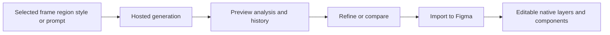

# Prompt.to.design

> Research status: **Architecture-level** · Last reviewed: **2026-08-12**

Prompt.to.design is Superun's AI assistant inside Figma. It creates or modifies interface layouts through several bounded operations rather than only a blank-canvas prompt: Kick Start, Style Transfer, Region Design, Smart Fill, element modification, template remix and frame redesign.

## Generated candidates become native only at import

The result panel separates generation from Figma authority. A result first appears as a scrollable preview with analysis, summary, history, feedback and refinement controls. “Import to Figma” is the materialization step that creates editable frames, Auto Layout, text layers and components.

Smart Fill is more constrained than whole-page generation: it inserts a new region inside a selected frame while leaving the rest unchanged. Frame Redesign preserves the selected layout while changing its visual language. These are important intent boundaries even though the closed implementation does not reveal how structural preservation is checked.

## Coupled to Superun, but not the same product

Results can open as a browser demo in Superun, and both products share documentation and organization. Prompt.to.design is nevertheless counted separately because it is an independently installable Figma surface whose final authority is a native design file; Superun is a full managed application project with backend and publishing semantics.

Model routing, Figma-node mapping, prototype-link generation, history retention and exact synchronization with Superun are not publicly disclosed. Team geography remains unknown in reviewed first-party material.

## Primary evidence

- [Prompt.to.design overview](https://docs.superun.ai/prompt-to-design/guide/welcome)
- [Generation result and Figma import](https://docs.superun.ai/prompt-to-design/features/modify-elements)
- [Frame Redesign](https://docs.superun.ai/prompt-to-design/features/frame-redesign)
