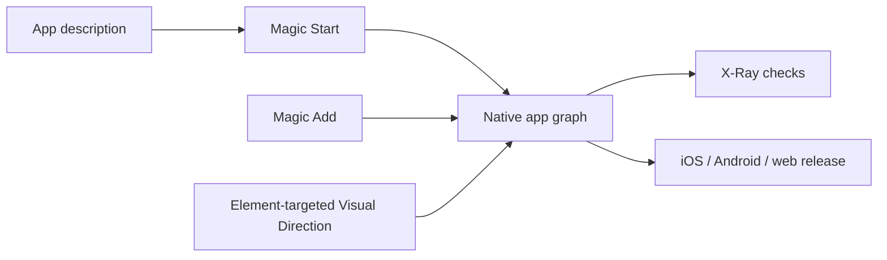

# Adalo AI

> Research status: **Architecture-level** · Last reviewed: **2026-08-11**

| Field | Value |
|---|---|
| Team | Adalo · team region not established by current first-party evidence |
| Ordinary job | have Ada create or extend a database-backed app then inspect and alter every screen on a visual flow canvas |
| Native authority | Adalo screens components navigation actions relational collections and data bindings |
| Delivery | one project published to iOS Android and web |

## Generation enters the native app graph

Magic Start creates several screens together with relational data navigation and sample content. Magic Add extends that graph from a feature request. Visual Direction lets a user point at one canvas element and ask Ada for a targeted change. X-Ray analyzes links data connections performance and visual consistency before release.

## The multi-screen canvas keeps topology visible

Adalo displays screens spatially and links navigation between them. Users drag resize and connect components directly after generation. The database and action graph remain part of the same project so UI generation is not separated from behavior or delivery.

X-Ray findings are advisory evidence and do not prove the generated application correct. The repository classifies constraint-driven engineering as additional because schema action and platform constraints shape the artifact; it does not equate this with physical engineering authority.

## Evidence ceiling

No implementation or serialization is public. Agent plan representation mutation atomicity version retention app-store build pipeline and exact source ownership are unknown. The native project is provider-managed rather than an exposed code repository.

## Primary evidence

- [Adalo AI app builder](https://www.adalo.com/products/ai-app-builder/)
- [Adalo product platform](https://www.adalo.com/)
- [Adalo help center](https://help.adalo.com/)
