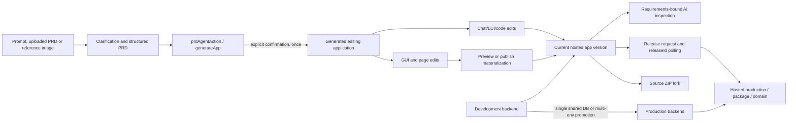

# Miaoda (秒哒)

> Research status: **Architecture-level / closed-source boundary reached** · Last reviewed: **2026-08-11**

| Field | Value |
|---|---|
| Organization / team | Baidu / Baidu AI Cloud |
| Category | PRD-gated multi-agent application builder and managed delivery platform |
| Status | Active; latest documented product release V3.5, 2026-07-15 |
| Current outputs | Web sites, H5, WeChat mini-programs, native Android/iOS applications and non-application general tasks |
| Working center | Hosted Miaoda project: requirement/conversation trajectory, generated application version, editor state and optional managed backend |
| Delivery surfaces | Miaoda-hosted release, custom domain, app square copy, mini-program/app packaging, or source-code ZIP |
| Source availability | Hosted product core closed; official Miaoda App Builder Skill v1.0.12 is an MIT-0 API adapter |
| Evidence ceiling | Public workflow, lifecycle protocol, environment promotion and export boundaries are established; generator, internal code model, editor reconciliation, storage and deployment implementation remain closed |

## The system to understand

Miaoda is not just a prompt-to-page generator with a visual editor. Its decisive product mechanism is a **two-gate hosted lifecycle**:

1. a requirement must become a structured PRD and expose a machine-readable confirmation action before the first application generation;
2. a generated editing version must be explicitly published before external users receive the change.

Between those gates, natural-language editing, GUI editing, page management, code conversation, Skills, backend schema/data and AI quality inspection operate on related but non-identical state. The [creation guide](https://cloud.baidu.com/doc/MIAODA/s/smf50gob5) describes requirement submission, clarification, PRD confirmation, multi-agent generation and preview/refinement. The [2026 changelog](https://cloud.baidu.com/doc/MIAODA/s/Zmm32qp8x) shows that the platform has since expanded from no-code web generation into native apps, general tasks, Skills, quality inspection, multi-application backends and development/production isolation.

The important technical question is therefore not “which model writes the page?” Public evidence does not answer that. It is “which state has actually crossed which gate?”



Generation completion, editor autosave, preview, AI inspection, source download and production release are separate events. Treating any earlier event as proof of the later one is the central ordinary-user failure mode.

## The ordinary-user path has two irreversible gates

The [product introduction](https://cloud.baidu.com/doc/MIAODA/s/Sm88db6er), creation, editing, testing and release documentation together establish this end-to-end path:

| Stage | Ordinary action | State advanced | Acceptance evidence |
|---|---|---|---|
| 1. Frame the requirement | describe an idea, expand a short prompt, upload a PRD or add reference images | conversation and requirement evidence | target users, scenarios, page map, rules, edge cases, acceptance criteria and non-goals are explicit enough to review |
| 2. Resolve clarification | answer Agent questions or choose interactive clarification cards | current PRD trajectory | rewritten requirement reflects the user's intent; invalidated conversation after rollback/context clearing is not mistaken for current state |
| 3. Confirm initial generation | act on the structured Generate App control | one application-generation job | confirmation is attached to the correct app/conversation; the job reaches generated/designing state |
| 4. Refine the application | use chat/LUI, selected-element context, GUI controls, page management or conversational code modification | editing project and, conditionally, materialized code | reload the editor and preview the intended route/device; autosave alone is not source-export or production evidence |
| 5. Configure behavior | add backend tables, auth, realtime data, shared backend, Skills, plugins, secrets and third-party services | several project-local and backend ledgers | verify roles, data isolation, plugin credentials, actual device/provider flows and intended environment |
| 6. Test the current version | preview and optionally run AI quality inspection | test evidence tied to one generated app version | inspect report, re-test repairs and manually exercise unsupported scenarios |
| 7. Materialize visual edits | preview or publish after GUI edits | GUI changes become represented in downloadable code | download only after this edge if the ZIP is a deliverable |
| 8. Release deliberately | publish from chat or the button and wait for completion | release record and production surface | obtain the successful release, open its actual URL/package and exercise the ordinary journey against production data/integrations |
| 9. Eject if needed | download supported source and reconstruct external dependencies | independent filesystem fork | run the exported code outside Miaoda, migrate backend/API dependencies, secure secrets and accept that no reverse synchronization is documented |

The first gate should happen once for a new application. Later refinements are conversation-driven modifications of the existing application, not repeated initial-generation confirmations. The second gate can happen repeatedly: unpublished editor changes remain separate from the last successful external release.

## `prdAgentAction`, not conversational prose, is the generation token

Baidu's official [Miaoda App Builder Skill guide](https://cloud.baidu.com/doc/MIAODA/s/mmmnhtlx9) exposes an external-agent route through Miaoda's hosted API. The pinned Skill package makes the hidden-looking gate concrete without exposing the generator core.

In `scripts/miaoda_api.py` from version 1.0.12:

- chat is JSON-RPC 2.0 `message/send` over `POST /api/v1/conversation/chat`;
- request metadata identifies `defaultAgent: "AdaPro"`, runtime `miaoda`, `queryMode: "deep_mode"` and the Web input field;
- a new conversation with no context creates an app; continuing one requires its current `appId` and `conversationId`;
- the response returns those identities under `result.status.message.metadata`;
- the client polls `/api/v1/conversation/trajectory?stream=false`, advances `lastEventId`, and recognizes `completed`, `input-required`, `failed` or `final` states;
- the PRD gate is found specifically in `result.artifact.parts[].data` where `type == "prdAgentAction"` and an action event has `name == "generateApp"`;
- confirmation sends `userConfirmation: {"type":"generateApp"}` through the same chat endpoint.

This establishes a control token rather than a text convention. The package explicitly warns callers not to infer readiness from a sentence or localized button label. It also distinguishes general tasks: a report, analysis or presentation can finish without `prdAgentAction`; calling application generation there would be a category error.

### Identity loss can fork the artifact

The adapter's most consequential guard is at `scripts/miaoda_api.py:294-305`: supplying an `appId` without a valid `conversationId` would silently create a new application instead of modifying the intended one. The client blocks empty, `null`, `undefined` and `none` contexts and can recover the latest context id from trajectory events.

That makes `appId + latest conversationId` the minimum continuation identity. The Skill is otherwise stateless; process restart does not preserve workflow state locally. Miaoda's server owns the project and trajectory, while the caller must preserve or recover those identifiers before a mutation.

### Lifecycle is visible, implementation is not

The adapter and Skill document these hosted `appFocus` states:

| State | Meaning for an external caller | Safe next step |
|---|---|---|
| `NOT_GENERATE` / `WAITING` | requirement or PRD work has not crossed generation | inspect trajectory and continue clarification; do not publish |
| `UNDER_CREATING` | initial application generation is running | poll; do not submit the generation token again |
| `CREATE_FAILED` | generation ended unsuccessfully | inspect trajectory/error and retry through the documented workflow |
| `DESIGNING` | an editable application exists | modify, test, inspect and publish when ready |
| `UNDER_RELEASE` | release is running | wait for the existing `releaseId`; editor operations may be locked |
| `RELEASED` | at least one hosted release succeeded | verify the live target; later editor changes can still be unpublished |
| `RELEASE_FAILED` | release failed | inspect and repair before a new release |

These states reveal orchestration semantics. They do not reveal which models/subagents ran, how source is represented, how requirements bind to code, or whether generation and backend migrations share a transaction.

## LUI and GUI converge through a materialization edge

The [application editor guide](https://cloud.baidu.com/doc/MIAODA/s/tmcit6fc7) exposes two refinement lanes plus page-level controls:

- **LUI** uses natural language or voice and can target selected text, images, buttons, static data, forms or blocks before the request is sent to the chat panel;
- **GUI** directly changes eligible text, images, buttons, sections and forms, including content, typography, color, links, backgrounds, crop, positioning, layering and component insertion;
- page management switches, renames, reorders, deletes, shows/hides navigation entries and chooses a homepage;
- undo/redo and automatic saving protect editor work, but GUI coverage applies only to supported applications/components.

Public documentation does not expose the selected-element packet, stable component/node ids, a file/range/AST identity, a source map, repeated-instance scoping or a stale-revision guard. Selected-element context is therefore established at product level, not as another source-inspected DOM-to-file mechanism.

The strongest public clue about reconciliation comes from the [source export guide](https://cloud.baidu.com/doc/MIAODA/s/Xmewgmsq7): the ZIP represents the application version currently being edited, yet GUI changes such as font and color are absent unless the user first previews or publishes. Preview/publish therefore performs a real materialization step between editor-side visual state and exportable code.

This has three practical consequences:

1. editor autosave proves recovery of editor intent, not that the code ZIP contains it;
2. preview can materialize the code path without making it an external production release;
3. publishing can both materialize the edit and advance a separate release, so it should not be used casually only to prepare an export when preview is sufficient.

Whether materialization is a deterministic source rewrite, model-mediated regeneration or a mixed pipeline is closed. No public contract says how conflicts between conversational code changes and pending GUI state are reconciled.

## The backend is one environment only when the project chooses it

The generic [backend guide](https://cloud.baidu.com/doc/MIAODA/s/Dmh2w3m8t) says Miaoda can derive tables, relations and front/back data flow from semantic requirements and add auth, roles, data isolation and realtime collaboration. V3.5 adds multi-application backend sharing: the [shared-backend guide](https://cloud.baidu.com/doc/MIAODA/s/bmrkh5a58) says independent Web, app, mini-program and admin frontends can share database schema/data, Storage, Auth/user data and Edge Functions while keeping frontend development and billing per application.

That power makes environment semantics decisive. The [multi-environment guide](https://cloud.baidu.com/doc/MIAODA/s/emrm8ossc) defines two modes chosen at creation:

| Backend mode | Development behavior | Publish behavior | Main risk |
|---|---|---|---|
| single environment | editing and online application share one database | code/UI still require release, but development data changes are already live | testing, CRUD or schema/data maintenance can affect real users before publication |
| multiple environments | development and production databases are isolated | first release initializes production broadly; later releases promote selected configuration/schema changes | promotion is asymmetric and not a complete environment replacement |

The first multi-environment publication copies schema and all table data, plugin configuration, Auth configuration and users, Storage configuration/data and other database configuration. Later publications synchronize changed schema/configuration, but intentionally do **not** remove plugins or keys deleted in development; those must be removed manually in production. Same-named plugin AK/SK values can overwrite the online values.

Each development version change such as Publish or Save Version records a development snapshot of schema **and business data**, enabling a development-backend rollback. Public docs do not establish an equivalent production-data rollback, an atomic transaction joining app code, database promotion and release alias, or how concurrent shared-backend application releases are serialized.

The [database maintenance guide](https://cloud.baidu.com/doc/MIAODA/s/kmhiia8g4) adds direct CRUD, query, CSV import/export and backend start/stop. In single-environment mode these operations can affect online state. An inactive backend may be stopped while static frontend pages continue to load; CRUD then fails until the backend is re-enabled. A visually healthy page is therefore weak backend evidence.

### Code isolation and data isolation must not be conflated

The [update/offline guide](https://cloud.baidu.com/doc/MIAODA/s/tmcjx5q55) correctly says unpublished editor changes do not affect the online application. That statement applies to the application release. The newer backend guide explicitly says a single-environment database is shared. “Editing is isolated from online” is therefore conditional by ledger: true for unpublished application code/UI, false for data changes when the backend is single-environment.

## AI quality inspection is requirements-bound, not product acceptance

The [AI quality inspection guide](https://cloud.baidu.com/doc/MIAODA/s/Xmo6tpc20) says every completed application version can launch a test-engineer Agent that reads the requirement document, visits the application and simulates user behavior. A run costs 60 credits, usually takes 10–20 minutes, produces a report and offers one free automatic repair when it finds a problem.

That is meaningful generated-version evidence, but its public boundary is unusually explicit:

- repair is not guaranteed and should be followed by another inspection;
- the test scope is the PRD's core functions, not every implied quality attribute;
- games and native apps need manual verification;
- multi-role scenarios are only checked as one role;
- WeChat login/payment, SMS/email codes, face/voice/gesture recognition and other real-world/authenticated interactions need manual testing;
- specific file uploads and long asynchronous generation tasks need manual testing;
- mini-program inspection exercises Web preview, not the published mini-program.

Consequently, `inspection completed` is neither production acceptance nor security/performance proof. The ordinary-user handoff requires real identities, real device/provider paths, intended production data and the actual published target.

## Release and portability split into several destinations

The [Web release guide](https://cloud.baidu.com/doc/MIAODA/s/km8ecsg70) makes publish an explicit operation. During release, page operations and chat are disabled. Repeated publication updates the hosted application, while the project list exposes only the most recent publication time. The official Skill triggers `POST /api/v1/app/release` with a production environment, receives a `releaseId`, polls `/api/v1/app/release/status/{releaseId}`, and returns the `https://<appId>.appmiaoda.com` address only after success.

Delivery then forks:

| Destination | What becomes durable | What does not travel automatically |
|---|---|---|
| Miaoda-hosted H5/site | successful release plus hosted URL | later editor changes, unpublished backend fixes and external-domain state |
| custom domain | DNS/ICP-bound route to the hosted release | domain ownership, real-name/ICP approval and propagation are separate from application success |
| WeChat mini-program | authorized build/submission in the user's channel | login/payment and provider authorization; Web-preview inspection is not published-state proof |
| Android/iOS package | generated package or signed store workflow | device behavior, signing identity, store review and public availability |
| app square | published app exposed for like/share/copy | a consumer copy becomes an independent project, not a live branch of the origin |
| source ZIP | current supported editing-version code after required materialization | hosted backend, data, secrets, managed third-party APIs, release history and reverse sync |

The [custom-domain guide](https://cloud.baidu.com/doc/MIAODA/s/Im8ecuhvk) requires domain real-name verification, ICP filing and CNAME propagation on Baidu's domestic hosting path. The [app-square guide](https://cloud.baidu.com/doc/MIAODA/s/Pmck9hefk) exposes copy/remix as distribution. Neither should be treated as the same version clock as the editor.

### Source ZIP is an ejection fork, not full portability

Source export is limited to most applications generated after the feature became available. Older projects remain ineligible even if subsequently updated, and code cannot be downloaded during initial generation. For eligible projects:

- plain frontends use Node.js 20+, npm 10+ and a Vite-style local workflow;
- mini-program output uses Taro with H5 and WeChat build routes;
- a backend application must provision an external Supabase instance, import supplied SQL, replace URL/key values in `.env`, and disable the Miaoda Supabase proxy;
- Miaoda-provided third-party services must be purchased/replaced for external deployment; some `appbuilder` question-answering or Web-summary services have no documented user replacement.

The ZIP is therefore a code fork whose portability depends on the generated project's capabilities. No public mechanism imports external edits back into Miaoda or binds a ZIP commit to later hosted versions.

## The official Skill exposes lifecycle, not the generator

Baidu's Skill guide directly endorses the ClawHub package. For reproducible inspection, this dossier pins the [Miaoda App Builder 1.0.12 page](https://clawhub.ai/seiriosplus/skills/miaoda-app-builder) and [versioned ZIP](https://clawhub.ai/api/v1/download?slug=miaoda-app-builder&ownerHandle=seiriosplus&version=1.0.12):

| Artifact fact | Observation |
|---|---|
| package identity | owner `seiriosplus`, slug `miaoda-app-builder`, version `1.0.12`; `_meta.json` published timestamp resolves to 2026-05-15T09:04:32.750Z |
| immutable content check | ZIP SHA-256 `23a48b314441d29d7adb285002c38b399daf836ef8a6a3f67d31bc6a6dbdc583` |
| license | `MIT-0` in `skill-card.md` |
| package shape | `_meta.json`, `skill-card.md`, `SKILL.md`, `scripts/miaoda_api.py`; four source files before local bytecode compilation |
| executable size | `miaoda_api.py` is 1,209 lines / 43,595 bytes and passes `python -m py_compile` |
| dependency posture | imports `requests`, but ships no lockfile, requirements file or tests |
| service boundary | Bearer `MIAODA_API_KEY`, versioned User-Agent and default `https://api.miaoda.cn` base URL |

The adapter exposes list/detail, chat, trajectory/history, confirmation and release operations:

```text
POST /api/v1/app/list
GET  /api/v1/app/bootstrap/{appId}
POST /api/v1/conversation/chat
GET  /api/v1/conversation/trajectory?appId=...&lastEventId=...&stream=false
POST /api/v1/app/release
GET  /api/v1/app/release/status/{releaseId}
```

This is useful source-level evidence about the control plane. It is not source evidence for application generation, editor GUI/LUI reconciliation, database storage, deployment, model routing or security isolation. No application-source download endpoint appears in the adapter.

### Adapter-specific failure boundaries

Source inspection identifies several operational risks beyond the product docs:

- `poll_trajectory` gives each request a timeout but has no overall deadline; if no terminal event arrives, it can poll forever;
- release polling has a 300-second overall deadline, so a slower successful publication can be reported locally as a timeout and should be reconciled by `releaseId` rather than blindly retriggered;
- `get_publish_status` checks HTTP status but not the API-level `status` field before reading `data.status`; a structured API error can degrade to `UNKNOWN` polling until timeout;
- list/trajectory normalization accepts several response wrappers, showing that the client anticipates response-shape drift;
- application detail treats context-id recovery failure as non-fatal, so a successful detail lookup does not guarantee that a safe continuation identity is available;
- the long-lived API key is superseded when a new key is issued; conversation histories and trajectory output can expose sensitive project details.

These are failures of the public adapter, not proof that Miaoda's first-party UI has the same defects.

## Persistence is a graph of clocks, not one version

| Ledger | Durable or recoverable unit | Promotion / rollback edge | What is not proven atomic |
|---|---|---|---|
| requirement and conversation | server-side trajectory, PRD artifact, app id and current conversation id | clarification, context clearing or rollback can invalidate older trajectory branches | PRD revision and generated source commit |
| application editing state | current hosted version plus autosaved LUI/GUI/page intent | Save Version, rollback, preview/materialization | editor intent, exportable code and backend state |
| GUI materialization | preview/publish-produced code representation | preview or release before ZIP | direct edit and exact source rewrite |
| development backend | schema, data, Auth, Storage, plugins and optional shared-backend resources | development snapshot on version change; development rollback | every frontend, shared backend and production release |
| production backend | single shared DB or separately promoted environment | first full initialization, then selective incremental promotion/manual deletion | schema/data/secrets and application alias as one transaction |
| release | release job/id, last successful hosted publication and destination URL/package | repeat publish; offline blocks external access without deleting editor state | editor's newest version, store review, DNS or third-party services |
| source ejection | downloaded ZIP at one eligible editing version | external Git/build/deployment owned by user | future Miaoda state, managed backend/data and reverse synchronization |
| Skill configuration | official/custom Skill, `SKILL.md`/ZIP, environment variables and secrets | independent create/edit/delete and project migration | application version or team-space migration |
| app-square/team copy | copied or migrated hosted project | copy/migrate creates a new ownership/context boundary | source lineage and synchronized future changes |

The [privacy policy](https://cloud.baidu.com/doc/MIAODA/s/xmb0kke6f) says customer-processed business data belongs to the customer and also makes the customer responsible for appropriate storage and lawful handling. That legal statement does not make the hosted project format portable, prove code ownership, or substitute for a tested export/backup path.

There is no documented suite-wide rewind. Restoring an application version cannot be assumed to restore a production database, domain, third-party API, store package, copied project or externally deployed ZIP.

## Evolution changed the artifact boundary quickly

| Release | Publicly documented shift | Architectural consequence |
|---|---|---|
| V2.4 · 2026-02-11 | quick/deep development, native mini-program preview, realtime/multi-user data and manual backend start/stop | preview and data/runtime health become separate concerns |
| V2.5 · 2026-04-01 | richer PM Agent PRD, official external Skill, backend versioning/multi-env preview, custom `SKILL.md`, UI enhancer and failure refunds | requirement gate, external control protocol and backend snapshot clock become first-class |
| V3.0 · 2026-05-13 | native Android app generation, general tasks, Skill system, AI inspection and team/SLA support | “Miaoda output” no longer always means an application, and app acceptance extends beyond Web preview |
| V3.1 · 2026-06-10 | Web-preview backend-error repair and additional Skills | runtime observation can trigger repair, without disclosing source mapping or production equivalence |
| V3.2 · 2026-06-24 | conversational Skill creation, cross-space migration, multi-size preview, interactive clarification and invalid-trajectory folding | project, Skill, team space and conversation lineage gain separate migration/version behavior |
| V3.5 · 2026-07-15 | iOS packaging, SEO Agent, shared backend, explicit dev/prod isolation, plan/trace display, scheduled tasks and conversational code modification | one hosted project family can span multiple frontends, backends, devices and delivery channels |

This pace matters when reading older documentation. Claims that appear globally true—especially environment isolation or export availability—may apply only to a selected mode, newly generated app or later release.

## Failure and recovery map

| Failure | Observable symptom | Recovery / verification boundary |
|---|---|---|
| wrong or lost conversation id | a requested modification would create a new app or cannot continue the old one | recover latest id from trajectory; verify app identity before mutation |
| premature or repeated generation confirmation | no structured PRD action, duplicate work or wrong task category | act only on `prdAgentAction.actions[].event.name == generateApp`, once for initial generation |
| generation/task failure | failed terminal event or absent generated application | inspect trajectory; product documents credit refunds in eligible failure cases, but retry still needs intent/state review |
| stale ZIP after GUI editing | downloaded source lacks font/color/other GUI changes | preview or publish to materialize, then download and diff/run the actual ZIP |
| sleeping backend | static page loads while CRUD/API fails | re-enable backend and retest the data journey; do not accept static rendering alone |
| single-environment data damage | development maintenance immediately affects live records | know the mode before editing; use backups/exports and real production-data checks |
| asymmetric multi-env promotion | online plugin/key survives development deletion or secret is overwritten | manually reconcile production plugins/keys and validate migrations/provider calls after release |
| schema publication failure | release reports migration/SQL/schema/plugin/Auth/Storage conflict | inspect generated repair, run it deliberately and revalidate schema/data plus application behavior |
| inspection false confidence | quality run passes an unsupported real-world or multi-role path | execute manual role/device/provider/upload/async tests on the actual destination |
| unsupported/legacy export | no download control even after updating an old app | treat hosted project as non-ejectable unless the current editor explicitly supports export |
| incomplete external reconstruction | frontend runs but backend/API behavior fails | provision Supabase, migrate SQL/data, replace env/API dependencies and verify outside Miaoda |
| publication timeout or ambiguity | local adapter times out while release may still be running | query the known `releaseId`; do not create duplicate releases without reconciling server state |
| domain/store lag | Miaoda release succeeds but destination is unavailable | verify ICP/DNS propagation, signing, provider authorization, review state and exact package/channel |
| moderation/offline action | external URL becomes inaccessible while project remains editable | inspect content/deployment status; republish only after resolving policy or intentional offline state |

An Agent plan, a completed tool call or a clean-looking preview is evidence of progress. The acceptance receipt is the intended project/version, reviewed requirements and changes, appropriate data/environment state, a successful named release/export and a freshly exercised ordinary-user journey at the real destination.

## Evidence boundary and open questions

### Established

- the PRD confirmation control and continuation identities are reproduced from a pinned official Skill package;
- initial generation, later modification and release are distinct lifecycle operations;
- LUI, GUI and page editing converge on a hosted editing version, with a documented GUI-to-code materialization edge;
- backend single/multi-environment behavior, development snapshots and asymmetric production promotion are documented;
- source export dependencies and portability limits are explicit;
- quality inspection's manual-test exclusions and release destination boundaries are public.

### Still unknown

- model/provider routing, multi-agent topology, prompt construction, planning protocol and retry policy inside the closed generator;
- the native application IR/source schema and exact relationship between PRD, generated files and hosted version ids;
- GUI/LUI selected-element packet, target identity, source-rewrite algorithm, conflict handling and revision guards;
- runtime/container architecture, build cache, dependency policy, network isolation and generated-code security review;
- database/storage implementation, tenant isolation, backup retention and the exact transaction across frontend version, schema/data promotion and release;
- version graph fields, retention limits, merge/collaboration semantics and what application rollback includes;
- whether a stable API exists for source download, data export, version pinning or release reconciliation beyond the official adapter;
- exact guarantees for shared-backend concurrent releases across multiple applications;
- a product-owned commit history for the closed core. The versioned Skill ZIP is release-level evidence, not a substitute for unavailable core commits.

## Primary sources

- [Miaoda documentation index](https://cloud.baidu.com/doc/MIAODA/index.html)
- [Product introduction](https://cloud.baidu.com/doc/MIAODA/s/Sm88db6er)
- [2026 changelog](https://cloud.baidu.com/doc/MIAODA/s/Zmm32qp8x)
- [Create an application](https://cloud.baidu.com/doc/MIAODA/s/smf50gob5)
- [Application editor](https://cloud.baidu.com/doc/MIAODA/s/tmcit6fc7)
- [Application preview](https://cloud.baidu.com/doc/MIAODA/s/nm8ed6hsc)
- [AI quality inspection](https://cloud.baidu.com/doc/MIAODA/s/Xmo6tpc20)
- [Backend](https://cloud.baidu.com/doc/MIAODA/s/Dmh2w3m8t), [database maintenance](https://cloud.baidu.com/doc/MIAODA/s/kmhiia8g4), [multi-environment backend](https://cloud.baidu.com/doc/MIAODA/s/emrm8ossc) and [shared backend](https://cloud.baidu.com/doc/MIAODA/s/bmrkh5a58)
- [Web release](https://cloud.baidu.com/doc/MIAODA/s/km8ecsg70), [update/offline](https://cloud.baidu.com/doc/MIAODA/s/tmcjx5q55), [custom domain](https://cloud.baidu.com/doc/MIAODA/s/Im8ecuhvk) and [app square](https://cloud.baidu.com/doc/MIAODA/s/Pmck9hefk)
- [Source export and deployment](https://cloud.baidu.com/doc/MIAODA/s/Xmewgmsq7)
- [Skills](https://cloud.baidu.com/doc/MIAODA/s/nmi5vs6cf) and [custom Skills](https://cloud.baidu.com/doc/MIAODA/s/wmhix5j02)
- [Official Miaoda App Builder Skill guide](https://cloud.baidu.com/doc/MIAODA/s/mmmnhtlx9)
- [Miaoda App Builder v1.0.12](https://clawhub.ai/seiriosplus/skills/miaoda-app-builder) and [versioned ZIP](https://clawhub.ai/api/v1/download?slug=miaoda-app-builder&ownerHandle=seiriosplus&version=1.0.12)
- [Privacy policy](https://cloud.baidu.com/doc/MIAODA/s/xmb0kke6f) and [content policy](https://cloud.baidu.com/doc/MIAODA/s/Hmmei2l8a)
