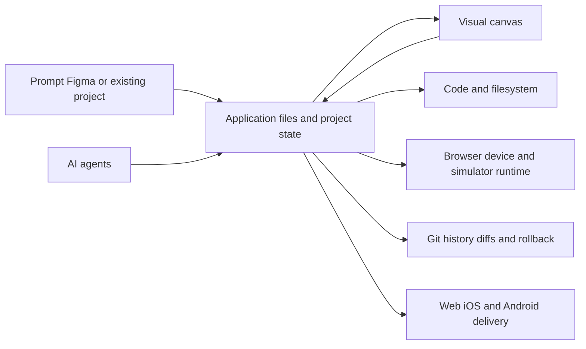

# Draftbit

> Research status: **Architecture-level** · Last reviewed: **2026-08-12**

Draftbit is a managed app-building environment in which AI agents human visual edits and code edits act on real project files. Its strongest authority claim is that the canvas is not a proprietary dead end: source control history and export are part of the ordinary product loop.

## One project has several projections

The workspace exposes an infinite canvas code and filesystem views cloud execution and browser device or simulator previews. AI agents can modify the same application a person manipulates visually. Figma and design-system inputs can seed the project but do not remain a second synchronized source of truth.

Before and after views distinguish a saved build from a current working build. GitHub and ZIP exits give the user an independent source authority while integrated publishing advances the managed project to platform targets.

## Collaboration and history are not one mechanism

Live presence and team roles govern concurrent access. Git history diffs and rollback govern source evolution. A visual undo gesture or working preview is not automatically a Git commit and a collaborator seeing a change does not prove it has entered a release build.

## Evidence ceiling

The closed product does not disclose the canvas-to-source mapper agent planner sandbox image build service or Git synchronization conflict rules. It is unknown which visual operations are deterministic AST changes and which trigger model rewrites. Figma import is evidenced as ingestion but arbitrary later Figma edits are not proven to round-trip.

First-party company material supports a United States organization boundary without exposing an internal product-team count.

## Primary evidence

- [Draftbit platform](https://draftbit.com/platform/)
- [Draftbit company](https://draftbit.com/about/)
