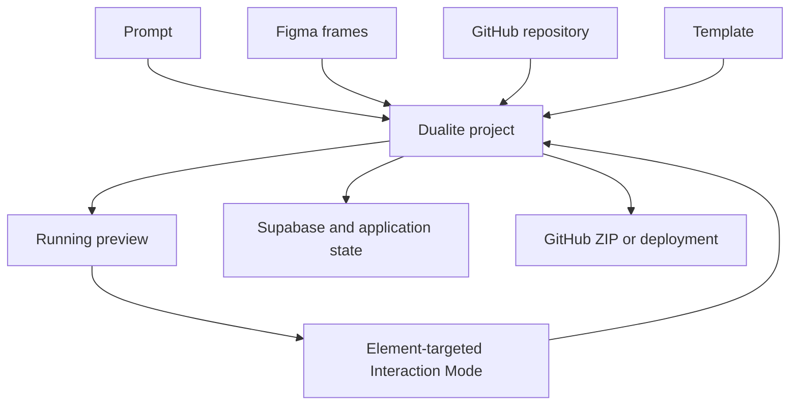

# Dualite

> Research status: **Architecture-level** · Last reviewed: **2026-08-11**

| Field | Value |
|---|---|
| Team | Dualite · team region not established |
| Ordinary job | begin with a prompt Figma file repository or template and continue until a deployable full-stack product exists |
| Authority | the code-backed Dualite project and its connected source repository |
| Lifecycle | active |

## Four entrances converge on one project

Dualite is not only a Figma exporter. Prompt Figma GitHub and template starts all enter a browser project containing frontend code backend wiring authentication and deployment state. A Figma import is converted into an editable working project; subsequent prompts can add behavior pages and Supabase-backed data.

Interaction Mode binds a natural-language request to the element selected in the running preview. That target binding is the decisive Design mechanism: the agent is revising a specific code-backed object rather than producing an untracked replacement image.

## The authority changes at import

Figma remains evidence of the imported visual intent but the live project becomes authoritative for later logic and visual changes. Current first-party material establishes adding Figma screens and continuing with AI; it does not establish a lossless push of arbitrary code-side changes back into the original Figma graph.

## Evidence ceiling

The project schema model routing code patch format autosave/version semantics and GitHub conflict behavior are not public. Marketing comparisons describe current capabilities but do not replace acceptance tests for fidelity accessibility framework quality or preservation of hand-written code.

## Primary evidence

- [Current Dualite product](https://dualite.dev/)
- [Figma import and continued AI editing](https://dualite.dev/blogs/how-to-import-figma-design-into-dualite)
- [Current input edit backend and delivery surface](https://dualite.dev/blogs/dualite-vs-kombai-which-ai-tool-should-you-choose-to-build-in-2026)
