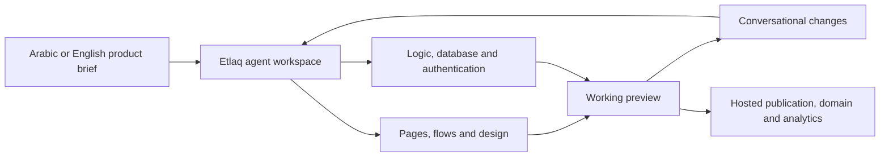

# Etlaq (إطلاق)

> Research status: **Architecture-level / closed-source boundary reached** · Last reviewed: **2026-08-11**

| Field | Value |
|---|---|
| Organization / team | Etlaq; first-party page identifies a Saudi technology company |
| Ordinary job | describe an Arabic- or English-language product, review a working application, refine it by conversation and publish it with regional business infrastructure |
| Status | active commercial product with free and paid builder tiers |
| Canonical artifact | a provider-managed application project spanning screens, logic, database, authentication, integrations, analytics and deployment state |
| Canonical URL | [etlaq.sa](https://www.etlaq.sa/) |
| Source availability | closed source |
| Pinned source revision | N/A — closed source |
| Evidence ceiling | the first-party product surface establishes the end-to-end project boundary and delivery claims; editor graph, source ownership, model orchestration, version semantics and deployment implementation are undisclosed |

## Its Design claim is a localized operating product

Etlaq does not stop at a UI image or static mockup. Its [first-party product page](https://www.etlaq.sa/) promises an initial draft containing pages, logic, database and design, followed by conversational revision and one-click publication. The same surface markets authentication, role permissions, APIs, hosting, analytics, SSL, CDN and more than 100 integrations.

The ordinary acceptance unit is therefore a working published product journey, not a single attractive screen. Pages can look plausible while RTL behavior, data permissions, payment flow or operational integrations are wrong.

## Arabic-first is structural context rather than translated chrome

Etlaq explicitly designs for Arabic business workflows: full RTL layout, Arabic fonts, bilingual content, Saudi payments such as Mada and local operating expectations. A sample prompt combines Arabic registration, payments and administrative approval in one product brief.

This matters technically because localization affects more than copy. Directionality, field order, mixed-script layout, validation, currency, payment providers and role flows all participate in the artifact. The public page does not document how those constraints are represented or tested internally, so “Arabic-first” remains a product contract that requires end-to-end acceptance on the generated app.

## The managed project is broader than its visible design

First-party material names three connected layers:

| Layer | Publicly described state | Evidence needed before delivery |
|---|---|---|
| experience | screens, flows, design, responsive RTL and bilingual content | browser behavior across key routes, roles and languages |
| application | logic, database, APIs, authentication and row-level security | real data mutations, authorization and failure paths |
| operation | hosting, domain, SSL, CDN, integrations, analytics and launch | deployed target, configuration ownership and production checks |

The chat is the control surface, while the hosted project is the durable product boundary. The site does not expose whether users can download source, inspect generated migrations, choose a runtime or reconnect an exported project. Those are consequential unknowns rather than assumed features.

## Revision is conversational but public version semantics are thin

Etlaq says users can review a working preview and change colors, layouts and content through natural language without a code editor. Plans include automatic backup. The public surface does not document named versions, diff, branching, restore, undo grouping, schema migrations or deployment rollback.

This leaves three clocks that must be verified separately:

1. the latest agent conversation and preview;
2. the provider's saved application project and data configuration;
3. the currently deployed public release.

An agent message or preview refresh cannot establish that the intended release is live, and a backup claim does not establish user-visible recovery semantics.

## Product boundary excludes a similarly named consulting tool

Search also surfaces `etlaq.com`, a Kuwait/US consulting firm and conversational business advisor. That is a different organization and product. The canonical object here is the Saudi application builder at `etlaq.sa`, whose own page calls it a Saudi technology company and reports Arabic-market infrastructure. This dossier records the name collision so a shared transliteration does not become a false merger.

## Evidence boundary

- **Established:** Etlaq is an active Saudi Arabic-first AI application builder; its claimed project spans UI, logic, database and deployment; users review, converse and publish from one service.
- **Inference:** the provider-managed application project is authoritative because design, data and release controls converge there while chat only directs changes.
- **Unknown:** source-code access, project schema, renderer/framework, model routing, tool permissions, data migration, version/rollback implementation, deployment isolation and fidelity of any export.
- **Not tested in this pass:** account creation and one complete Arabic RTL application journey through data, roles, Mada integration and deployment.

## Primary sources

- [Etlaq product, workflow and pricing](https://www.etlaq.sa/)
- [Etlaq technical blog](https://blog.etlaq.sa/)

## Research gaps

- Build one bilingual role-based application and test RTL, authentication, row-level permissions, data persistence and deployment.
- Determine whether users receive source, database schema and migration ownership or remain inside a fully managed project graph.
- Observe backup, restore and rollback behavior after a breaking conversational edit.
