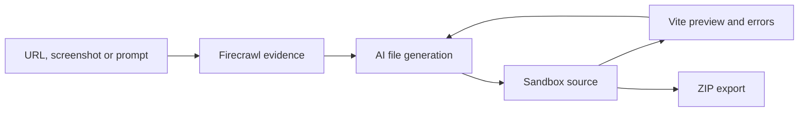

# Firecrawl Open Lovable

> Research status: **Source-level** · Lifecycle: **active** · Last reviewed: **2026-08-13**

Open Lovable is Firecrawl's open reference product for turning an existing URL or a prompt into an editable React reconstruction. The `beatnyk77/gcode` repository is a near-exact copy of this tree and resolves here; Argus is retained separately because it adds a persistent build and delivery model.

## Reconstruction begins with observed site evidence

Pinned revision: `69bd93bae7a9c97ef989eb70aabe6797fb3dac89`.

Firecrawl routes capture website content, screenshots and brand styles. Generation routes create React files in an isolated Vercel or E2B sandbox. The product reads sandbox files back, streams AI patches, detects packages and Vite errors, and renders a live preview. Visual edit intent can be translated into bounded source changes.

## The sandbox is current authority, not durable history

The ordinary loop operates on the live sandbox file set. ZIP creation exports a copy, while kill/restart/resume routes manage runtime. The inspected upstream does not establish account projects, build snapshots or a version ledger; losing the sandbox without an export can lose the continuing artifact.

## Pinned evidence

- [Repository](https://github.com/firecrawl/open-lovable)
- [Website evidence route](https://github.com/firecrawl/open-lovable/blob/69bd93bae7a9c97ef989eb70aabe6797fb3dac89/app/api/scrape-url-enhanced/route.ts)
- [Streamed source application](https://github.com/firecrawl/open-lovable/blob/69bd93bae7a9c97ef989eb70aabe6797fb3dac89/app/api/apply-ai-code-stream/route.ts)
- [Sandbox file retrieval](https://github.com/firecrawl/open-lovable/blob/69bd93bae7a9c97ef989eb70aabe6797fb3dac89/app/api/get-sandbox-files/route.ts)
- [ZIP export](https://github.com/firecrawl/open-lovable/blob/69bd93bae7a9c97ef989eb70aabe6797fb3dac89/app/api/create-zip/route.ts)
