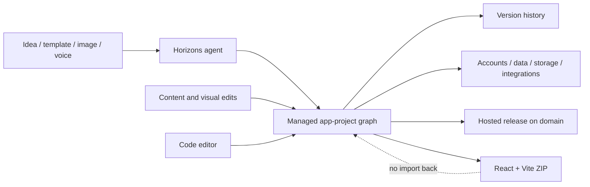

# Hostinger Horizons

> Research status: **Architecture-level** · Last reviewed: **2026-08-11**

| Field | Value |
|---|---|
| Team | Hostinger · headquartered in Vilnius, Lithuania |
| Ordinary job | describe an app or site, inspect and edit the working result, add real backend behavior, recover project versions and launch it |
| Managed authority | hosted Horizons application project |
| Owned-source exit | complete React + Vite ZIP; exported edits cannot be imported back |

## Design is part of a live application project

Horizons does not stop at a mockup. A project can contain the rendered interface, text and image content, user accounts, logins, databases, file storage, payments, analytics, custom domains and deployment. Users can ask the agent to change appearance or behavior, edit content directly, use a code editor on higher plans and publish through the same product.

The primary Design definition is therefore end-to-end product delivery. Delegated creation and visual authoring matter, but neither alone explains the continuing backend and release state.

## Version history is a product contract

Current plan documentation explicitly lists project version history. This gives the hosted project a recovery path that a one-shot generated preview would not have. The public page does not specify retention duration, branch semantics, per-file restoration or how database state relates to a visual-version rollback; those remain acceptance questions rather than inferred guarantees.

Projects can also be duplicated into remixable templates. Duplication creates another managed project; it is not evidence of a Git-style branch or merge model.

## Export transfers authority instead of synchronizing it

The official export guide is unusually clear. Horizons produces a complete Node.js project using React and Vite. A user may edit and deploy that code elsewhere, but an edited export cannot be imported into Horizons for more prompting. At export, durable authority can move to the user's files, but the managed project and exported repository become divergent lineages.

This one-way boundary prevents the dossier from describing “code ownership” as round-trip source authority. Inside Horizons, the provider-managed graph remains canonical; outside, the ZIP does.

## Evidence ceiling

No public implementation or internal schema is available. First-party contracts establish the user-visible graph, editing modes, version recovery, backend integration, export format and deployment boundary. They do not establish model orchestration, generated-code patching strategy, preview sandboxing, database migrations or atomicity between UI and backend edits.

## Primary evidence

- [Hostinger Horizons product](https://www.hostinger.com/horizons)
- [Official code export guide](https://www.hostinger.com/support/10771345-hostinger-horizons-how-to-export-code/)
- [Hostinger company location](https://www.hostinger.com/support/the-most-frequently-asked-questions-about-hostinger/)
