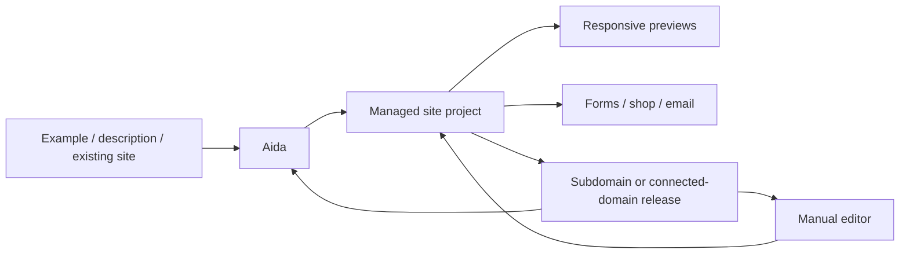

# one.com Aida

> Research status: **Architecture-level** · Last reviewed: **2026-08-11**

| Field | Value |
|---|---|
| Team | one.com · team region not established for this product lineage |
| Ordinary job | build a small-business site in conversation then mix Aida and manual changes before and after publication |
| Native authority | managed Aida site with pages responsive variants forms commerce and domain state |
| Delivery | provider subdomain or connected domain on one.com hosting |

## Publication does not end editing

Aida can start from an example freeform description or modernization request. The user can ask for further changes or use manual tools at any time including after publishing. Desktop tablet and mobile previews expose responsive results. Contact forms shops email and domain connection remain operational state in the same project.

## Modernization creates a new managed lineage

Current help says an existing classic one.com Website Builder site cannot be moved directly into Aida. Modernize can generate a new version but may require a new plan and domain. This is not a round trip to the old project and the dossier keeps that ownership boundary explicit.

The product targets simpler sites and does not claim advanced multi-site workflows. Managed project and hosting state define the artifact; no owned source export is documented in the reviewed flow.

## Evidence ceiling

No implementation or schema is public. AI patch granularity version recovery responsive layout authority and modernization fidelity remain unknown. Domain connection limitations are changing and should be rechecked at later snapshots.

## Primary evidence

- [Aida AI Website Builder FAQ](https://help.one.com/hc/en-us/articles/46266458442129-FAQ-Aida-AI-Website-Builder)
- [Aida help category](https://help.one.com/hc/en-us/categories/46878740562321-Aida-AI-Website-Builder)
- [Aida application](https://aida.one.com/)
