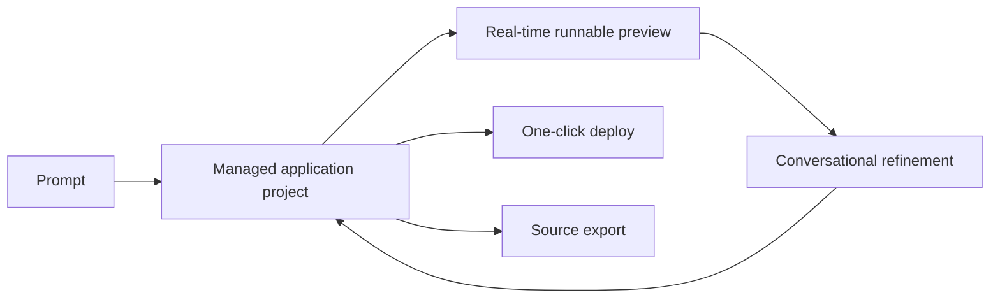

# Prompt To App

> Research status: **Architecture-level** · Last reviewed: **2026-08-12**

Prompt To App is an AI application builder whose retained artifact is a functional software project rather than a static UI proposal. The product loop spans generation live execution conversational revision source exit and deployment.

## Ordinary user loop

1. Describe an application.
2. Let the service generate full-stack source.
3. Exercise the result in a real-time preview.
4. Ask for changes in chat and inspect the new behavior.
5. deploy through the service or export the code.

The advertised targets include web applications with React Vue or JavaScript mobile projects with React Native or Flutter and Chrome extensions. Those targets cannot share one hidden runtime unchanged; the closed service necessarily has target-specific scaffolding and execution paths but does not publicly disclose them.

## Authority changes at export

Inside the service the provider-managed project and its preview are the working authority. A code export transfers that authority to user-controlled files; a deployment advances a provider-managed revision to a delivered endpoint. Public material does not establish an import path that reconciles arbitrary edits to an exported repository back into the same hosted project.

“Full stack” is a product promise rather than a public schema. Database models secrets backend execution version retention collaboration rollback and deployment atomicity are not disclosed. The dossier therefore does not infer them from the presence of a preview button.

Team region remains unknown because no stable first-party company-location evidence was found in the reviewed surface.

## Primary evidence

- [Prompt To App product](https://prompttoapp.dev/)
- [Supported project targets and workflow](https://prompttoapp.dev/)
