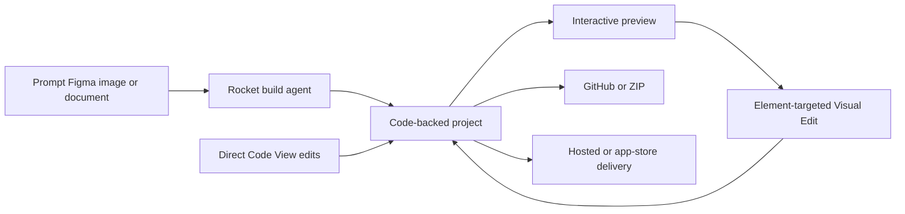

# Rocket.new

> Research status: **Architecture-level** · Last reviewed: **2026-08-11**

| Field | Value |
|---|---|
| Team | DhiWise → Rocket.new · team region not established |
| Ordinary job | turn a prompt design reference or Figma input into a working app and continue through visual edits code and deployment |
| Authority | the Rocket project and its editable source files |
| Lifecycle | active transition from the DhiWise design-to-code product |

## Visual selection writes to the same code project

Rocket can start from natural language Figma or other attached visual and document inputs. It generates a web or mobile code project with a running preview. Visual Edit binds controls and a quick natural-language request to a selected element; saving writes those pending edits to source. Code View exposes the same files for precise manual work and GitHub or ZIP moves that source outside the hosted surface.

The important coupling is explicit: direct manipulation AI changes and manual code edits are views over a continuing project rather than disconnected generations. The user owns and can export the source.

## DhiWise is a lineage transition not another team

The DhiWise homepage now identifies the product as Rocket.new. DhiWise documentation still exposes the earlier Figma-to-React and Flutter translation path; the current Rocket surface expands that lineage to prompt-led full applications research backend integrations visual editing and deployment. One team lineage is counted with the current product as canonical.

Figma remains an import channel. Current Rocket documentation says adding screens is supported while updating existing screens from later Figma changes is not yet fully supported. This is not a lossless bidirectional Figma-code bridge.

## Evidence ceiling

The hosted project format patch protocol model orchestration build isolation autosave checkpoints and Git merge semantics are closed. Public docs establish user-visible source ownership and editing paths but do not independently validate production quality or one-prompt completion claims.

## Primary evidence

- [DhiWise transition to Rocket.new](https://www.dhiwise.com/)
- [Rocket current product](https://www.rocket.new/)
- [Visual edits written to code](https://docs.rocket.new/build/editor/visual-edit)
- [Code ownership persistence and Figma limitations](https://docs.rocket.new/help/faq)
