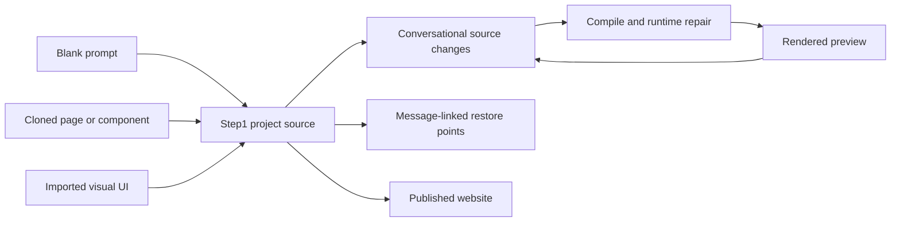

# Step1

> Research status: **Architecture-level** · Last reviewed: **2026-08-12**

Step1 is an AI website workspace organized around acquiring a visual starting point and continuing it as editable source. A project can start from a prompt, a whole cloned page, a selected component from another site or an imported existing site.

## Cloning captures visual UI rather than the original application

The browser extension opens the captured page or component in Step1's editor. The documentation explicitly limits import to visual UI: application logic, data behavior and existing interactions do not come with it. “Pixel perfect” is therefore a product claim about the reconstructed appearance, not evidence of semantic equivalence to the source site.

Magic Fusion adds another provenance path. The user points to an element on an external page and describes how it should be fused into the current project. The agent then adapts the selected visual direction to the retained site rather than merely saving a screenshot reference.

## The retained authority is the editable site project

Natural-language edits modify the project and the product observes compile and runtime errors so it can attempt repairs. The user can restore code from a prior message or use the top-level restore control. Those checkpoints make the conversation a mutation history rather than merely a chat transcript.

## Product boundary and evidence ceiling

Step1 owns the hosted project and publication path. It is not counted once for cloning and again for Fusion because both converge on the same editor authority. The closed implementation leaves the DOM-to-source capture method, internal code representation and exact repair policy unverified. The dossier therefore does not treat marketing claims of exactness as implementation evidence.

## Primary evidence

- [Step1 documentation](https://docs.step1.dev/en)
- [Project starts, AI edits and restore controls](https://docs.step1.dev/en/get-started)
- [Clone boundary](https://docs.step1.dev/en/clone)
- [Prompt and debugging guide](https://docs.step1.dev/en/basics)
- [Current product](https://step1.dev/)
