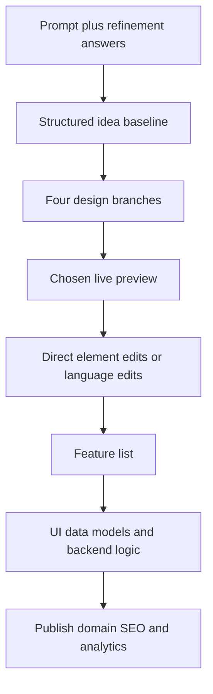

# Superun

> Research status: **Architecture-level** · Last reviewed: **2026-08-12**

Superun is a managed AI application builder organized around four decision stages: Idea, Preview, Build and Launch. Unlike its Prompt.to.design Figma plugin, the canonical artifact is a hosted full-stack project whose UI, data model, backend integrations and publication settings are managed together.

## Design branches precede implementation

An initial prompt is refined through questions and normalized into an editable idea definition. Superun then generates four design branches. After choosing a direction, the user works in a live full-page preview, selects elements and changes layout, content, spacing or style directly or through natural language.

The distinction between demo/prototype and development is explicit: the first two validate UI and workflow with fake data, while development connects real behaviors. This prevents a visual preview from being misreported as a functioning product.

## Managed project authority and limits

Feature selection can provision UI, data and backend logic through Superun Cloud and integrations such as Supabase, Stripe and AI services. Editable Design and Code modes expose different views of the project; public evidence does not disclose the canonical intermediate representation, database migration behavior, source repository ownership, merge semantics or rollback guarantees.

Manual edits are described as incrementally saved and generation or branching is blocked during a manual-edit session. This is useful concurrency evidence, but it does not establish multi-user conflict resolution or lossless version control.

The reviewed first-party documentation does not make a reliable legal-team geography claim, so region remains unknown.

## Primary evidence

- [Getting started: Idea to Launch](https://docs.superun.ai/superun/introduction/getting-started)
- [Idea refinement and editable baseline](https://docs.superun.ai/superun/features/prompt-question)
- [Modes, Figma import and publishing FAQ](https://docs.superun.ai/superun/introduction/faq)
- [Manual editing and incremental save changelog](https://docs.superun.ai/superun/changelog)
