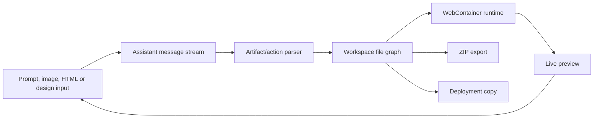

# We0.ai

> Research status: **Source-level** · Lifecycle: **active-transition** · Last reviewed: **2026-08-13**

We0 is one product lineage with two evidence layers that must not be collapsed. The current managed product turns business material into a published website, CMS and growth surface. The public `we0-dev/we0` repository exposes an earlier design-to-code workspace and its browser execution grammar; it does not establish that the current hosted multi-agent service still runs the same implementation.

## Current authority is the managed site project

The ordinary user gives We0 business goals and brand material, receives planning and visual proposals, continues editing the generated site and content, and publishes from the same managed project. Pages, CMS data, domain configuration and release state therefore outrank any one generated code snapshot in the current product.

The public product describes planning, design, technical and SEO/GEO roles. That is evidence for functional specialization, not for an independently recoverable transaction across every agent.

## The public workspace makes the older artifact grammar inspectable

Pinned source revision: `3258d6d8348e56e8580bcbec8e42a3894d6113d6`.

The earlier client parses assistant messages containing Bolt-style artifact and action tags into a file-oriented workbench. Those actions feed a file store and a WebContainer-backed IDE; the preview iframe is a projection of the running filesystem, not a separate canvas document. The same workspace exposes code editing, terminal state and file-tree operations.

This source also shows why chat is not itself the artifact. Messages can be persisted in browser storage and replayed, while the runtime filesystem and preview have their own lifecycle. ZIP export and a deploy route create delivery copies; neither proves that every hosted site state can be reconstructed from chat alone.

## Transitional boundary

The public repository contains HTML-to-design and Figma-oriented entry points, whereas current first-party pages emphasize websites, CMS operation and growth. This dossier treats that as a product transition. It does not merge every historical capability into the present service or claim that the repository is the source of the current hosted agent, model routing, CMS schema, rollback behavior or publishing backend.

## Decisive evidence

- [Current We0 product](https://we0.ai/)
- [Official company and current product definition](https://we0.ai/zh/about-us)
- [Public source repository](https://github.com/we0-dev/we0)
- [Pinned chat handler](https://github.com/we0-dev/we0/blob/3258d6d8348e56e8580bcbec8e42a3894d6113d6/apps/we-dev-next/src/app/api/chat/handlers/chatHandler.ts)
- [Pinned WebContainer filesystem adapter](https://github.com/we0-dev/we0/blob/3258d6d8348e56e8580bcbec8e42a3894d6113d6/apps/we-dev-client/src/components/WeIde/services/webcontainer/filesystem.ts)
- [Pinned deployment route](https://github.com/we0-dev/we0/blob/3258d6d8348e56e8580bcbec8e42a3894d6113d6/apps/we-dev-next/src/app/api/deploy/route.ts)
