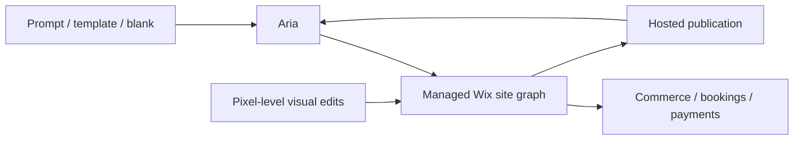

# Wix Harmony

> Research status: **Architecture-level** · Last reviewed: **2026-08-11**

| Field | Value |
|---|---|
| Team | Wix · Israel |
| Ordinary job | start or reshape a production business site through Aria and then continue with full visual editing and publication |
| Native authority | managed Wix site graph and attached business capabilities |
| Identity boundary | current Harmony builder; retired Wix ADI is a predecessor and Base44 remains a separately branded acquired product |

## Aria continuously mutates the normal site

Harmony starts from a prompt template or blank canvas. Aria can create a whole site page section or custom element and can configure business capabilities. Direct drag-and-drop editing addresses the same site immediately afterward. The agent remains available across editor and dashboard rather than handing off a one-time generated snapshot.

## Stable host architecture bounds local changes

Wix says Aria understands site structure and can make scoped changes without breaking unrelated functionality. This establishes a native managed-graph contract but not its internal transaction or dependency model. Built-in infrastructure and business services make product delivery primary: the artifact remains operational after visual generation.

Wix ADI was retired for new sites and legacy projects open in the Wix Editor. Harmony is therefore the current lineage rather than a second record beside ADI. Base44 has its own product identity and dossier even though Wix owns it.

## Evidence ceiling

The implementation is closed. Site schema patch planning version restore custom-element sandboxing and cross-surface consistency are not public. Reliability claims apply to Wix infrastructure and do not prove every agent-generated business flow correct.

## Primary evidence

- [Wix Harmony](https://www.wix.com/harmony)
- [Harmony launch and mechanism](https://www.wix.com/press-room/home/post/wix-launches-wix-harmony-the-ai-website-builder-that-merges-human-and-artificial-intelligence-rein)
- [Current AI builder and ADI transition](https://www.wix.com/ai-website-builder)
