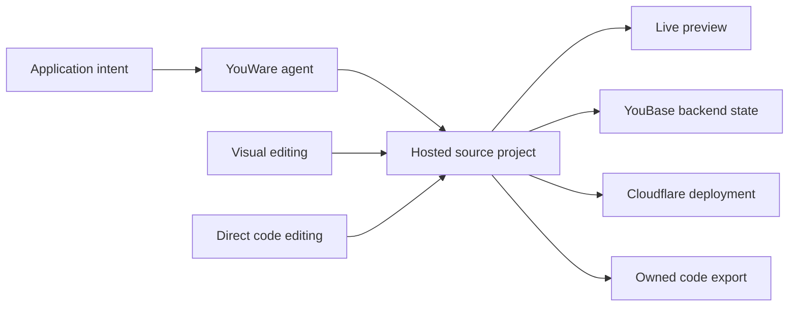

# YouWare

> Research status: **Architecture-level** · Last reviewed: **2026-08-11**

| Field | Value |
|---|---|
| Team | YouWare · team region not established |
| Ordinary job | generate a working web application then alternate among agent visual and source edits before deploying or exporting it |
| Project authority | hosted application source and configuration with live preview |
| Runtime services | YouBase auth data storage and logic plus Cloudflare deployment |

## Source and visual editing share one application

YouWare generates a React application with interface structure and logic. Users can click UI to edit it ask AI for changes or open the code editor. Backend functions such as authentication database and file storage stay attached to the project. Publishing produces a live link and code can be exported for external ownership.

## Export may transfer authority

Inside YouWare the source-bearing managed project is canonical. An exported repository can become a new authority outside the product. Public pages do not establish import of external changes or a Git round trip so export is recorded as a transfer boundary rather than permanent synchronization.

Visual edits and AI edits are valuable because they converge on the same working code and runtime. This distinguishes YouWare from a mockup generator and makes product delivery primary.

## Evidence ceiling

The hosted implementation is closed. File schema patch strategy backend migrations version history sandboxing deployment rollback and export/import semantics are not public. “Full code access” must be evaluated against plan and generated project scope.

## Primary evidence

- [YouWare web app builder](https://www.youware.com/features/web-app-builder)
- [YouWare AI code editor](https://www.youware.com/features/ai-code-editor)
- [YouWare website builder and export boundary](https://www.youware.com/features/ai-website-builder)
