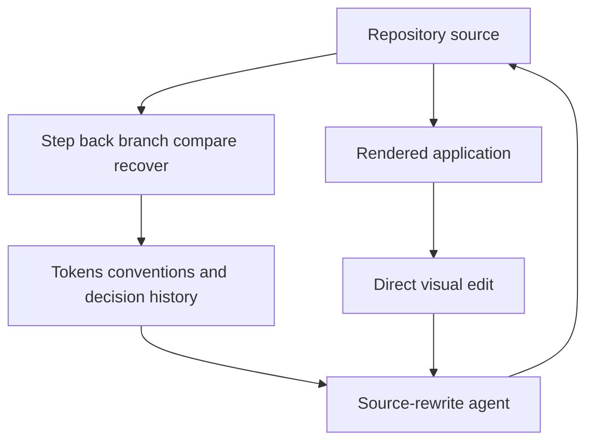

# Caliper

> Research status: **Architecture-level** · Last reviewed: **2026-08-12**

Caliper is an early-access code-native visual design tool. It renders a real application lets a person manipulate what they see and asks an agent to rewrite the owning source using repository selectors tokens conventions and accumulated design history.

## Design history becomes agent context

Caliper's unusual claim is not only live visual editing. The project profile remembers accepted rejected and refined changes together with conventions and commits. Later agent actions can therefore be conditioned on prior design decisions rather than the current pixels alone.

Source remains authoritative. A preview mutation is useful only when the agent materializes a corresponding file change and the application rerenders successfully.

## Branching separates alternatives

The product advertises a rich design history with step-back branching comparison and recovery. This is candidate promotion at the source level rather than a list of generated screenshots. Public material does not establish whether branches are Git branches private product snapshots or both nor how uncommitted user changes are protected.

## Early-access evidence boundary

The implementation is closed and access is limited. DOM-to-source identity AST rewriting framework coverage history schema merge semantics model provider and recovery guarantees are not publicly disclosed. The product contract is sufficient to identify the authority arrangement but not to claim deterministic editing or production readiness.

Team region remains unknown in the reviewed first-party evidence.

## Primary evidence

- [Caliper product](https://www.calipr.design/)
- [Caliper early-access workflow](https://www.calipr.design/)
