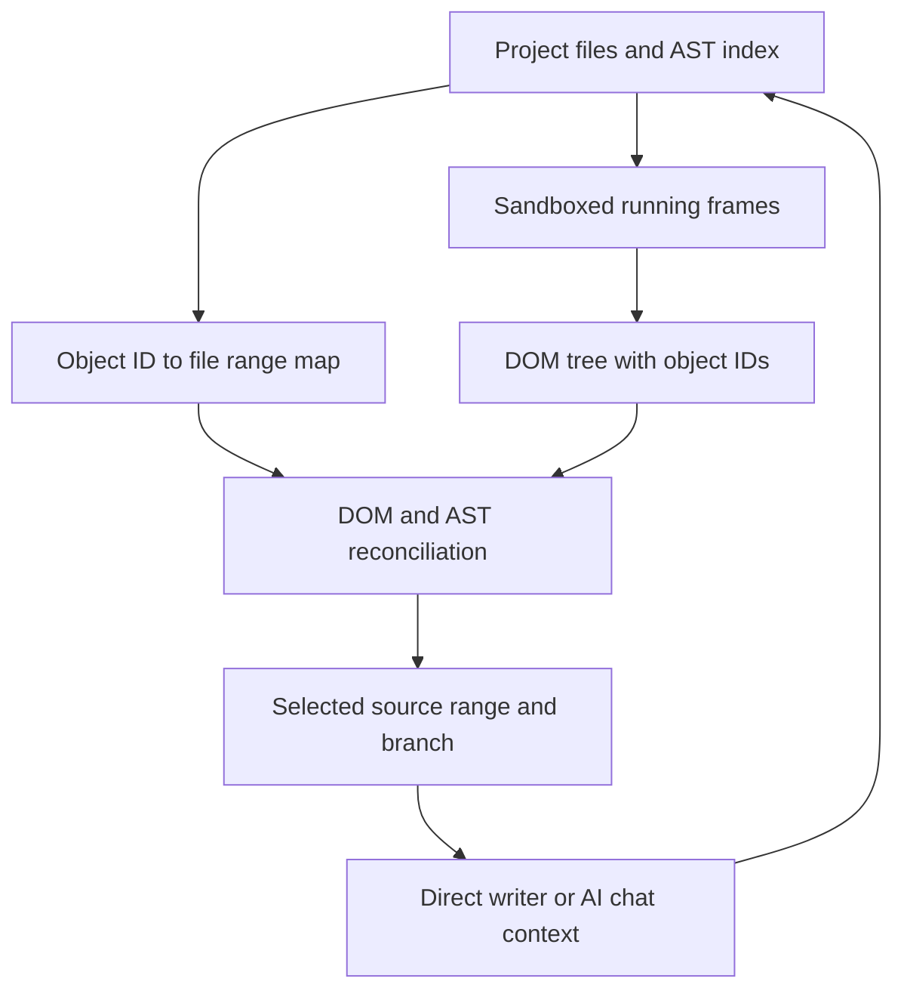

# CodeCanvas AI

> Research status: **Source-level** · Last reviewed: **2026-08-12**

| Field | Verified value |
|---|---|
| Maintainer | Farid Garcia / `FaridDevU` |
| Product | local-first visual design IDE derived from a VS Code and Onlook-oriented codebase |
| Canonical authority | project files inside branch workspaces |
| Element join | injected object IDs plus DOM and AST reconciliation |
| Pinned source | [`fc731386f70d3c4e0f76de3c128bbf607dcfd04d`](https://github.com/FaridDevU/CodeCanvas-AI/tree/fc731386f70d3c4e0f76de3c128bbf607dcfd04d) |

CodeCanvas AI places multiple live application frames on a canvas while retaining a code editor chat Git branches assets and history. The selected visual element is converted back into file and source-range context before either deterministic editing or an agent change.

## DOM and AST each provide missing identity

Rendered nodes carry object IDs. The DOM reveals the live tree but can hide the JSX component instance that produced a child. The AST index knows file ranges components and JSX instances but not the final runtime tree. The documented algorithm walks both structures and uses parent-child component changes and index matching to recover an instance location.

The matching is constrained and can fail for dynamic trees fragments generated content or unsupported syntax. The code explicitly falls back when it cannot locate a safe range.

## Direct HTML writes are range-bounded

`html-source-writer.ts` parses source and uses `MagicString` to update attributes inline styles text removal and insertion for an identified node. It preserves or migrates CodeCanvas IDs and rejects operations that cannot be represented safely such as replacing text in a node with element children. Broader JSX edits use the editor engine and agent path rather than pretending every HTML operation generalizes.

Selected elements automatically refresh chat context with the owning file exact highlighted code and branch metadata. This means a request sent after another edit reads current content rather than a stale initial snapshot.

## Source map

| Pinned path | Evidence |
|---|---|
| [`design-editor-src/src/components/store/editor/ast/`](https://github.com/FaridDevU/CodeCanvas-AI/tree/fc731386f70d3c4e0f76de3c128bbf607dcfd04d/design-editor-src/src/components/store/editor/ast) | DOM/AST instance-recovery algorithm |
| [`design-editor-src/src/lib/html-source-writer.ts`](https://github.com/FaridDevU/CodeCanvas-AI/blob/fc731386f70d3c4e0f76de3c128bbf607dcfd04d/design-editor-src/src/lib/html-source-writer.ts) | deterministic range mutation |
| [`design-editor-src/src/lib/inspector-script.ts`](https://github.com/FaridDevU/CodeCanvas-AI/blob/fc731386f70d3c4e0f76de3c128bbf607dcfd04d/design-editor-src/src/lib/inspector-script.ts) | runtime element instrumentation and messaging |
| [`design-editor-src/src/components/store/editor/chat/context.ts`](https://github.com/FaridDevU/CodeCanvas-AI/blob/fc731386f70d3c4e0f76de3c128bbf607dcfd04d/design-editor-src/src/components/store/editor/chat/context.ts) | selected file range and branch context for agents |
| [`design-editor-src/src/components/store/editor/branch/`](https://github.com/FaridDevU/CodeCanvas-AI/tree/fc731386f70d3c4e0f76de3c128bbf607dcfd04d/design-editor-src/src/components/store/editor/branch) | branch-scoped project authority |

## Provenance and limits

The repository contains substantial upstream-derived code and third-party notices. The pinned revision establishes the shipped source mechanism but does not establish that every inherited backend or brand service is independently operated by the maintainer. Framework support and branch isolation need real-project testing. Team region remains unknown.

## Primary evidence

- [Pinned repository](https://github.com/FaridDevU/CodeCanvas-AI/tree/fc731386f70d3c4e0f76de3c128bbf607dcfd04d)
- [Product](https://getcodecanvas.dev/)
- [License and notices](https://github.com/FaridDevU/CodeCanvas-AI/blob/fc731386f70d3c4e0f76de3c128bbf607dcfd04d/LICENSE.txt)
