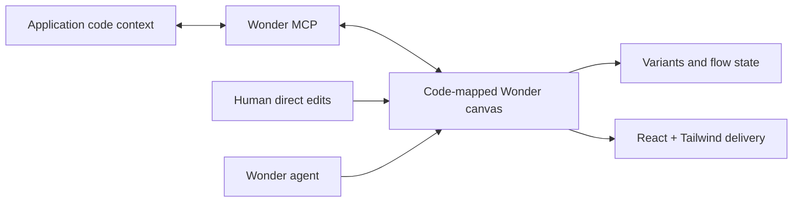

# Wonder

> Research status: **Architecture-level** · Last reviewed: **2026-08-11**

| Field | Value |
|---|---|
| Team | Wonder · team region not established |
| Ordinary job | generate and directly edit UI on a code-backed canvas then move changes between design and an application agent |
| Authority | Wonder's code-mapped design document |
| Lifecycle | public alpha |

## Design data and code are intended to round-trip

Wonder states that its design representation maps one-to-one to code. The canvas supports precise selection edits, style variants and continuing flows; React and Tailwind can be copied for delivery. Its MCP server can read and write Wonder design data, so a coding agent can bring an existing component context into the canvas or update the canvas from code-side intent.

## “One-to-one” is a product contract not an inferred parser

First-party documentation establishes direct data access and bidirectional tools but does not publish the design schema or mapping implementation. The dossier therefore records source-authority/live-projection architecture at the observable boundary without claiming lossless equivalence for arbitrary React components or round-trip preservation of application logic.

Wonder follows the same founding team’s earlier Superflex design-to-code product. The later candidate is resolved into this current lineage rather than counted as another active team. That lineage transition matters because the authority moved from export-oriented translation toward a continuing code-and-canvas document.

## Evidence ceiling

Public alpha evidence does not establish file serialization, autosave guarantees, named versions, branch/merge behavior, MCP authorization or conflict semantics. Exact production compatibility remains an acceptance question per codebase.

## Primary evidence

- [Wonder product](https://wonder.design/)
- [Wonder MCP documentation](https://wonder.design/docs/mcp)
- [Wonder public-alpha lineage account](https://www.producthunt.com/products/wonder-public-alpha)
