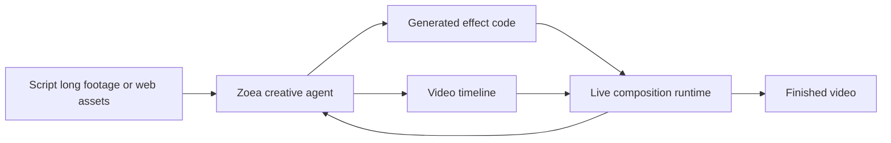

# Zoea

> Research status: **Architecture-level** · Last reviewed: **2026-08-12**

| Field | Value |
|---|---|
| Team | Zoea · team region not established |
| Ordinary job | converse over scripts or long footage while an agent builds and changes a desktop video project |
| Working authority | timeline plus generated effect code and imported media |
| Runtime evidence | live preview of the composed video |
| Lifecycle | active |

## Effects are authored as code rather than a fixed menu

Zoea's desktop application combines chat script and Markdown context a preview timeline and a code editor. It can identify moments in long recordings import web media and write the implementation for requested captions transitions motion graphics or compositing effects. The generated effect is judged in the same live preview as manually assembled media.

This code-and-runtime loop distinguishes Zoea from editors that expose only opaque generative operations. The public material does not disclose its project file format execution sandbox supported effect APIs save/version implementation or export interchange. Availability on macOS and Windows establishes a current user surface but not source openness.

## Primary evidence

- [Zoea desktop creative-agent surface](https://zoea.io/)
- [Official script-to-video workflow](https://zoea.io/docs/script-to-video-workflow)
- [Motion graphics as code](https://zoea.io/docs/motion-graphics-as-code)
