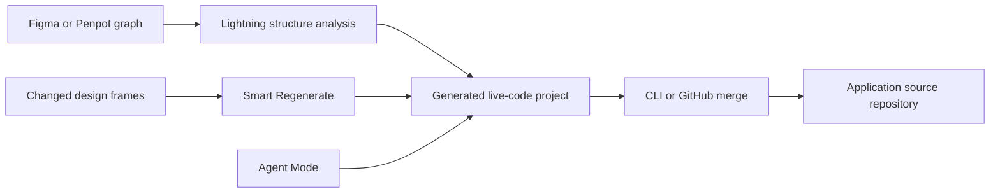

# Locofy

> Research status: **Architecture-level** · Last reviewed: **2026-08-11**

| Field | Value |
|---|---|
| Team | Locofy · team region not established |
| Ordinary job | turn an existing Figma or Penpot interface into framework code and keep integrating later design changes |
| Upstream authority | selected design frames components links and responsive intent |
| Downstream authority | the generated code after it is pulled or merged into the user's repository |
| Lifecycle | active |

## Regeneration is narrower than round-trip editing

Locofy's Lightning flow reads layout groups auto-layout breakpoints element roles and reusable components before it generates a live code preview. Later runs use Smart Regenerate to identify changed design frames instead of blindly rebuilding the whole project. Agent Mode then modifies the generated UI with natural-language requests for responsiveness accessibility themes and other code-level concerns.

The CLI has local project context and can reuse existing components while merging generated output. That makes this a continuing materialization pipeline rather than a ZIP-only converter. It does not make Figma and application source co-equal. Once developers add application logic the repository is the downstream authority; a later design regeneration is an integration event with possible conflicts.

## What is actually mapped

- Frames grouping auto-layout and consistently named breakpoint variants inform responsive structure.
- Prototype links and element tags inform actions and semantic elements.
- Design components can be matched to existing code components.
- Agent and Visual modes operate the generated project before source delivery.

## Evidence ceiling

Public documentation does not expose the Large Design Model representation diff grammar merge algorithm or conflict-resolution invariants. “Smart merge” therefore remains a product contract. Exact behavior for hand-edited files design deletions renamed components and application state requires repository-level acceptance testing.

## Primary evidence

- [Plugin quickstart and Lightning flow](https://www.dev.locofy.ai/docs/plugin/quickstart/)
- [Context-aware CLI pull](https://www.locofy.ai/docs/export-and-deployment/cli-pull/)
- [Builder Agent and Visual modes](https://www.dev.locofy.ai/docs/url/builder/)
- [GitHub synchronization](https://www.locofy.ai/docs/plugin/export-and-deployment/sync-with-github/)
