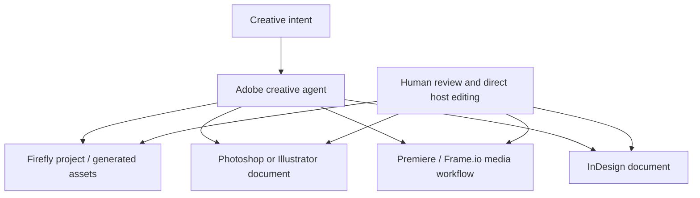

# Adobe Firefly Creative Agent

> Research status: **Architecture-level** · Last reviewed: **2026-08-11**

| Field | Value |
|---|---|
| Team | Adobe · San Jose, United States |
| Ordinary job | delegate a multi-step creative task while retaining correction and document authority in Firefly or a Creative Cloud host |
| Canonical unit | one cross-application creative-agent lineage, not one new product for every host application |
| Lifecycle | active-transition; public beta and private-beta surfaces coexist |

## One orchestration lineage crosses several native authorities

Adobe describes Firefly AI Assistant as powered by a creative agent. The agent plans and executes multi-step work, can use different models and is expanding from Firefly into Premiere, Photoshop, Illustrator, InDesign and Frame.io; After Effects and parts of the unified Firefly creation experience remain at earlier access stages. The census counts that orchestration lineage once and treats host-specific skills as surfaces, avoiding an inflated product count.

## The agent does not erase host-native documents

The decisive mechanism is external-agent control across established visual platforms. A Photoshop, Illustrator, InDesign or Premiere artifact remains governed by its host's native document and editing semantics; the creative agent coordinates operations over those authorities. In Firefly, Projects and the unified creation surface provide a managed workspace around generated and edited assets.

Firefly Creative Production shows a second boundary: a no-code modular workflow builder can define inputs, processing and outputs for batch asset production and review. That workflow graph is operational automation, while the resulting creative files remain deliverables. The dossier does not merge the production workflow itself with every host document.

## Transition and evidence ceiling

Adobe's April and June 2026 announcements distinguish public beta, private beta and expanded app availability. This record therefore uses `active-transition` rather than silently treating every announced surface as generally available. Public evidence establishes user-visible orchestration and host scope, not internal planning graphs, tool-call protocols, cross-app transactionality or a shared version model.

## Primary evidence

- [Adobe announces the creative agent and Firefly AI Assistant](https://news.adobe.com/news/2026/04/adobe-new-creative-agent)
- [Adobe expands creative agents across Creative Cloud](https://news.adobe.com/news/2026/06/adobe-unveils-major-expansion)
- [Firefly Creative Production FAQ](https://helpx.adobe.com/enterprise/using/firefly-creative-production-faq.html)
