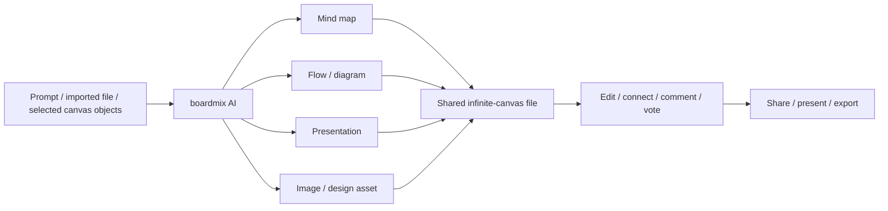

# boardmix AI

> Research status: **Architecture-level** · Last reviewed: **2026-08-11**

| Field | Value |
|---|---|
| Team | Shenzhen Bosiyunchuang Technology · China |
| Ordinary job | ask AI to structure or create visual working material and continue arranging, editing and deciding with a team on one infinite canvas |
| Native authority | boardmix workspace file containing editable canvas objects and embedded artifacts |
| Count boundary | one boardmix AI product surface, not one product per advertised agent or artifact template |

## Design here means structured visual work, not only interface design

boardmix AI spans mind maps, flowcharts, presentations, documents, images, code blocks, diagrams and reusable analysis frameworks. Generated output can enter a boardmix file, where users can edit objects, rearrange them on the infinite canvas, connect them to other work, comment, vote, present and export.

The record belongs in the landscape because the AI output becomes a continuing structured visual artifact. It is not included merely because the site advertises hundreds of chat agents. A response that stays in chat would not meet the boundary; adding an editable mind map, flow, deck or design to the native file does.

## One file can hold several artifact grammars

Each artifact type has different internal semantics, so “native graph authority” here means a host-owned family of structured objects, not one homogeneous schema. The dossier does not claim that generated presentation slides and mind-map nodes have identical mutation or history behavior.

## Persistence and collaboration

The workbench creates named files in personal or team space. Pricing and help pages distinguish editable-file limits, storage, sharing and file creation. AI outputs added to a file can be edited later; existing content remains viewable and editable subject to plan capacity. Public pages do not establish fine-grained version restoration or atomic rollback for a multi-artifact agent action.

The material library is a separate reusable-asset layer for uploaded images, files and media. It supports labels, preview and reuse on the canvas, but should not be confused with a version history for the entire board.

## Product and team identity

BoardMix/boardmix and 博思 AI are localized names around the same account and canvas lineage. The official about and service pages identify 深圳市博思云创科技有限公司 and a Shenzhen address, supporting a China region classification independently of the query language.

## Primary evidence

- [boardmix AI and collaborative canvas](https://boardmix.cn/)
- [Official AI-agent help surface](https://boardmix.cn/help/zh/search?q=%E5%8D%9A%E5%9B%BE+AI)
- [boardmix AI agents and artifact types](https://boardmix.cn/ai-agent/)
- [Provider and Shenzhen address](https://boardmix.cn/about-us/)
