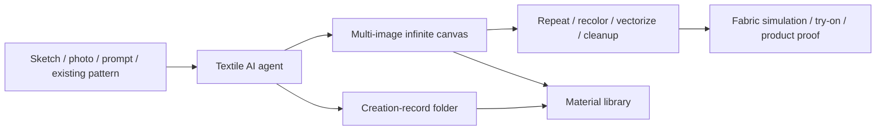

# Botlab.art

> Research status: **Architecture-level** · Last reviewed: **2026-08-11**

| Field | Value |
|---|---|
| Team | Botlab.art · China |
| Ordinary job | create, modify, repeat and proof textile patterns with an AI agent and specialist production tools on one visual workbench |
| Continuing workspace | multi-image infinite canvas plus a categorized material library |
| Recovery evidence | generated work is placed in the material library's `创作记录` (creation records) folder |

## Textile Design is not reduced to image generation

Botlab combines a conversational agent, an infinite canvas and more than thirty textile-specific operations. The user can manage several images together, generate or modify patterns, create seamless repeats, remove fabric texture/backgrounds, recolor, vectorize and upscale. Virtual try-on, fabric simulation and product previews carry the result toward sampling and delivery.

That domain chain is the reason for inclusion. A generic image generator could output a floral bitmap; Botlab frames the bitmap inside repeat construction, material preparation and production preview work understood by textile designers.

## The material library closes the earlier recovery gap

The initial verification pass could see a canvas and a material library but not whether generated work survived as recoverable user state. The current first-party account page states that images created in applications are uniformly stored under the material library's creation-record folder; users can browse those records alongside uploaded files and their own categories.

This establishes durable managed continuation at the asset level. It does not establish a complete version graph for canvas layout, agent conversation or every transformation parameter. The dossier therefore distinguishes saved generated assets from unverified canvas-history semantics.

## Authority changes across the production path

Within Botlab, the canvas/library owns creative selection and reusable source assets. A seamless repeat, vector conversion or production-resolution file can become the handoff authority for a print workflow. Virtual try-on and fabric simulation are proofs, not necessarily manufacturing files.

Public pages do not expose internal formats, color-management rules, repeat metadata, rollback guarantees or transaction boundaries. Those remain central acceptance questions for professional use.

## Product and team identity

Indexed pages use both 保丽智绘 and the current 保特丽布 branding while retaining the Botlab.art domain, account system and textile tool family. They resolve to one continuing service. The official about page attributes the company address to China; the dossier does not infer a more precise city.

## Primary evidence

- [Botlab.art product page](https://www.botlab.art/)
- [First-party team and product description](https://www.botlab.art/about)
- [First-party material-library creation records](https://www.botlab.art/user)
