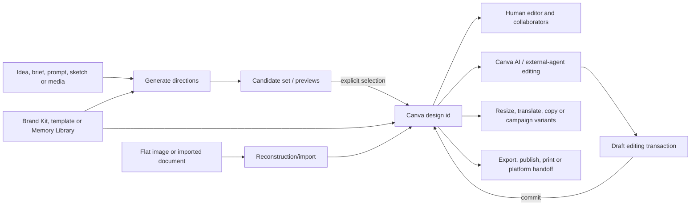

# Canva Magic Design

> Research status: **Architecture-level / closed-source boundary reached** · Last reviewed: **2026-08-11**

| Field | Value |
|---|---|
| Organization / team | Canva |
| Category | Candidate-based generative design evolving into a conversational, layered visual-creation platform |
| Status | Active lineage; Magic Design launched in 2023, absorbed into Canva AI in 2025, with Canva AI 2.0 in research preview in 2026 |
| Current artifact | Hosted Canva design with native pages/elements, edit permissions and destination-specific exports/publications |
| Current AI direction | Canva Design Model, conversational design, agentic orchestration, layered object intelligence, brand intelligence and persistent Memory Library |
| Public agent edge | Remote Canva MCP with candidate promotion and draft/commit editing transactions; Connect APIs and Apps SDK expose bounded design resource/element contracts |
| Source availability | Proprietary product/model/remote services; public specifications, SDK contracts and documentation are inspectable but not open product source |
| Evidence ceiling | Candidate, native-design, agent-transaction, brand, import and export boundaries are public; model weights/training, internal design graph, generation/reflow and hosted version algorithms remain closed |

## Magic Design is now a lineage, not one unchanged feature

The name “Magic Design” identifies a real product lineage, but freezing it at the 2023 template picker would misdescribe the current system.

- The original [Magic Design launch](https://www.canva.com/newsroom/news/supercharging-the-visual-suite/) accepted an image or style and returned a curated selection of templates, fonts, graphics and styles. Presentation generation added outline and slide content.
- [Magic Studio](https://www.canva.com/newsroom/news/magic-studio/) expanded the starting evidence to prompts, images and video, then joined Magic Design to Brand Kit, presentation storytelling, video music recommendations and Beat Sync.
- [Canva Create 2025](https://www.canva.com/newsroom/news/canva-ai-launches/) reframed the entry point as Canva AI: a conversational surface for design drafts, Docs, images and interactive Canva Code, backed by a stated mixture of in-house models, Leonardo.Ai Phoenix, OpenAI, Anthropic and Canva's template/content library.
- [Canva AI 2.0](https://www.canva.com/newsroom/news/canva-create-2026-ai/) is a 2026 research preview built around a proprietary Canva Design Model, conversational context, tool orchestration, editable-object generation, persistent memory, connectors, scheduling, research and brand intelligence.

The stable product idea is not one model or one UI label. It is the transfer from **generated directions into a native Canva design that remains editable and deliverable through the rest of Canva**.



The diagram deliberately separates candidate, design, brand context and delivery. Each can succeed or drift independently.

## A candidate is not yet the design

The original 2023 product promised a shortlist of refined templates that users could preview **before** they started designing. Canva's current public MCP makes the same promotion boundary machine-readable:

1. `generate-design` returns candidates;
2. the user chooses one;
3. `create-design-from-candidate` creates a Canva design and returns its design id plus edit/view links.

The official [MCP verification guide](https://www.canva.dev/docs/mcp/verify-integration/) explicitly tests “create an Instagram post” → `generate-design` and “use the second option” → `create-design-from-candidate`. It lists automatic candidate selection and fabricated `candidate_id` values as integration mistakes.

This does not prove that the first-party Canva AI interface calls the same public tools internally. It does establish the product's durable promotion semantics: a previewed direction becomes a user-owned/editable Canva resource only after selection/creation. Candidate thumbnails, generated media and the eventual design id should not be collapsed into one artifact.

## The ordinary-user journey ends at the real destination

| Stage | Ordinary action | Authority advanced | What must be checked |
|---|---|---|---|
| 1. Choose the job | state the audience, message, format/channel, language, brand and success criteria | conversational brief | the requested artifact type is correct; “make an image” and “make an editable campaign” are different jobs |
| 2. Ground generation | attach media/sketch/context, select style, Brand Kit or brand template, and authorize any connector intentionally | input and constraint context | correct account/team, active brand and current source material; connector access is not treated as timeless truth |
| 3. Compare directions | inspect generated candidates, page/story outline, copy and media | volatile candidate set | select deliberately; check factual copy, visual hierarchy, asset/licensing fit, accessibility and required pages |
| 4. Promote one direction | create/open the chosen Canva design | native design id and editable document | obtain the real edit link, confirm pages/elements are editable and ensure the design landed in the intended account/folder |
| 5. Refine structurally | edit layers manually, converse with Canva AI, or use a transaction-capable external assistant | current native design | verify only intended objects/pages changed; regenerate is not a substitute for a targeted edit |
| 6. Apply brand and variants | apply Brand Kit/Brand Intelligence, translate, resize, duplicate or create channel variants | design plus derivative designs | inspect overflow, font substitution, image crops, animation/timing, translated copy and brand exceptions per destination |
| 7. Collaborate | share with explicit permissions, comment, approve and resolve feedback | hosted collaboration state | correct owner/team/access graph; comment resolution does not prove pixels or copy changed |
| 8. Deliver | export, present, publish Website/Code, schedule, print or send to an external platform | destination-specific artifact/job | open the actual file/URL/channel, check licensing and page/format behavior, and exercise interactive outputs rather than accepting a thumbnail |
| 9. Preserve editability | retain the Canva edit link/design id and any governing Brand Template alongside the delivery | hosted source plus delivery receipt | static export is a fork, not a backup of every native layer, comment, permission, memory or connector state |

Canva's own [design-edit handoff guidance](https://www.canva.dev/docs/mcp/workflows/design-edit/) says an agent workflow is not done after generation, editing or export: it should return the design edit URL so the person can review and continue in Canva. That is the correct acceptance boundary for an editable-design system.

## Layered editability is the product claim that matters

Canva AI 2.0 says its Design Model generates from individual objects with layout, hierarchy and brand rather than returning a locked image. “Change only the headline” is intended to preserve everything else. This is materially different from a raster generator, but “fully layered” is still a vendor claim whose fidelity must be tested on the generated design.

[Magic Layers](https://www.canva.com/newsroom/news/magic-layers/) makes the inverse path explicit. Its public beta attempts to reconstruct an external flat image into:

- live editable text boxes;
- individually movable/resizable objects;
- preserved backgrounds;
- retained layout relationships.

That is semantic reconstruction, not recovery of the original source document. The imported raster has no original Canva element ids, constraints, component instances, font licenses, animation timeline or authoring history to recover. A visually similar layered result begins a new native lineage.

The public [Design Editing API](https://www.canva.dev/docs/apps/design-editing/) offers a bounded view of what “native” can mean to an embedded app:

- `openDesign` yields a page snapshot, helpers and `sync()` inside a one-minute session;
- current-page and all-page contexts operate on absolute pages; Canva Docs are unsupported by this API;
- supported element types are currently embeds, groups, rects, shapes and rich-text ranges;
- images and videos appear as rect fills rather than separate element types;
- tables and other Canva-native kinds are not generally exposed;
- locked pages reject read/write operations.

This contract does not reveal Canva's storage schema and is not necessarily the exact interface used by Canva AI. It proves that public “editable design” access is a typed but deliberately partial projection of a richer proprietary graph.

## External agents expose a real draft/commit boundary

Canva's remote [MCP server](https://www.canva.dev/docs/mcp/) exposes generation, discovery, page/content reads, assets/brands, comments, export, resize and editing. Its public [tool catalog](https://www.canva.dev/docs/mcp/tools/) lists a four-step mutation protocol:

```text
start-editing-transaction
perform-editing-operations
commit-editing-transaction
cancel-editing-transaction
```

The verification contract adds the important details:

- `get-design-content` is a readable projection but does not return editable `element_id` values;
- `start-editing-transaction` returns the transaction and editable element identities;
- operations remain draft state until commit;
- export should reflect the committed result;
- concurrent browser edits can stale the transaction, requiring cancel → reopen → reapply → commit;
- an uploaded image must first become an `asset_id`; passing the raw URL into an element mutation is invalid;
- a completed edit still needs an edit URL and human review.

This is a stronger agent-edit contract than “the assistant said it changed the design.” It also sets its own limit: transactions protect one public agent mutation session, not the full design/brand/memory/collaboration/delivery graph.

### Identity domains do not collapse

| Identity | Public role | Non-equivalence |
|---|---|---|
| `candidate_id` | choose one generated direction | not a design id or durable edit link |
| `design_id` | address the hosted Canva design | does not identify a particular version, page or export |
| page id / page number | correlate bounded page metadata | some designs have no pages; page number can change with ordering |
| transaction id | hold one draft edit session | not durable after commit/cancel/staleness |
| editable `element_id` | address an element within a transaction | absent from general content reads and not documented as a permanent cross-version id |
| asset id | refer to an uploaded/library asset | not the same as the rect/fill instance in a design |
| brand-template id / data-field name | constrain a copy/autofill job | not a live binding from every derived design back to the template |
| export job id / signed URL | materialize one format | not a design backup; URL expires |

No public contract ties all of these to one immutable design revision.

## Brand is a separate authority, not decoration embedded forever

Magic Design originally allowed a Brand Kit to be applied after generation. Canva AI 2.0's Brand Intelligence claims to apply fonts, colors and style from the first output and to update existing work to a newer brand. Memory Library adds learned working style across projects. These are at least three distinct constraint sources:

1. organization/team Brand Kit and brand templates;
2. project/design-local content and manual exceptions;
3. cross-project AI memory and conversational context.

The public [Autofill guide](https://www.canva.dev/docs/connect/autofill-guide/) shows a deterministic brand-template path alongside generative design. A published template exposes named text/image/chart fields; an asynchronous job fills supplied values, uses defaults for omissions and creates a new design in the user's library. The result then opens in the ordinary editor.

That path is inspectable but not live-linked:

- template id and dataset determine one generation job;
- the output is a new Canva design;
- changing the template later is not documented as mutating existing outputs;
- autofill has plan/asset limitations and can fail while creating, saving, thumbnailing or applying approval settings;
- MCP policy prohibits extracting/caching Brand Kit data for non-Canva generation or converting it into generalized style embeddings.

A reproducible campaign therefore records the chosen design id, active brand/template revision as far as the product exposes it, input data and each delivered variant. “On brand” cannot be inferred from successful job status.

## Public specifications expose resource shape, not the Design Model

Canva publishes a mutable [Connect API OpenAPI description](https://www.canva.dev/sources/connect/api/latest/api.yml). The 2026-08-11 snapshot inspected for this dossier is 460,808 bytes with SHA-256 `499c392c7720ecea82468292a19b21b86028a27be95bcda44969f34884627810`. Its declared API version remains `2024-06-18`; the schema nevertheless contains later fields and endpoints documented through 2026, so the header is an API compatibility version rather than a snapshot date.

The specification establishes:

- design summaries with `id`, title, owner-aware URLs, timestamps, thumbnail and optional page count;
- page metadata with one-based page number, optional page id, dimensions, design type and expiring thumbnail;
- design copy and brand-template copy creation modes;
- asynchronous autofill, import and export jobs with `in_progress`, `success` and `failed` states;
- export format/permission/licensing failures and signed download URLs valid for 24 hours;
- no public internal element graph, generation prompt/model trace, candidate schema, Memory Library schema or native version history.

The current [Connect changelog](https://www.canva.dev/docs/connect/changelog/) also matters operationally: page ids, page-number naming, merge jobs, brand-template publication/copy modes and supported export formats are still evolving, and several remain preview features with possible unannounced breaking changes. A stable product UI does not imply a frozen integration schema.

The OpenAPI file is protocol evidence under an all-rights-reserved notice, not open-source implementation. Canva's remote MCP adds generation candidates and edit transactions that are not source code for the service.

## Imports and exports are asymmetric forks

The [Design import API](https://www.canva.dev/docs/connect/api-reference/design-imports/) accepts formats such as AI, PSD, Affinity, Office, OpenDocument and PDF through asynchronous conversion. Large files can be split into several Canva designs. Invalid/corrupt input, duplicate import, fetching, throttling or internal conversion can fail. Successful import provides a new design and temporary return-navigation URLs; it does not promise a lossless roundtrip to the source application.

Magic Layers adds raster reconstruction, while ordinary asset upload adds media without reconstructing a whole document. These three lanes have different semantics:

| Input lane | New Canva authority | Fidelity boundary |
|---|---|---|
| prompt/sketch/brief | generated candidate, then selected design | semantics are synthesized; no original design structure exists |
| image/video as content | asset id and element/fill instances | media remains content inside a new layout |
| document import | converted Canva design(s) | unsupported constructs/fonts/effects can normalize or split |
| flat-image Magic Layers | reconstructed text/objects/background | source structure and authoring history cannot be recovered from pixels |

Exports are similarly destination-specific. The [Connect export API](https://www.canva.dev/docs/connect/api-reference/exports/create-design-export-job/) creates a job for formats including PDF, JPG, PNG, GIF, PPTX, MP4, CSV and HTML variants; capability varies by design type/page, premium elements can produce `license_required`, and result URLs expire after 24 hours. The Apps SDK's [export contract](https://www.canva.dev/docs/apps/api/latest/design-request-export/) shows that multi-page raster/SVG output may become a ZIP or multiple URLs while PDF/PPTX/video can preserve multiple pages in one format.

An export is a delivery projection. It does not contain collaboration permissions, comments, transaction history, Memory Library, connector provenance, Brand Kit authority or every native element behavior. Canva's own handoff guide explicitly says not to end an editable workflow at export.

## Persistence is federated around the native design

| Ledger | Durable center | Divergence / rollback boundary |
|---|---|---|
| generated candidates | provider-side candidate ids/thumbnails until promotion | losing or auto-selecting the intended candidate changes the starting lineage; candidates are not documented as long-term design versions |
| native design | Canva design id, pages/elements, ownership and edit access | public APIs expose update time, not an immutable revision id or full native backup format |
| agent edit | transaction draft followed by explicit commit/cancel | browser collaboration can stale the draft; commit does not publish every external destination |
| human collaboration | live design, permissions, comments/approvals and editor history | comment resolution and access changes are separate from pixels; public API has no suite-wide rewind |
| brand constraints | Brand Kit, brand template, dataset and Brand Intelligence/Memory inputs | copied/autofilled designs can drift; memory/template revision binding is undisclosed |
| variants | resize, translation, copied design, campaign format or generated derivative | each resulting design/destination has its own layout/copy clock |
| connected context | explicitly authorized external source plus scheduled/research run | source can change or permissions expire; generated design does not preserve a publicly auditable source snapshot |
| delivery | exported file, published site/code, scheduled post, print order or third-party publication | success is destination-specific; static files do not reverse-sync to the Canva design |

Canva's current privacy policy says design interactions and access metadata can be visible to owners/editors according to sharing settings, while team administrators may manage shared items. The MCP requires per-user OAuth and applies the invoking user's actual design/asset permissions; there is no organization-wide service account. Identity, access and destination review are therefore part of artifact acceptance, not administrative trivia.

There is no documented atomic operation that rewinds a design, agent conversation, Memory Library, Brand Kit, connector source, comments, derivatives and external publications together.

## Model claims changed with the product generation

| Era | Public model statement | What can safely be concluded |
|---|---|---|
| 2023 Magic Design | initial launch named OpenAI while curating template/style/font/graphic directions | model/provider was part of candidate selection/content generation, not disclosed as the Canva document schema |
| 2023 Magic Studio | prompts/media, Brand Kit, presentation/video pipelines and several partner AI apps | “Magic” was a suite of coordinated capabilities, not one model |
| 2025 Canva AI | in-house models + Leonardo.Ai Phoenix + OpenAI/Anthropic partnerships + content/template library | routing became explicitly heterogeneous; a provider name cannot identify one output's complete path |
| 2026 Canva AI 2.0 | proprietary Canva Design Model plus tool orchestration, layered objects and Memory Library | Canva claims a design-structure-aware foundation model; architecture, weights, training corpus, prompts and tool traces remain closed |
| 2026 Magic Layers | same Design Model reconstructs flat images into editable layers | semantic layer reconstruction is public behavior, not proof of lossless source recovery |

Vendor statements such as “only that changes” and “preserves layout” describe intended behavior. Acceptance still requires opening the resulting design, inspecting layers/pages and comparing the rendered output.

## Failure and recovery map

| Failure | Observable symptom | Recovery / acceptance boundary |
|---|---|---|
| wrong candidate promoted | edit link opens a direction the user did not choose | retain candidate choice, create only the selected option and review the actual design |
| flat-looking “editable” output | text/objects are merged, wrong or hard to manipulate | inspect layers; repair manually or rerun reconstruction with awareness that provenance is gone |
| broad conversational rewrite | unrelated elements/copy/brand change | request a targeted edit, inspect before/after, and use transaction element ids when available |
| transaction staleness | operation/commit fails after collaborator or browser change | cancel, reopen against current design, reapply narrowly and commit; never fabricate ids |
| unsaved agent claim | assistant reports success but transaction remains draft | require `commit-editing-transaction` result, then open the edit URL and verify |
| wrong account/team/brand | design lands in an unexpected library or uses inaccessible assets | verify authenticated principal, folder, active Brand Kit/template and permissions before generation |
| stale connector or scheduled source | polished design contains outdated external facts | record source/run time, inspect citations/data and refresh deliberately |
| derivative layout break | translated/resized design overflows, crops or loses hierarchy | inspect every channel/locale rather than accepting batch completion |
| import normalization | fonts, effects, pages or structure differ from source | compare source/render, repair in Canva and treat the import as a new lineage |
| export failure | job fails or premium asset requires a license | query allowed formats, resolve licensing/permissions and rerun the exact destination job |
| expired link | thumbnail/export URL no longer works | keep design id/edit link; regenerate the export rather than treating signed URLs as durable storage |
| static delivery mistaken for source | recipient can view file but cannot continue native editing | hand off the Canva design edit/view access separately from the export |
| external publication drift | Canva design is correct but social/site/print destination is stale or wrong | verify the actual scheduled/published/printed destination and its revision/order receipt |

## Evidence boundary and open questions

### Established

- Magic Design's initial candidate/template workflow and its evolution into Canva AI/AI 2.0;
- native layered editability as the intended durable center rather than raster output;
- explicit candidate → design promotion and draft → commit mutation gates in the public MCP;
- bounded design/page/element identities and asynchronous import/autofill/export contracts;
- separate Brand Kit/template, design, transaction, derivative and delivery authorities;
- public failure boundaries for stale edits, preview APIs, licensing, permissions, imports and expiring delivery URLs.

### Still unknown

- Canva Design Model architecture, weights, training/evaluation data, prompt construction, provider/tool routing and safety filters;
- internal candidate representation/ranking, personalization inputs and the relationship between Magic Design candidates and MCP candidates;
- complete native design graph/schema, constraint/layout engine, renderer, collaboration CRDT/OT and storage format;
- permanence of page/element identities across manual edits, version restore, resize, copy, import and AI regeneration;
- first-party Canva AI edit transaction and conflict semantics; public MCP behavior may be an adapter rather than the internal path;
- Memory Library schema, retention, user controls, brand-revision binding and project-level reproducibility;
- exact version-history fields, retention and what restore does to comments, transactions, brand context, connectors and publications;
- quality metrics for “fully layered,” targeted-change isolation, accessibility, brand compliance and import/export fidelity;
- source-level product implementation or commit history. Public SDK/specification changes are interface evidence, not the closed core's commits.

## Primary sources

- [Magic Design launch / Visual Suite AI](https://www.canva.com/newsroom/news/supercharging-the-visual-suite/)
- [Canva Create 2023 Magic Design summary](https://www.canva.com/newsroom/news/what-happened-at-canva-create-2023/)
- [Magic Studio](https://www.canva.com/newsroom/news/magic-studio/)
- [Canva AI at Canva Create 2025](https://www.canva.com/newsroom/news/canva-ai-launches/)
- [Canva AI 2.0 research preview](https://www.canva.com/newsroom/news/canva-create-2026-ai/)
- [Magic Layers](https://www.canva.com/newsroom/news/magic-layers/)
- [Canva MCP overview](https://www.canva.dev/docs/mcp/), [tool catalog](https://www.canva.dev/docs/mcp/tools/), [verification contract](https://www.canva.dev/docs/mcp/verify-integration/) and [design edit handoff](https://www.canva.dev/docs/mcp/workflows/design-edit/)
- [MCP usage policy](https://www.canva.dev/docs/mcp/usage-policy/) and [prohibited uses](https://www.canva.dev/docs/mcp/prohibited-use/)
- [Connect APIs](https://www.canva.dev/docs/connect/), [Canva concepts](https://www.canva.dev/docs/connect/canva-concepts/) and [current OpenAPI description](https://www.canva.dev/sources/connect/api/latest/api.yml)
- [Create/copy a design](https://www.canva.dev/docs/connect/api-reference/designs/create-design/), [get design pages](https://www.canva.dev/docs/connect/api-reference/designs/get-design-pages/) and [Connect changelog](https://www.canva.dev/docs/connect/changelog/)
- [Autofill guide](https://www.canva.dev/docs/connect/autofill-guide/)
- [Design import](https://www.canva.dev/docs/connect/api-reference/design-imports/)
- [Create design export job](https://www.canva.dev/docs/connect/api-reference/exports/create-design-export-job/) and [Apps SDK export contract](https://www.canva.dev/docs/apps/api/latest/design-request-export/)
- [Design Editing API](https://www.canva.dev/docs/apps/design-editing/) and [`@canva/design` changelog](https://www.canva.dev/docs/apps/api/latest/design-changelog/)
- [Canva privacy policy](https://www.canva.com/policies/privacy-policy/)
