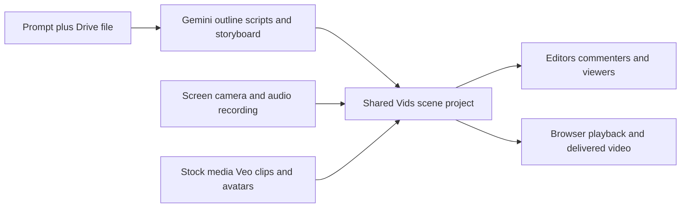

# Google Vids

> Research status: **Architecture-level** · Last reviewed: **2026-08-12**

| Field | Value |
|---|---|
| Team | Google Workspace · team region audit pending |
| Ordinary job | build a collaborative work video from a prompt Workspace file recordings and generated or stock media |
| Authority | shared Google Vids project organized by editable scenes |
| Lifecycle | active generally available in named Workspace and consumer plans |

## Gemini creates a starting scene graph

Gemini can take a prompt and Drive file and propose a fully editable outline with scenes scripts stock media and background music. A user then changes the scenes adds recordings from camera screen or audio generates short Veo clips or avatars and applies transitions animation effects and object tracking.

The project adopts Workspace collaboration semantics: permissions separately allow edit comment or view and browser playback reflects the current shared artifact. This is not a one-shot video endpoint. The generated storyboard remains an ordinary editable Workspace document and a rendered playback is its projection.

## Evidence boundary

The official product page establishes the artifact flow availability and maximum-duration constraints. It does not publish the internal scene schema version history model or a round-trip export format. Google organizational lineage is clear while the specific operating team's geography remains unassigned.

## Primary evidence

- [Google Vids product and collaboration contract](https://workspace.google.com/products/vids/)
- [Google Workspace Vids learning center](https://support.google.com/a/users/answer/14906011)
