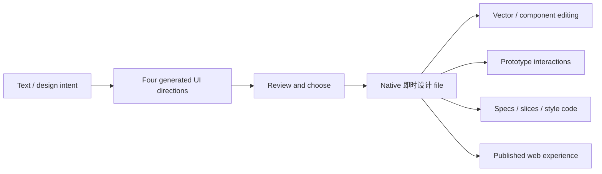

# 即时设计 AI

> Research status: **Architecture-level** · Last reviewed: **2026-08-11**

| Field | Value |
|---|---|
| Team | 即时设计 · public team region not confirmed in this pass |
| Ordinary job | generate several UI directions, choose one and continue it as a collaborative native design file through prototype and developer handoff |
| Canonical artifact | cloud design file with vector layers, components, prototype links and version history |

## Four outputs form a real decision set

The first-party AI description says one text instruction produces four UI designs. The outputs contain vectors and icons, retain clear layer structure and can be saved into 即时设计 for further editing and export. This explicit multi-direction step makes variant exploration and decision the primary definition rather than treating AI as a faster drawing command.

The public contract does not describe an explicit “merge” operation. Selection means continuing one or more generated directions in the native editor; rejected directions are not assumed to remain as durable branches unless saved.

## Native continuity matters more than the generator

The host product supports automatic cloud saving, historical records, real-time collaboration, components, auto layout and prototype interactions. Generated layers therefore enter an established graph that humans can inspect and alter at element level. This distinguishes the product from a static screenshot generator even though internal AI implementation is closed.

The platform also imports Figma, Sketch and XD and exports Sketch. These are migration paths; public evidence does not establish perfect semantic round-trip or a shared cross-tool authority.

## Handoff and delivery

Developer mode provides measurements, slices and style-code output. A design board can also be published as a web page with page navigation and variant effects. Both are projections from the native file. Nothing in the reviewed public material shows arbitrary downstream code edits updating the design graph.

## Evidence ceiling

No open implementation or public native schema was found. Model selection, generation pipeline, version retention, candidate storage and code-mapping fidelity remain unknown. The dossier also keeps team region unknown because Chinese localization and target users are not team-location evidence.

## Primary evidence

- [Official AI capability description](https://js.design/special/article/what-is-js-ai.html)
- [Native design, prototype and delivery workspace](https://js.design/)
- [Cloud projects and version-history team contract](https://js.design/recommend)
