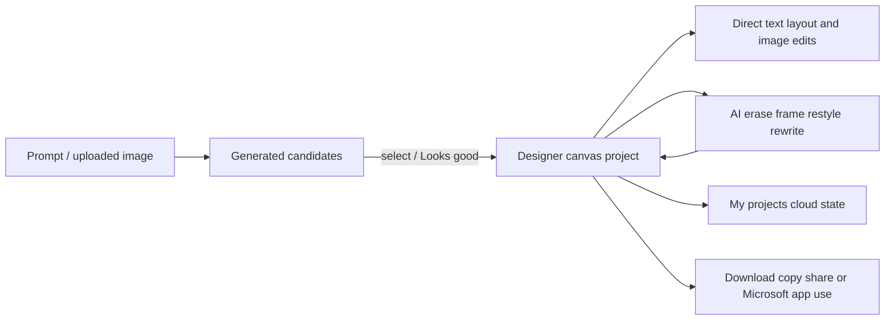

# Microsoft Designer

> Research status: **Architecture-level** · Last reviewed: **2026-08-11**

| Field | Value |
|---|---|
| Team | Microsoft · United States |
| Ordinary job | generate a visual option deliberately bring it onto a canvas and refine it with direct and AI-assisted edits |
| Continuing authority | cloud-saved Designer project plus OneDrive-backed uploaded assets |
| Lifecycle | active-transition after migration from the legacy visual editor |

## Candidate generation has an explicit acceptance step

Designer generates several image design frame or text options. A user selects one to continue or accepts a generative erase result through “Looks good.” The chosen result can then enter the Designer canvas for text layout filter crop object and background editing. My projects autosaves cloud artifacts so the work can be reopened.

## Project recovery has an explicit deletion ceiling

Designer projects are automatically saved and count toward Microsoft cloud storage. Uploaded personal images are stored in OneDrive. Deleted Designer project files have no product recycle bin according to current support material. That limitation matters more than a generic claim of cloud persistence.

The legacy visual editor was deprecated in October 2025 and users moved to a newer editor while some features such as Brand Kits were removed. The record therefore preserves one Microsoft Designer lineage and marks transition instead of describing all historical features as current.

## Evidence ceiling

Public support establishes user-visible persistence and editing but not the project schema layer structure collaboration or version history. Some AI operations may flatten their selected region; editability is not assumed to be vector-semantic for every output.

## Primary evidence

- [Microsoft Designer FAQ and project storage](https://support.microsoft.com/en-US/designer/frequently-asked-questions-about-microsoft-designer)
- [Current editor and migration](https://support.microsoft.com/en-US/designer/welcome-to-microsoft-designer)
- [Object and generative image editing](https://support.microsoft.com/en-us/windows/edit-images-with-designer-b41e0b6e-0009-4cfd-a0cb-2adc3bcbde96)
