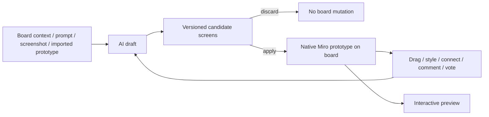

# Miro Prototypes

> Research status: **Architecture-level** · Last reviewed: **2026-08-11**

| Field | Value |
|---|---|
| Team | Miro · multi-region team with 13 public hub cities |
| Discovery name | Miro AI Design |
| Ordinary job | turn research and rough context into several interactive UI directions and decide what should move toward implementation |
| Continuing artifact | native editable prototype screens and connections inside a Miro board |

## The product is optimized for a decision, not pixel-final delivery

Miro now names the working surface **Miro Prototypes**. It can begin from text, sticky notes, a PRD, diagrams, screenshots, an embedded Figma prototype or output from a coding agent. A user can generate one or many screens, connect interactions, preview the flow, comment and vote beside the artifact, and compare directions on the same collaborative canvas.

That ordinary loop is materially broader than the discovery URL's “AI Design Generator” label. The unit counted here is the continuing prototype surface inside Miro, not every Miro AI feature and not a second record for every generator landing page.

## Draft versions cross an explicit promotion boundary

AI refinement does not silently overwrite the board. The help contract describes a draft prototype with a version selector. Each refinement produces another candidate; the user can inspect versions and then choose **Add to canvas / Apply to canvas** or discard the draft. Once applied, the prototype becomes editable with normal canvas operations and can be selected again for AI refinement.

This candidate-promotion mechanism is why variant exploration is the primary Design definition. Native artifact authoring remains essential after promotion, while feedback and voting make the board a coordination record around the artifact.

## Authority and handoff

The authoritative editable representation after application is Miro's host-native object graph: screens, components, connections and board context. First-party pages say generated outputs are composed of editable native shapes and objects. A screenshot conversion similarly rebuilds text, controls and layout as editable content rather than retaining only a bitmap.

Miro can import context from Figma or coding agents and can push an aligned direction toward a coding agent through MCP or export it for design refinement. Public documentation does not establish lossless bidirectional synchronization after either handoff. The dossier therefore treats those paths as projections across authorities rather than claiming one universal graph.

## Recovery boundary

Draft refinements are recoverable through the prototype version selector and, for the newer Sidekick surface, AI chat history. Applied screens persist with the board. The public contract does not expose internal record schemas, transactionality across a multi-screen apply, merge behavior under concurrent edits or exact MCP mutation semantics.

## Product and team boundary

Miro Prototypes is part of the existing Miro organization but is independently countable from Uizard: it has its own Miro-board artifact, release surface and ordinary workflow. Uizard remains a separately maintained acquired product. Miro publicly describes a multi-region hub model, so this record does not assign the team to one country.

## Primary evidence

- [Miro Prototypes help](https://help.miro.com/hc/en-us/articles/26654269713682-Miro-Prototypes)
- [Miro Prototypes overview](https://help.miro.com/hc/en-us/articles/26654102601874-Miro-Prototypes-overview)
- [Miro prototyping product page](https://miro.com/ai/prototyping/)
- [Miro team locations](https://miro.com/careers/locations/)
