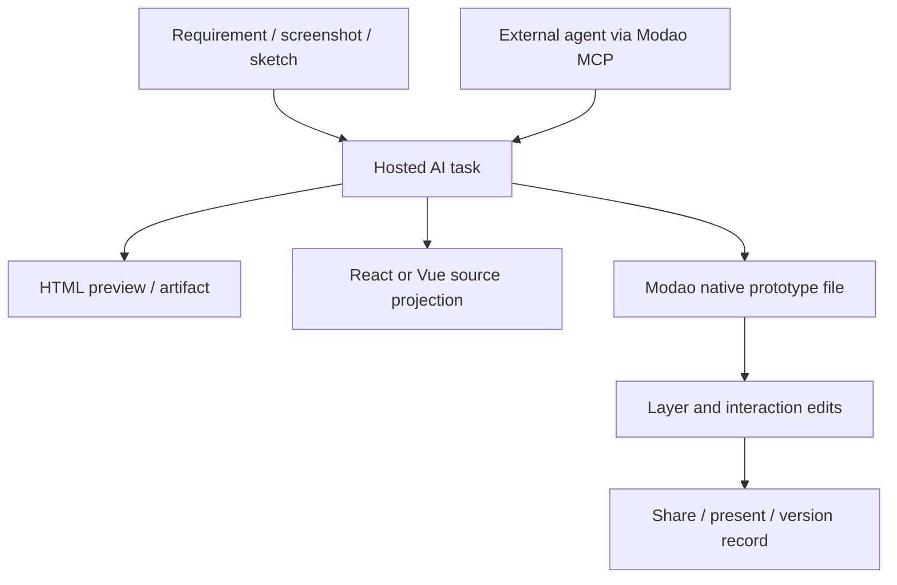

# 墨刀 AI

> Research status: **Architecture-level** · Last reviewed: **2026-08-11**

| Field | Value |
|---|---|
| Team | 墨刀 / Modao · public team region not confirmed in this pass |
| Ordinary job | turn a requirement into an interactive prototype and code projection, then keep refining or sharing it in the Modao workspace |
| Native continuation | editable Modao prototype file with layers, interactions, collaboration and version records |
| Agent interface | hosted Streamable HTTP MCP using a personal Modao token |

## Two artifact paths meet under one account

墨刀 AI can generate an HTML preview or React/Vue application-oriented result and can also convert AI output into an editable native Modao prototype. The native path supports clear layer structure, drag editing, interaction design, sharing and collaboration. The code path gives a runnable projection that can continue in development.

These are related but not interchangeable authorities. A native prototype remains governed by Modao's graph; an exported or copied source artifact becomes governed by files. The product does not document arbitrary source edits synchronizing back into native layers.

## The MCP contract exposes persistence without exposing internals

The official MCP endpoint offers `generate`, `generate_html`, `generate_react` and `generate_prd`. Calls reuse the account, entitlements and online generation service. Results return a task ID, task URL, preview URL and artifact content; generated results create Modao files in the token holder's personal space, so the agent call is not merely a transient response.

The interface also establishes a security boundary: a personal token selects the destination account and workspace. Public docs do not specify idempotency, cancellation, transactionality or whether every tool output becomes an editable native prototype.

## Prototype recovery is broader than generation history

The mature prototype product publicly lists version records, offline presentation, sharing, comments and several export formats. AI-generated pages can be imported for ordinary editing. Separately, the AI generation task and preview provide task-level history. The evidence does not show that native version restoration also rewinds generated code or external source changes.

## Why this is one lineage

“墨刀 MCP”, the AI web surface and the established prototype editor all authenticate through and write into the same Modao service. They are interfaces around one continuing product lineage, not three products counted independently.

## Primary evidence

- [墨刀 AI generation and native editing](https://modao.cc/feature/ai)
- [Official Modao MCP tools and file persistence](https://modao.cc/feature/ai-mcp.html)
- [Prototype product and version contract](https://modao.cc/feature/prototype/index.html)
- [AI and Vue projection workflow](https://modao.cc/ad/blog/ai-prototype-to-vue-code.html)
