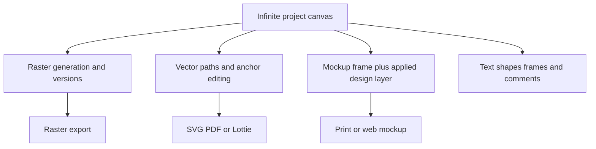

# Recraft

> Research status: **Architecture-level** · Last reviewed: **2026-08-12**

| Field | Value |
|---|---|
| Team | Recraft · headquartered in London United Kingdom |
| Ordinary job | generate arrange refine and deliver raster vector and mockup assets in one collaborative project |
| Authority | Recraft Studio infinite canvas and its typed visual objects |
| Lifecycle | active |

## One canvas contains artifacts with different editability

Recraft Studio places generated and imported images frames mockups text shapes and comments on an infinite canvas. Prompts adapt to the selected object and edits produce a new image version while preserving the original. Raster operations include inpaint outpaint backgrounds upscale masks and mockup placement.

Vectors are materially different. Recraft generates SVG paths and its current vector editor lets users select shapes drag anchors recolor paths and duplicate elements without leaving the canvas. Vector export can preserve SVG PDF or Lottie structure while raster export produces PNG JPG PDF or TIFF. The dossier therefore does not describe every object as either “just pixels” or “fully structured.”

Imported and edited image history has documented limits: not every intermediate edit appears in the project timeline and some outputs must be exported then re-imported for reuse. Recraft's own About page establishes the London headquarters used for region evidence.

## Primary evidence

- [Recraft Studio canvas](https://www.recraft.ai/docs/recraft-studio/work-area/canvas)
- [Vector editor and native path control](https://www.recraft.ai/blog/vector-editor)
- [History import and export limits](https://www.recraft.ai/docs/recraft-studio/importing/about-importing)
- [Recraft team and headquarters](https://www.recraft.ai/about)
