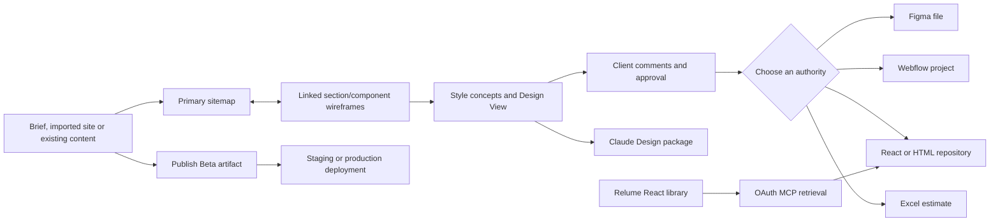

# Relume

> Research status: **Architecture-level / closed-source boundary reached** · Last reviewed: **2026-08-11**

| Field | Value |
|---|---|
| Organization / team | Relume |
| Category | Structured sitemap/wireframe/design-system workflow, destination-specific export system, component-library MCP and emerging hosted publisher |
| Status | Established Site Builder/export workflow active; Relume Library MCP active; Relume Publish remains invitation/Beta evidence rather than a documented generally available product in this snapshot |
| Established working artifact | A hosted Relume Site Builder project whose primary sitemap, linked section/component wireframes, copy, concepts, styles, comments and global sections evolve together |
| Newer artifact paths | A one-way Claude Design design-system package; React component source retrieved through the Library MCP and vendored by an external agent; a separate Yjs-backed Publish site artifact exposed in the current client |
| Decisive technical question | Does Relume keep one design/code/site source of truth, or does its structured planning graph deliberately fork into destinations with independent identities and clocks? |
| Inspected distributions | Current public account bundle `index.d39898cd.js`; Chrome extension `82`; historical/currently distributed `@relume_io/relume-ui` `1.3.1` and `@relume_io/relume-tailwind` `1.3.0` |
| Source availability | Hosted editors, AI selection, collaboration, export services, MCP server and publishing backend are closed. Readable shipped JavaScript/packages are not publicly licensed source repositories. Exported component code is editable under Relume's output license, not open source by implication. |
| Evidence ceiling | Official product/docs/community behavior, destination contracts, anonymous MCP OAuth boundary, distributed Webflow bridge, public client artifact/version/publish schemas and source/licensing boundary are established. Private model prompts, server storage, selection/ranking algorithms, conflict handling, export transforms, authenticated MCP tools and production deployment implementation remain undisclosed. |

## Relume is not one artifact pipeline

The shortest inaccurate description is “AI generates a website.” Relume currently exposes four materially different paths, only the first of which has a mature public ordinary-user workflow:

| Path | Input and mutation center | What leaves Relume | Authority after the exit | Public reverse path |
|---|---|---|---|---|
| established Site Builder/export workflow | prompt or imported site → primary sitemap → linked component wireframes → style concepts and Design View | Figma layers, Webflow pages/components, React/HTML files or an Excel pricing sheet | the chosen Figma file, Webflow project, repository or spreadsheet | none documented; later Relume edits do not automatically reconcile the destination |
| Claude Design export | selected Relume style concept/design system | colors, typography, spacing, reusable components, logos and a homepage preview | the new Claude Design artifact and its generated output | none; the launch boundary says wireframe structure is not exported |
| Relume Library MCP | natural-language search plus a deterministic library slug | actual React library code, primitives, Tailwind preset/tokens and icons returned to an external agent | files the external agent actually vendors and reviews in the application repository | none; MCP cannot read or mutate the originating Site Builder project in this snapshot |
| Relume Publish / client codename `nova` | Website Brief, documents, chat, structured pages/components, direct controls and collaboration in a separate hosted artifact generation | staged or production hosted site plus related analytics/form/SEO state | Publish project, selected snapshot and deployment pointers | client contracts expose snapshot restore inside Publish, not a round trip to Site Builder exports, Figma, Webflow or repository code |



The center of the established product is therefore a **structured pre-production graph**. It is useful precisely because pages, sections, component choices and copy remain constrained long enough for a team to agree on structure. Once exported, Relume generally stops being the mutation authority. The newer Publish path aims to remove that handoff, but it is a separate artifact generation and remains behind a Beta/documentation boundary at this snapshot.

## Ordinary journey: converge before choosing a destination

The established [sitemap](https://resources.relume.io/resources/docs/building-a-sitemap-with-ai), [wireframe](https://resources.relume.io/resources/docs/how-to-create-and-edit-wireframes-in-the-relume-site-builder), [concept](https://resources.relume.io/resources/docs/concept-creation-using-the-relume-style-guide-builder) and [Design View](https://resources.relume.io/resources/docs/how-to-style-all-pages-using-the-design-view) documentation supports this end-to-end path:

| Stage | Ordinary action | Authority actually advanced | Evidence before continuing |
|---|---|---|---|
| 1. establish the brief | describe company, audience, goals and required pages, or import an existing domain | prompt/import context; no destination artifact yet | required content and exclusions are represented; an imported site is treated as a starting inventory, not a faithful design clone |
| 2. generate alternatives | ask AI for one or more sitemap options, including page and section copy outlines | candidate sitemap trees | choose one intended sitemap and move it to the primary position; language and page scope are correct |
| 3. refine the section graph | rename/reorder/add/delete pages and sections; make section descriptions specific enough to guide component choice | the primary sitemap and its linked wireframe structure | each required journey has the right section order and content count; delete semantics are understood |
| 4. converge on components and copy | swap variants/components, remove or reorder supported elements, rewrite text, reset copy or layout and mark reusable global sections | hosted component instances, overrides, copy and global-section identities | components fit the semantic role and real content; protected structure has not been mistaken for a freeform canvas |
| 5. review across devices | inspect desktop/tablet/mobile views and collect section-anchored comments | project graph plus comment threads | comments on all required devices are resolved; reviewers know deleting a section also removes its attached comments |
| 6. explore visual direction | create several concepts, tune color/type/UI rules, pitch selected concepts and apply the chosen guide in Design View | concept/style state projected over wireframes | one concept is explicitly approved; generated images and homepage treatment do not hide unfinished interior pages |
| 7. choose the real destination | decide whether Figma, Webflow, React/HTML, Claude Design, pricing Excel or Publish is the next authority | workflow decision, not a mutation by itself | destination prerequisites and information loss are accepted before export |
| 8. materialize once | run the destination-specific plugin/app/copy/download/package operation | a new artifact in another identity domain | intended pages, components, copy, styles, variables/assets and files actually arrived; there are no silent duplicates or missing globals |
| 9. continue and validate there | refine, implement, connect data, add behavior, publish and exercise the real visitor journey | destination artifact and its own version/deployment state | exact Figma/Webflow/repository/deployment revision is recorded and the ordinary site journey works |

The essential operational rule is to settle structure and copy before the export boundary, then consciously promote the destination to source of truth. Relume staff guidance on existing content makes the reason explicit: trying to edit copy independently in both Site Builder and Webflow/Figma produces chasing rather than synchronization.

## Sitemap and wireframe are one coupled section graph

In Site Builder, sitemap and wireframe are not independent views that merely happen to resemble each other. Each sitemap section is directly linked to a wireframe section. Deleting either side deletes the counterpart. A section's title and description form the “section prompt” that informs AI component selection and copy. Global sections retain reusable identity inside the project and become destination-native reusable components when supported.

That coupling is the decisive artifact property:

| Hosted object | Publicly established fields/behavior | Consequence |
|---|---|---|
| project | name, brief, locale, preferred/primary pages, home page, global sections, comments, logo, concepts, Webflow style version and Design state appear in the current public client | Site Builder persists a structured project rather than a sequence of screenshots; these shipped client fields are a supported projection, not proof of the private database schema |
| page | name, description, sections, recursive subpages, comments, path/page-type flags | sitemap hierarchy and wireframe content share one page/section organization |
| component instance | component/source slug, descriptive metadata, text/icon/slot overrides, concept-specific margins/images, family style and AI selection metadata | component selection and structured overrides are first-class; the ordinary edit is not arbitrary vector manipulation |
| concept | versioned color, typography, UI, card, scheme and image configuration through several client schema generations | one site graph can project several visual directions without duplicating every page |
| comment | thread/resolution state associated with view/device and highlighted structure | review is contextual but not independent: structural deletion can delete the review anchor and thread |

The [existing-site importer](https://resources.relume.io/resources/docs/import-an-existing-site-into-the-relume-site-builder) reinforces the graph boundary. It crawls up to 50 pages from the domain sitemap and uses titles/meta descriptions as page prompts. It can over-collect CMS pages and is intentionally an imperfect starting iteration. The [import FAQ](https://resources.relume.io/resources/faqs/doc) says to provide the root domain rather than an XML/page URL and notes that bot/firewall rules may need to allow `relume.io`. Nothing in that contract preserves the source site's DOM, authored component tree, CMS identity or repository revision.

## The decisive mechanism is constrained component search

Relume's generation quality comes less from unrestricted drawing than from selecting and configuring a maintained component corpus. The May 2026 [release description](https://www.relume.ai/whats-new/may-2026-release) describes Wireframing 2.0 as considering both section title and description, content count and a project-appropriate layout family while searching a larger share of the marketing library.

The current wireframe editor exposes the same constraint model directly:

- **variant swap** changes the whole component while retaining the section role;
- **replace component** can preserve existing copy while choosing a different structure;
- **element controls** can remove most elements and reorder/add supported list items, but some elements remain protected when removal would destroy the component's semantic structure;
- **reset structure and reset copy** are separate actions, so a user can return to the library baseline without necessarily discarding approved content;
- **AI rewrite** can target text or a whole section without making the prompt transcript the artifact;
- **family style** categories visible in the current client include standard, card, off-grid, background, overlapping and edge-to-edge;
- **global sections** preserve one project-level reusable role and are translated into destination-native components where the bridge supports it.

AI and direct controls therefore converge on the same hosted component graph, but at different risk levels. Deleting a button or swapping a known variant can be a bounded structural operation; asking AI to reinterpret a section may change component choice, copy and layout. A finished model response is only a proposal until the actual section graph and device projections are inspected.

## Style concepts are a conditional projection, not final design authority

A style concept can only be generated after sitemap and wireframes exist. It combines colors, typography and base UI treatments, supports multiple competing concepts, and can expose up to three selected concepts through the Pitch Concepts link. The chosen concept maps into Figma font/variable structures and Webflow tags/global classes through destination-specific templates.

[Design View](https://resources.relume.io/resources/docs/how-to-style-all-pages-using-the-design-view) applies that guide across all pages, but Relume explicitly presents it as an approximately 80% accelerator rather than a final high-fidelity editor. Exact spacing, custom animation and pixel-level polish remain Figma/Webflow work. Three visually similar states therefore differ:

1. a concept exists for the homepage;
2. the concept has been selected/applied across all wireframes in Design View;
3. the destination artifact has received, preserved and then refined the relevant style semantics.

React wireframe export and Claude Design export make the conditional nature especially clear: the official React path exports unstyled wireframes, while the separate Claude path packages the design system but omits the Site Builder wireframe graph. “The project has a style guide” does not imply that every exit transports it.

## Every exit changes the source of truth

| Exit | Preconditions and materialization | What survives | Known loss or collision | New acceptance point |
|---|---|---|---|---|
| Figma plugin | duplicate current Relume Figma Kit `v3.0+`, open plugin, choose project and import sitemap, pages/sections, wireframes or concepts | AI copy, variables/style concept and compatible component structure | imported instances are intentionally detached so Site Builder element-level edits can materialize; core component propagation is then lost and nominally identical layouts can diverge | intended Figma file, variables, pages, layer structure and later design behavior |
| Webflow Site Builder Import app | start from current Relume Webflow Style Guide `v3.0`, import a style guide once, then pages/sections | pages, copy, global sections as Webflow components, compatible class/variable schema | style guide imports once; same-name pages require replace/new choice; same-name global components are reused rather than overwritten; old schema versions need alternate copy/extension routes | actual Webflow project, reusable component/class graph, CMS/interactions and published site |
| Webflow copy/Chrome extension | select component/section, choose class and spacing preferences, copy a Webflow clipboard payload and paste into Designer | component nodes, classes, assets and selected normalization preferences | wrong style/spacing version can duplicate classes, disconnect variables or rewrite wrappers/spacing blocks; Designer internals and browser permissions are part of the path | resulting Webflow nodes/classes and their behavior |
| React | copy one section or download a page/sitemap whose sections expand into multiple files | React + TypeScript + Tailwind section implementation and variable content as props | official React docs state Style Guide/Design export is unsupported; whole pages generate a file graph rather than one clipboard snippet | reviewed repository files, build, runtime and deployment |
| HTML | copy/download a code projection | markup suitable for a downstream implementation | no public round trip or original Site Builder identity; application behavior/data still needs implementation | reviewed project files and deployed runtime |
| Claude Design | export colors, typography, spacing, components, logos and homepage preview from the chosen concept | branded design-system context and reusable visual vocabulary | current launch clarification says wireframe structure does not travel; no full-circle Claude → Relume synchronization | Claude Design artifact and whatever it subsequently creates |
| Excel pricing | project sitemap is projected into beginner/intermediate/advanced estimation sheets | page/section scope as a pricing input | no live link to later sitemap changes or implementation complexity | reviewed commercial estimate |

The Figma detachment is not an accidental failure; it is a deliberate trade. Keeping a library instance attached would preserve component propagation but prevent arbitrary Site Builder element structure from arriving exactly. Relume chooses local editability at import time, so the user must rebuild any desired reusable identity in Figma.

The Webflow path makes a different trade. It tries to reconcile into a known Client-First-derived class/variable/component schema. That gives better destination-native reuse, but compatibility depends on the exact style-guide generation, naming and import order. Existing same-name global components win rather than being overwritten, so a successful import can still render against older destination structure.

## Library MCP is a component faucet, not a Site Builder agent

The [Relume Library MCP](https://www.relume.ai/relume-library-mcp) exposes the React component library to an external AI editor. Natural-language search finds a candidate, deterministic slug lookup retrieves Relume's actual source, and the external agent materializes component files together with shared primitives such as buttons/cards and `cn`, the Tailwind preset/tokens and icons. Vendoring makes those resulting files editable and avoids a locked runtime dependency.

That does **not** make the MCP an agent interface to a Relume website project:

| Question | Established answer at 2026-08-11 |
|---|---|
| Can an anonymous client call it? | no; `GET https://relume-library-mcp.relume.io/mcp` returns `401 invalid_token` |
| What does the OAuth resource advertise? | exact resource `/mcp`, bearer-header authentication and only `relume:components` scope |
| Which OAuth flow is public? | authorization code and refresh token, PKCE `plain`/`S256`, dynamic client registration endpoint and basic/post/none token-client authentication are advertised |
| What corpus is promised? | the React library; the launch announcement explicitly limits the initial MCP to React components |
| Does it read a Site Builder project's sitemap, wireframes, copy or concept? | no; staff support says actual Site Builder project access is not possible today |
| Does it write the repository by itself? | the public page promises returned/vendored code, but the connected external agent/editor owns the actual filesystem operation and review |
| Does a component retain Relume project/version identity? | no public binding; a library slug identifies the retrieved component family, not the originating project section, destination file range or Git revision |
| Does it close the Relume → Claude Design → code → host loop? | no; the launch discussion explicitly says the full circle is not present |

The anonymous protocol probe deliberately stopped at the authorization boundary; no account was registered and no authenticated tool list was inferred. This means tool names, arguments, rate limits and exact response schemas remain unknown even though the authentication/resource boundary and product semantics are public.

## The Chrome extension reaches into Webflow's designer boundary

The current [Chrome Web Store distribution](https://chromewebstore.google.com/detail/relume-chrome-extension-f/doeokejknjdlpgkkmlbcahojmnpdlebm?hl=en-US) is a more concrete implementation edge than the hosted export services. Version `82`, updated 2026-07-09, was retrieved as a 573,272-byte CRX with SHA-256 `d3683c54595a6fd2cbd95ef8552d8402a34356a490abfadcd831606b35a5c205`.

Its Manifest V3 package contains separate isolated-world content scripts for Relume/Webflow, a `MAIN`-world Webflow script and a service worker. Static inspection establishes these boundaries:

- it matches Relume pages and the Webflow Designer, with `storage`, clipboard read/write and downloads permissions plus optional `<all_urls>` access;
- the `MAIN`-world script answers `window.postMessage` requests by reading `window._webflow.stores.HandoverStore.state`;
- it recognizes the `@webflow/XscpData` clipboard representation carrying nodes, styles and assets;
- the bridge can fetch Relume component JSON, stage class/spacing transformations and ask Webflow to process destination pages;
- copy preferences persist a style-guide choice and spacing strategy (`wrappers` or `blocks`) through extension storage;
- the background layer can fetch page text and support screenshot/download operations, explaining the optional broad-origin permission.

This is a destination-specific adapter over Webflow's current private/designer/clipboard surface, not a live binding. A browser/Designer change can break it; a user-selected preference can alter the generated class graph; and a pasted component has no durable pointer back to its Site Builder section or Relume project version. The minified extension has no disclosed first-party source repository or license; bundled third-party notices do not license Relume's implementation.

## Stable Site Builder and Publish use separate persistence generations

The current public account JavaScript, [retrieved from this immutable-looking asset URL](https://www.relume.ai/app/_account/js/index.d39898cd.js), is 1,527,977 bytes with SHA-256 `e69a81e3b467bc2bcfaa91f8cdf983c81c92f3f89abfa6ab6de1b8fc196135e2` and ETag `"4b15907794469dbad730a714b064918d"`. It exposes two non-equivalent collaborative artifact families in the same shipped client.

### Established Site Builder: custom delta protocol over a structured project

The established client includes a custom change model with scalar, map, list and struct domains; clocked delta types; list insertion, entomb and restore operations; and a session initialization message carrying schema version, session id, base version, initial state/deltas, comments, presence joins/decorations, access level, feature flags and restrictions. Subsequent delta messages carry a numeric id and an array of changes; a reload message carries a version. Presence access distinguishes none, viewer, commenter and owner.

Public API strings expose project creation/sharing/ownership/duplication/rename/delete plus version routes:

```text
POST /blocks/projects/create
GET  /blocks/project/versions?projectToken=...
GET  /blocks/project/version?projectToken=...&version=...
POST /blocks/project/version    { snapshotVersion }
```

Version list items carry a nullable version, `lastEditedAt` and `lastEditedBy`; the response also exposes a delta count. The importer uses a streamed status/page/error response with a client timeout. These are meaningful recovery/collaboration contracts, but they do not establish server snapshot cadence, retention, compaction, cross-object atomicity or the conflict policy after a stale base.

### Publish: Yjs document plus snapshot and deployment clocks

The same bundle separately imports Yjs and wraps `Y.Map`, `Y.Array` and `Y.Text` in a newer Publish artifact. Its typed client projection includes:

| Publish domain | Public client shape | Why it matters |
|---|---|---|
| brief/evidence | brief plus named brief documents with content, file/quote/resource references and timestamps | generation can be grounded in durable project inputs rather than only the latest chat turn |
| page graph | home page, recursive subpages, slugs, meta title/description, purpose/priority, navbar/footer and ordered sections | Publish retains structured site/navigation state rather than flattening immediately to deployed HTML |
| component | slug and version, structured override tree, category, concept-specific overrides and AI role/purpose/decision/evidence/link metadata | component revision and structured overrides are explicit within the Publish artifact |
| links/resources | internal page/section targets, external/email/phone targets; image/video/document/generic resources and metadata | navigation and assets are typed domains that preflight can inspect |
| concepts | color labels and project concepts | visual system remains part of the hosted artifact |
| comments | selection id, sitemap/wireframe/design viewport and device, coordinates, point/section placement, resolution and version | review anchors are artifact-relative, not application-source coordinates |
| snapshot | id, epoch, kind (`Publish`, `Autosave`, `AI`), publish-point flag, author/time and full-state retrieval | restore can rewind the Publish Yjs state independently of a deployment pointer |
| deploy | draft/unpublished/publishing/published site status; staging/production deploy ids and times; job stages/warnings/errors | editing, snapshotting, staging, production publishing and promotion are separate clocks |

The shipped client also contains calls for publish, staging publish, unpublish, staging unpublish, promotion and job polling; preflight scoring across responsive behavior, discoverability, metadata, links, placeholders and forms; redirects with unpublished-change state; indexing/robots/sitemap/JSON-LD settings; tracking/custom code/cookies; Lighthouse results; form-submission CSV export; invitations/roles/ownership transfer; and Cloudflare-oriented hosting plans.

These schemas prove that a substantial Publish client was distributed. They do **not** prove that every route is enabled for every account, that the server implements every client branch exactly, or that Beta pricing/limits are durable. Plan strings in a shipped UI are rollout evidence, not a stable commercial contract.

## Publish is an implemented Beta edge with unfinished public documentation

The official [announcements feed](https://community.relume.io/x/announcements) describes Publish as the next full workflow: Website Brief plus document input/chat, rebuilt components, AI for larger changes, direct controls for small edits and Cloudflare-backed hosting. It repeatedly frames access as an approaching/first-wave Beta and solicits invitation testing. The public account client exposes `/app/site/{id}`-style site/dashboard/settings/analytics states, but availability flags and account entitlement still sit between shipped code and ordinary-user access.

The documentation surface confirms that the product boundary is not settled. On 2026-08-11, the official sitemap listed 25 `/resources/docs/publish/` URLs:

- 7 returned `404`;
- the other 18 returned `200`, but most rendered title shells with lorem-ipsum placeholder bodies;
- the two longer pages—Publish/hosting and Export-vs-Publish—still exposed planning-outline material and unresolved placeholders rather than dependable operating documentation.

For that reason this dossier treats the Yjs/publish/service contracts as **distributed client evidence** and the announcements as **Beta intent/current rollout evidence**. It does not promote Publish to a generally available, fully documented ordinary-user journey, and it does not use provisional UI plan limits as lasting product facts.

Website Briefs can contain client files and transcripts, so the input boundary is also a product fact rather than a generic policy footnote. Relume's [privacy policy](https://www.relume.io/legal/privacy-policy), current as of 2024-12-02, says some customer data may be used for AI training/model development, with anonymization or aggregation where feasible, and exposes an account-settings opt-out. That is a policy commitment, not evidence of which specific model or request path consumes a given brief; a team handling sensitive client material still needs to verify the current account setting and contractual terms before upload.

## Failure and recovery map

| Break | User-visible consequence | What can be recovered | What remains separate |
|---|---|---|---|
| wrong sitemap candidate remains primary | later wireframes/export follow the wrong information architecture | choose/reorder the intended sitemap before extensive refinement | downstream exports already made are not recalled |
| page/section deletion | counterpart disappears from both sitemap and wireframe; anchored comments may disappear with it | project-version recovery may restore prior hosted state when retained | Figma/Webflow/repository copies are independent and can disagree |
| imported domain is blocked or CMS-heavy | missing pages or a noisy 50-page inventory becomes the prompt base | retry from root domain, adjust bot rules, prune/rebuild the graph | original DOM/CMS/source provenance was never a live binding |
| protected component structure blocks a requested freeform edit | some element deletion/layout changes cannot be expressed directly | swap/replace a component or move to the final design destination | custom structure may leave the maintained Relume component vocabulary |
| concept is mistaken for final design | interior pages, exact spacing, animation and responsive polish remain unfinished | refine in Design View, then complete in Figma/Webflow | final changes do not synchronize back |
| Figma import detaches components | local layers are editable but library changes no longer propagate | rebuild Figma components/instances or re-import deliberately | re-import can create another divergent copy rather than merge |
| Webflow schema/preference/name mismatch | duplicate classes, unlinked variables, old global component reuse or wrong page replacement | use matching v3 style guide/preferences, rename globals, or re-import into a clean project | destination edits and Relume graph have no shared transaction |
| React whole-page export is treated as one snippet | missing supporting files/imports or unstyled result | use download for page/sitemap and review the generated file graph | Site Builder style concepts are not part of that export contract |
| MCP auth or entitlement fails | external agent cannot search/fetch library source | re-authenticate a paid account/client and retry bounded retrieval | no Site Builder project access exists even after authentication |
| external agent vendors a wrong/stale component | repository builds against an unintended library choice | inspect slug/source/diff and replace under Git | there is no reverse project-section binding or automatic upgrade |
| Site Builder client loses/reloads a stale collaborative session | local projection may need a version reload/rebase | custom protocol exposes reload/version/snapshot paths | exact server conflict/partial-write behavior is undisclosed |
| Publish Beta client route is unavailable or incomplete | a visible UI/service contract may not be usable for the current account | remain on established Export path or wait for entitlement/documentation | client presence is not service availability proof |
| Publish edit, snapshot, staging and production diverge | editor looks correct while live domain serves another deploy | inspect snapshot/deploy ids, poll job, preflight, publish/promote the intended state | no disclosed atomic rewind spans Yjs state, forms/analytics, domain and external systems |

## Distribution, source and license boundaries

| Evidence artifact | Exact snapshot | What it establishes | What it cannot establish |
|---|---|---|---|
| public account bundle | `index.d39898cd.js`, 1,527,977 bytes, SHA-256 `e69a81e3b467bc2bcfaa91f8cdf983c81c92f3f89abfa6ab6de1b8fc196135e2`, retrieved 2026-08-11 | shipped Site Builder schemas/deltas/API strings and separate Yjs Publish artifact/service contracts | server behavior, feature entitlement, private source, model/ranking implementation or commit history |
| Chrome extension | Web Store `82`, 573,272-byte CRX, SHA-256 `d3683c54595a6fd2cbd95ef8552d8402a34356a490abfadcd831606b35a5c205`, updated 2026-07-09 | manifest permissions, injected-world split, Webflow store/clipboard adapter and preference boundary | hosted export service, a stable Webflow public API or licensed first-party source |
| `@relume_io/relume-ui` | npm `1.3.1`, integrity `sha512-efrl8I4pQB1Pxh4dtWdB5niWh0dSp0gsVTIV8eRMGA9GGCoBcc5EdmKxO4tS6dhCaO07+wiKtU8HhrSr98jGNQ==`, shasum `032dd1b8f116d7a2eedefb1f5f53be9f16180caf` | a distributed 2025-era primitive implementation and declarations/source-map contents | current MCP registry/server, Site Builder component ranking or permission to treat missing-license code as open source |
| `@relume_io/relume-tailwind` | npm `1.3.0`, integrity `sha512-29muspmGOgBWyCDNZhIGsfTP1nkgnF335h3dmV+3aG/mml10+ERIz3dEjoYtc6D81xADoZWVhNZ/xqqy4dWDSA==`, shasum `867f0ab1ce2d623c7f5732de3607af4f1390b131` | readable historical/currently distributed Tailwind preset design | exact current token package installed by MCP or a public source lineage |
| Library MCP OAuth metadata | live unauthenticated resource/auth metadata inspected 2026-08-11 | resource origin/path, component-only scope, bearer and OAuth/PKCE boundary | authenticated tools, arguments, outputs, quotas or server implementation |
| licensing agreement | current public Relume component/output license page | permission to use/modify output in end products and restrictions against redistributing a competing library | open-source status or unrestricted resale of the library |

The marketing phrase “components you own” should be read operationally: the agent vendors editable files rather than forcing a locked dependency. Relume's [licensing agreement](https://www.relume.ai/legal/licensing-agreement) still governs those files and restricts redistribution/competing-library use. Editable output and open-source software are different claims.

## The product is moving from structured handoff to plural AI exits

| Date / era | Public change | Architectural consequence |
|---|---|---|
| established Site Builder era | AI sitemap, linked component wireframes, style concepts, Figma/Webflow workflow and later React/HTML export | Relume owns structured pre-production convergence; destination tools own fidelity, behavior and release |
| 2025-era React packages | distributed UI primitives and Tailwind preset support code-centric implementation | reusable code becomes an exit, but not a synchronized projection of the full hosted project |
| 2026-05-06 | Wireframing 2.0 / broader component-aware selection and Claude Design export announced | one product now has both a richer section-selection engine and a design-system-only AI-artifact fork |
| 2026-07 | Relume Library MCP released for paid users and React library retrieval | external coding agents can search/fetch maintained source by slug, while Site Builder project state remains outside the MCP boundary |
| 2026 mid-year snapshot | Publish Beta invitations, testing and client implementation appear | Relume is building a second hosted authority that keeps brief → component graph → deployment inside Relume rather than ending at export |

This evolution does not collapse into one universal agent interface. Site Builder AI mutates a hosted planning graph; Claude Design consumes a packaged visual system; Library MCP retrieves a code corpus; Publish chat/direct controls target a separate Yjs site document. Each must be evaluated against its own artifact and promotion gates.

## What remains unknown

- the private Site Builder and Publish storage schema, database topology, Yjs provider, delta compaction and retention policy;
- how the service chooses, ranks or synthesizes a component after reading a section prompt, including model/provider and evaluation data;
- transaction, idempotency and conflict semantics when one AI/direct-edit operation touches several pages, components, comments or global sections;
- whether Site Builder versions are automatic/manual, their exact retention, and which external/export side effects are excluded from restore;
- authenticated Library MCP tool names, request/response schemas, component version pinning, rate limits and how an editor decides file paths/overwrites;
- a durable Site Builder section → Figma node/Webflow component/React file/Claude node identity or any supported reverse-sync protocol;
- the exact transformation implementation for Figma detachment, Webflow class reconciliation, React/HTML generation and Claude Design packaging;
- Publish Beta eligibility/general-availability date and which distributed client routes are currently enabled server-side;
- production guarantees for Publish snapshots, deploy rollback, staging promotion, domain cutover, forms/analytics/SEO state and pricing/limits;
- whether the two artifact generations will migrate/merge, and what happens to existing Export projects if Publish becomes the primary product;
- a first-party public source repository or immutable Git commit for the hosted core, extension, current app bundle or MCP server.

## Primary sources

### Established Site Builder and artifact behavior

- [Build a sitemap with AI](https://resources.relume.io/resources/docs/building-a-sitemap-with-ai)
- [Create and edit Site Builder wireframes](https://resources.relume.io/resources/docs/how-to-create-and-edit-wireframes-in-the-relume-site-builder)
- [Create Style Guide concepts](https://resources.relume.io/resources/docs/concept-creation-using-the-relume-style-guide-builder)
- [Apply a style guide through Design View](https://resources.relume.io/resources/docs/how-to-style-all-pages-using-the-design-view)
- [Import an existing site](https://resources.relume.io/resources/docs/import-an-existing-site-into-the-relume-site-builder)
- [Sitemap import FAQ](https://resources.relume.io/resources/faqs/doc)
- [Use Site Builder for pricing projects](https://resources.relume.io/resources/docs/using-the-relume-site-builder-for-pricing-projects)

### Figma, Webflow and code exits

- [Use the Relume Figma plugin](https://resources.relume.io/resources/docs/using-the-relume-figma-plugin)
- [Why Figma components detach on import](https://resources.relume.io/resources/faqs/why-are-my-figma-components-detached-upon-import)
- [Use the Site Builder Import Webflow app](https://resources.relume.io/resources/docs/using-the-relume-site-builder-import-webflow-app)
- [Webflow style-guide version compatibility FAQ](https://resources.relume.io/resources/faqs/why-can-i-not-use-the-webflow-app-with-my-style-guide-version-c8f3a)
- [Install and use the Relume Chrome extension](https://resources.relume.io/resources/docs/how-to-install-and-use-the-relume-chrome-extension)
- [Webflow unresponsive error/workaround](https://resources.relume.io/resources/faqs/webflow-unresponsive-error)
- [Export Site Builder wireframes to React](https://resources.relume.io/resources/docs/how-to-export-site-builder-wireframes-to-react)
- [Relume React/HTML documentation](https://react-docs.relume.io/getting-started/html)
- [Chrome Web Store distribution](https://chromewebstore.google.com/detail/relume-chrome-extension-f/doeokejknjdlpgkkmlbcahojmnpdlebm?hl=en-US)

### Claude Design, Library MCP and Publish

- [Claude Design export](https://www.relume.ai/claude-design-export)
- [May 2026 release: Claude Design and Wireframing 2.0](https://www.relume.ai/whats-new/may-2026-release)
- [Relume Library MCP](https://www.relume.ai/relume-library-mcp)
- [Library MCP launch announcement](https://community.relume.io/x/announcements/ye2kqlkcg5kg/introducing-the-relume-library-mcp-seamless-access)
- [Staff answer: MCP cannot access an actual Site Builder project](https://community.relume.io/x/feedback/msg_OdrycomM9hBP/is-it-possible-to-connect-relume-mcp-with-actual-w)
- [Relume announcements, including current Publish Beta updates](https://community.relume.io/x/announcements)
- [Publish documentation sitemap](https://resources.relume.io/sitemap.xml)

### Distributed implementation and legal boundary

- [Current Relume account application shell](https://www.relume.ai/app)
- [Inspected public account bundle](https://www.relume.ai/app/_account/js/index.d39898cd.js)
- [`@relume_io/relume-ui` 1.3.1 package](https://www.npmjs.com/package/@relume_io/relume-ui/v/1.3.1)
- [`@relume_io/relume-tailwind` 1.3.0 package](https://www.npmjs.com/package/@relume_io/relume-tailwind/v/1.3.0)
- [Relume licensing agreement](https://www.relume.ai/legal/licensing-agreement)
- [Relume privacy policy](https://www.relume.io/legal/privacy-policy)
