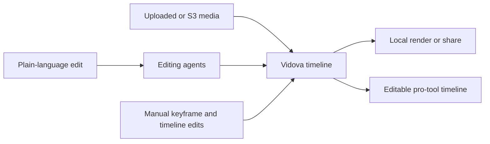

# Vidova

> Research status: **Architecture-level** · Last reviewed: **2026-08-12**

| Field | Value |
|---|---|
| Team | Vidova / DeepShot Inc. · team region not established |
| Ordinary job | ask agents to perform production edits while retaining manual control of the real video timeline |
| Authority | Vidova project timeline and referenced media |
| Escape path | editable timeline for professional tools plus rendered video |
| Lifecycle | active |

## Agents issue edits against a timeline

Vidova does not treat a prompt-to-video render as the whole product. Plain-language instructions invoke cuts zooms captions b-roll music voiceover and other editing operations on a timeline that also exposes keyframes and conventional manual control. The user can inspect and change the result rather than accepting a sealed render.

Media custody is separable from project control. A team may use managed storage or connect its own S3 bucket; the editing graph still references those assets. Finished work can be rendered locally and the product claims an editable-timeline handoff to professional editors. That handoff transfers authority because no public contract establishes later Premiere or Resolve changes synchronizing back.

## Evidence ceiling

The current product page establishes operations storage choices deletion and delivery. It does not disclose the timeline schema agent planning model export interchange format or conflict semantics. DeepShot Inc. appears in the first-party footer but its operating-team geography remains unverified.

## Primary evidence

- [Vidova agentic editor and timeline contract](https://vidova.ai/)
- [Vidova project and data boundary](https://vidova.ai/#pricing)
