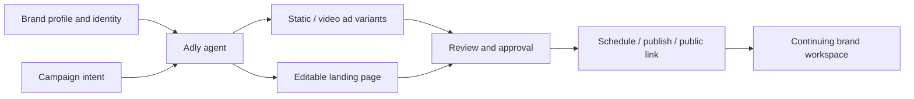

# Adly

> Research status: **Architecture-level** · Last reviewed: **2026-08-11**

| Field | Value |
|---|---|
| Team | Adly Technologies Ltd · London, United Kingdom |
| Ordinary job | ground a campaign in a brand profile, create and edit its assets, approve them and publish or schedule the result |
| Continuing authority | managed brand and campaign workspace |
| Agent surfaces | web application, Telegram, WhatsApp and MCP access to the same workspace |

## The endpoint is a released campaign

Adly begins with a reusable brand profile and identity. It generates multiple static or video advertisements and copy, supports refinement and approval, and schedules or publishes to connected channels. It also creates landing pages, store pages and digital cards; landing pages can be edited before saving to a durable public link. The ordinary artifact is therefore a campaign package with release state, not a collection of unrelated generated images.

## External interfaces operate the same project

Official knowledge pages describe access through messaging channels and MCP. These are control surfaces over the owner's Adly workspace, not separate products. Counting one lineage avoids turning every transport or specialist operation into a new “agent.”

Brand reuse gives the agent governed context across campaigns. Human editing and approval bound its release authority: generation can propose creative, but publication is part of the same managed state. Product delivery is therefore primary, with system governance and native authoring as additional definitions.

## Identity boundary

The canonical product uses `getadly.com` and is operated by Adly Technologies Ltd. The unrelated `adly.ai` domain is explicitly not merged. Arabic-language discovery is a product capability, while the London company address is the evidence used for team region.

## Evidence ceiling

No public implementation or campaign schema establishes the native structure of video/static assets, approval history, scheduler guarantees, MCP tool list or version recovery. The dossier records first-party user-visible behavior without claiming source-level round trips or autonomous ad-platform optimization.

## Primary evidence

- [Adly product](https://getadly.com/)
- [What is Adly?](https://getadly.com/knowledge/what-is-adly/)
- [Adly company profile](https://getadly.com/about/?lang=en)
