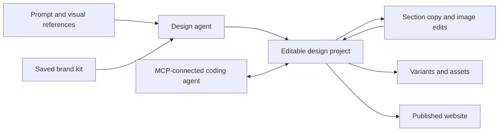

# AIDesigner

> Research status: **Architecture-level** · Last reviewed: **2026-08-11**

| Field | Value |
|---|---|
| Team | AIDesigner Inc. · team region not established |
| Ordinary job | create and keep refining UI brand systems and visual assets in one AI design project |
| Authority | the saved editable AIDesigner project and its brand context |
| Lifecycle | active |

## The project remembers direction across media

AIDesigner accepts prompts and references for website UI mobile screens brand kits logos campaign graphics and images. Generated UI remains editable: sections copy and imagery can be targeted while the accepted direction persists. Saved colors logos references and assets form brand context for later outputs rather than being repeated in every prompt.

The MCP path is important because it lets another agent read or create design work rather than treating the product as a gallery. The browser project still owns design composition; a coding agent owns whatever production code it later creates.

## Breadth does not erase distinct artifact types

UI screens brand kits and generated images share context but have different editability. Public language supports editable website designs and targeted refinement; it should not be read as proof that every logo image or campaign asset is a structured vector graph.

## Evidence ceiling

The native project schema MCP tool contract autosave version graph publication format and code-export fidelity are not publicly exposed. Claims about design taste or professional quality are product positioning and are not used as technical evidence.

## Primary evidence

- [AIDesigner current product and edit loop](https://www.aidesigner.ai/)
- [Current plans and persistent project limits](https://www.aidesigner.ai/pricing)
- [AIDesigner MCP workflow](https://www.aidesigner.ai/mcp)
